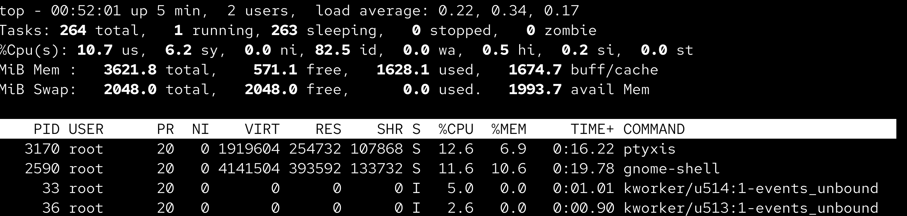
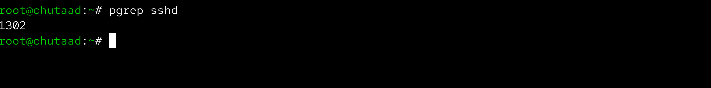
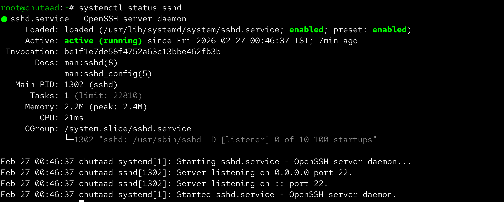
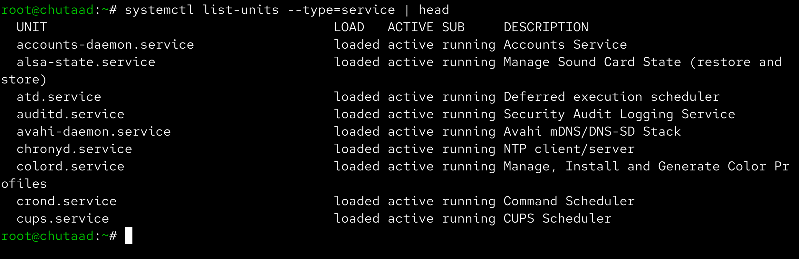
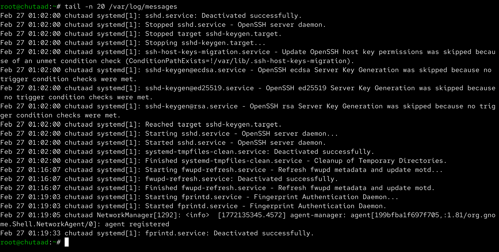
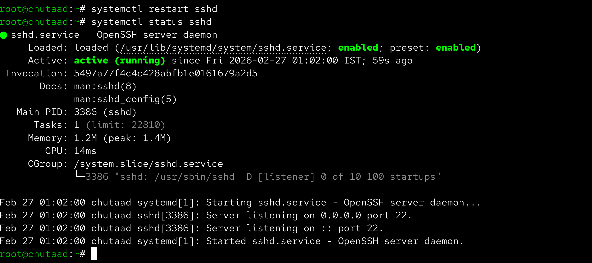

# Day 04 – Linux Practice (Processes and Services)

Aaj maine apne CentOS system par kuch basic Linux commands practice kiye.  
Main focus tha processes, services aur logs check karna so that troubleshooting samajh aaye.

## Process Checks

Sabse pehle maine running processes check kiye:

Phir `top` command run karke live CPU aur memory usage dekha.  
Isse pata chalta hai kaunsa process zyada resource use kar raha hai.

Uske baad `pgrep sshd` se ssh service ka PID check kiya.

## Service Checks

`systemctl status sshd` run karke dekha ki ssh service running hai ya nahi.

Phir system me running services list dekhne ke liye ye command run ki:

## Log Checks

SSH service ke logs dekhne ke liye `journalctl` use kiya:

System ke recent logs dekhne ke liye `/var/log/messages` check kiya:

## Mini Troubleshooting

Practice ke liye ssh service restart ki aur fir dubara status check kiya:

Is practice se mujhe better idea mila ki agar service down ho ya issue aaye toh process, service status aur logs kaise check karte hain. Ye commands daily use me kaafi helpful rahenge.
