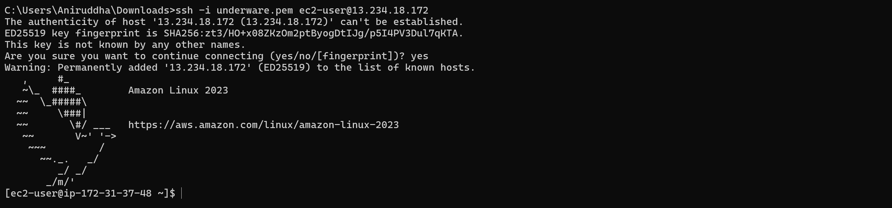
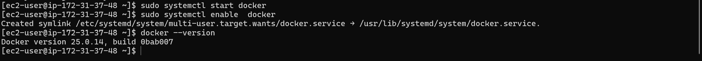

# Day 08 – Cloud Server Deployment (Docker & Nginx)

Aaj maine cloud par ek basic web server deploy kiya using AWS EC2. Is exercise ka goal tha server launch karna, SSH se connect karna, Nginx install karna aur internet se webpage access karna.

------------------------------------------------------------

SSH Connection

Sabse pehle maine EC2 instance launch kiya aur SSH ke through server se connect kiya.

Is step me confirm hua ki server successfully remote access ho raha hai.

------------------------------------------------------------

Installing Docker & Nginx

Server par login karne ke baad maine system update kiya aur Docker aur Nginx install kiya.

Example commands jo use kiye:

sudo dnf update -y
sudo dnf install docker -y
sudo systemctl start docker
sudo dnf install nginx -y
sudo systemctl start nginx
sudo systemctl enable nginx

Docker aur Nginx installation verify kiya.

------------------------------------------------------------

Accessing Nginx Web Page

Security group me HTTP port 80 allow karne ke baad maine browser me instance ka public IP open kiya.

http://<your-instance-ip>

Nginx ka default welcome page successfully load hua.

------------------------------------------------------------

Extracting Nginx Logs

Nginx ke access logs check kiye aur unhe ek file me save kiya.

Commands used:

sudo cat /var/log/nginx/access.log | tail
sudo cp /var/log/nginx/access.log ~/nginx-logs.txt

Log file ka sample output check kiya using:

cat nginx-logs.txt

Yeh log file bhi repository me add ki hai.

------------------------------------------------------------

Challenges Faced

Initially webpage open nahi ho raha tha. Baad me pata chala ki security group me port 80 allow nahi tha. Jab HTTP rule add kiya tab Nginx page successfully load hua.

------------------------------------------------------------

What I Learned

- Cloud instance launch karna aur SSH se connect karna
- Server par services install aur manage karna
- Security groups ka importance samajh aaya
- Web server deploy karna aur internet se access karna
- Logs check karna aur troubleshoot karna

------------------------------------------------------------

Conclusion

Is exercise se mujhe cloud server deployment ka basic workflow samajh aaya. Ye real DevOps workflow jaisa hi laga jisme server launch, configuration aur monitoring sab included hai.
