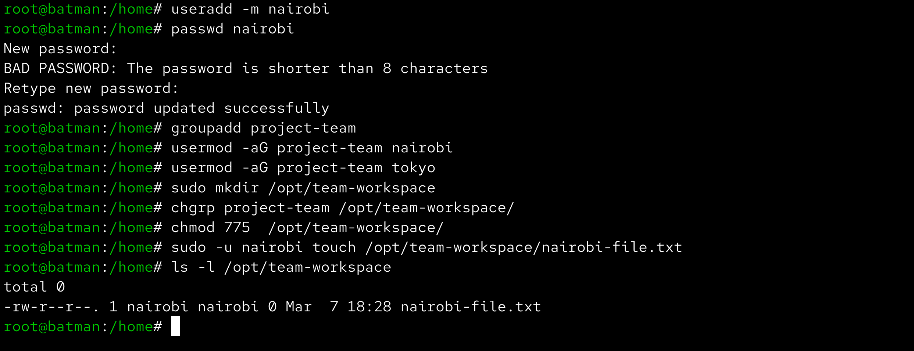

# Day 09 – Linux User & Group Management Challenge

Aaj maine Linux me users aur groups manage karne ka hands-on practice kiya. Is challenge me users create kiye, groups banaye aur shared directories setup karke permissions test ki.

------------------------------------------------------------

## Users & Groups Created

Users created:

tokyo  
berlin  
professor  
nairobi  

Groups created:

developers  
admins  
project-team  

------------------------------------------------------------

## Group Assignments

tokyo → developers  
berlin → developers, admins  
professor → admins  
nairobi → project-team  
tokyo → project-team  

------------------------------------------------------------

## Directories Created

/opt/dev-project  
Group: developers  
Permissions: 775  

/opt/team-workspace  
Group: project-team  
Permissions: 775  

------------------------------------------------------------

## Commands Used

sudo useradd -m tokyo  
sudo passwd tokyo  

sudo useradd -m berlin  
sudo passwd berlin  

sudo useradd -m professor  
sudo passwd professor  

sudo useradd -m nairobi  
sudo passwd nairobi  

sudo groupadd developers  
sudo groupadd admins  
sudo groupadd project-team  

sudo usermod -aG developers tokyo  
sudo usermod -aG developers,admins berlin  
sudo usermod -aG admins professor  
sudo usermod -aG project-team nairobi  
sudo usermod -aG project-team tokyo  

sudo mkdir /opt/dev-project  
sudo chgrp developers /opt/dev-project  
sudo chmod 775 /opt/dev-project  

sudo mkdir /opt/team-workspace  
sudo chgrp project-team /opt/team-workspace  
sudo chmod 775 /opt/team-workspace  

------------------------------------------------------------

## Verification Screenshots

### Users Created

### Groups Created

### Group Membership

### Shared Directory Test

### Team Workspace Test

------------------------------------------------------------

## What I Learned

Linux me user aur group management system administration ka important part hai.  
Group permissions use karke multiple users ko ek shared directory par kaam karne diya ja sakta hai.  
Is practice se mujhe samajh aaya ki teams ko manage karne ke liye groups aur directory permissions kaise use hote hain in real DevOps environments.
