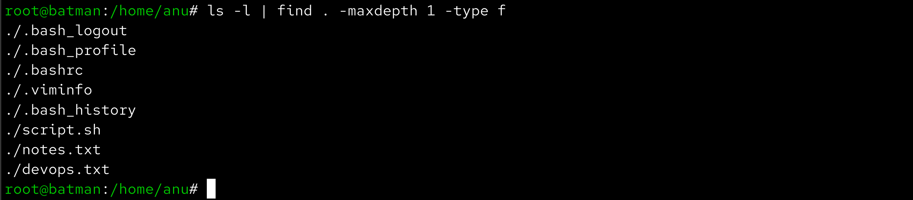
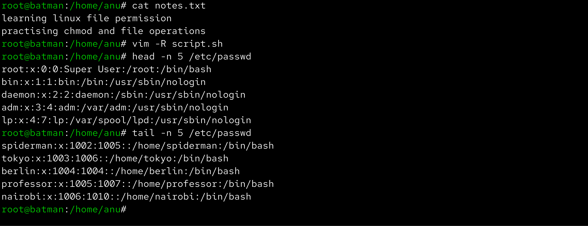
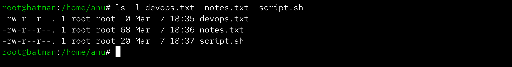
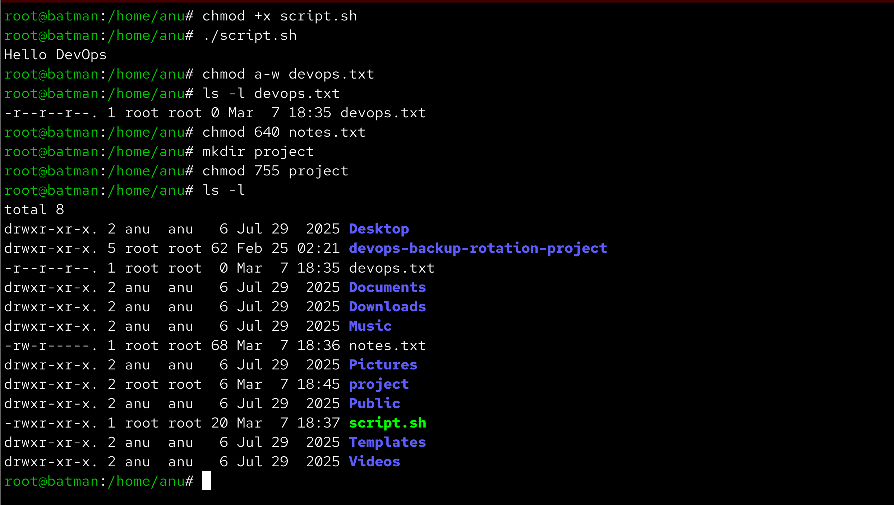
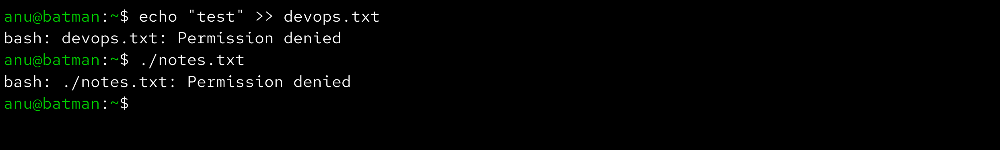

# Day 10 – File Permissions & File Operations Challenge

Aaj maine Linux me file creation, file reading aur permissions modify karne ka practice kiya. Is challenge me basic commands use karke files create ki, unhe read kiya aur chmod ke through permissions change ki.

------------------------------------------------------------

## Files Created

devops.txt  
notes.txt  
script.sh  
project/ (directory)

------------------------------------------------------------

## Permission Changes

Initial permissions check kiye using:

ls -l devops.txt notes.txt script.sh

Script file executable banaya:

chmod +x script.sh

Phir script run ki:

./script.sh

devops.txt ko read-only banaya:

chmod a-w devops.txt

notes.txt ki permission set ki:

chmod 640 notes.txt

Directory create ki aur permissions set ki:

mkdir project  
chmod 755 project

------------------------------------------------------------

## Commands Used

touch devops.txt

echo "Learning Linux file permissions" > notes.txt  
echo "Practicing chmod and file operations" >> notes.txt

vim script.sh

cat notes.txt

vim -R script.sh

head -n 5 /etc/passwd

tail -n 5 /etc/passwd

chmod +x script.sh

chmod a-w devops.txt

chmod 640 notes.txt

mkdir project

chmod 755 project

------------------------------------------------------------

## Verification Screenshots

### Files Created

### Reading Files

### Initial Permissions

### Permissions Modified

### Permission Errors

------------------------------------------------------------

## What I Learned

Linux file permissions ka concept system security aur file access control ke liye important hai.  
chmod command use karke easily permissions modify ki ja sakti hain.  
Execute permission ke bina script run nahi hoti aur read-only files me write karne par error aata hai.
