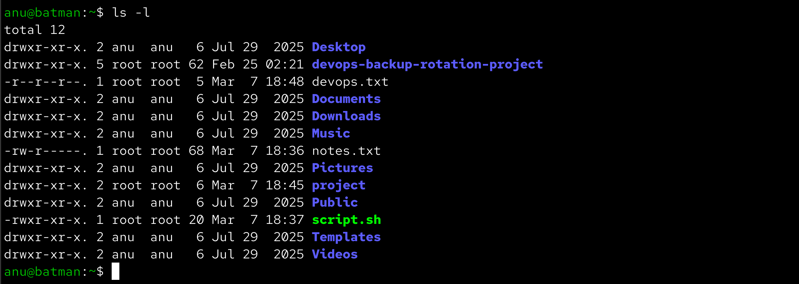
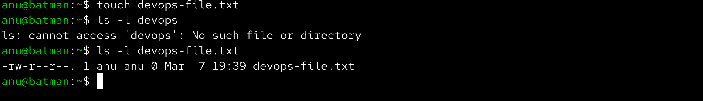
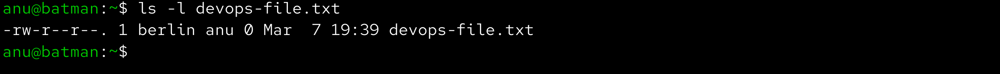
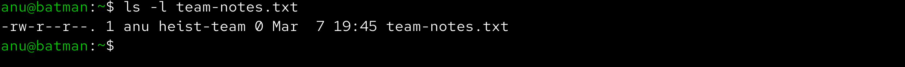
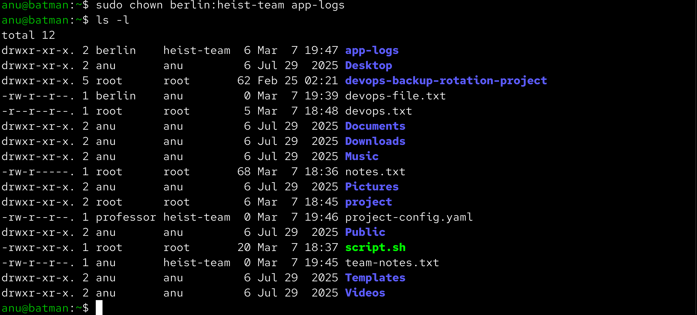
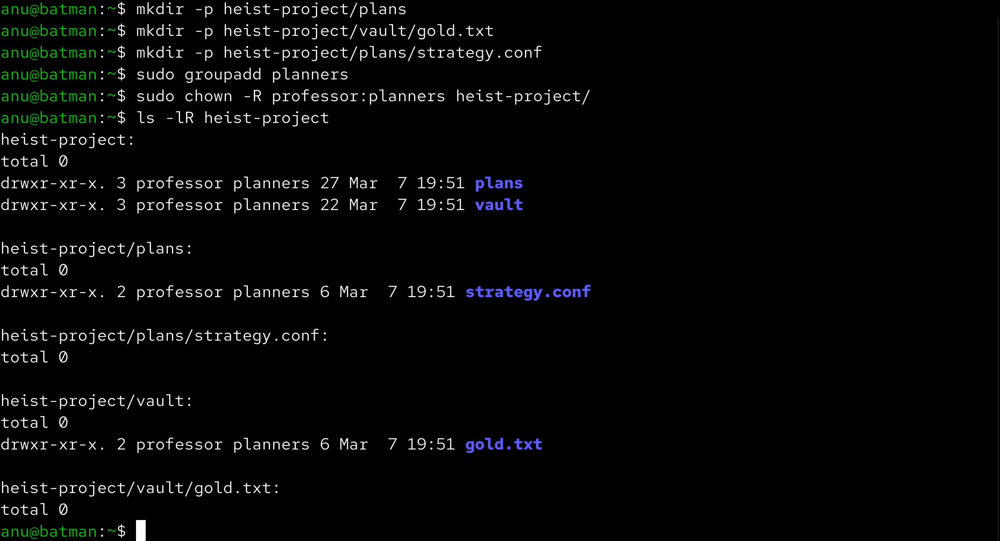
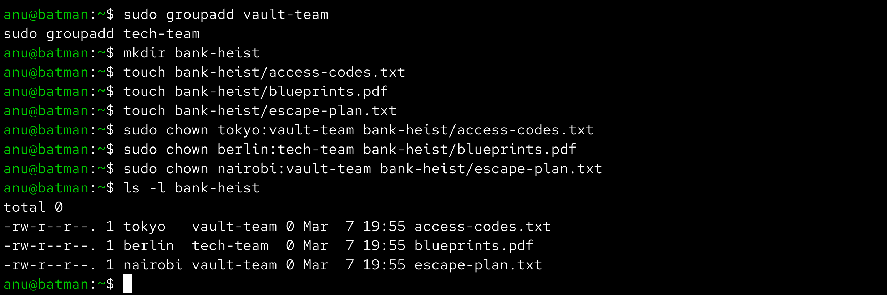

# Day 11 – File Ownership Challenge (chown & chgrp)

Aaj maine Linux me file ownership aur group ownership ka practical challenge complete kiya. Is exercise me maine files create ki, unka owner change kiya, group change kiya aur recursive ownership bhi practice ki.

------------------------------------------------------------

## Files & Directories Created

devops-file.txt  
team-notes.txt  
project-config.yaml  
app-logs/  
heist-project/  
bank-heist/

Inside bank-heist directory:

access-codes.txt  
blueprints.pdf  
escape-plan.txt  

------------------------------------------------------------

## Ownership Changes

devops-file.txt  
Initial owner → current user  
Changed owner → tokyo  
Changed owner again → berlin  

team-notes.txt  
Initial group → default user group  
Changed group → heist-team  

project-config.yaml  
Owner → professor  
Group → heist-team  

app-logs directory  
Owner → berlin  
Group → heist-team  

heist-project directory (recursive change)  
Owner → professor  
Group → planners  

bank-heist files:

access-codes.txt → tokyo:vault-team  
blueprints.pdf → berlin:tech-team  
escape-plan.txt → nairobi:vault-team  

------------------------------------------------------------

## Commands Used

ls -l

touch devops-file.txt  
touch team-notes.txt  
touch project-config.yaml  

sudo chown tokyo devops-file.txt  
sudo chown berlin devops-file.txt  

sudo groupadd heist-team  
sudo chgrp heist-team team-notes.txt  

sudo chown professor:heist-team project-config.yaml  

mkdir app-logs  
sudo chown berlin:heist-team app-logs  

mkdir -p heist-project/vault  
mkdir -p heist-project/plans  

touch heist-project/vault/gold.txt  
touch heist-project/plans/strategy.conf  

sudo groupadd planners  
sudo chown -R professor:planners heist-project  

sudo groupadd vault-team  
sudo groupadd tech-team  

mkdir bank-heist  

touch bank-heist/access-codes.txt  
touch bank-heist/blueprints.pdf  
touch bank-heist/escape-plan.txt  

sudo chown tokyo:vault-team bank-heist/access-codes.txt  
sudo chown berlin:tech-team bank-heist/blueprints.pdf  
sudo chown nairobi:vault-team bank-heist/escape-plan.txt  

------------------------------------------------------------

## Verification Screenshots

### Checking Ownership

### Owner Change (Before)

### Owner Change (After)

### Group Change

### Combined Owner & Group

### Recursive Ownership

### Bank Heist File Ownership

------------------------------------------------------------

## What I Learned

Linux me har file ka ek owner aur ek group hota hai jo decide karta hai ki kaun file ko access ya modify kar sakta hai.  
chown command se file ka owner change kiya ja sakta hai aur chgrp se group change kiya ja sakta hai.  
Recursive ownership change (-R) useful hota hai jab kisi directory ke andar sabhi files ka ownership ek saath change karna ho.
