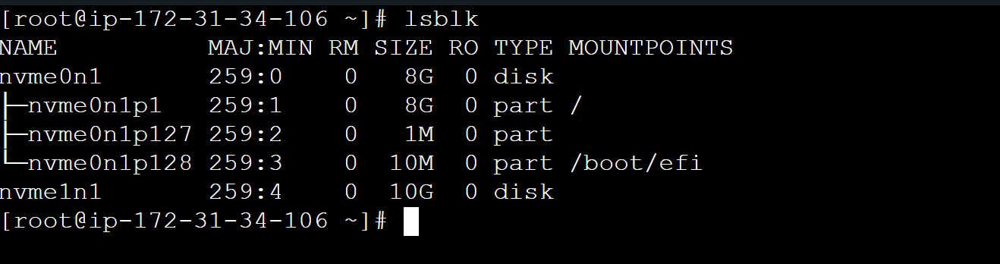
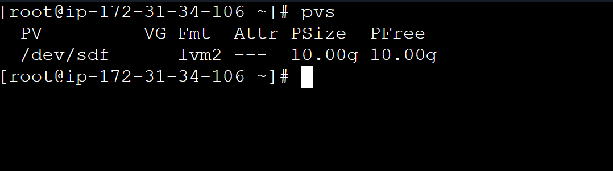
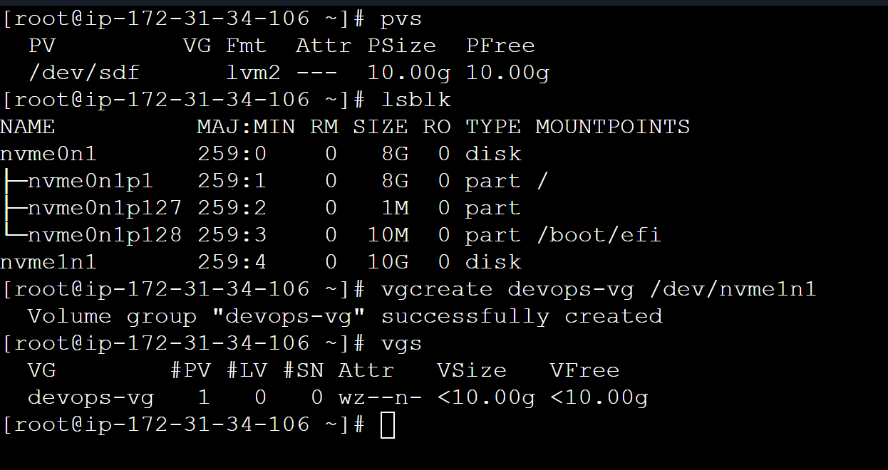
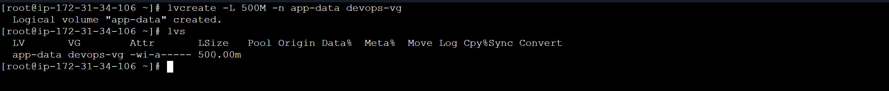
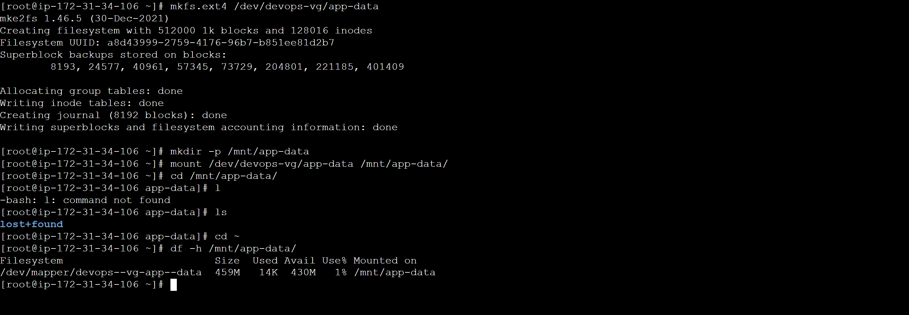
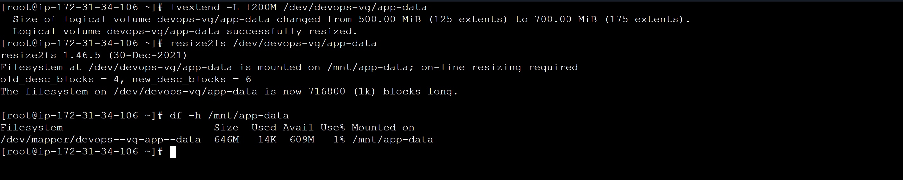

# Day 13 – Linux Volume Management (LVM)

Aaj maine Linux me LVM (Logical Volume Management) ka hands-on practice kiya. Is exercise me maine AWS EC2 instance par ek extra EBS volume attach kiya aur usko LVM use karke manage kiya.

LVM ka advantage ye hai ki storage ko flexible tarike se manage kiya ja sakta hai – volumes create karna, extend karna aur mount karna easy ho jata hai.

------------------------------------------------------------

## Initial Storage Check

Sabse pehle system ke existing disks aur storage configuration check kiya.

Commands used:

lsblk  
pvs  
vgs  
lvs  
df -h  

Is step se pata chala ki system me new disk **/dev/nvme1n1** attach hui hai jo abhi LVM me use nahi ho rahi thi.

### Screenshot

------------------------------------------------------------

## Creating Physical Volume

Naye EBS disk ko LVM me use karne ke liye usko physical volume me convert kiya.

Command used:

sudo pvcreate /dev/nvme1n1

Verify kiya using:

sudo pvs

### Screenshot

------------------------------------------------------------

## Creating Volume Group

Next step me ek volume group create kiya jisme physical volume add kiya.

Command used:

sudo vgcreate devops-vg /dev/nvme1n1

Verify:

sudo vgs

### Screenshot

------------------------------------------------------------

## Creating Logical Volume

Volume group ke andar ek logical volume create kiya.

Command used:

sudo lvcreate -L 500M -n app-data devops-vg

Verify:

sudo lvs

### Screenshot

------------------------------------------------------------

## Formatting and Mounting Volume

Logical volume ko filesystem ke saath format kiya aur mount kiya.

Commands used:

sudo mkfs.ext4 /dev/devops-vg/app-data

sudo mkdir -p /mnt/app-data

sudo mount /dev/devops-vg/app-data /mnt/app-data

Verify:

df -h /mnt/app-data

### Screenshot

------------------------------------------------------------

## Extending Logical Volume

LVM ka main benefit ye hai ki volume ko easily extend kiya ja sakta hai.

Commands used:

sudo lvextend -L +200M /dev/devops-vg/app-data

sudo resize2fs /dev/devops-vg/app-data

Verify:

df -h /mnt/app-data

### Screenshot

------------------------------------------------------------

## Commands Used

lsblk  
pvs  
vgs  
lvs  
df -h  

sudo pvcreate /dev/nvme1n1

sudo vgcreate devops-vg /dev/nvme1n1

sudo lvcreate -L 500M -n app-data devops-vg

sudo mkfs.ext4 /dev/devops-vg/app-data

sudo mkdir -p /mnt/app-data

sudo mount /dev/devops-vg/app-data /mnt/app-data

sudo lvextend -L +200M /dev/devops-vg/app-data

sudo resize2fs /dev/devops-vg/app-data

------------------------------------------------------------

## What I Learned

LVM Linux me storage management ko flexible aur scalable banata hai.  
Physical volume, volume group aur logical volume ka concept samajh aaya.  
Logical volumes ko easily extend kiya ja sakta hai without recreating the filesystem.
