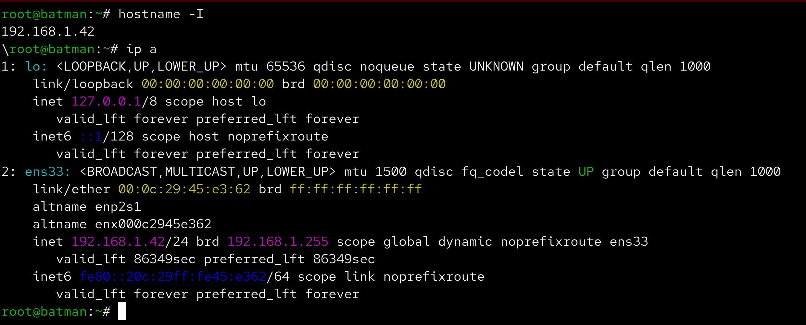
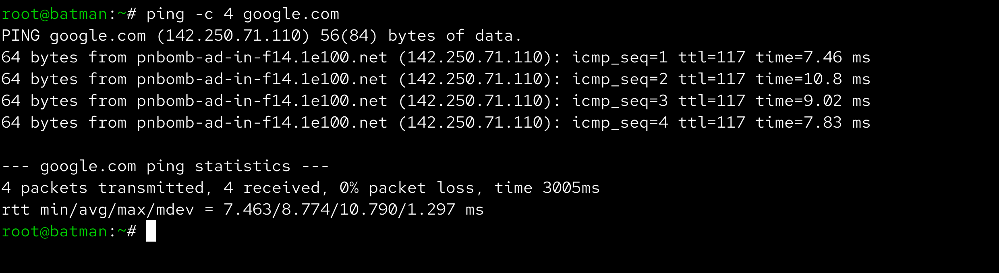
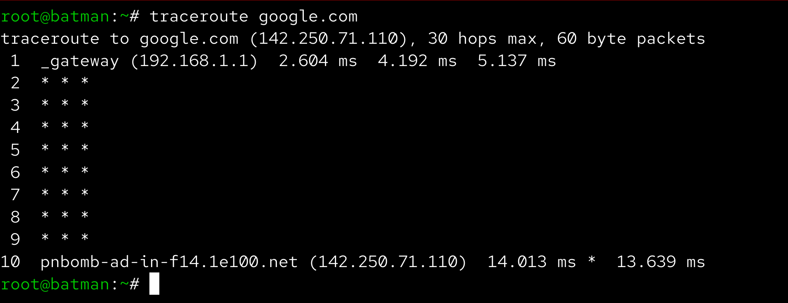
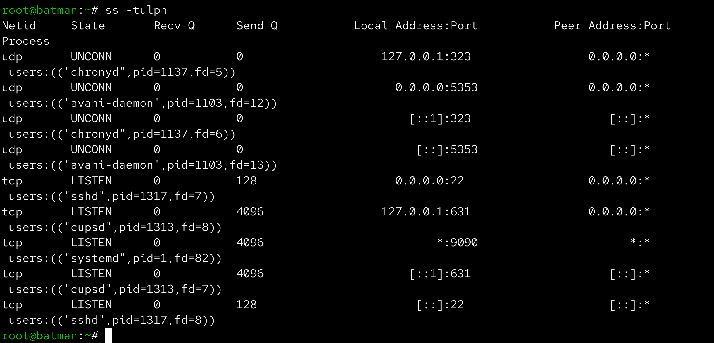
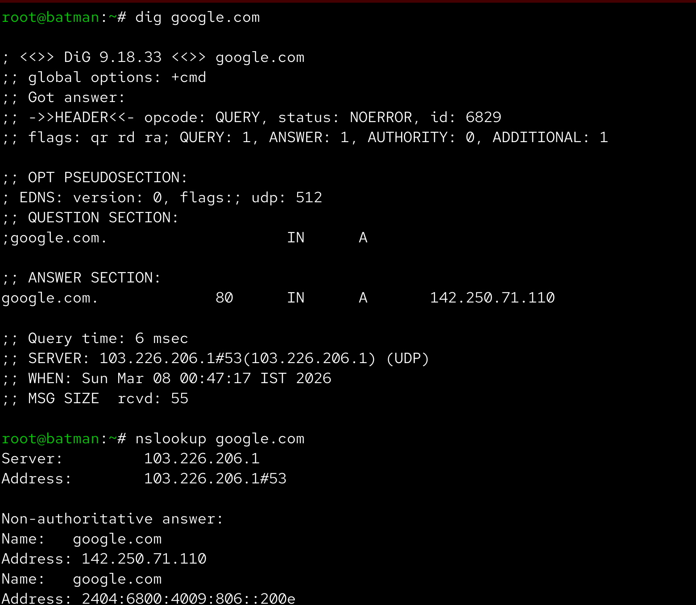
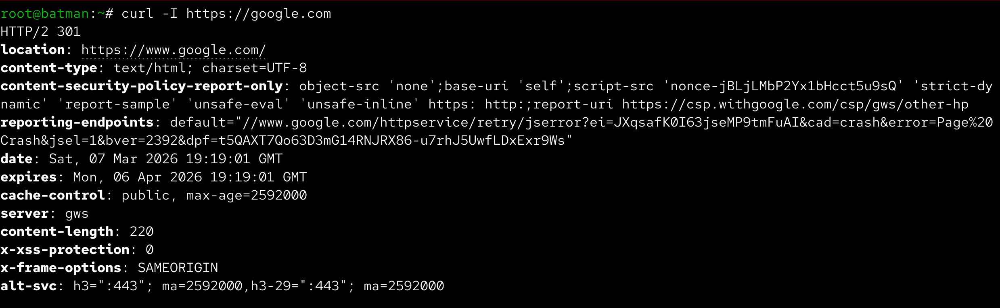
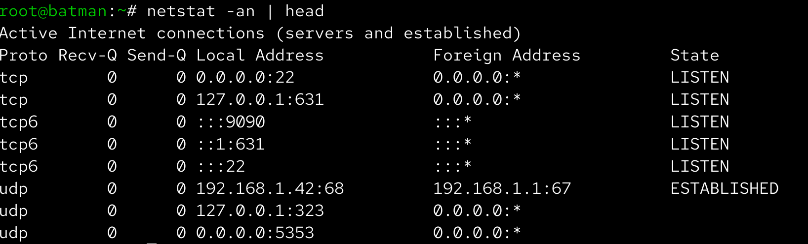
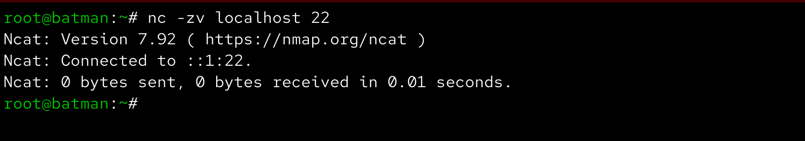

# Day 14 – Networking Fundamentals & Hands-on Checks

Aaj maine Linux me basic networking commands practice kiye jo troubleshooting ke time kaafi useful hote hain. Is exercise ka goal tha network connectivity, DNS resolution aur open ports ko check karna.

------------------------------------------------------------

## OSI vs TCP/IP Model

OSI model me 7 layers hoti hain:

Layer 1 – Physical  
Layer 2 – Data Link  
Layer 3 – Network  
Layer 4 – Transport  
Layer 5 – Session  
Layer 6 – Presentation  
Layer 7 – Application  

TCP/IP model me 4 layers hoti hain:

Link Layer  
Internet Layer  
Transport Layer  
Application Layer  

Example:

curl https://example.com  

Is request me HTTP Application layer par hota hai, TCP Transport layer par aur IP Internet layer par work karta hai.

------------------------------------------------------------

## Identity Check

Sabse pehle machine ka IP address check kiya.

Command used:

hostname -I

Observation:

Is command se system ka current IP address pata chalta hai jo network communication ke liye use hota hai.

### Screenshot

------------------------------------------------------------

## Reachability Test

Network connectivity check karne ke liye ping command run ki.

Command used:

ping -c 4 google.com

Observation:

Latency milliseconds me show hoti hai aur packet loss bhi pata chalta hai. Agar packet loss 0% ho to network connectivity normal hoti hai.

### Screenshot

------------------------------------------------------------

## Network Path Check

Command used:

traceroute google.com

Observation:

Is command se pata chalta hai ki request destination tak pahunchne ke liye kaun kaun se intermediate routers cross karti hai.

### Screenshot

------------------------------------------------------------

## Listening Ports

Command used:

ss -tulpn

Observation:

Is command se system me running services aur unke listening ports pata chalte hain. Example: SSH service port 22 par run hoti hai.

### Screenshot

------------------------------------------------------------

## DNS Resolution

Command used:

dig google.com

Observation:

Is command se domain name ka IP address resolve hota hai jo DNS server return karta hai.

### Screenshot

------------------------------------------------------------

## HTTP Check

Command used:

curl -I https://google.com

Observation:

Is command se HTTP response headers milte hain aur status code bhi pata chalta hai. Example: HTTP 200 means request successful.

### Screenshot

------------------------------------------------------------

## Connections Snapshot

Command used:

netstat -an | head

Observation:

Is command se active network connections aur unke states jaise LISTEN, ESTABLISHED aur TIME_WAIT pata chalte hain.

### Screenshot

------------------------------------------------------------

## Port Probe Test

Listening port identify karne ke baad usko test kiya.

Command used:

nc -zv localhost 22

Observation:

Port reachable tha jo indicate karta hai ki SSH service properly running hai.

### Screenshot

------------------------------------------------------------

## Reflection

Fastest command jab network issue ho:

ping – quickly pata chal jata hai ki host reachable hai ya nahi.

Agar DNS fail ho jaye to next check:

dig domain.com  
nslookup domain.com

Agar HTTP error aaye to check karunga:

systemctl status service  
ss -tulpn  
journalctl -u service

------------------------------------------------------------

## What I Learned

Linux networking troubleshooting me basic commands bahut important hote hain.  
Ping, traceroute aur curl commands se quickly network issues identify kiye ja sakte hain.  
DNS resolution aur open ports check karna production troubleshooting me useful hota hai.
