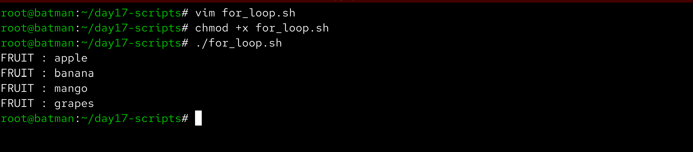
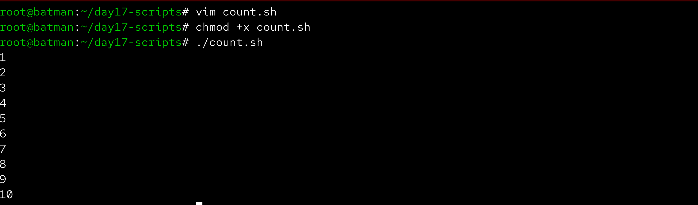
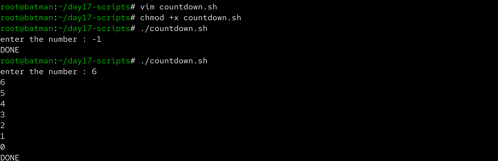
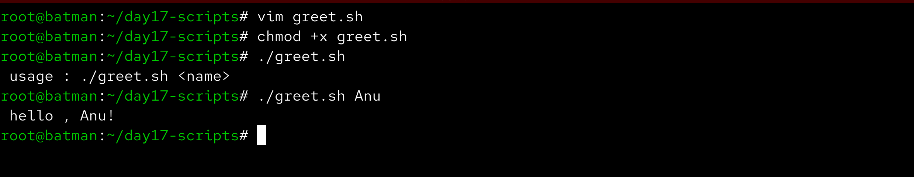
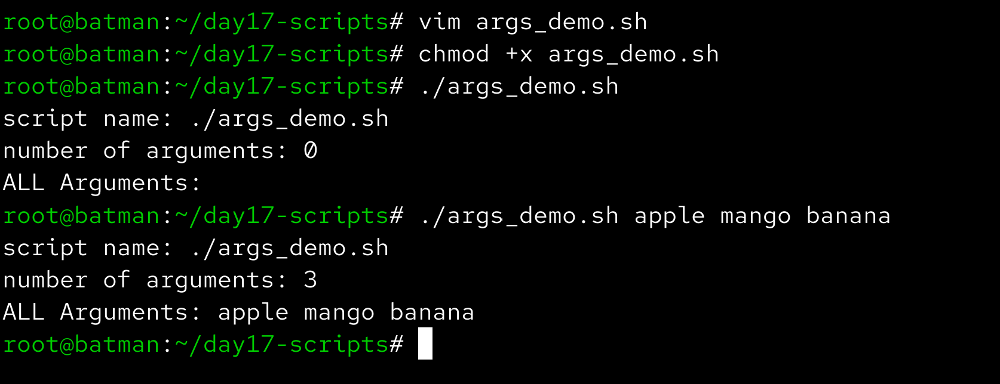
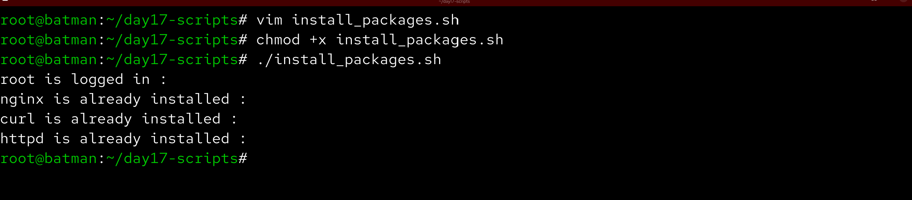
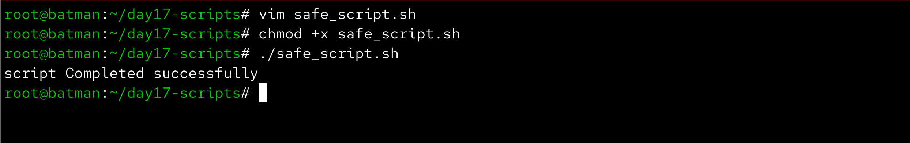

# Day 17 – Shell Scripting: Loops, Arguments & Error Handling

Aaj maine Bash shell scripting me loops, command-line arguments aur basic error handling concepts practice kiye. Ye concepts automation scripts likhne ke liye bahut useful hote hain.

------------------------------------------------------------

## Task 1 – For Loop

File: for_loop.sh

Script:

#!/bin/bash

FRUITS=("Apple" "Banana" "Mango" "Orange" "Grapes")

for fruit in "${FRUITS[@]}"
do
  echo "Fruit: $fruit"
done

Output example:

Fruit: Apple  
Fruit: Banana  
Fruit: Mango  
Fruit: Orange  
Fruit: Grapes  

Screenshot:

------------------------------------------------------------

File: count.sh

Script:

#!/bin/bash

for i in {1..10}
do
  echo $i
done

Output:

1  
2  
3  
4  
5  
6  
7  
8  
9  
10  

Screenshot:

------------------------------------------------------------

## Task 2 – While Loop

File: countdown.sh

Script:

#!/bin/bash

read -p "Enter a number: " NUM

while [ $NUM -ge 0 ]
do
  echo $NUM
  NUM=$((NUM-1))
done

echo "Done!"

Screenshot:

------------------------------------------------------------

## Task 3 – Command Line Arguments

File: greet.sh

Script:

#!/bin/bash

if [ -z "$1" ]; then
  echo "Usage: ./greet.sh <name>"
else
  echo "Hello, $1!"
fi

Example run:

./greet.sh Alex

Output:

Hello, Alex!

Screenshot:

------------------------------------------------------------

File: args_demo.sh

Script:

#!/bin/bash

echo "Script name: $0"
echo "Number of arguments: $#"
echo "All arguments: $@"

Example run:

./args_demo.sh apple mango orange

Output example:

Script name: ./args_demo.sh  
Number of arguments: 3  
All arguments: apple mango orange  

Screenshot:

------------------------------------------------------------

## Task 4 – Install Packages Script

File: install_packages.sh

Script:

#!/bin/bash

if [ "$EUID" -ne 0 ]; then
  echo "Please run as root"
  exit 1
fi

PACKAGES=("nginx" "curl" "wget")

for pkg in "${PACKAGES[@]}"
do
  if rpm -q $pkg &> /dev/null; then
      echo "$pkg is already installed"
  else
      echo "Installing $pkg..."
      dnf install -y $pkg
  fi
done

Screenshot:

------------------------------------------------------------

## Task 5 – Error Handling

File: safe_script.sh

Script:

#!/bin/bash
set -e

mkdir /tmp/devops-test || echo "Directory already exists"

cd /tmp/devops-test || echo "Failed to enter directory"

touch example.txt || echo "File creation failed"

echo "Script completed successfully"

Screenshot:

------------------------------------------------------------

## What I Learned

For loops aur while loops scripts me repetitive tasks automate karne ke liye use hote hain.  
Command-line arguments ($1, $#, $@) scripts ko flexible banate hain.  
Basic error handling (set -e, || operator) scripts ko safer aur reliable banata hai.
