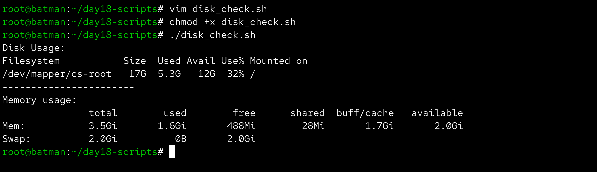
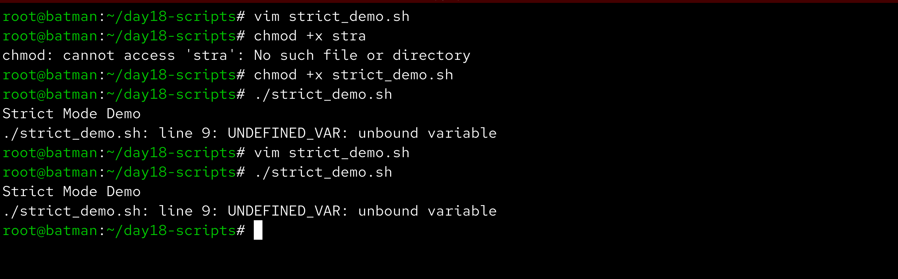
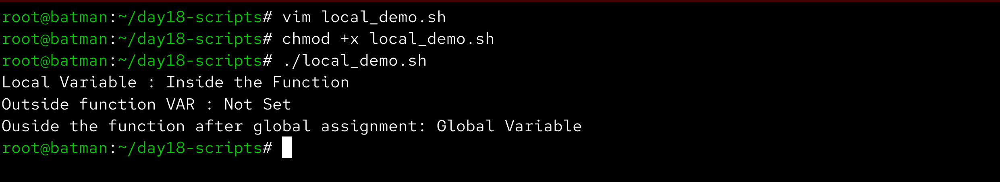
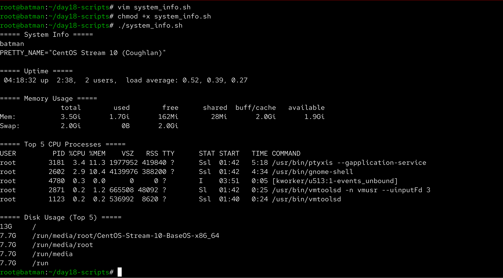

# Day 18 – Shell Scripting: Functions & Intermediate Concepts

Aaj maine Bash scripting me functions, strict mode aur reusable scripting patterns practice kiye. Is exercise ka goal scripts ko cleaner, safer aur modular banana tha.

---

## Task 1 – Basic Functions

**File:** `functions.sh`

```bash
#!/bin/bash

greet() {
  name=$1
  echo "Hello, $name!"
}

add() {
  num1=$1
  num2=$2
  sum=$((num1 + num2))
  echo "Sum: $sum"
}

greet "Alex"
add 5 10
```

**Output:**

```
Hello, Alex!
Sum: 15
```


---

## Task 2 – Functions with System Checks

**File:** `disk_check.sh`

```bash
#!/bin/bash

check_disk() {
  echo "Disk Usage:"
  df -h /
}

check_memory() {
  echo "Memory Usage:"
  free -h
}

check_disk
echo "-----------------------"
check_memory
```



---

## Task 3 – Strict Mode (`set -euo pipefail`)

**File:** `strict_demo.sh`

```bash
#!/bin/bash
set -euo pipefail

echo "Strict mode demo"

# undefined variable example
echo "$UNDEFINED_VAR"
```

**Observed behavior:**

Running the script throws an error because the variable is undefined.



**Explanation**

set -e → Script exits immediately if any command fails.  
set -u → Script exits if an undefined variable is used.  
set -o pipefail → Pipeline fails if any command inside the pipe fails.

---

## Task 4 – Local Variables

**File:** `local_demo.sh`

```bash
#!/bin/bash

demo_local() {
  local VAR="Inside function"
  echo "Local variable: $VAR"
}

demo_global() {
  VAR="Global variable"
}

demo_local
echo "Outside function VAR: ${VAR:-Not set}"

demo_global
echo "Outside function after global assignment: $VAR"
```



This demonstrates that variables declared with `local` remain inside the function scope.

---

## Task 5 – System Info Reporter Script

**File:** `system_info.sh`

```bash
#!/bin/bash
set -euo pipefail

print_system() {
  echo "===== System Info ====="
  hostname
  grep PRETTY_NAME /etc/os-release
}

print_uptime() {
  echo "===== Uptime ====="
  uptime
}

print_disk() {
  echo "===== Disk Usage (Top 5) ====="
  du -h / 2>/dev/null | sort -rh | head -5
}

print_memory() {
  echo "===== Memory Usage ====="
  free -h
}

print_cpu() {
  echo "===== Top 5 CPU Processes ====="
  ps aux --sort=-%cpu | head -6
}

main() {
  print_system
  echo
  print_uptime
  echo
  print_disk
  echo
  print_memory
  echo
  print_cpu
}

main
```



---

## What I Learned

- Functions help organize scripts and make code reusable.
- Strict mode (`set -euo pipefail`) prevents silent failures and makes scripts safer.
- Using `local` variables avoids conflicts and keeps functions isolated.
