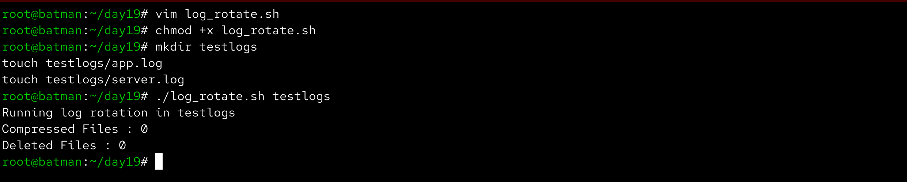
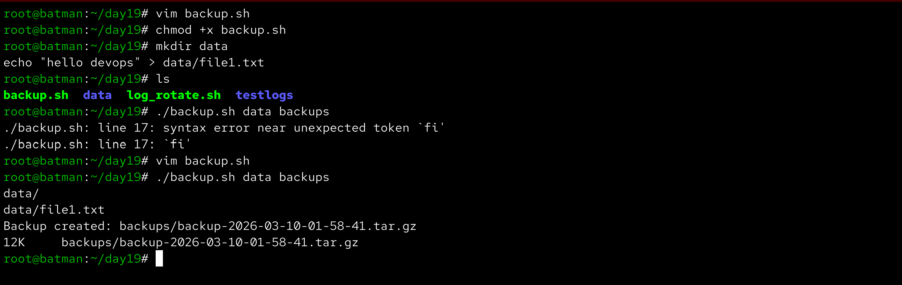
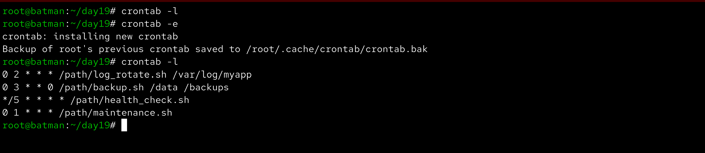
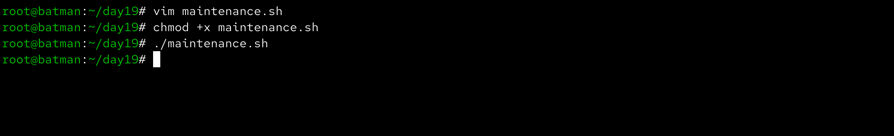

# Day 19 – Shell Scripting Project: Log Rotation, Backup & Crontab

Aaj maine Bash shell scripting ka ek practical mini project banaya jisme **log rotation, server backup aur cron scheduling** implement kiya.  
Is project ka goal tha automation ka use karke system maintenance tasks ko automatically run karna.

---

## Task 1 – Log Rotation Script

**File:** `log_rotate.sh`

```bash
#!/bin/bash

# Ye script ek given directory me log rotation perform karti hai.
# .log files jo 7 din se purani hain unko compress karta hai
# aur .gz files jo 30 din se purani hain unko delete karta hai.

LOG_DIR=$1

# check karo ki user ne directory argument diya hai ya nahi
if [ -z "$LOG_DIR" ]; then
    echo "Usage: ./log_rotate.sh <log_directory>"
    exit 1
fi

# verify karo ki directory exist karti hai ya nahi
if [ ! -d "$LOG_DIR" ]; then
    echo "Error: Directory does not exist"
    exit 1
fi

echo "Running log rotation in $LOG_DIR"

compressed=0
deleted=0

# 7 din se purani .log files ko compress karo
for file in $(find "$LOG_DIR" -name "*.log" -mtime +7); do
    gzip "$file"
    ((compressed++))
done

# 30 din se purani compressed files delete karo
for file in $(find "$LOG_DIR" -name "*.gz" -mtime +30); do
    rm -f "$file"
    ((deleted++))
done

echo "Compressed files: $compressed"
echo "Deleted files: $deleted"
```



---

## Task 2 – Server Backup Script

**File:** `backup.sh`

```bash
#!/bin/bash

# Ye script ek source directory ka compressed backup banata hai
# aur 14 din se purane backups delete karta hai.

SOURCE_DIR=$1
BACKUP_DIR=$2

# check karo ki dono arguments diye gaye hain ya nahi
if [ -z "$SOURCE_DIR" ] || [ -z "$BACKUP_DIR" ]; then
    echo "Usage: ./backup.sh <source_directory> <backup_directory>"
    exit 1
fi

# verify karo ki source directory exist karti hai
if [ ! -d "$SOURCE_DIR" ]; then
    echo "Error: Source directory does not exist"
    exit 1
fi

# agar backup directory nahi hai to create karo
mkdir -p "$BACKUP_DIR"

# timestamp generate karo unique backup file ke liye
TIMESTAMP=$(date +%Y-%m-%d-%H-%M-%S)

ARCHIVE="$BACKUP_DIR/backup-$TIMESTAMP.tar.gz"

# source directory ka compressed archive create karo
tar -czf "$ARCHIVE" "$SOURCE_DIR"

if [ $? -eq 0 ]; then
    echo "Backup created successfully: $ARCHIVE"
    du -h "$ARCHIVE"
else
    echo "Backup failed"
    exit 1
fi

# 14 din se purane backups delete karo
find "$BACKUP_DIR" -name "backup-*.tar.gz" -mtime +14 -delete
```



---

## Task 3 – Cron Scheduling

Sabse pehle maine check kiya ki system me kaun-kaun se cron jobs already configured hain.

```bash
crontab -l
```

Cron syntax ka format kuch aisa hota hai:

```
* * * * * command
│ │ │ │ │
│ │ │ │ └── Day of week (0-7)
│ │ │ └──── Month (1-12)
│ │ └────── Day of month (1-31)
│ └──────── Hour (0-23)
└────────── Minute (0-59)
```

Example cron jobs:

Run log rotation **daily at 2 AM**

```bash
0 2 * * * /path/log_rotate.sh /var/log/myapp
```

Run backup **every Sunday at 3 AM**

```bash
0 3 * * 0 /path/backup.sh /data /backups
```

Run health check **every 5 minutes**

```bash
*/5 * * * * /path/health_check.sh
```



---

## Task 4 – Maintenance Script

**File:** `maintenance.sh`

```bash
#!/bin/bash

# Ye maintenance script automated tasks run karta hai
# jaise log rotation aur backup
# aur output ko log file me store karta hai

LOGFILE="/var/log/maintenance.log"

LOG_DIR="./testlogs"
SOURCE_DIR="./data"
BACKUP_DIR="./backups"

echo "$(date): Maintenance started" >> "$LOGFILE"

./log_rotate.sh "$LOG_DIR" >> "$LOGFILE" 2>&1
./backup.sh "$SOURCE_DIR" "$BACKUP_DIR" >> "$LOGFILE" 2>&1

echo "$(date): Maintenance completed" >> "$LOGFILE"
```

Cron entry to run this script **daily at 1 AM**

```bash
0 1 * * * /path/maintenance.sh
```



---

## What I Learned

- Bash scripting ka use karke repetitive system tasks automate kiye ja sakte hain.
- Log rotation important hai taaki logs ki wajah se disk space fill na ho.
- Cron jobs scripts ko automatically schedule karke system maintenance ko easier banate hain.
