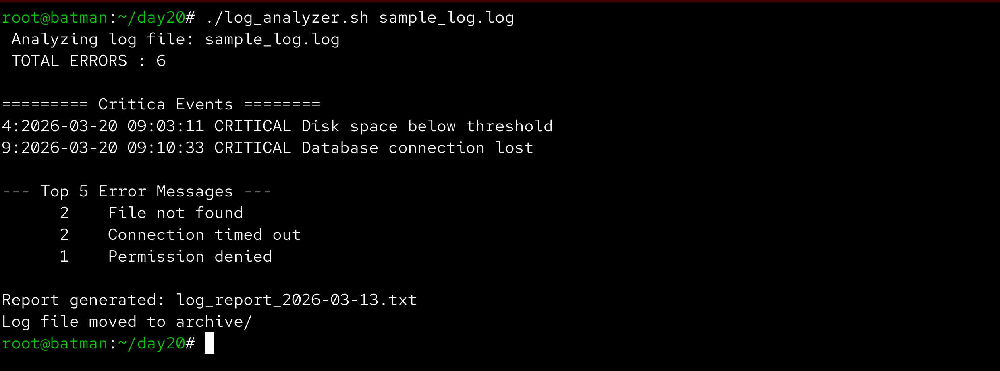

# Day 20 – Bash Scripting Challenge: Log Analyzer and Report Generator

Aaj maine ek Bash script banayi jo system log files ko analyze karti hai aur ek summary report generate karti hai.  
Is script ka purpose hai **errors identify karna, critical events detect karna aur top error messages summarize karna**.

Ye automation real DevOps environments me useful hoti hai jaha system administrators ko daily logs analyze karne padte hain.

---

## Task 1 – Input Validation

Script log file ka path **command-line argument** ke through accept karti hai.

Agar user argument nahi deta ya file exist nahi karti to script error message ke saath exit ho jati hai.

Example run:

```bash
./log_analyzer.sh sample_log.log
```

---

## Task 2 – Error Count

Script log file me **ERROR ya Failed keyword** wali lines count karti hai.

Command used:

```bash
grep -E "ERROR|Failed" logfile.log | wc -l
```

Isse pata chalta hai system me total kitne error events hue.

---

## Task 3 – Critical Events Detection

Script CRITICAL events ko search karti hai aur unko **line numbers ke saath print karti hai**.

Example output:

```
--- Critical Events ---
4:2026-03-20 09:03:11 CRITICAL Disk space below threshold
9:2026-03-20 09:10:33 CRITICAL Database connection lost
```

Command used:

```bash
grep -n "CRITICAL" logfile.log
```

---

## Task 4 – Top Error Messages

Script log file me sabse zyada repeat hone wale **Top 5 error messages** identify karti hai.

Example output:

```
--- Top 5 Error Messages ---
2 Connection timed out
2 File not found
1 Permission denied
```

Commands used:

```bash
grep "ERROR" logfile.log | awk '{$1=$2=$3=""; print}' | sort | uniq -c | sort -rn | head -5
```

Tools used:

- grep
- awk
- sort
- uniq
- head

---

## Task 5 – Summary Report Generation

Script ek report file generate karti hai:

```
log_report_<date>.txt
```

Example:

```
log_report_2026-03-20.txt
```

Report me following information hoti hai:

- Date of analysis
- Log file name
- Total lines processed
- Total error count
- Top 5 error messages
- Critical events with line numbers

Date generate karne ke liye command use ki:

```bash
date +%Y-%m-%d
```

---

## Task 6 – Archive Processed Logs

Analysis complete hone ke baad script processed log file ko **archive directory me move karti hai**.

Agar archive directory exist nahi karti to script automatically create karti hai.

Commands used:

```bash
mkdir -p archive
mv logfile.log archive/
```

---

## Script Implementation

**File:** `log_analyzer.sh`

```bash
#!/bin/bash

# Check if argument is provided
if [ $# -eq 0 ]; then
    echo "Usage: ./log_analyzer.sh <log_file>"
    exit 1
fi

LOGFILE=$1

# Check if file exists
if [ ! -f "$LOGFILE" ]; then
    echo "Error: Log file does not exist"
    exit 1
fi

echo "Analyzing log file: $LOGFILE"

# Total number of lines
TOTAL_LINES=$(wc -l < "$LOGFILE")

# Count ERROR or Failed lines
ERROR_COUNT=$(grep -E "ERROR|Failed" "$LOGFILE" | wc -l)

echo "Total errors: $ERROR_COUNT"

echo
echo "--- Critical Events ---"

grep -n "CRITICAL" "$LOGFILE"

echo
echo "--- Top 5 Error Messages ---"

grep "ERROR" "$LOGFILE" \
| awk '{$1=$2=$3=""; print}' \
| sort \
| uniq -c \
| sort -rn \
| head -5

DATE=$(date +%Y-%m-%d)
REPORT="log_report_$DATE.txt"

{
echo "Log Analysis Report"
echo "Date: $DATE"
echo "Log File: $LOGFILE"
echo "Total Lines: $TOTAL_LINES"
echo "Total Errors: $ERROR_COUNT"

echo
echo "Top 5 Error Messages:"
grep "ERROR" "$LOGFILE" \
| awk '{$1=$2=$3=""; print}' \
| sort \
| uniq -c \
| sort -rn \
| head -5

echo
echo "Critical Events:"
grep -n "CRITICAL" "$LOGFILE"

} > "$REPORT"

echo "Report generated: $REPORT"

mkdir -p archive
mv "$LOGFILE" archive/

echo "Log file moved to archive/"
```

---

## Script Execution

Example run:

```bash
./log_analyzer.sh sample_log.log
```


---

## Generated Report

After execution, report file generate hoti hai:

```
log_report_<date>.txt
```

Example:

```bash
cat log_report_2026-03-20.txt
```



---

## Archive Directory

Processed log file archive folder me move ho jata hai.

```bash
ls archive
```


---

## What I Learned

- Bash scripting ka use karke log analysis automate kiya ja sakta hai.
- Linux text processing tools jaise **grep, awk, sort aur uniq** log analysis me powerful hote hain.
- Automation scripts DevOps environments me monitoring aur troubleshooting ko easier banate hain.
