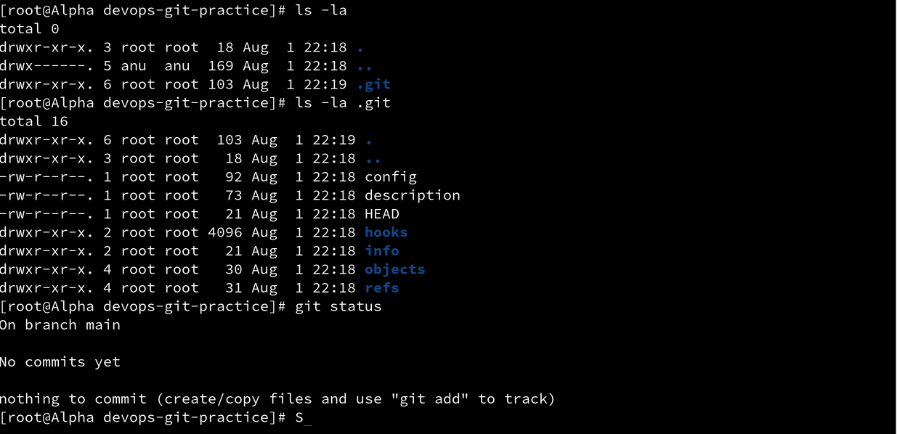

# Day 22 – Introduction to Git: Your First Repository

Aaj maine Git ke fundamentals practically explore kiye. Is exercise me maine Git configure kiya, ek local repository initialize ki, staging area aur commits ko samjha aur multiple commits create karke Git history check ki.

---

## Task 1 – Install and Configure Git

Sabse pehle maine verify kiya ki Git system par installed hai.

```bash
git --version
```

Uske baad Git username aur email configuration check ki.

```bash
git config --global user.name
git config --global user.email
```

Git ki complete global configuration check karne ke liye:

```bash
git config --global --list
```

Git identity important hai kyunki har commit ke saath author ka naam aur email record hota hai.


---

## Task 2 – Create Git Repository

Practice ke liye maine `devops-git-practice` naam ka directory create kiya.

```bash
mkdir devops-git-practice
cd devops-git-practice
```

Directory ko Git repository me initialize kiya:

```bash
git init
```

Repository ka current status check kiya:

```bash
git status
```

Hidden files aur `.git` directory inspect ki:

```bash
ls -la
ls -la .git
```

`.git` directory ke andar Git repository ki internal information store hoti hai jaise commits, references, configuration aur objects.



---

## Task 3 – Git Commands Reference

Maine `git-commands.md` naam ka personal Git reference file create kiya.

```bash
vim git-commands.md
```

Is file me maine Git commands ko different categories me organize kiya:

- Setup & Config
- Basic Workflow
- Viewing Changes
- Useful Git Commands

Kuch important commands jo maine practice kiye:

```bash
git --version
git config --global --list
git init
git status
git add
git commit
git diff
git diff --staged
git log
git log --oneline
git branch
git show
```

Ye `git-commands.md` file future Git days me bhi update hoti rahegi aur meri personal Git cheat sheet ki tarah kaam karegi.

---

## Task 4 – Stage and Commit

File create karne ke baad repository ka status check kiya:

```bash
git status
```

File ko staging area me add kiya:

```bash
git add git-commands.md
```

Staging ke baad dobara status check kiya:

```bash
git status
```

First commit create kiya:

```bash
git commit -m "Add initial Git commands reference"
```

Commit history check karne ke liye:

```bash
git log --oneline
```

---

## Task 5 – Build Commit History

`git-commands.md` ko multiple times update karke maine different commits create kiye.

Changes check karne ke liye:

```bash
git diff
```

Changes stage kiye:

```bash
git add git-commands.md
```

Second commit:

```bash
git commit -m "Add Git diff and tracked files commands"
```

File me aur commands add karne ke baad third commit create kiya:

```bash
git commit -m "Expand Git commands reference"
```

Finally compact commit history check ki:

```bash
git log --oneline
```

Isse repository ke commits short aur readable format me show hue.


---

# Git Workflow – My Understanding

## 1. `git add` aur `git commit` me kya difference hai?

`git add` working directory ke changes ko **staging area** me move karta hai.

Example:

```bash
git add git-commands.md
```

`git commit` staging area me available changes ka snapshot Git repository history me permanently save karta hai.

Example:

```bash
git commit -m "Update Git commands"
```

Simple workflow:

```text
Working Directory
       |
       | git add
       v
Staging Area
       |
       | git commit
       v
Git Repository
```

---

## 2. Staging Area kya karta hai?

Staging area working directory aur Git repository ke beech ek intermediate area hai.

Iski help se hum decide kar sakte hain ki kaunse changes next commit me include karne hain.

Example ke liye agar maine 3 files modify ki hain lekin sirf ek file commit karni hai:

```bash
git add file1.txt
git commit -m "Update file1"
```

Baaki modified files commit me include nahi hongi.

---

## 3. `git log` kya information show karta hai?

`git log` repository ki commit history show karta hai.

```bash
git log
```

Normally isme information hoti hai:

- Commit hash
- Author
- Date
- Commit message

Compact history ke liye:

```bash
git log --oneline
```

---

## 4. `.git/` Folder Kya Hai?

`.git` Git repository ka sabse important internal directory hai.

Isme repository ki information store hoti hai jaise:

```text
HEAD
config
objects
refs
hooks
```

Agar `.git` directory delete kar di jaye to project files delete nahi hongi, lekin directory Git repository nahi rahegi aur uski local Git history/configuration bhi lose ho jayegi.

---

## 5. Working Directory, Staging Area aur Repository

### Working Directory

Ye actual files hain jinpar hum currently kaam kar rahe hote hain.

Example:

```text
git-commands.md
```

### Staging Area

Next commit me kaunse changes jane chahiye ye staging area decide karne deta hai.

Command:

```bash
git add git-commands.md
```

### Repository

Committed snapshots Git repository me permanently store hote hain.

Command:

```bash
git commit -m "Update Git commands"
```

Overall workflow:

```text
Working Directory
       |
       | git add
       v
Staging Area
       |
       | git commit
       v
Local Git Repository
```

---

# Commands Practiced

```bash
git --version
git config --global user.name
git config --global user.email
git config --global --list
git init
git status
git add
git commit
git diff
git diff --staged
git log
git log --oneline
git ls-files
git branch
git show
```

---

# What I Learned

- Git files ke changes ko track karne aur project history maintain karne ke liye use hota hai.
- `git add` changes ko staging area me rakhta hai aur `git commit` un changes ko repository history me save karta hai.
- `.git` directory repository ki complete Git metadata aur history maintain karti hai.
- Meaningful aur small commits maintain karne se project history samajhna aur troubleshoot karna easier hota hai.
- `git status`, `git diff` aur `git log --oneline` Git workflow samajhne ke liye bahut useful commands hain.

---

## Screenshots

### Git Configuration


### Git Repository Initialization


### Multiple Commit History


