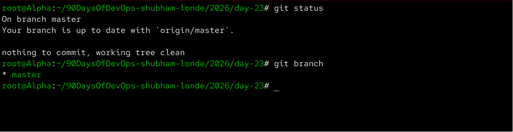
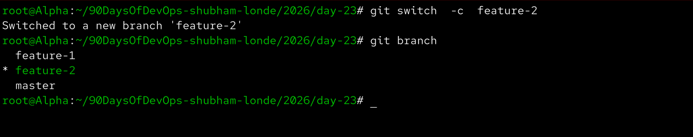
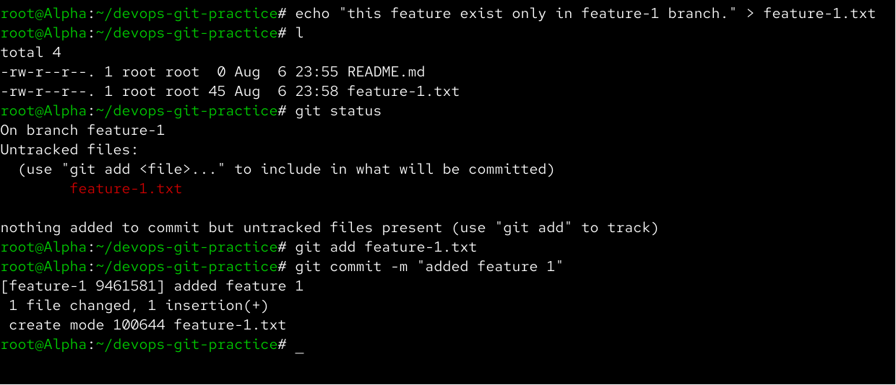
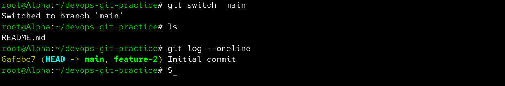
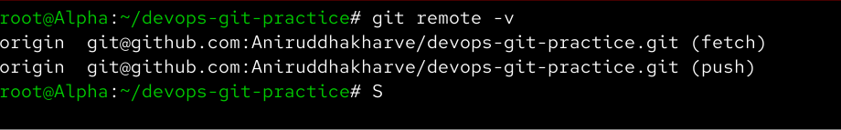
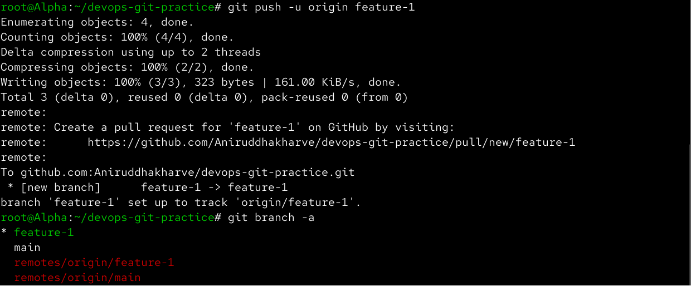
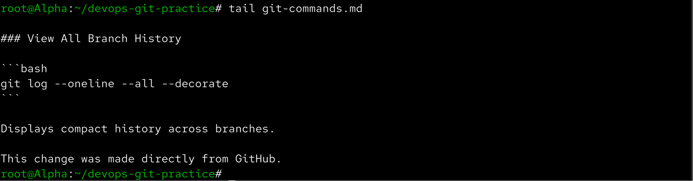
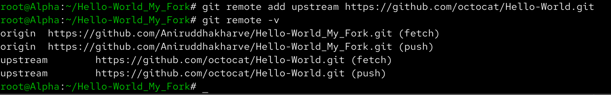

# Day 23 – Git Branching & Working with GitHub

Aaj maine Git branching aur GitHub ke saath remote repository workflow practically practice kiya. Is task me maine branches create aur switch ki, feature branch par isolated commit banaya, local repository ko GitHub se connect kiya, branches push ki, remote changes pull kiye aur clone vs fork ka difference samjha.

---

## Task 1 – Understanding Branches

### Git Branch kya hoti hai?

Git branch repository ke andar development ki ek separate line hoti hai.

Branch ki help se hum kisi feature, bug fix ya experiment par independently kaam kar sakte hain bina `main` branch ko directly affect kiye.

Current branches check karne ke liye:

```bash
git branch
```

Repository status check karne ke liye:

```bash
git status
```



---

### Hum sab kuch `main` par commit kyu nahi karte?

Agar multiple developers directly `main` branch par changes karenge to incomplete ya broken code main codebase ko affect kar sakta hai.

Isliye generally separate branches use ki jati hain:

```text
main
 |
 |---- feature-login
 |
 |---- feature-payment
 |
 |---- bugfix-api
```

Feature complete aur tested hone ke baad usko `main` me merge kiya ja sakta hai.

---

### HEAD kya hai?

`HEAD` Git ka pointer hai jo normally batata hai ki hum currently kis branch ke latest commit par kaam kar rahe hain.

Example:

```text
HEAD -> main
```

Agar hum `feature-1` par switch kare:

```bash
git switch feature-1
```

to HEAD us branch ko point karega.

```text
HEAD -> feature-1
```

---

### Branch switch karne par files ka kya hota hai?

Jab hum branch switch karte hain, Git working directory ko us branch ke committed snapshot ke according update karta hai.

Isliye ek branch par available file dusri branch par available nahi bhi ho sakti hai.

---

## Task 2 – Branching Commands Hands-On

### Branches List Karna

```bash
git branch
```

---

### `feature-1` Branch Create Karna

```bash
git branch feature-1
```

Us branch par switch kiya:

```bash
git switch feature-1
```

Verify:

```bash
git branch
```

---

### Branch Create + Switch in One Command

`feature-2` create karke immediately uspar switch kiya:

```bash
git switch -c feature-2
```

Branches verify ki:

```bash
git branch
```



---

## `git switch` vs `git checkout`

Branch switch karne ke liye traditional command:

```bash
git checkout feature-1
```

Modern Git command:

```bash
git switch feature-1
```

`git checkout` ek multipurpose command hai jo branches switch karne ke saath files restore/check out karne ke liye bhi use hota hai.

`git switch` specifically branch switching ke liye designed hai, isliye iska purpose clearer hai.

---

## Feature Branch par Isolated Commit

`feature-1` branch par switch kiya:

```bash
git switch feature-1
```

New file create ki:

```bash
echo "This feature exists only in feature-1 branch." > feature-1.txt
```

Status check kiya:

```bash
git status
```

File stage ki:

```bash
git add feature-1.txt
```

Commit create kiya:

```bash
git commit -m "Add feature 1"
```

All branches ki history check ki:

```bash
git log --oneline --all --decorate
```



---

## Branch Isolation Verify Karna

`main` branch par wapas switch kiya:

```bash
git switch main
```

Files check ki:

```bash
ls
```

Commit history check ki:

```bash
git log --oneline
```

`feature-1.txt` aur uska commit `main` branch par available nahi tha.

Is practical se clear hua ki feature branch ke changes `main` se isolated rehte hain jab tak hum unhe merge nahi karte.



---

## Branch Delete Karna

Unused `feature-2` branch delete ki:

```bash
git branch -d feature-2
```

Verify:

```bash
git branch
```

---

## Git Commands Reference Update

Existing `git-commands.md` me naye branching commands add kiye:

```bash
git branch
git branch feature-1
git switch feature-1
git switch -c feature-2
git checkout main
git branch -d feature-2
git log --oneline --all --decorate
```

Update commit ki:

```bash
git add git-commands.md
git commit -m "Add Git branching commands"
```

---

# Task 3 – Push Repository to GitHub

Local `devops-git-practice` repository ke liye GitHub par ek empty repository create ki.

Repository ko README, `.gitignore` ya license ke saath initialize nahi kiya kyunki local repository already exist karti thi.

---

## Remote Repository Connect Karna

Local repository ko GitHub repository se connect kiya:

```bash
git remote add origin <repository-url>
```

Remote verify kiya:

```bash
git remote -v
```



---

## Main Branch Push Karna

```bash
git push -u origin main
```

`-u` upstream tracking relationship set karta hai, jiske baad future me simply:

```bash
git push
```

use kiya ja sakta hai.

---

## Feature Branch Push Karna

`feature-1` par switch kiya:

```bash
git switch feature-1
```

Remote par branch push ki:

```bash
git push -u origin feature-1
```

Branches check ki:

```bash
git branch -a
```

GitHub par verify kiya ki `main` aur `feature-1` dono branches available hain.



---

## `origin` aur `upstream` me Difference

`origin` normally us remote repository ka default naam hota hai jahan se repository clone ki gayi hai ya jise humne apne local repository ke primary remote ke roop me configure kiya hai.

Example:

```text
origin -> my GitHub repository
```

Fork workflow me `upstream` commonly original repository ko refer karta hai:

```text
origin   -> my fork
upstream -> original repository
```

Important point: `origin` aur `upstream` Git ke special reserved words nahi hain. Ye remote names hain, bas ye naming convention commonly use hoti hai.

---

# Task 4 – Pull Changes from GitHub

Maine GitHub editor se directly `git-commands.md` me ek change kiya aur GitHub par commit kiya.

Uske baad local repository me remote change pull kiya:

```bash
git pull origin main
```

Recent commits verify kiye:

```bash
git log --oneline -3
```

File ke latest changes check kiye:

```bash
tail git-commands.md
```

GitHub par kiya hua change successfully local repository me aa gaya.



---

## `git fetch` vs `git pull`

### git fetch

```bash
git fetch origin
```

`git fetch` remote repository se latest commits aur references download karta hai, lekin automatically current working branch me integrate nahi karta.

Conceptually:

```text
Remote Repository
       |
       | git fetch
       v
Remote-Tracking References
```

---

### git pull

```bash
git pull origin main
```

`git pull` remote changes fetch karta hai aur phir unko current branch me integrate karta hai.

Simplified concept:

```text
git pull
   |
   +---- git fetch
   |
   +---- integrate changes
```

Isliye changes inspect karne ke liye pehle `git fetch` useful ho sakta hai, jabki remote changes directly integrate karne ke liye `git pull` use hota hai.

---

# Task 5 – Clone vs Fork

## Git Clone

Public repository ko local machine par clone kiya:

```bash
git clone <repository-url>
```

Clone karne ke baad:

```bash
cd repository
git remote -v
```

`git clone` existing Git repository ki local working copy create karta hai, including its Git history.

---

## Git Fork

GitHub par same public repository ka fork create kiya.

Fork original repository ki server-side copy mere GitHub account ke under create karta hai.

Uske baad fork ko local machine par clone kiya:

```bash
git clone <fork-url> hello-world-fork
```

---

## Clone aur Fork me Difference

### Clone

Clone repository ko remote server se **local machine par copy** karta hai.

```text
GitHub Repository
       |
       | git clone
       v
Local Machine
```

### Fork

Fork GitHub par original repository ki **separate server-side copy** create karta hai under another account.

```text
Original Repository
        |
        | Fork
        v
My GitHub Fork
        |
        | git clone
        v
Local Machine
```

Fork ek **GitHub/platform concept** hai, Git command nahi.

---

## Clone kab use karunga?

Agar mujhe repository locally download karke inspect, build ya work karna hai aur mere paas required permissions hain, to clone use karunga.

```bash
git clone <repository-url>
```

---

## Fork kab use karunga?

Agar mujhe kisi dusre developer ya open-source project me contribution karna hai aur original repository par direct write access nahi hai, to fork useful hai.

Typical workflow:

```text
Original Repository
       |
       v
Fork
       |
       v
Clone Fork
       |
       v
Create Branch
       |
       v
Make Changes
       |
       v
Push to Fork
       |
       v
Pull Request
```

---

# Keeping a Fork in Sync

Fork clone karne ke baad original repository ko `upstream` remote ke roop me add kiya:

```bash
git remote add upstream <original-repository-url>
```

Verify:

```bash
git remote -v
```

Ab remote structure:

```text
origin   -> my fork
upstream -> original repository
```



Original repository se latest changes lene ke liye:

```bash
git fetch upstream
```

Uske baad original repository ki main branch ke changes apni local main branch me integrate kiye ja sakte hain.

Example:

```bash
git switch main
git fetch upstream
git merge upstream/main
```

Aur apne fork ko update karne ke liye:

```bash
git push origin main
```

---

# Git Workflow Learned Today

Aaj ka basic feature development workflow:

```text
main
 |
 | git branch / git switch -c
 |
 v
feature branch
 |
 | make changes
 |
 | git add
 |
 | git commit
 |
 | git push
 |
 v
GitHub Remote
```

Fork workflow:

```text
Original Repository (upstream)
             |
             | fork
             v
       My Fork (origin)
             |
             | clone
             v
      Local Repository
```

---

# New Commands Practiced

```bash
git branch
git branch feature-1
git switch feature-1
git switch -c feature-2
git checkout main
git branch -d feature-2
git log --oneline --all --decorate
git remote add origin <url>
git remote -v
git push -u origin main
git push -u origin feature-1
git branch -a
git pull origin main
git fetch origin
git clone <url>
git remote add upstream <url>
git fetch upstream
git merge upstream/main
```

---

# What I Learned

- Git branches feature development ko `main` branch se isolate karne me help karti hain.
- `HEAD` current checked-out branch/commit ko reference karta hai.
- `git switch` branch switching ke liye modern aur clearer command hai.
- `origin` usually apne primary remote ya fork ko represent karta hai, jabki fork workflow me `upstream` original repository ko represent karta hai.
- `git fetch` remote changes download karta hai without automatically integrating them, jabki `git pull` fetch ke baad changes integrate bhi karta hai.
- Clone repository ko local machine par copy karta hai, jabki fork GitHub par repository ki separate copy create karta hai.
- Feature branches aur remote repositories collaborative DevOps workflows ka important part hain.

---

# Screenshots

## Initial Branch Status


## Branches Created


## Feature Branch Commit


## Main Branch Isolation


## GitHub Remote


## GitHub Branches


## Git Pull from GitHub


## Origin and Upstream


