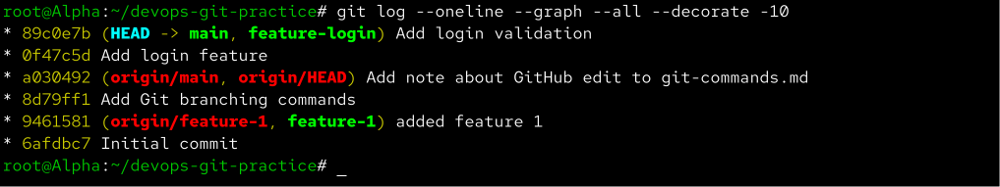
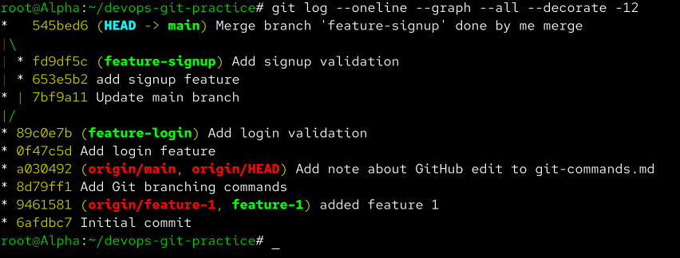
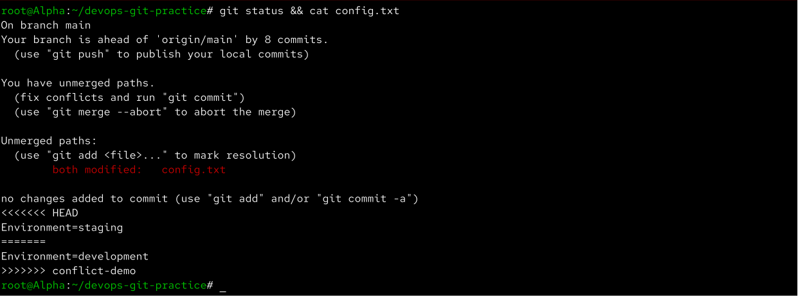
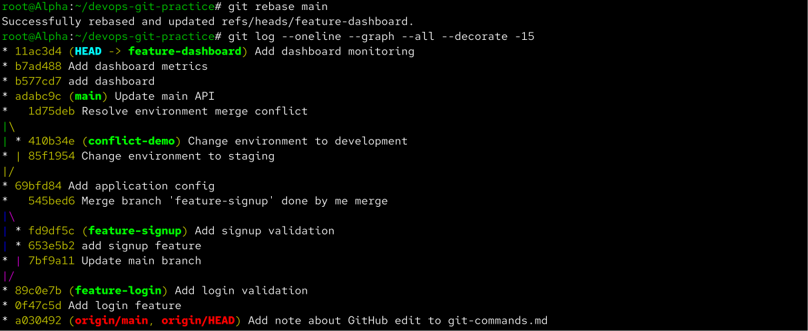
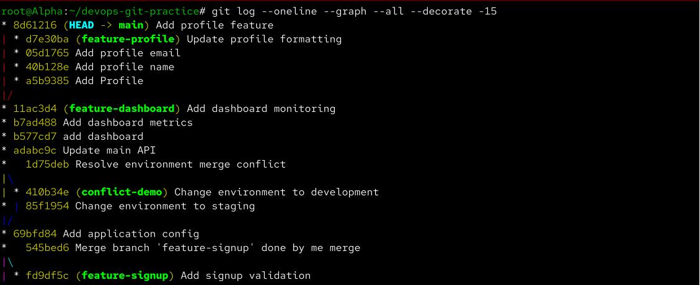
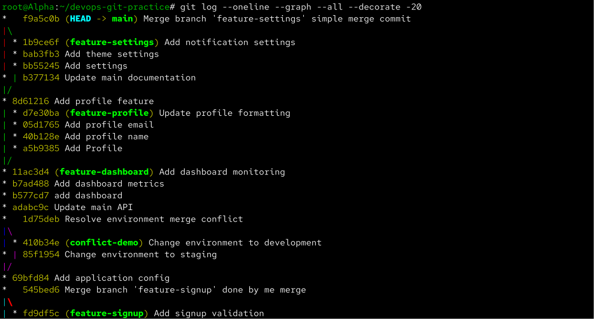
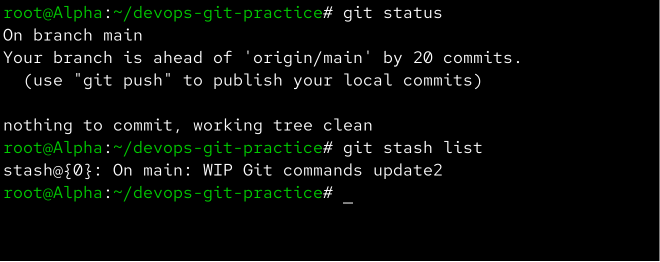
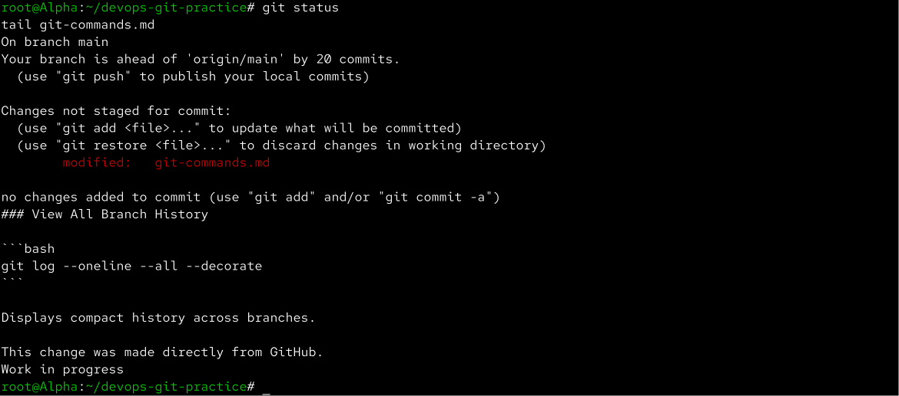
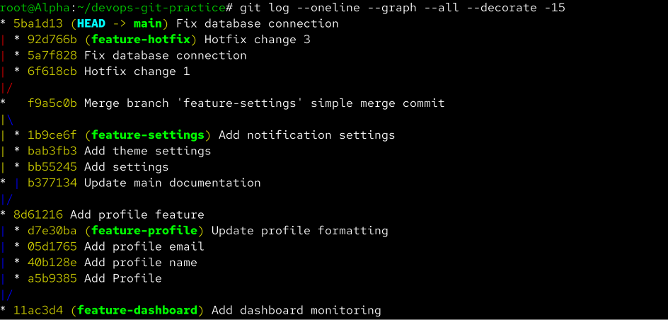

# Day 24 – Advanced Git: Merge, Rebase, Stash & Cherry Pick

Aaj maine Git ke advanced concepts practically practice kiye — **merge, merge conflicts, rebase, squash merge, stash aur cherry-pick**.

Ye concepts real DevOps aur development workflows me bahut important hain kyunki multiple developers alag-alag branches par kaam karte hain aur unke changes ko safely manage aur integrate karna padta hai.

---

# Task 1 – Git Merge

## Feature Login Branch

Sabse pehle `main` branch se `feature-login` branch create ki:

```bash
git switch main
git switch -c feature-login
```

Feature ke liye do commits create kiye:

```bash
echo "Login Feature" > login.txt
git add login.txt
git commit -m "Add login feature"
```

```bash
echo "Login validation added" >> login.txt
git add login.txt
git commit -m "Add login validation"
```

Commit history check ki:

```bash
git log --oneline --graph --all --decorate
```

---

## Fast-Forward Merge

`main` branch par wapas switch kiya:

```bash
git switch main
```

Feature branch merge ki:

```bash
git merge feature-login
```

Is case me Git ne **fast-forward merge** perform kiya kyunki `feature-login` create hone ke baad `main` branch par koi naya commit nahi hua tha.



### Fast-Forward Merge kya hai?

Fast-forward merge tab possible hota hai jab target branch ke paas merge hone wali branch ke common ancestor ke baad apna koi separate commit nahi hota.

Git ko new merge commit create karne ki zarurat nahi padti. Wo simply branch pointer ko latest feature commit tak move kar deta hai.

```text
Before:

A---B main
     \
      C---D feature-login


After:

A---B---C---D
            ↑
           main
```

---

# Merge Commit

Ab maine `feature-signup` branch create ki:

```bash
git switch -c feature-signup
```

Feature commits create kiye:

```bash
echo "Signup Feature" > signup.txt
git add signup.txt
git commit -m "Add signup feature"
```

```bash
echo "Signup validation added" >> signup.txt
git add signup.txt
git commit -m "Add signup validation"
```

Uske baad `main` par wapas gaya:

```bash
git switch main
```

Aur `main` par ek separate commit create kiya:

```bash
echo "Main branch update" > main-update.txt
git add main-update.txt
git commit -m "Update main branch"
```

Ab `main` aur `feature-signup` dono ki history diverge ho chuki thi.

Feature branch merge ki:

```bash
git merge feature-signup
```

History check ki:

```bash
git log --oneline --graph --all --decorate
```



### Git merge commit kab create karta hai?

Jab dono branches common ancestor ke baad independently move ho chuki hoti hain, simple fast-forward possible nahi hota.

Git histories ko combine karke generally ek **merge commit** create karta hai.

```text
      C---D feature-signup
     /     \
A---B---E---M main

M = Merge Commit
```

Merge commit ke usually do parent commits hote hain aur ye show karta hai ki do development histories kaha combine hui.

---

# Merge Conflict

Merge conflict ko practically samajhne ke liye same file ki same line ko do branches par differently modify kiya.

`main` par:

```bash
echo "Environment=production" > config.txt
git add config.txt
git commit -m "Add application config"
```

Conflict branch create ki:

```bash
git switch -c conflict-demo
```

Line change ki:

```bash
echo "Environment=development" > config.txt
git add config.txt
git commit -m "Change environment to development"
```

Main par wapas aakar same line differently modify ki:

```bash
git switch main

echo "Environment=staging" > config.txt
git add config.txt
git commit -m "Change environment to staging"
```

Merge try kiya:

```bash
git merge conflict-demo
```

Git automatically decide nahi kar paya ki kaunsa version rakhna chahiye, isliye merge conflict mila.

File ke andar conflict markers kuch is tarah dikhe:

```text
<<<<<<< HEAD
Environment=staging
=======
Environment=development
>>>>>>> conflict-demo
```



### Merge Conflict kya hai?

Merge conflict tab hota hai jab Git ke paas same part of file ke multiple incompatible changes hote hain aur Git automatically decide nahi kar pata ki final version kya hona chahiye.

Conflict manually resolve karke:

```bash
git add config.txt
git commit -m "Resolve environment merge conflict"
```

use complete kiya.

---

# Task 2 – Git Rebase

Rebase practice ke liye `feature-dashboard` branch create ki:

```bash
git switch main
git switch -c feature-dashboard
```

Multiple commits create kiye:

```bash
echo "Dashboard" > dashboard.txt
git add dashboard.txt
git commit -m "Add dashboard"
```

```bash
echo "Dashboard metrics" >> dashboard.txt
git add dashboard.txt
git commit -m "Add dashboard metrics"
```

```bash
echo "Dashboard monitoring" >> dashboard.txt
git add dashboard.txt
git commit -m "Add dashboard monitoring"
```

Uske baad `main` par ek new commit create kiya:

```bash
git switch main

echo "Main API update" > api.txt
git add api.txt
git commit -m "Update main API"
```

Ab `main` aur `feature-dashboard` diverge ho gaye.

---

## Rebase onto Main

Feature branch par switch kiya:

```bash
git switch feature-dashboard
```

Rebase run kiya:

```bash
git rebase main
```

History check ki:

```bash
git log --oneline --graph --all --decorate
```



### Rebase actually kya karta hai?

Rebase current branch ke commits ko temporarily remove karke target branch ke latest commit ke upar replay karta hai.

Before:

```text
      D---E---F feature-dashboard
     /
A---B---C---G main
```

After:

```text
A---B---C---G---D'---E'---F'
            ↑              ↑
           main      feature-dashboard
```

`D'`, `E'` aur `F'` technically naye commits hain aur unke commit hashes original commits se different hote hain.

---

## Merge vs Rebase

**Merge** branch histories ko preserve karta hai aur zarurat hone par merge commit create karta hai.

```text
      C---D
     /     \
A---B---E---M
```

**Rebase** feature commits ko target branch ke latest commit ke upar replay karke cleaner linear history create karta hai.

```text
A---B---E---C'---D'
```

---

## Shared Commits ko Rebase kyu nahi karna chahiye?

Rebase commit history rewrite karta hai aur commits ke hashes change ho jate hain.

Agar commits already remote par push ho chuke hain aur dusre developers un commits par kaam kar rahe hain, rebase karne se unki history aur rewritten history diverge ho sakti hai.

Isse unnecessary conflicts aur collaboration issues create ho sakte hain.

Isliye generally **private/local feature branch ko rebase karna safer hai**, shared history ko rewrite nahi karna chahiye.

---

## Rebase vs Merge kab use karunga?

**Rebase:**

Feature branch ko latest `main` ke saath update karna ho aur clean linear history maintain karni ho.

**Merge:**

Branch history preserve karni ho ya shared/public branches ko safely integrate karna ho.

---

# Task 3 – Squash Commit vs Regular Merge

## Squash Merge

`feature-profile` branch create ki:

```bash
git switch -c feature-profile
```

Feature development ke during multiple small commits create kiye:

```bash
git commit -m "Add profile"
git commit -m "Add profile name"
git commit -m "Add profile email"
git commit -m "Update profile formatting"
```

Main branch par switch kiya:

```bash
git switch main
```

Squash merge perform kiya:

```bash
git merge --squash feature-profile
```

Squash merge automatically commit create nahi karta, isliye staged combined changes ko manually commit kiya:

```bash
git commit -m "Add profile feature"
```

History check ki:

```bash
git log --oneline --graph --all --decorate
```



### Squash Merge kya karta hai?

Squash merge feature branch ke multiple commits ke changes ko combine karke target branch ke liye **ek single new commit** banane deta hai.

Example:

```text
Feature branch:

A
|
B
|
C
|
D

Squash into main:

S
```

Isse `main` ki history clean aur compact reh sakti hai.

---

## Regular Merge

Comparison ke liye `feature-settings` branch create ki:

```bash
git switch -c feature-settings
```

Multiple commits create kiye:

```bash
git commit -m "Add settings"
git commit -m "Add theme settings"
git commit -m "Add notification settings"
```

Main par separate commit create karne ke baad:

```bash
git switch main
git merge feature-settings
```

History inspect ki:

```bash
git log --oneline --graph --all --decorate
```



### Squash vs Regular Merge

**Squash Merge**

Multiple feature commits ko main ke liye one clean commit me combine karta hai.

Useful jab feature branch me bahut small WIP, typo ya formatting commits hon.

**Regular Merge**

Feature branch ki individual commit history preserve kar sakta hai.

Useful jab individual commits meaningful hain aur development history preserve karni hai.

### Squashing ka trade-off

History clean ho jati hai, lekin feature branch ke individual commits ka granular history `main` me separately preserve nahi hota.

---

# Task 4 – Git Stash

Maine `git-commands.md` me uncommitted change create kiya:

```bash
echo "Work in progress" >> git-commands.md
```

Status check ki:

```bash
git status
```

Work ko commit kiye bina temporarily save kiya:

```bash
git stash push -m "WIP Git commands update"
```

Stashes check ki:

```bash
git stash list
```

Working directory dobara clean ho gayi.



---

## Restore Stashed Work

Urgent branch work ke baad `main` par wapas aaya aur stash restore ki:

```bash
git stash pop
```

Check:

```bash
git status
```



---

## Multiple Stashes

Multiple WIP changes ko separately stash kiya:

```bash
git stash push -m "Temporary change 1"
```

```bash
git stash push -m "Temporary change 2"
```

List:

```bash
git stash list
```

Example:

```text
stash@{0}: On main: Temporary change 2
stash@{1}: On main: Temporary change 1
```

Specific stash apply ki:

```bash
git stash apply 'stash@{1}'
```

---

## `git stash pop` vs `git stash apply`

### stash pop

```bash
git stash pop
```

Stashed changes apply karta hai aur successful application ke baad stash entry ko stash list se remove karta hai.

### stash apply

```bash
git stash apply 'stash@{1}'
```

Changes apply karta hai lekin stash ko list me preserve rakhta hai.

Ye useful hai jab same stash ko multiple places par apply karna ho ya restore karne ke baad bhi backup rakhna ho.

---

## Real-World me Stash kab use karunga?

Example:

Main feature par kaam kar raha hoon:

```text
feature-payment
```

Changes incomplete hain aur suddenly production hotfix karna hai.

Instead of incomplete commit:

```bash
git stash push -m "WIP payment feature"
git switch hotfix
```

Hotfix complete hone ke baad:

```bash
git switch feature-payment
git stash pop
```

Aur wahi se development continue kar sakta hoon.

---

# Task 5 – Git Cherry-Pick

Cherry-pick practice ke liye `feature-hotfix` branch create ki:

```bash
git switch main
git switch -c feature-hotfix
```

Three different commits create kiye:

```text
Hotfix change 1
Fix database connection
Hotfix change 3
```

Commit hashes check kiye:

```bash
git log --oneline -3
```

Uske baad `main` par switch kiya:

```bash
git switch main
```

Sirf database fix wala second commit select karke cherry-pick kiya:

```bash
git cherry-pick <commit-hash>
```

History verify ki:

```bash
git log --oneline --graph --all --decorate
```



### Cherry-Pick kya karta hai?

`git cherry-pick` kisi dusri branch ke **specific commit ke changes** ko current branch par apply karta hai.

Example:

```text
feature-hotfix:

A---B---C
    ↑
   Fix

main:

D---E
```

Cherry-pick `B`:

```text
feature-hotfix:

A---B---C

main:

D---E---B'
```

`B'` same changes contain karta hai lekin current branch par new commit hash ke saath create hota hai.

---

## Cherry-Pick kab use karunga?

Suppose feature branch me multiple changes hain lekin production me sirf ek critical bug fix urgently chahiye.

Complete feature branch merge karne ke instead:

```bash
git cherry-pick <bug-fix-commit>
```

use karke sirf required fix apply ki ja sakti hai.

---

## Cherry-Pick me kya problem ho sakti hai?

Agar selected commit current branch ke code se conflict karta hai to cherry-pick conflict aa sakta hai.

Also, unnecessary cherry-picking se duplicate changes aur confusing history create ho sakti hai.

Isliye cherry-pick targeted situations me carefully use karna chahiye.

---

# Git Commands Added Today

```bash
git merge feature-login
git merge --squash feature-profile
git rebase main
git stash
git stash push -m "message"
git stash list
git stash pop
git stash apply 'stash@{1}'
git stash clear
git cherry-pick <commit-hash>
git log --oneline --graph --all --decorate
```

---

# What I Learned

- **Fast-forward merge** branch pointer ko directly forward move karta hai jab histories diverge nahi hui hoti.
- **Merge commit** separate branch histories ko combine karke development history preserve karta hai.
- **Merge conflicts** tab aate hain jab Git same code ke incompatible changes automatically resolve nahi kar pata.
- **Rebase** commits ko latest base ke upar replay karke clean linear history create karta hai, lekin commit hashes rewrite karta hai.
- **Squash merge** multiple small commits ko target branch par ek clean commit me combine kar sakta hai.
- **Git stash** incomplete work ko temporarily save karke clean working tree ke saath context switch karne deta hai.
- **Cherry-pick** kisi branch se ek specific commit ke changes ko current branch par apply karne deta hai.
- Shared/public history par rebase carefully use karna chahiye kyunki history rewriting collaborative workflow ko affect kar sakti hai.

---

# Screenshots

## Fast-Forward Merge


## Merge Commit


## Merge Conflict


## Rebase History


## Squash Merge


## Regular Merge History


## Git Stash


## Stash Pop


## Cherry Pick


