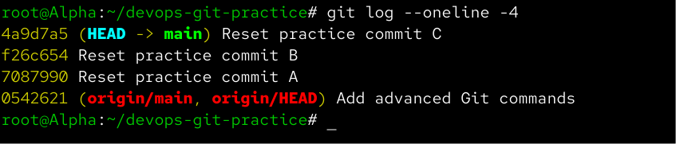
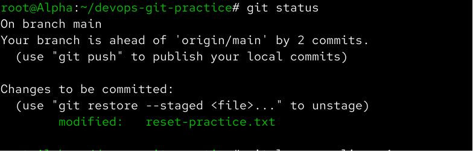
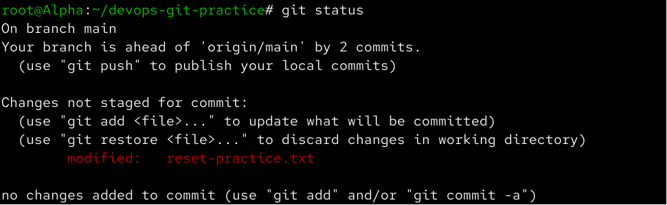
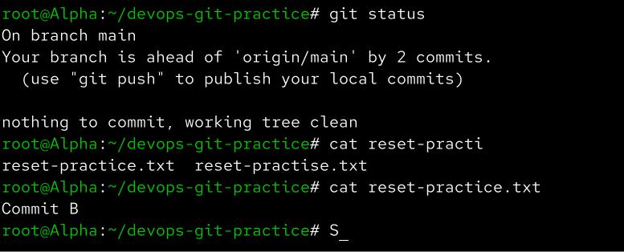
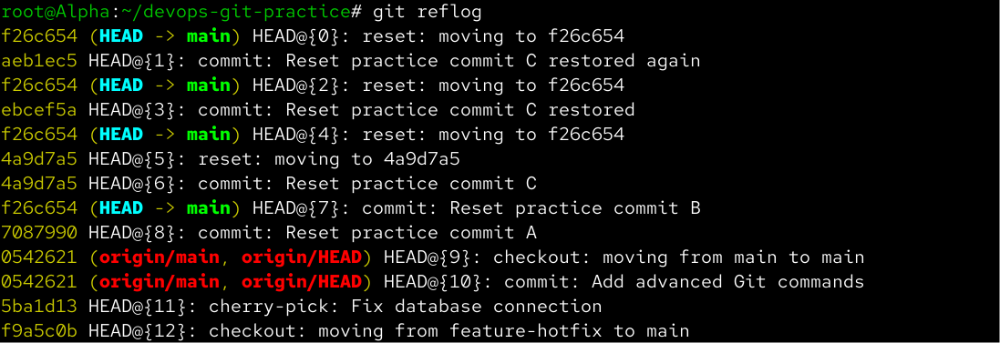
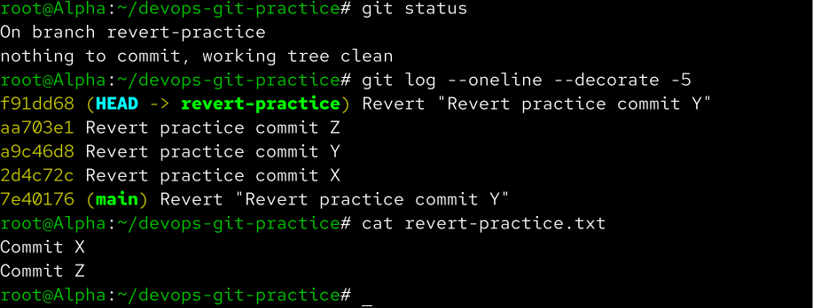
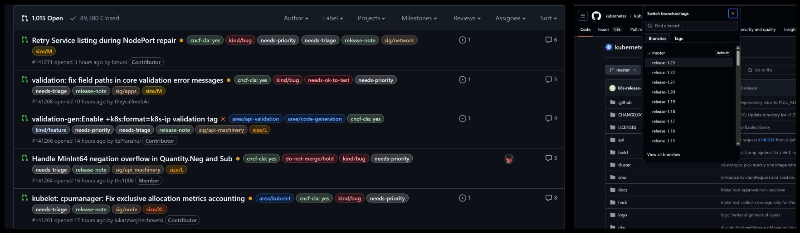
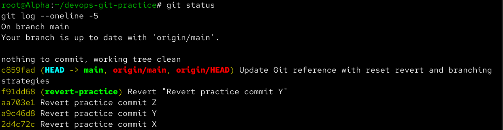

# Day 25 – Git Reset vs Revert & Branching Strategies

Aaj maine Git me mistakes ko safely undo karne ke liye `git reset` aur `git revert` practically practice kiya. Saath hi GitFlow, GitHub Flow aur Trunk-Based Development jaise real-world branching strategies ko samjha.

---

# Task 1 – Git Reset

## Commit A, B and C

Reset practice ke liye maine teen commits create kiye:

```bash
echo "Commit A" > reset-practice.txt
git add reset-practice.txt
git commit -m "Reset practice commit A"

echo "Commit B" >> reset-practice.txt
git add reset-practice.txt
git commit -m "Reset practice commit B"

echo "Commit C" >> reset-practice.txt
git add reset-practice.txt
git commit -m "Reset practice commit C"
```

History check ki:

```bash
git log --oneline -4
```

History me Commit A, B aur C visible the.



---

## `git reset --soft`

Ek commit piche jane ke liye:

```bash
git reset --soft HEAD~1
```

Uske baad:

```bash
git status
git log --oneline -4
git diff --cached
```

### Observation

`--soft` se latest commit history se remove ho gaya, lekin us commit ke changes **staged** state me remain rahe.

Matlab:

```text
Commit removed
      ↓
Changes preserved
      ↓
Changes staged
```



---

## `git reset --mixed`

Changes ko dobara commit karne ke baad mixed reset practice kiya:

```bash
git reset --mixed HEAD~1
```

Check:

```bash
git status
git diff
```

### Observation

`--mixed` me commit history se remove ho gaya, lekin changes working directory me remain rahe.

Difference ye tha ki changes **unstaged** the.

```text
Commit removed
      ↓
Changes preserved
      ↓
Changes unstaged
```

`--mixed` Git ka default reset mode bhi hai.



---

## `git reset --hard`

Changes ko dobara commit karne ke baad hard reset practice kiya:

```bash
git reset --hard HEAD~1
```

Check:

```bash
git status
cat reset-practice.txt
git log --oneline -4
```

### Observation

`--hard` ne:

- Commit ko history se remove kiya
- Staging area ko reset kiya
- Working directory ke tracked changes ko bhi discard kiya

```text
Commit removed
      ↓
Staging reset
      ↓
Working changes discarded
```

Ye reset ka sabse destructive form hai.



---

## `git reflog` – Safety Net

Hard reset ke baad maine:

```bash
git reflog
```

run kiya.

`reflog` ne `HEAD` ke previous positions show kiye.

Isse pata chala ki hard reset ke baad bhi Git kuch time tak previous commit references track karta hai.



### Important

`git reflog` local recovery ke liye bahut useful hai, especially jab galti se reset, rebase ya branch movement ho jaye.

---

# Soft vs Mixed vs Hard

| Reset Type | Commit History | Changes | Staging |
|---|---|---|---|
| `--soft` | Reset | Preserved | Staged |
| `--mixed` | Reset | Preserved | Unstaged |
| `--hard` | Reset | Discarded | Reset |

### Kaunsa destructive hai?

`git reset --hard` sabse destructive hai kyunki ye tracked working-tree changes ko discard kar sakta hai.

### `--soft` kab use karunga?

Jab mujhe commit ko undo karke changes ko staged state me rakhna ho.

Example:

```bash
git reset --soft HEAD~1
```

Useful jab commit message galat ho ya multiple commits ko combine karna ho.

### `--mixed` kab use karunga?

Jab commit undo karna ho lekin changes ko manually review/edit karna ho.

```bash
git reset HEAD~1
```

### `--hard` kab use karunga?

Jab mujhe local branch ko completely previous state par le jana ho aur unwanted tracked changes discard karne ho.

```bash
git reset --hard HEAD~1
```

Is command ko carefully use karna chahiye.

### Kya pushed commits par reset use karna chahiye?

Generally **shared/pushed commits par `git reset` avoid karna chahiye**, kyunki ye history rewrite karta hai.

Shared branch ke liye `git revert` safer option hai.

---

# Task 2 – Git Revert

## Revert Practice Commits

Revert practice ke liye maine commits X, Y aur Z create kiye:

```bash
echo "Commit X" > revert-practice.txt
git add revert-practice.txt
git commit -m "Revert practice commit X"

echo "Commit Y" >> revert-practice.txt
git add revert-practice.txt
git commit -m "Revert practice commit Y"

echo "Commit Z" >> revert-practice.txt
git add revert-practice.txt
git commit -m "Revert practice commit Z"
```

History check ki:

```bash
git log --oneline
```

History approximately:

```text
Z
Y
X
```

---

## Revert Commit Y

Y ka commit hash identify kiya:

```bash
git log --oneline
```

Uske baad Y ko revert kiya:

```bash
git revert <Y-COMMIT-HASH>
```

Is process ke during Git ne conflict detect kiya:

```text
CONFLICT (content): Merge conflict in revert-practice.txt
```

Reason ye tha ki main **middle commit Y** ko revert kar raha tha jab uske baad **Z** commit already exist karta tha.

Git ko Y ke changes undo karne the while Z ke changes preserve karne the, isliye manual conflict resolution required hui.

---

## Conflict Resolution

File check ki:

```bash
cat revert-practice.txt
```

Conflict markers ko remove karke desired final content rakha:

```text
Commit X
Commit Z
```

Phir:

```bash
git add revert-practice.txt
git revert --continue
```

Finally verify kiya:

```bash
git status
git log --oneline --decorate -5
cat revert-practice.txt
```



### Important Observation

`git revert` ne original Y commit ko delete nahi kiya.

Instead, Git ne ek **new revert commit** create kiya jo Y ke changes ko reverse karta hai.

Conceptually:

```text
X → Y → Z → Revert-Y
```

Y history me abhi bhi present hai.

---

# Reset vs Revert

| | `git reset` | `git revert` |
|---|---|---|
| What it does | Branch pointer move karta hai | New inverse commit create karta hai |
| Original commit history | Current branch history se remove ho sakta hai | Original commit preserve rehta hai |
| History rewrite | Yes | No |
| Shared branch ke liye safe? | Generally no | Yes |
| Best use | Local/private changes | Shared/pushed changes |

---

## Reset vs Revert – Simple Example

### Reset

```text
A → B → C

git reset HEAD~1

A → B
```

Branch pointer piche chala gaya.

### Revert

```text
A → B → C

git revert B

A → B → C → Revert-B
```

Original B history me remain karta hai.

---

# Task 4 – Branching Strategies

## 1. GitFlow

GitFlow ek structured branching strategy hai jo scheduled releases ke liye design ki gayi hai.

Typical branches:

```text
main
  |
  └── develop
       |
       ├── feature/login
       ├── feature/payment
       |
       └── release/1.0

hotfix
   |
   └── main
```

### Main Branches

`main`

Production-ready code rakhta hai.

`develop`

Upcoming release ke integrated development changes rakhta hai.

`feature/*`

Individual features ke liye use hoti hain.

Example:

```bash
git switch -c feature/login
```

`release/*`

Release ko stabilize aur test karne ke liye use hoti hai.

`hotfix/*`

Production me urgent bug fix ke liye use hoti hai.

### GitFlow kab use hota hai?

- Scheduled releases
- Formal QA process
- Versioned software
- Multiple release stages

### Advantages

- Clear release process
- Production aur development separation
- Dedicated hotfix workflow
- Versioned projects ke liye useful

### Disadvantages

- Workflow complex hota hai
- Bahut branches maintain karni padti hain
- More merge operations
- Continuous deployment ke liye unnecessary complexity ho sakti hai

---

# 2. GitHub Flow

GitHub Flow GitFlow ke comparison me kaafi simple hai.

```text
main
  |
  ├── feature/login
  |
  ├── feature/payment
  |
  └── feature/api-fix
          |
          ↓
     Pull Request
          |
          ↓
         main
```

Typical workflow:

```text
main
 ↓
Feature Branch
 ↓
Changes
 ↓
Commit
 ↓
Push
 ↓
Pull Request
 ↓
CI/CD Tests
 ↓
Code Review
 ↓
Merge
 ↓
Deploy
```

Example:

```bash
git switch main
git pull

git switch -c feature/login

git add .
git commit -m "Add login feature"

git push -u origin feature/login
```

### GitHub Flow kab use karunga?

- Startups
- SaaS applications
- Web applications
- Frequent deployment
- CI/CD based teams

### Advantages

- Simple
- Easy to understand
- Pull Request friendly
- CI/CD ke saath excellent
- Frequent deployment possible

### Disadvantages

- Formal release branches nahi hoti
- Strong automated testing required
- Complex scheduled-release projects me additional process ki zarurat ho sakti hai

---

# 3. Trunk-Based Development

Trunk-Based Development me developers frequently shared main/trunk branch ke saath integrate karte hain.

Branches generally **short-lived** hoti hain.

```text
             short-lived branch
                    |
                    ↓
main ─── A ─── B ─── C ─── D ─── E ─── F
                    ↑
               quick merge
```

Development branches ko weeks tak open rakhne ke instead changes ko frequently integrate kiya jata hai.

### Feature Flags

Incomplete features ko feature flags ke behind hide kiya ja sakta hai.

Example:

```bash
if feature_enabled
then
    show_new_feature
else
    show_old_feature
fi
```

### Trunk-Based Development kab useful hai?

- Continuous Integration
- Continuous Delivery
- Frequent deployments
- Strong automated testing
- Large engineering teams

### Advantages

- Frequent integration
- Smaller merge conflicts
- Fast feedback
- CI/CD ke liye excellent
- Long-lived branches avoid hoti hain

### Disadvantages

- Strong automated testing required
- Developer discipline required
- Feature flags ki zarurat ho sakti hai
- Weak testing ke case me main quickly break ho sakta hai

---

# Startup Shipping Fast

Agar ek startup rapidly ship kar raha hai, to main **GitHub Flow** choose karunga.

Reason:

```text
Feature Branch
      ↓
Pull Request
      ↓
CI/CD
      ↓
main
      ↓
Deployment
```

Isme unnecessary branch complexity nahi hoti aur frequent deployment easy hota hai.

---

# Large Team With Scheduled Releases

Agar ek large team formal scheduled releases aur dedicated QA/release process follow karti hai, to **GitFlow** useful ho sakta hai.

```text
feature
   ↓
develop
   ↓
release
   ↓
main
```

Lekin agar large team continuous delivery practice karti hai, to **Trunk-Based Development** bhi better choice ho sakta hai.

Isliye strategy team size se zyada **release model aur engineering practices** par depend karti hai.

---

# Open-Source Project – Kubernetes

Maine Kubernetes ke GitHub repository ko branching workflow ke example ke roop me dekha.

Kubernetes ka workflow classic GitFlow jaisa nahi hai jisme permanent `develop` branch ho.

Iska workflow main branch, Pull Requests, CI checks aur release processes ke around organized hai.

:contentReference[oaicite:0]{index=0}

Conceptually:

```text
Kubernetes
    |
    ├── main
    |
    ├── Pull Requests
    |
    ├── CI checks
    |
    └── Release processes
```

Isliye ise classic GitFlow ke bajay **main/trunk-oriented PR-based workflow ke closer** samajhna better hai.



---

# Task 5 – Git Commands Reference Update

`git-commands.md` me Days 22–25 ke important commands add kiye.

## Reset

```bash
git reset --soft HEAD~1
git reset --mixed HEAD~1
git reset --hard HEAD~1
```

## Reflog

```bash
git reflog
```

## Revert

```bash
git revert <commit-hash>
```

## Branching Strategies

```text
GitFlow
GitHub Flow
Trunk-Based Development
```

Final update commit kiya:

```bash
git add git-commands.md
git commit -m "Update Git reference with reset revert and branching strategies"
git push
```

---

# Final Git Status

Final changes verify kiye:

```bash
git status
git log --oneline -5
```

Final repository clean state me tha aur latest Git reference changes commit aur push kiye gaye.



---

# What I Learned

- `git reset --soft`, `--mixed` aur `--hard` same commit ko different levels par undo karte hain.
- `git reset --hard` destructive ho sakta hai, isliye shared branches par carefully use karna chahiye.
- `git reflog` Git mistakes ke baad previous `HEAD` positions recover karne ke liye useful safety net hai.
- `git revert` history rewrite nahi karta; instead ek new commit create karke previous changes ko reverse karta hai.
- Shared/pushed branches ke liye `git revert` generally reset se safer hai.
- GitFlow structured release management ke liye useful hai.
- GitHub Flow simple feature-branch + Pull Request workflow provide karta hai.
- Trunk-Based Development frequent integration aur short-lived branches par focus karta hai.
- Real-world teams apni release process aur CI/CD maturity ke according branching strategy choose karti hain.

---

# Screenshots

## Three Reset Commits


## Soft Reset


## Mixed Reset


## Hard Reset


## Git Reflog


## Git Revert


## Kubernetes Branching Strategy


## Final Git Status


