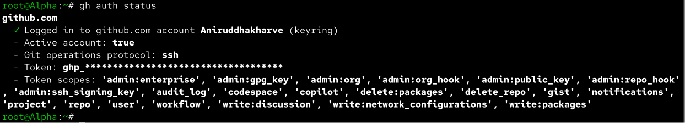
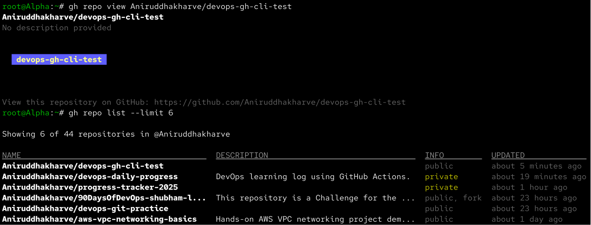
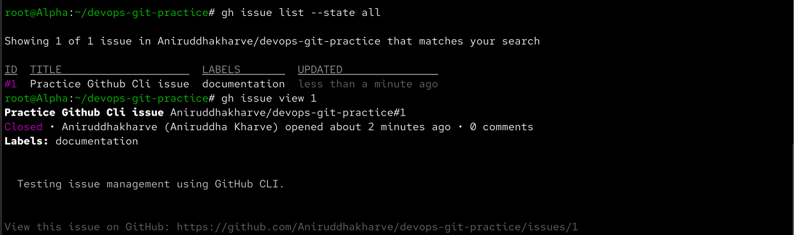
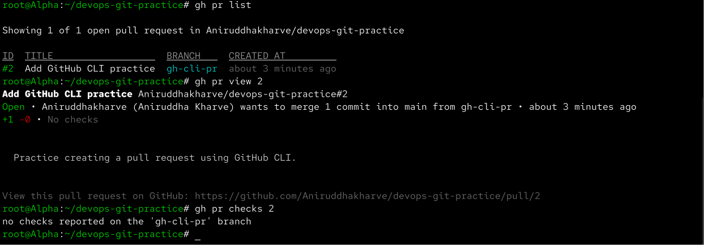
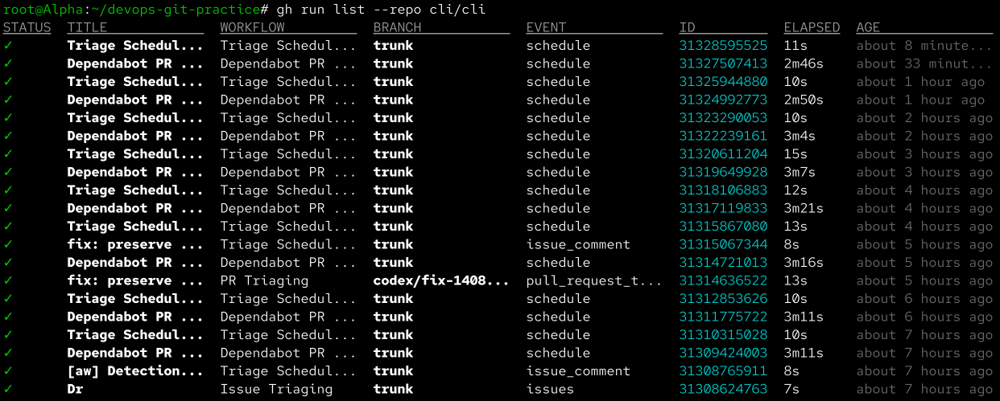
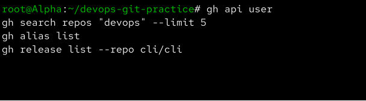
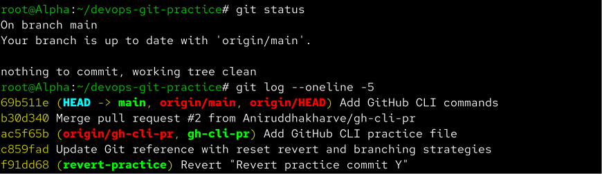

# Day 26 – GitHub CLI: Manage GitHub from Your Terminal

Aaj maine GitHub CLI (`gh`) ko practically use kiya. Isme maine terminal se GitHub authentication, repository management, issues, pull requests, GitHub Actions runs aur useful `gh` commands practice kiye.

---

## Task 1 – Install and Authenticate

Sabse pehle GitHub CLI installed hai ya nahi check kiya:

```bash
gh --version
```

Uske baad GitHub account authenticate kiya:

```bash
gh auth login
```

Authentication complete hone ke baad active account verify kiya:

```bash
gh auth status
```

GitHub CLI browser-based authentication aur token-based authentication jaise methods support karta hai. Normal interactive use ke liye browser authentication convenient hai.



### What I Learned

`gh auth status` se pata chalta hai ki GitHub CLI kis account ke saath authenticated hai aur Git operations ke liye kaunsa protocol configured hai.

---

## Task 2 – Working with Repositories

### Create Repository

Terminal se ek temporary public test repository create ki:

```bash
gh repo create devops-gh-cli-test --public --add-readme
```

Is command se GitHub par public repository create hui aur README automatically add hua.

### View Repository

```bash
gh repo view YOUR_USERNAME/devops-gh-cli-test
```

### List Repositories

```bash
gh repo list
```

Repository ko browser me open karne ke liye:

```bash
gh repo view YOUR_USERNAME/devops-gh-cli-test --web
```

### Clone Using GitHub CLI

Repository ko `git clone` ki jagah `gh repo clone` se clone kiya:

```bash
gh repo clone YOUR_USERNAME/devops-gh-cli-test
```

Clone ke baad remote verify kiya:

```bash
git remote -v
```

### Delete Test Repository

Practice complete hone ke baad temporary repository delete ki:

```bash
gh repo delete YOUR_USERNAME/devops-gh-cli-test --yes
```

Repository delete hone ke baad:

```bash
gh repo list
```

se verify kiya.



### What I Learned

`gh repo` commands se repository create, clone, view, list aur delete directly terminal se ki ja sakti hai.

---

## Task 3 – GitHub Issues

Apne practice repository me issue create kiya:

```bash
gh issue create --title "Practice GitHub CLI issue" --body "Testing issue management using GitHub CLI."
```

Open issues list ki:

```bash
gh issue list
```

Specific issue view ki:

```bash
gh issue view <issue-number>
```

Issue close ki:

```bash
gh issue close <issue-number>
```

All issues verify karne ke liye:

```bash
gh issue list --state all
```



### How can `gh issue` be used in automation?

`gh issue` ko shell scripts aur automation me use karke automatically issues create, list ya close kiye ja sakte hain.

Example:

```bash
gh issue create \
  --title "Deployment failed" \
  --body "Production deployment failed. Please investigate."
```

Is tarah CI/CD pipeline failure ke time automatically GitHub issue create kiya ja sakta hai.

---

## Task 4 – Pull Requests

### Create Feature Branch

Practice repository me main branch se feature branch create ki:

```bash
git switch main
git pull
git switch -c gh-cli-pr
```

### Make a Change

```bash
echo "# GitHub CLI Practice" > gh-cli-demo.md
```

Stage aur commit:

```bash
git add gh-cli-demo.md
git commit -m "Add GitHub CLI practice file"
```

Branch push ki:

```bash
git push -u origin gh-cli-pr
```

### Create Pull Request

Pull Request directly terminal se create ki:

```bash
gh pr create \
  --base main \
  --head gh-cli-pr \
  --title "Add GitHub CLI practice" \
  --body "Practice creating a pull request using GitHub CLI."
```

PR list ki:

```bash
gh pr list
```

Specific PR view ki:

```bash
gh pr view <PR-number>
```

PR checks dekhe:

```bash
gh pr checks <PR-number>
```



### Merge Pull Request

PR ko terminal se merge kiya:

```bash
gh pr merge <PR-number> --merge
```

`gh pr merge` ke major merge methods:

```bash
gh pr merge <PR-number> --merge
gh pr merge <PR-number> --squash
gh pr merge <PR-number> --rebase
```

### How can I review someone else's PR?

PR list:

```bash
gh pr list
```

Specific PR:

```bash
gh pr view <PR-number>
```

Changed files/diff dekhne ke liye:

```bash
gh pr diff <PR-number>
```

Checks dekhne ke liye:

```bash
gh pr checks <PR-number>
```

Isse browser open kiye bina PR review ki ja sakti hai.

---

## Task 5 – GitHub Actions & Workflows

GitHub Actions use karne wale public repository ke workflow runs check kiye.

Example repository:

```text
cli/cli
```

Workflow runs list ki:

```bash
gh run list --repo cli/cli
```

Specific workflow run view ki:

```bash
gh run view <RUN-ID> --repo cli/cli
```

Logs dekhne ke liye:

```bash
gh run view <RUN-ID> --repo cli/cli --log
```

Running workflow ko watch karne ke liye:

```bash
gh run watch <RUN-ID> --repo cli/cli
```

Workflows list ki:

```bash
gh workflow list --repo cli/cli
```



### How can `gh run` help in CI/CD?

`gh run` se terminal ya automation script se:

- Workflow status check kar sakte hain
- Failed workflow identify kar sakte hain
- Workflow logs retrieve kar sakte hain
- Deployment status monitor kar sakte hain

Example:

```bash
gh run list --repo OWNER/REPO
```

CI/CD scripts me iska output automation decisions ke liye use kiya ja sakta hai.

---

# Task 6 – Useful `gh` Tricks

## `gh api`

GitHub API ko directly terminal se call kar sakte hain:

```bash
gh api user
```

Repository information:

```bash
gh api repos/YOUR_USERNAME/devops-git-practice
```

Ye automation ke liye useful hai because GitHub API ko shell scripts se directly access kar sakte hain.

---

## `gh search repos`

GitHub repositories search karne ke liye:

```bash
gh search repos "devops" --limit 10
```

Language filter:

```bash
gh search repos "devops" --language shell
```

---

## `gh alias`

Frequently used commands ke liye custom shortcut bana sakte hain:

```bash
gh alias set prs 'pr list'
```

Ab simply:

```bash
gh prs
```

run karne par:

```bash
gh pr list
```

execute hoga.

Aliases check:

```bash
gh alias list
```

---

## `gh gist`

Small files ko GitHub Gist ke roop me create kar sakte hain:

```bash
echo "GitHub CLI practice" > gh-cli-note.txt
gh gist create gh-cli-note.txt --public --desc "GitHub CLI practice"
```

Gists list:

```bash
gh gist list
```

---

## `gh release`

Repository releases list karne ke liye:

```bash
gh release list --repo cli/cli
```

Latest release view:

```bash
gh release view --repo cli/cli
```



---

# Machine-Readable Output

`gh` commands me `--json` option automation ke liye bahut useful hai.

Example:

```bash
gh repo list --json name,url
```

Workflow runs ke liye:

```bash
gh run list \
  --repo cli/cli \
  --json databaseId,status,conclusion,name
```

Is output ko `jq`, Bash scripts ya CI/CD pipelines me further process kiya ja sakta hai.

---

# GitHub CLI Commands Added to `git-commands.md`

Maine `git-commands.md` me GitHub CLI ke important commands add kiye.

## Authentication

```bash
gh auth login
gh auth status
gh auth logout
gh auth setup-git
```

## Repository Management

```bash
gh repo create
gh repo clone
gh repo view
gh repo list
gh repo delete
```

## Issues

```bash
gh issue create
gh issue list
gh issue view <number>
gh issue close <number>
```

## Pull Requests

```bash
gh pr create
gh pr list
gh pr view <number>
gh pr diff <number>
gh pr checks <number>
gh pr merge <number>
```

## GitHub Actions

```bash
gh run list
gh run view <run-id>
gh run watch <run-id>
gh workflow list
gh workflow view <workflow>
```

## Useful Commands

```bash
gh api user
gh search repos "devops"
gh gist create <file>
gh release list
gh alias set prs 'pr list'
gh alias list
```

## Machine-Readable Output

```bash
gh repo list --json name,url
```

`--json` output scripting aur automation ke liye useful hai.

---

# Final Git Status

GitHub CLI commands ko `git-commands.md` me add karke commit kiya:

```bash
git add git-commands.md
git commit -m "Add GitHub CLI commands"
git push
```

Final repository status check kiya:

```bash
git status
git log --oneline -5
```

Working tree clean tha aur latest changes successfully pushed the.



---

# What I Learned

- GitHub CLI (`gh`) se GitHub ke repositories, issues aur Pull Requests directly terminal se manage kar sakte hain.
- `gh pr`, `gh issue` aur `gh run` commands DevOps automation aur CI/CD workflows me kaafi useful hain.
- `gh api` aur `--json` options GitHub CLI ko shell scripts aur automation ke liye powerful banate hain.

---

# Screenshots

## GitHub CLI Authentication


## Repository Management


## Issue Management


## Pull Request


## GitHub Actions


## Useful `gh` Commands


## Final Status


