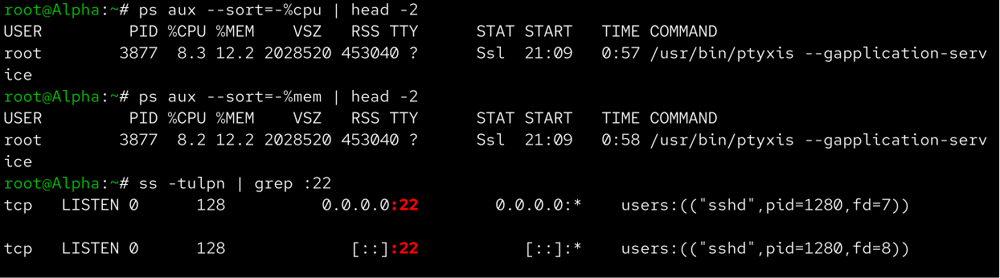
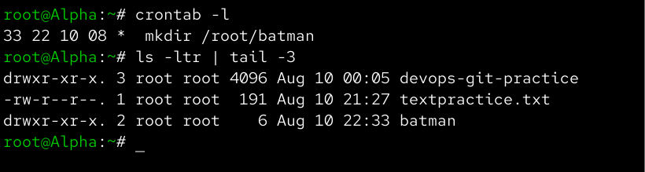
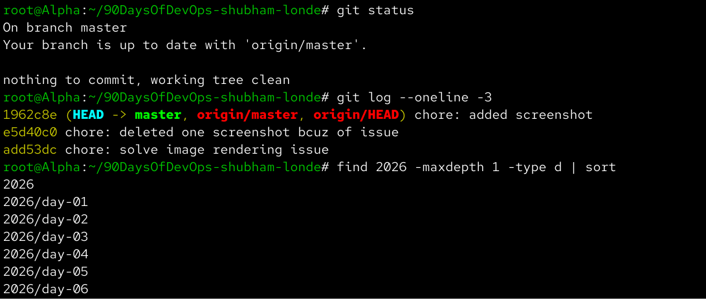

# Day 28 – Revision Day: Everything from Day 1 to Day 27

Aaj maine Day 1 se Day 27 tak jo DevOps concepts seekhe the unka revision kiya. Isme Linux, networking, shell scripting, Git, GitHub aur GitHub CLI ke important concepts ko revise karke practical checks bhi kiye.

> Note: Day 27 intentionally deferred hai, isliye usse completed nahi maana gaya.

---

## Task 1 – Self-Assessment

Revision ke time maine apne confidence level ko honestly check kiya.

### Linux

| Topic | Status |
|---|---|
| File system navigation and file operations | Can do confidently |
| Process management | Need to revisit |
| systemd services | Can do confidently |
| Text files using vi/vim/nano | Need to revisit |
| CPU, memory and disk troubleshooting | Need to revisit |
| Linux filesystem hierarchy | Can do confidently |
| Users and groups | Can do confidently |
| chmod permissions | Can do confidently |
| chown and chgrp | Can do confidently |
| LVM | Can do confidently |
| Network troubleshooting commands | Can do confidently |
| DNS, IP, subnets and ports | Can do confidently |

### Shell Scripting

| Topic | Status |
|---|---|
| Variables, arguments and user input | Can do confidently |
| if/elif/else and case | Can do confidently |
| for, while and until loops | Need to revisit |
| Functions | Can do confidently |
| grep, awk, sed, sort and uniq | Need to revisit |
| set -euo pipefail | Can do confidently |
| Error handling | Can do confidently |
| Crontab | Need to revisit |

### Git & GitHub

| Topic | Status |
|---|---|
| Init, add, commit and log | Can do confidently |
| Branching | Can do confidently |
| Push and pull | Can do confidently |
| Clone vs fork | Can do confidently |
| Merge and fast-forward merge | Can do confidently |
| Merge conflicts | Can do confidently |
| Rebase | Can do confidently |
| Git stash | Can do confidently |
| Cherry-pick | Can do confidently |
| Squash merge | Can do confidently |
| Reset soft/mixed/hard | Can do confidently |
| Git revert | Can do confidently |
| GitFlow | Can do confidently |
| GitHub Flow | Can do confidently |
| Trunk-Based Development | Can do confidently |
| GitHub CLI | Can do confidently |

---

# Task 2 – Weak Spots Revisited

Maine following three topics ko practically revise kiya:

1. Linux process management and troubleshooting
2. Shell text processing using grep, awk, sed, sort and uniq
3. Crontab and job scheduling

---

## Weak Spot 1 – Linux Process Management

Processes list karne ke liye:

```bash
ps aux
```

CPU usage ke according processes sort karne ke liye:

```bash
ps aux --sort=-%cpu | head
```

Memory usage ke according processes sort karne ke liye:

```bash
ps aux --sort=-%mem | head
```

Specific process find karne ke liye:

```bash
pgrep sshd
```

Process ki details check karne ke liye:

```bash
ps -fp <PID>
```

Port 22 par kaunsa process listening hai ye check kiya:

```bash
sudo ss -tulpn | grep :22
```

### What I Re-learned

Process ek running program ka instance hota hai. `ps`, `pgrep` aur `ss` jaise commands troubleshooting ke time quickly identify karne me help karte hain.



---

## Weak Spot 2 – Text Processing

Practice ke liye ek sample log file create ki:

```bash
cat > text-practice.log <<'EOF'
INFO Server started
ERROR Connection failed
INFO User logged in
ERROR Database unavailable
WARNING Disk usage high
ERROR Connection failed
CRITICAL Database unavailable
INFO Backup completed
EOF
```

### grep

ERROR lines search karne ke liye:

```bash
grep "ERROR" text-practice.log
```

Case-insensitive search:

```bash
grep -i "error" text-practice.log
```

ERROR count:

```bash
grep -c "ERROR" text-practice.log
```

Line numbers ke saath:

```bash
grep -n "ERROR" text-practice.log
```

### awk

First field print:

```bash
awk '{print $1}' text-practice.log
```

ERROR lines filter:

```bash
awk '$1 == "ERROR" {print}' text-practice.log
```

### sed

Text replace:

```bash
sed 's/ERROR/ERROR_FOUND/g' text-practice.log
```

WARNING lines delete karke output:

```bash
sed '/WARNING/d' text-practice.log
```

### sort + uniq

Repeated error messages count karne ke liye:

```bash
grep "ERROR" text-practice.log | sort | uniq -c | sort -rn
```

### What I Re-learned

`grep` searching ke liye, `awk` field-based processing ke liye, `sed` text modification ke liye aur `sort`/`uniq` data ko organize aur count karne ke liye useful hain.


---

# Weak Spot 3 – Crontab

Current cron jobs check kiye:

```bash
crontab -l
```

Cron syntax:

```text
* * * * * command
│ │ │ │ │
│ │ │ │ └── Day of week
│ │ │ └──── Month
│ │ └────── Day of month
│ └──────── Hour
└────────── Minute
```

### Every day at 3 AM

```cron
0 3 * * * /path/to/script.sh
```

### Every 5 minutes

```cron
*/5 * * * * /path/to/script.sh
```

### Every Sunday at 3 AM

```cron
0 3 * * 0 /path/to/script.sh
```

### Every day at 1 AM

```cron
0 1 * * * /path/to/script.sh
```

Maine ek temporary cron job ke through scheduling ko practically test kiya aur verify kiya ki script expected output generate kar rahi hai.



### What I Re-learned

Crontab Linux me repetitive tasks ko automatically schedule karne ke liye use hota hai. Cron expression ke five fields minute, hour, day of month, month aur day of week represent karte hain.

---

# Task 3 – Quick-Fire Questions

## 1. What does `chmod 755 script.sh` do?

```bash
chmod 755 script.sh
```

Permissions:

```text
Owner  → rwx
Group  → r-x
Others → r-x
```

Owner ko read, write aur execute permission milti hai, jabki group aur others ko read aur execute permission milti hai.

---

## 2. Process vs Service

A **process** ek running program ka instance hota hai.

A **service** generally ek long-running background application hoti hai jo `systemd` jaise service manager se manage ho sakti hai.

Example:

```bash
systemctl status ssh
```

service ka status check karta hai.

```bash
ps aux | grep ssh
```

related running processes dekhne me help karta hai.

---

## 3. Which process is using port 8080?

```bash
sudo ss -tulpn | grep :8080
```

Alternative:

```bash
sudo lsof -i :8080
```

---

## 4. What does `set -euo pipefail` do?

```bash
set -euo pipefail
```

- `-e` → command fail hone par script exit karti hai.
- `-u` → unset variable use hone par error deta hai.
- `pipefail` → pipeline ke kisi bhi command ke fail hone par pipeline failure return karti hai.

---

## 5. `git reset --hard` vs `git revert`

`git reset --hard` branch ko previous commit par move karta hai aur working directory ke uncommitted changes ko discard kar sakta hai.

```bash
git reset --hard HEAD~1
```

`git revert` ek new commit create karta hai jo previous commit ke changes ko reverse karta hai.

```bash
git revert <commit>
```

Isliye shared/pushed branches ke liye `git revert` generally safer hai.

---

## 6. Team of 5 developers shipping weekly

Main **GitHub Flow** choose karunga.

Basic workflow:

```text
Feature Branch
      ↓
Pull Request
      ↓
Code Review
      ↓
CI/CD
      ↓
main
      ↓
Release
```

Ye simple workflow hai aur frequent releases ke liye suitable hai.

---

## 7. What does `git stash` do?

`git stash` uncommitted changes ko temporarily save karta hai taaki working directory clean ho jaye aur hum kisi doosre branch ya urgent task par switch kar saken.

```bash
git stash push -m "WIP"
```

Changes restore karne ke liye:

```bash
git stash pop
```

---

## 8. Schedule a script every day at 3 AM

```cron
0 3 * * * /path/to/script.sh
```

---

## 9. `git fetch` vs `git pull`

`git fetch` remote repository se latest changes download karta hai lekin current branch ko automatically modify nahi karta.

```bash
git fetch
```

`git pull` generally fetch ke baad remote changes ko current branch me integrate karta hai.

```bash
git pull
```

Simple way:

```text
git fetch = Download changes
git pull  = Download + integrate changes
```

---

## 10. What is LVM?

LVM ka full form **Logical Volume Manager** hai.

Ye storage ko flexible way me manage karne ke liye use hota hai aur logical volumes ko traditional fixed partitions ke comparison me easily resize aur manage karne ki flexibility deta hai.

Basic structure:

```text
Physical Disk
      ↓
Physical Volume (PV)
      ↓
Volume Group (VG)
      ↓
Logical Volume (LV)
      ↓
Filesystem
      ↓
Mount Point
```

---

# Task 4 – Organize Your Work

Maine challenge repository ka status check kiya:

```bash
git status
```

Recent commit history:

```bash
git log --oneline -10
```

Daily directories verify ki:

```bash
find 2026 -maxdepth 1 -type d | sort
```

Git command reference aur shell scripting cheat sheet bhi verify ki.

Important files:

```text
git-commands.md
shell_scripting_cheatsheet.md
```

Day 27 intentionally deferred hai aur isliye usse completed nahi maana gaya.



---

# Task 5 – Teach It Back: Git Branching

Git branch ko ek separate workspace ki tarah samajh sakte hain.

Main branch me stable code hota hai.  
Jab hume koi new feature develop karna hota hai to hum main se ek feature branch create karte hain.  
Feature branch me hum independently changes aur commits kar sakte hain.  
Isse main branch directly affect nahi hoti.  
Feature complete hone ke baad Pull Request create karke code review kiya ja sakta hai.  
Review aur testing ke baad feature branch ko main me merge kiya ja sakta hai.  
Is workflow se multiple developers simultaneously different features par kaam kar sakte hain.

---

# What I Learned

- Revision karne se pata chalta hai ki kaunse concepts practically strong hain aur kaunse topics ko dobara practice karna chahiye.
- Linux troubleshooting me processes, ports aur resource usage ko quickly identify karna important hai.
- Shell scripting aur Git ke concepts ko combine karke real-world DevOps automation workflows build kiye ja sakte hain.

---

# Screenshots

## Linux Process Revision


## Text Processing Revision


## Crontab Revision


## Repository Review


