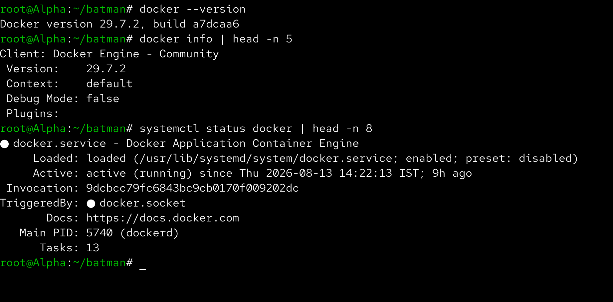
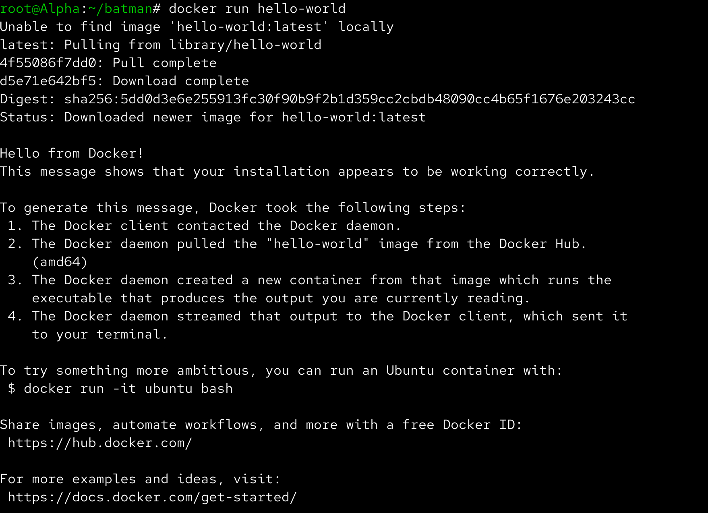
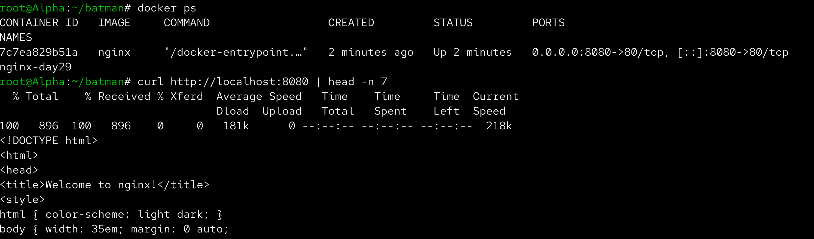
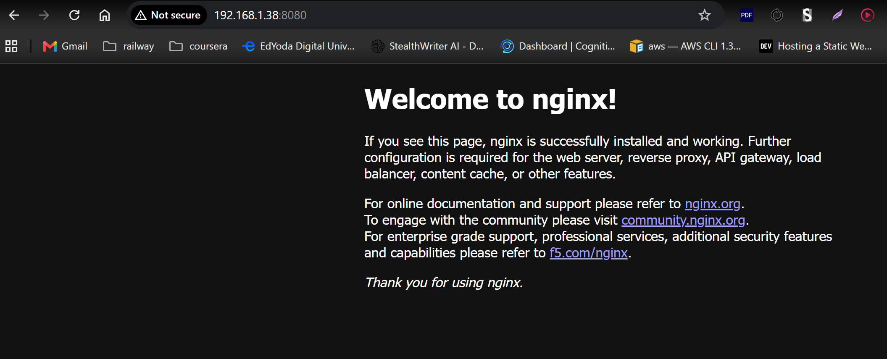
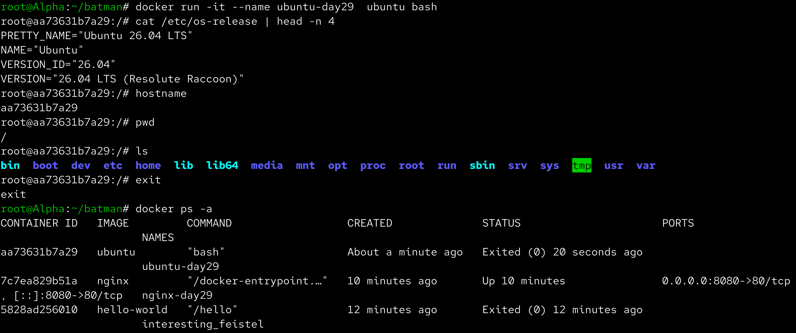
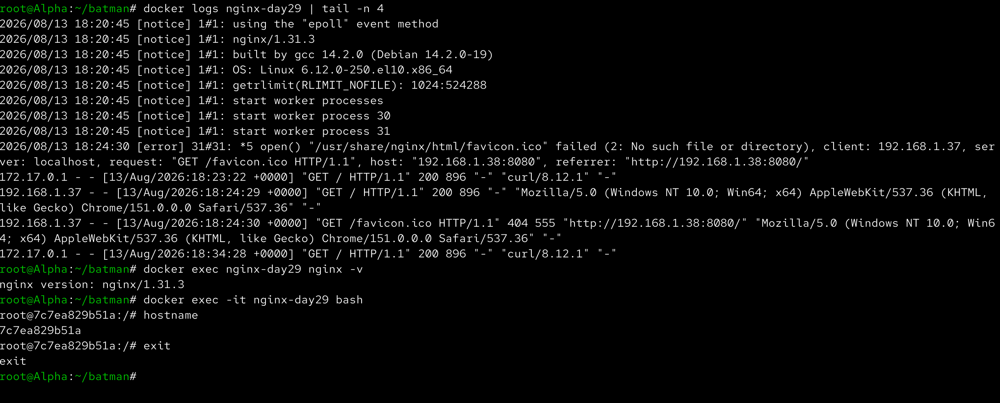
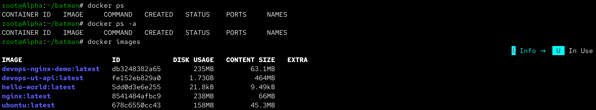

# Day 29 – Introduction to Docker

Aaj maine Docker ke basic concepts ko practically samjha aur different types ke containers run karke explore kiye. Maine Docker installation verify ki, `hello-world`, Nginx aur Ubuntu containers run kiye aur Docker ke basic commands jaise `docker ps`, `docker logs`, `docker exec`, `docker stop` aur `docker rm` practice kiye.

---

## Task 1 – What is Docker?

### What is a Container?

Container ek lightweight, isolated environment hota hai jisme application aur uski required dependencies package hoti hain.

Containers ka main benefit ye hai ki application different environments me consistently run kar sakti hai without manually configuring every dependency.

### Containers vs Virtual Machines

Virtual Machine me complete guest operating system hota hai.

```text
Virtual Machine

Hardware
   ↓
Hypervisor
   ↓
Guest OS
   ↓
Application
```

Docker containers host operating system ke kernel ko share karte hain.

```text
Container

Hardware
   ↓
Host OS
   ↓
Docker Engine
   ↓
Container
   ↓
Application
```

Isliye containers generally VMs ke comparison me lightweight hote hain aur quickly start ho sakte hain.

### Docker Architecture

```text
Docker Client
      │
      │ Docker Commands
      ▼
Docker Daemon
      │
      ├── Images
      ├── Containers
      ├── Networks
      └── Volumes
              │
              ▼
        Docker Registry
          (Docker Hub)
```

### Important Components

**Docker Client** – User Docker commands jaise `docker run` execute karta hai.

**Docker Daemon** – Docker objects jaise containers, images, networks aur volumes ko manage karta hai.

**Docker Image** – Container create karne ke liye read-only template hota hai.

**Docker Container** – Docker image ka running instance hota hai.

**Docker Registry** – Docker images ko store aur distribute karta hai. Docker Hub ek popular public registry hai.

---

## Task 2 – Install Docker

Sabse pehle Docker installation verify ki:

```bash
docker --version
```

Docker Engine ki information check ki:

```bash
docker info
```

Docker service ka status check kiya:

```bash
sudo systemctl status docker
```

Docker successfully installed aur running tha.



---

## Run First Container – hello-world

Docker ka first container run kiya:

```bash
docker run hello-world
```

Docker ne `hello-world` image ko use karke container create kiya aur uska output terminal par display kiya.

Basic Docker workflow:

```text
Docker Client
      ↓
Docker Daemon
      ↓
Docker Hub
      ↓
Docker Image
      ↓
Container
      ↓
Output
```

Isse Docker ka basic workflow practically samajh aaya.



---

# Task 3 – Run Real Containers

## Nginx Container

Nginx container ko detached mode me run kiya:

```bash
docker run -d --name nginx-day29 -p 8080:80 nginx
```

Yahan:

```text
-d
→ Container background me run hota hai

--name nginx-day29
→ Container ko custom name deta hai

-p 8080:80
→ Host port 8080 ko container port 80 se map karta hai

nginx
→ Nginx Docker image
```

Running containers check kiye:

```bash
docker ps
```

Nginx ko host machine se test kiya:

```bash
curl http://localhost:8080
```

Nginx ka HTML response successfully receive hua.



### Access Nginx from Browser

Nginx ko browser se access kiya:

```text
http://<HOST-IP>:8080
```

Browser me Nginx ka default welcome page successfully open hua.



---

## Ubuntu Container

Ubuntu container ko interactive mode me run kiya:

```bash
docker run -it --name ubuntu-day29 ubuntu bash
```

Container ke andar basic Linux commands practice kiye:

```bash
cat /etc/os-release
hostname
pwd
ls
ps
```

Container se bahar aane ke liye:

```bash
exit
```

Container exit hone ke baad:

```bash
docker ps
```

me wo running container ke form me nahi dikha.

Stopped containers dekhne ke liye:

```bash
docker ps -a
```

use kiya.



---

# Task 4 – Explore Docker

## Detached Mode

Detached mode ke liye:

```bash
docker run -d nginx
```

`-d` flag container ko background me run karta hai.

Interactive mode:

```bash
docker run -it ubuntu bash
```

me terminal directly container ke andar attach hota hai.

---

## Custom Container Name

Container ko custom name dene ke liye:

```bash
--name nginx-day29
```

use kiya.

Custom name se containers ko identify aur manage karna easy hota hai.

---

## Port Mapping

Nginx container ke liye:

```bash
-p 8080:80
```

use kiya.

Iska meaning:

```text
Host Port 8080
      ↓
Container Port 80
      ↓
Nginx
```

---

## Container Logs

Nginx ke logs check karne ke liye:

```bash
docker logs nginx-day29
```

Curl ya browser request generate karne ke baad Nginx access logs bhi observe kiye.

---

## Execute Command Inside Container

Running Nginx container ke andar command execute ki:

```bash
docker exec nginx-day29 nginx -v
```

Interactive shell open karne ke liye:

```bash
docker exec -it nginx-day29 bash
```

Container ke andar:

```bash
hostname
```

run kiya aur phir:

```bash
exit
```

se bahar aaye.



---

## Container Management

Running containers check karne ke liye:

```bash
docker ps
```

All containers including stopped containers:

```bash
docker ps -a
```

Container stop:

```bash
docker stop nginx-day29
```

Container remove:

```bash
docker rm nginx-day29
```

Docker images check:

```bash
docker images
```

---

# Final Docker Check

Day 29 ke end me running containers, stopped containers aur locally available images verify kiye:

```bash
docker ps
docker ps -a
docker images
```



---

# Important Docker Commands Learned

```bash
docker --version
docker info
docker run
docker ps
docker ps -a
docker images
docker stop
docker rm
docker logs
docker exec
```

### Important Docker Options

```text
-d
→ Detached/background mode

-it
→ Interactive terminal

--name
→ Custom container name

-p
→ Port mapping
```

---

# What I Learned

- Docker containers applications ko isolated aur consistent environment me run karne ka lightweight way provide karte hain.
- Docker images templates hote hain aur containers un images ke running instances hote hain.
- `docker run`, `docker ps`, `docker logs`, `docker exec`, `docker stop` aur `docker rm` jaise commands container management ke basic building blocks hain.
- Port mapping ke through host machine ke port ko container ke service port se connect kiya ja sakta hai.

---

# Screenshots


