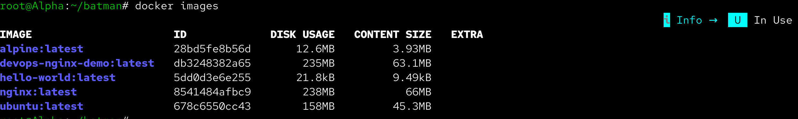
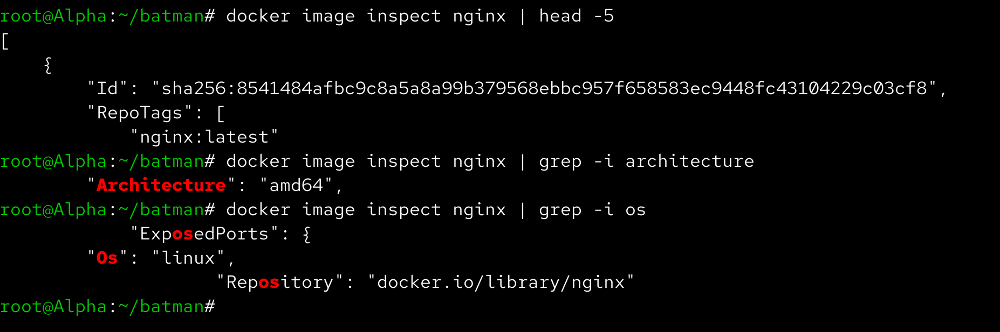
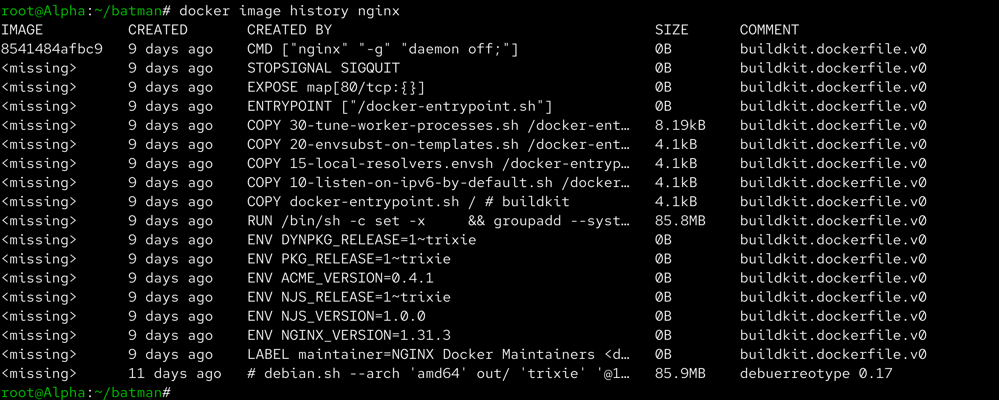
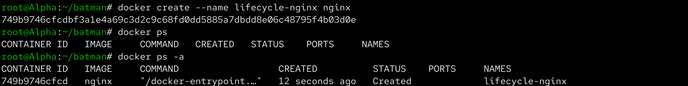
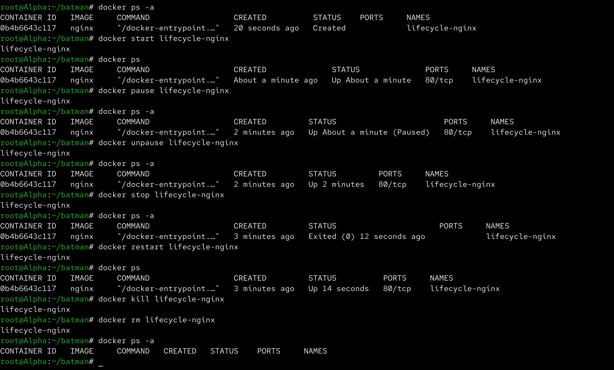
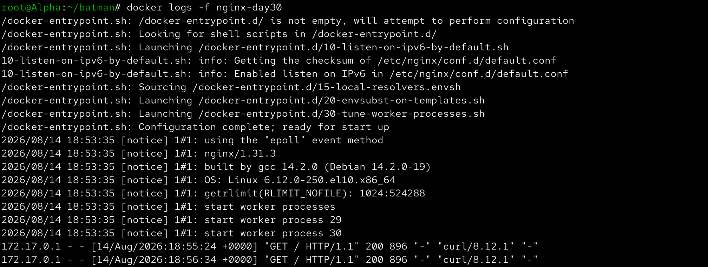
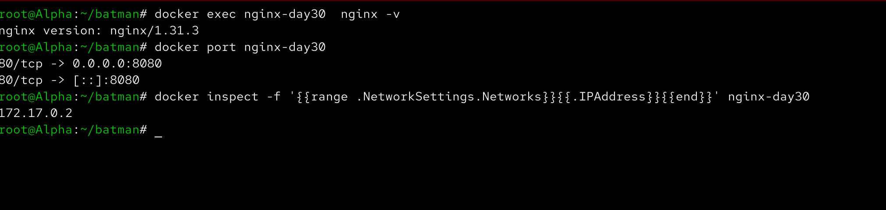
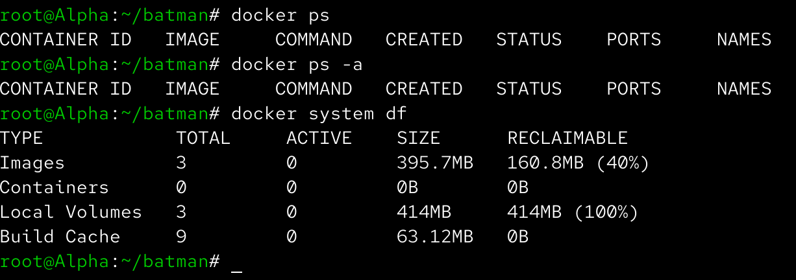

# Day 30 – Docker Images & Container Lifecycle

Aaj maine Docker images aur containers ke lifecycle ko practically explore kiya. Maine different Docker images pull kiye, image layers aur history dekhi, container ke complete lifecycle ko practice kiya aur running containers ke logs, filesystem, networking aur inspection ko explore kiya.

---

## Task 1 – Docker Images

### Pull Docker Images

Sabse pehle maine `nginx`, `ubuntu` aur `alpine` images Docker Hub se pull ki:

```bash
docker pull nginx
docker pull ubuntu
docker pull alpine
```

Uske baad locally available images check ki:

```bash
docker images
```

Is command se image ka repository, tag, image ID, creation time aur size dekh sakte hain.



---

### Ubuntu vs Alpine

Ubuntu aur Alpine image sizes ko compare kiya:

```bash
docker images ubuntu alpine
```

Alpine Ubuntu ke comparison me kaafi smaller hai.

**Reason:**

- Ubuntu ek general-purpose Linux distribution hai.
- Ubuntu image me comparatively zyada packages aur utilities available hote hain.
- Alpine ek minimal Linux distribution hai.
- Alpine ko lightweight container environments ke liye design kiya gaya hai.

```text
Ubuntu
→ Larger image
→ More packages and utilities
→ General-purpose environment

Alpine
→ Very small image
→ Minimal packages
→ Lightweight container
```

---

### Inspect Docker Image

Nginx image ki detailed information check ki:

```bash
docker image inspect nginx
```

Is command se image ke baare me information mil sakti hai, jaise:

- Image ID
- Architecture
- Operating system
- Creation time
- Environment variables
- Entrypoint
- Configuration
- Layers



---

### Remove an Image

Unused image ko remove karne ke liye:

```bash
docker rmi alpine
```

Images verify karne ke liye:

```bash
docker images
```

Agar image kisi existing container ke through use ho rahi ho to Docker image ko remove karne se pehle us container ko remove karna pad sakta hai.

---

# Task 2 – Docker Image Layers

Nginx image ki history check ki:

```bash
docker image history nginx
```

Is command se image banane ke process me create hui layers dikhai deti hain.

Output me generally ye information hoti hai:

```text
IMAGE
CREATED
CREATED BY
SIZE
COMMENT
```

Kuch layers ka size hota hai, jabki kuch layers `0B` show kar sakti hain.



---

## What are Docker Image Layers?

Docker image ek single block nahi hoti. Ye multiple read-only layers se milkar banti hai.

Example:

```text
Application Layer
       ↓
COPY Layer
       ↓
Nginx Installation Layer
       ↓
Package Installation Layer
       ↓
Base Image Layer
```

Docker layers ka use karta hai kyunki layers reusable aur cacheable hoti hain.

Agar image build karte waqt koi layer change nahi hui hai, Docker us layer ko dobara build karne ke bajay cached layer reuse kar sakta hai.

Isse:

- Build time reduce hota hai.
- Storage efficiently use hota hai.
- Same layers multiple images me reuse ho sakti hain.

---

# Task 3 – Container Lifecycle

Container lifecycle ko practically practice karne ke liye Nginx container use kiya.

---

## 1. Create Container

Container ko start kiye bina create kiya:

```bash
docker create --name lifecycle-nginx nginx
```

Container status check ki:

```bash
docker ps -a
```

Container initially `Created` state me tha.



---

## 2. Start Container

Container start kiya:

```bash
docker start lifecycle-nginx
```

Running container check kiya:

```bash
docker ps
```

Container ab running state me tha.

---

## 3. Pause Container

Running container ko pause kiya:

```bash
docker pause lifecycle-nginx
```

Status check kiya:

```bash
docker ps
```

Container paused state me dikhai diya.

---

## 4. Unpause Container

Paused container ko resume kiya:

```bash
docker unpause lifecycle-nginx
```

Phir status verify kiya:

```bash
docker ps
```

Container wapas running state me aa gaya.

---

## 5. Stop Container

Container ko gracefully stop kiya:

```bash
docker stop lifecycle-nginx
```

Status check kiya:

```bash
docker ps -a
```

Container `Exited` state me aa gaya.

---

## 6. Restart Container

Container ko restart kiya:

```bash
docker restart lifecycle-nginx
```

Phir verify kiya:

```bash
docker ps
```

Container dobara running state me aa gaya.

---

## 7. Kill Container

Container ko immediately terminate karne ke liye:

```bash
docker kill lifecycle-nginx
```

Status check:

```bash
docker ps -a
```

### Stop vs Kill

```text
docker stop
→ Container ko gracefully stop karta hai.

docker kill
→ Container ko immediately terminate karta hai.
```

---

## 8. Remove Container

Finally container remove kiya:

```bash
docker rm lifecycle-nginx
```

Verify:

```bash
docker ps -a
```

Container list se remove ho gaya.



---

# Task 4 – Working with Running Containers

Fresh Nginx container run kiya:

```bash
docker run -d --name nginx-day30 -p 8080:80 nginx
```

Running container verify kiya:

```bash
docker ps
```

---

## View Container Logs

Container logs check kiye:

```bash
docker logs nginx-day30
```

Nginx ko request send ki:

```bash
curl http://localhost:8080
```

Uske baad logs dobara check kiye:

```bash
docker logs nginx-day30
```

Nginx access request logs me दिखाई di.

---

## Real-Time Logs

Real-time logs follow karne ke liye:

```bash
docker logs -f nginx-day30
```

Dusre terminal se request generate ki:

```bash
curl http://localhost:8080
```

`docker logs -f` ki wajah se request ka log immediately terminal me appear hua.

Logs follow karna stop karne ke liye:

```text
Ctrl + C
```



---

## Exec Into Running Container

Running Nginx container ke andar interactive shell open ki:

```bash
docker exec -it nginx-day30 bash
```

Container ke andar basic commands run ki:

```bash
pwd
ls
ls /
ls /etc/nginx
ls /usr/share/nginx/html
hostname
```

Container se exit kiya:

```bash
exit
```

---

## Run Single Command Inside Container

Container ke andar enter kiye bina direct command execute ki:

```bash
docker exec nginx-day30 nginx -v
```

Ek aur example:

```bash
docker exec nginx-day30 ls /usr/share/nginx/html
```

`docker exec` running container ke andar commands execute karne ke liye useful hai.

---

## Inspect Container

Container ki detailed information check ki:

```bash
docker inspect nginx-day30
```

Isme container ke baare me information milti hai:

- Container ID
- Image
- Network configuration
- IP address
- Port mappings
- Mounts
- Environment
- Container state

Container ka IP address directly find kiya:

```bash
docker inspect -f '{{range .NetworkSettings.Networks}}{{.IPAddress}}{{end}}' nginx-day30
```

Port mapping check ki:

```bash
docker port nginx-day30
```



---

# Task 5 – Cleanup

## Stop All Running Containers

Practice environment me running containers ko stop karne ke liye:

```bash
docker stop $(docker ps -q)
```

Verify:

```bash
docker ps
```

---

## Remove All Stopped Containers

Stopped containers remove karne ke liye:

```bash
docker rm $(docker ps -aq)
```

Verify:

```bash
docker ps -a
```

---

## Remove Unused Images

Available images check ki:

```bash
docker image ls
```

Specific unused image remove karne ke liye:

```bash
docker rmi <IMAGE_ID>
```

Unused Docker resources clean karne ke liye:

```bash
docker system prune
```

`docker system prune` use karte waqt confirmation carefully read karna chahiye because unused Docker resources remove ho sakte hain.

---

## Check Docker Disk Usage

Docker kitni disk space use kar raha hai ye check kiya:

```bash
docker system df
```

Isse images, containers, local volumes aur build cache ke disk usage ka overview milta hai.



---

# Docker Image vs Container

Day 30 ka important concept:

```text
Docker Image
     ↓
Read-only Template
     ↓
docker run
     ↓
Docker Container
     ↓
Running Instance
```

Ek hi image se multiple containers create kiye ja sakte hain.

Example:

```text
             Nginx Image
                  │
        ┌─────────┼─────────┐
        ↓         ↓         ↓
   Container 1 Container 2 Container 3
```

---

# Container Lifecycle Summary

```text
Created
   ↓
Started / Running
   ↓
Paused
   ↓
Unpaused
   ↓
Stopped
   ↓
Restarted
   ↓
Killed
   ↓
Removed
```

Important commands:

```bash
docker create
docker start
docker pause
docker unpause
docker stop
docker restart
docker kill
docker rm
```

---

# Important Commands Learned

## Images

```bash
docker pull
docker images
docker image ls
docker image inspect
docker image history
docker rmi
```

## Containers

```bash
docker create
docker run
docker ps
docker ps -a
docker start
docker pause
docker unpause
docker stop
docker restart
docker kill
docker rm
```

## Container Debugging

```bash
docker logs
docker logs -f
docker exec
docker inspect
docker port
```

## Cleanup

```bash
docker system df
docker system prune
```

---

# What I Learned

- Docker images read-only templates hoti hain, aur containers un images ke running instances hote hain.
- Docker images multiple layers se build hoti hain, jisse caching aur layer reuse ke through build performance aur storage efficiency improve hoti hai.
- Container lifecycle ko `create`, `start`, `pause`, `unpause`, `stop`, `restart`, `kill` aur `rm` commands ke through manage kiya ja sakta hai.
- `docker logs`, `docker exec` aur `docker inspect` running containers ko troubleshoot aur understand karne ke liye bahut useful commands hain.

---

# Screenshots


