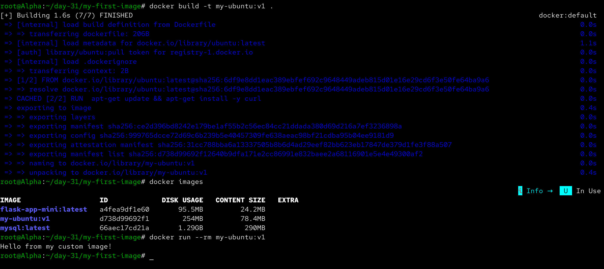
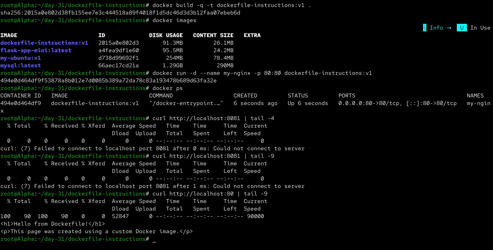
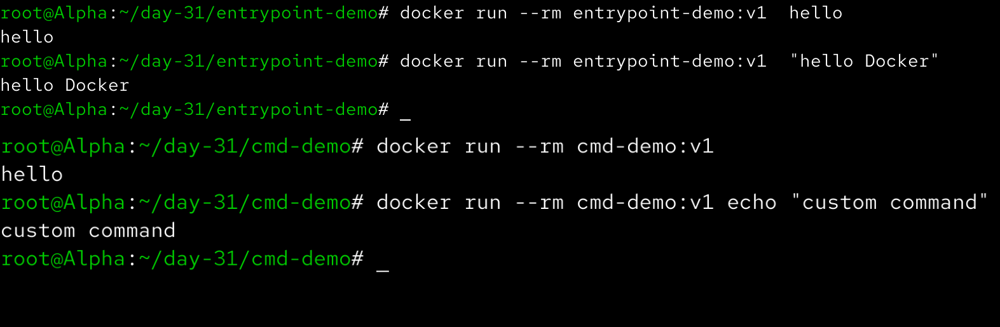
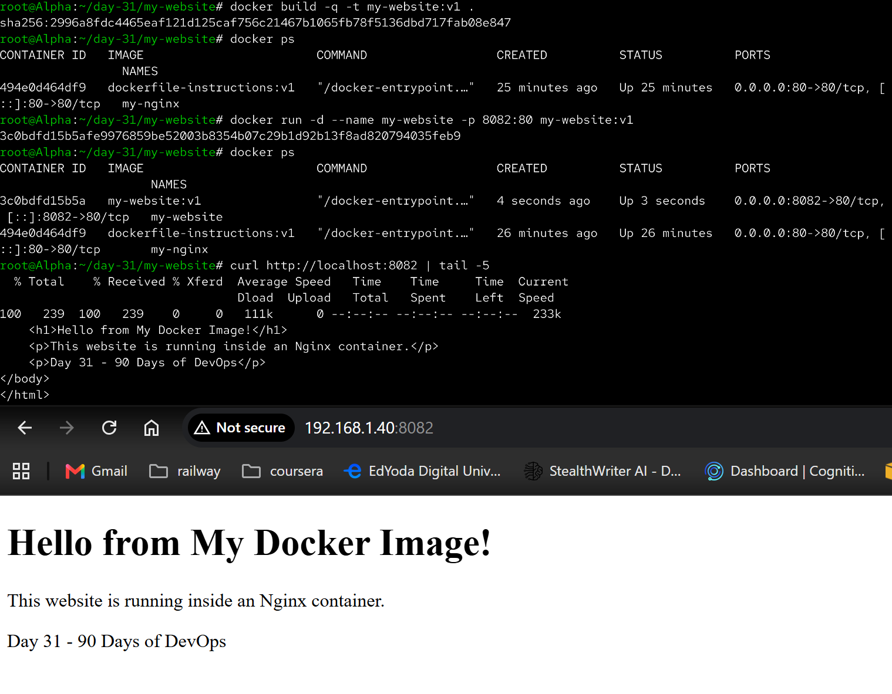
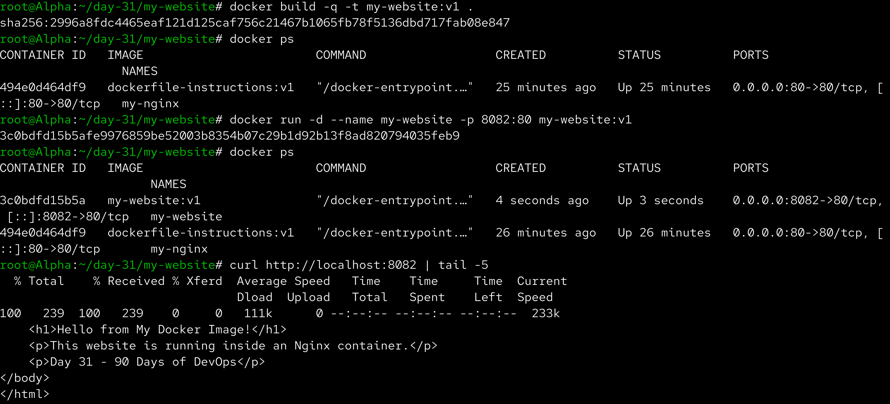
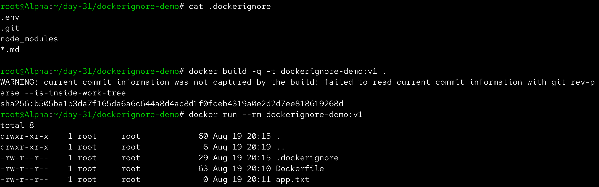
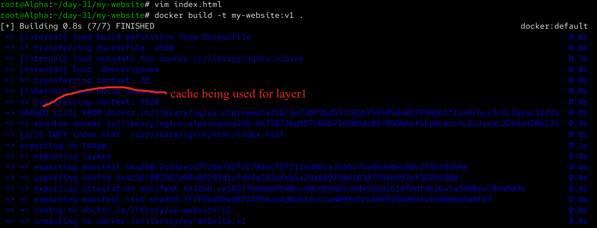
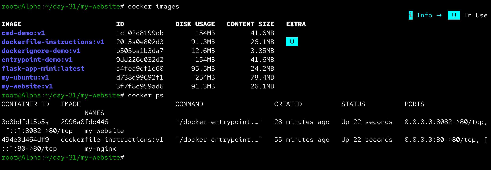

# Day 31 – Dockerfile: Build Your Own Images

Aaj maine Dockerfiles ka use karke custom Docker images build karna practice kiya. Maine `FROM`, `RUN`, `COPY`, `WORKDIR`, `EXPOSE`, `CMD` jaise Dockerfile instructions ko practically use kiya. Saath hi `CMD` vs `ENTRYPOINT`, `.dockerignore` aur Docker build cache ko bhi explore kiya.

---

## Task 1 – Your First Dockerfile

Sabse pehle `my-first-image` naam ka folder create kiya:

```bash
mkdir -p ~/day-31/my-first-image
cd ~/day-31/my-first-image
```

Is folder ke andar `Dockerfile` create kiya.

### Dockerfile

```dockerfile
FROM ubuntu

RUN apt-get update && apt-get install -y curl

CMD ["echo", "Hello from my custom image!"]
```

### Dockerfile Explanation

**FROM ubuntu**

Ubuntu ko base image ke roop me use karta hai.

**RUN**

Image build hone ke time `apt-get update` aur `curl` installation execute karta hai.

**CMD**

Container start hone par default command define karta hai.

Image build ki:

```bash
docker build -t my-ubuntu:v1 .
```

Image verify ki:

```bash
docker images
```

Container run kiya:

```bash
docker run --rm my-ubuntu:v1
```

### Output

```text
Hello from my custom image!
```



---

## Task 2 – Dockerfile Instructions

Is task me maine ek Dockerfile banaya jisme `FROM`, `RUN`, `COPY`, `WORKDIR`, `EXPOSE` aur `CMD` sabhi instructions use kiye.

### Dockerfile

```dockerfile
FROM nginx:alpine

RUN echo "Building custom Nginx image"

COPY index.html /usr/share/nginx/html/index.html

WORKDIR /usr/share/nginx/html

EXPOSE 80

CMD ["nginx", "-g", "daemon off;"]
```

### `index.html`

```html
<h1>Hello from Dockerfile!</h1>
<p>This page was created using a custom Docker image.</p>
```

Image build ki:

```bash
docker build -t dockerfile-instructions:v1 .
```

Container run kiya:

```bash
docker run -d --name dockerfile-demo -p 8081:80 dockerfile-instructions:v1
```

Container check kiya:

```bash
docker ps
```

Nginx ko test kiya:

```bash
curl http://localhost:8081
```

### Dockerfile Instructions

| Instruction | Purpose |
|---|---|
| `FROM` | Base image select karta hai |
| `RUN` | Image build ke time command execute karta hai |
| `COPY` | Host se files ko image me copy karta hai |
| `WORKDIR` | Working directory set karta hai |
| `EXPOSE` | Container ke intended port ko document karta hai |
| `CMD` | Default command define karta hai |



---

## Task 3 – CMD vs ENTRYPOINT

### CMD

CMD ke liye Dockerfile:

```dockerfile
FROM ubuntu

CMD ["echo", "hello"]
```

Image build ki:

```bash
docker build -t cmd-demo:v1 .
```

Normal run:

```bash
docker run --rm cmd-demo:v1
```

Output:

```text
hello
```

Custom command ke saath run kiya:

```bash
docker run --rm cmd-demo:v1 echo "custom command"
```

Output:

```text
custom command
```

Yahan custom command ne Dockerfile ke default `CMD` ko override kar diya.

---

### ENTRYPOINT

ENTRYPOINT ke liye Dockerfile:

```dockerfile
FROM ubuntu

ENTRYPOINT ["echo"]
```

Image build ki:

```bash
docker build -t entrypoint-demo:v1 .
```

Run:

```bash
docker run --rm entrypoint-demo:v1 hello
```

Output:

```text
hello
```

Additional argument ke saath:

```bash
docker run --rm entrypoint-demo:v1 "Hello Docker"
```

Output:

```text
Hello Docker
```

Yahan supplied argument `echo` command ko pass hua.

---

### CMD vs ENTRYPOINT

```text
CMD
→ Default command provide karta hai.
→ docker run ke command se override kiya ja sakta hai.

ENTRYPOINT
→ Container ka main executable define karta hai.
→ docker run ke arguments normally ENTRYPOINT ko pass hote hain.
```

### Kab use karein?

**CMD:** Jab application ke liye ek default command dena ho aur user ko us command ko easily override karne dena ho.

**ENTRYPOINT:** Jab container ko ek fixed executable ke around design karna ho aur command-line arguments ko us executable ke arguments ke roop me pass karna ho.



---

## Task 4 – Build a Simple Web App Image

Is task me maine ek custom static website banayi aur use Nginx Docker image ke andar serve kiya.

Project folder:

```bash
mkdir -p ~/day-31/my-website
cd ~/day-31/my-website
```

### index.html

```html
<!DOCTYPE html>
<html>
<head>
    <title>My Docker Website</title>
</head>
<body>
    <h1>Hello from My Docker Image!</h1>
    <p>This website is running inside an Nginx container.</p>
    <p>Day 31 - 90 Days of DevOps</p>
</body>
</html>
```

### Dockerfile

```dockerfile
FROM nginx:alpine

COPY index.html /usr/share/nginx/html/index.html
```

Image build ki:

```bash
docker build -t my-website:v1 .
```

Container run kiya:

```bash
docker run -d --name my-website -p 8082:80 my-website:v1
```

Container verify kiya:

```bash
docker ps
```

Website ko terminal se test kiya:

```bash
curl http://localhost:8082
```

Browser me access kiya:

```text
http://<SERVER-IP>:8082
```

Custom website successfully Nginx container ke through serve hui.



Terminal verification:



---

## Task 5 – .dockerignore

`.dockerignore` ka purpose unnecessary files ko Docker build context se exclude karna hai.

Project me following files/directories create ki:

```text
dockerignore-demo/
├── Dockerfile
├── .dockerignore
├── app.txt
├── notes.md
├── .env
├── .git/
└── node_modules/
```

### Dockerfile

```dockerfile
FROM alpine

WORKDIR /app

COPY . .

CMD ["ls", "-la", "/app"]
```

### .dockerignore

```text
node_modules
.git
*.md
.env
```

Iska matlab:

- `node_modules` ignore hoga.
- `.git` directory ignore hogi.
- Sabhi `.md` files ignore hongi.
- `.env` ignore hoga.

Image build ki:

```bash
docker build -t dockerignore-demo:v1 .
```

Container run kiya:

```bash
docker run --rm dockerignore-demo:v1
```

Expected result me ignored files/directories image ke andar available nahi honi chahiye.



---

## Task 6 – Build Optimization

Docker build ke time layers ko cache karta hai.

Initial image build ki:

```bash
docker build -t my-website:v1 .
```

Uske baad `index.html` me ek small change kiya aur image ko dobara build kiya:

```bash
docker build -t my-website:v2 .
```

Build output me Docker ne unchanged layers ke liye cache use kiya.

Example:

```text
CACHED
```

ka matlab Docker ne previous build ki existing layer reuse ki.



---

## Why Does Layer Order Matter?

Dockerfile ki instructions layers create karti hain.

Example:

```dockerfile
FROM ubuntu

RUN apt-get update && apt-get install -y curl

COPY application.sh /app/application.sh
```

Yahan package installation relatively stable hai, jabki application file frequently change ho sakti hai.

Isliye frequently changing instructions ko generally Dockerfile me later rakhna better hota hai.

```text
Less Frequently Changing Instructions
              ↓
        Earlier Layers
              ↓
More Frequently Changing Instructions
              ↓
         Later Layers
```

Isse Docker cache ka better use hota hai aur rebuild faster ho sakta hai.

---

# Important Dockerfile Instructions Learned

## FROM

Base image define karta hai.

```dockerfile
FROM ubuntu
```

## RUN

Image build ke time commands execute karta hai.

```dockerfile
RUN apt-get update
```

## COPY

Build context se files image ke andar copy karta hai.

```dockerfile
COPY index.html /usr/share/nginx/html/
```

## WORKDIR

Container ke andar working directory set karta hai.

```dockerfile
WORKDIR /app
```

## EXPOSE

Container application ke intended port ko document karta hai.

```dockerfile
EXPOSE 80
```

## CMD

Container ka default command define karta hai.

```dockerfile
CMD ["nginx", "-g", "daemon off;"]
```

## ENTRYPOINT

Container ka primary executable define karta hai.

```dockerfile
ENTRYPOINT ["echo"]
```

---

# Dockerfile Build Process

Aaj ka overall workflow:

```text
Dockerfile
     ↓
docker build
     ↓
Docker Image
     ↓
docker run
     ↓
Docker Container
     ↓
Application
```

---

# Important Commands Learned

### Build Image

```bash
docker build -t image-name:tag .
```

### List Images

```bash
docker images
```

### Run Image

```bash
docker run image-name:tag
```

### Run in Detached Mode

```bash
docker run -d image-name:tag
```

### Port Mapping

```bash
docker run -d -p 8080:80 image-name:tag
```

### Remove Image

```bash
docker rmi image-name:tag
```

---

# Final Verification

Day 31 ke end me custom images aur running containers verify kiye:

```bash
docker images
docker ps
```

Maine apne custom Docker images successfully build kiye aur containers ke through run kiye.



---

# What I Learned

- Dockerfile ke through apni custom Docker images build kar sakte hain instead of sirf Docker Hub ki existing images use karna.
- `FROM`, `RUN`, `COPY`, `WORKDIR`, `EXPOSE`, `CMD` aur `ENTRYPOINT` Dockerfile ke important instructions hain.
- `CMD` default command provide karta hai, jabki `ENTRYPOINT` container ka primary executable define karne ke liye useful hai.
- `.dockerignore` unnecessary files ko build context se exclude karta hai.
- Docker image layers aur build cache ko samajhne se Docker image builds ko faster aur efficient banaya ja sakta hai.

---

# Day 31 Screenshots


