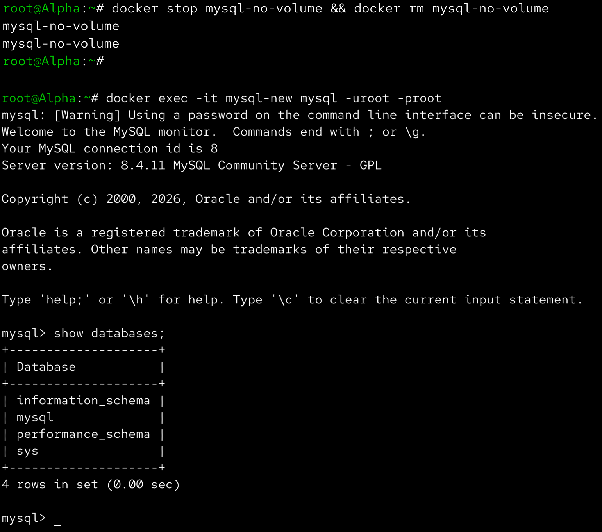
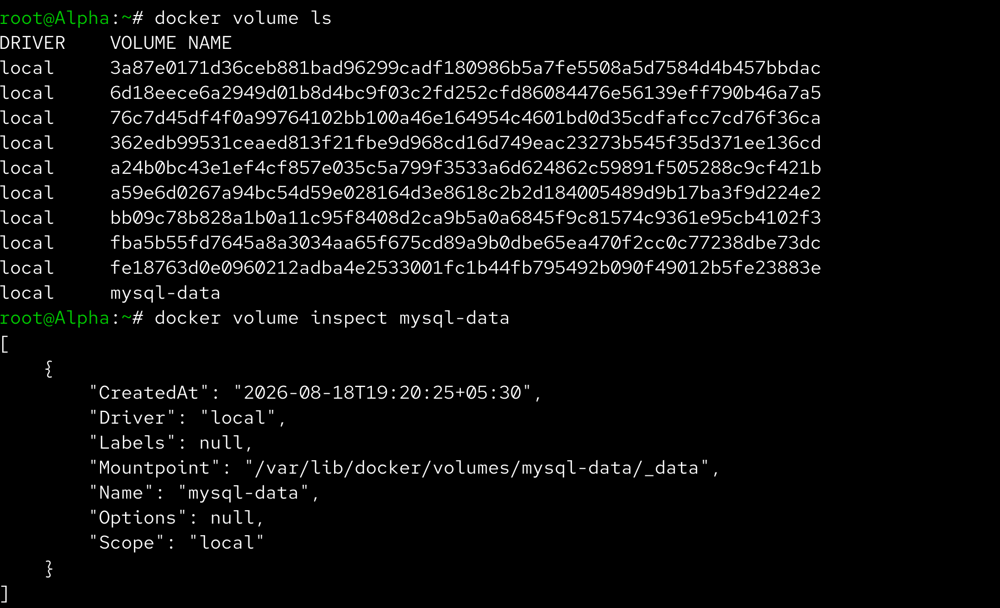
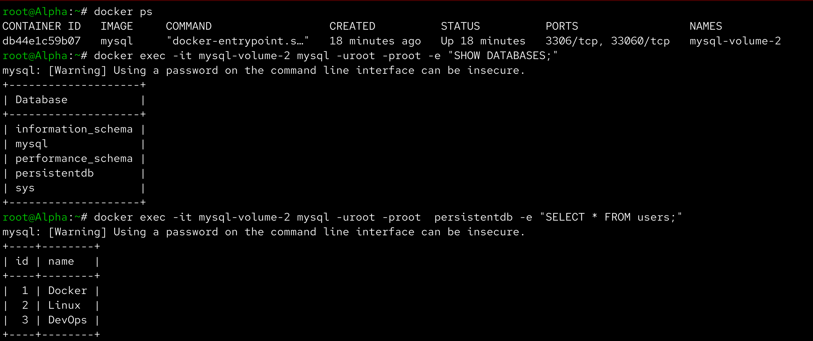
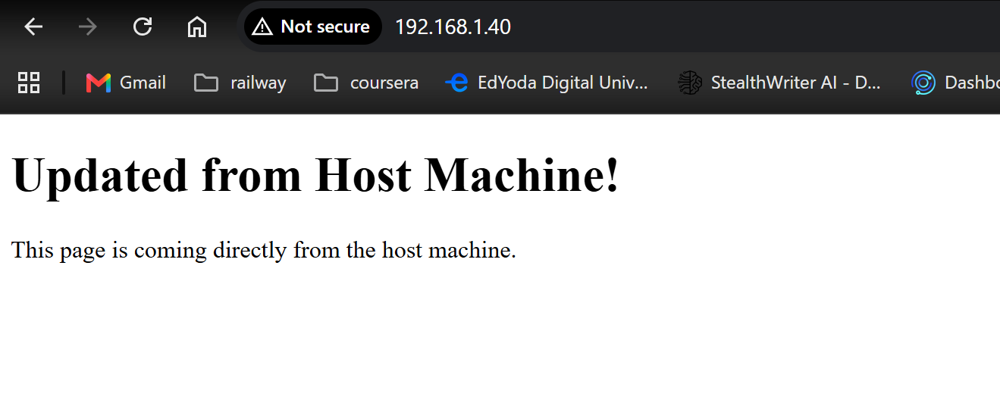
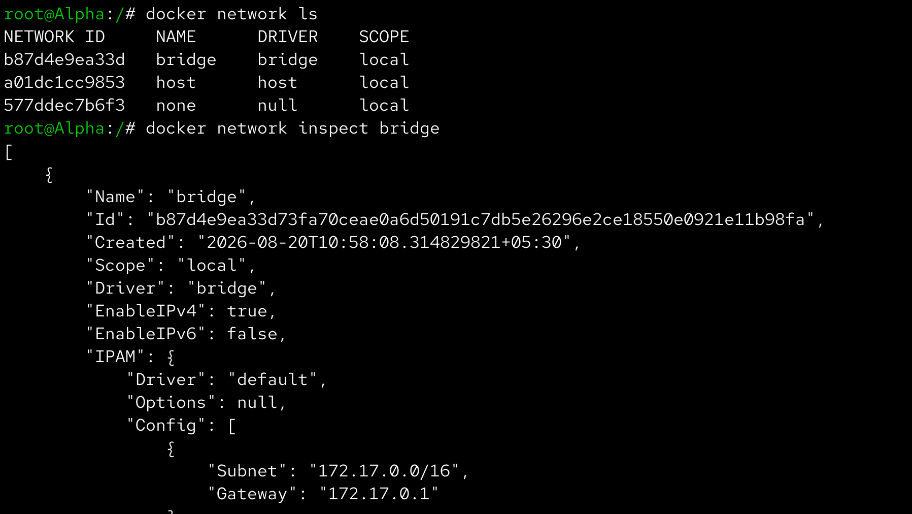
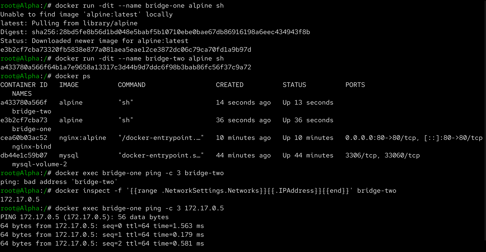
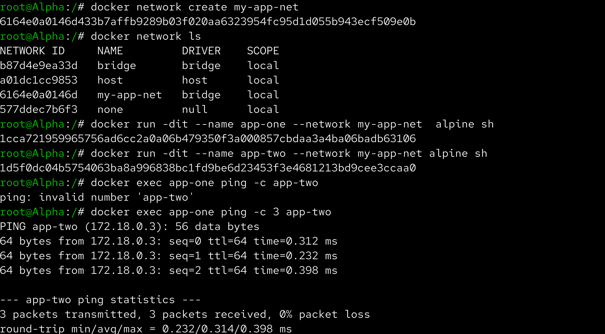
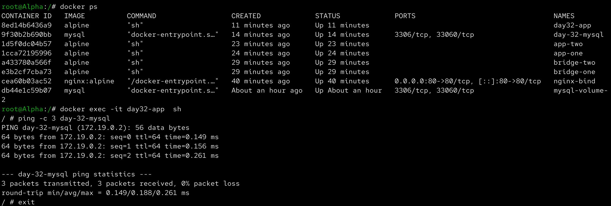

# Day 32 – Docker Volumes & Networking

Aaj maine Docker volumes aur networking ko practically explore kiya. Maine dekha ki container delete hone par data kaise lose hota hai, named volumes aur bind mounts se data persistence kaise achieve hoti hai, aur custom Docker networks ke through containers ek dusre se naam ke through kaise communicate karte hain.

---

## Task 1 – The Problem: Containers Are Ephemeral

Sabse pehle maine MySQL container ko bina kisi volume ke run kiya:

```bash
docker run -d \
  --name mysql-no-volume \
  -e MYSQL_ROOT_PASSWORD=root \
  mysql:8
```

Container check kiya:

```bash
docker ps
```

MySQL container ke andar enter kiya:

```bash
docker exec -it mysql-no-volume mysql -uroot -proot
```

MySQL ke andar ek database, table aur kuch data create kiya:

```sql
CREATE DATABASE devopsdb;

USE devopsdb;

CREATE TABLE students (
    id INT PRIMARY KEY,
    name VARCHAR(50)
);

INSERT INTO students VALUES
(1, 'Rahul'),
(2, 'Amit'),
(3, 'Priya');

SELECT * FROM students;
```

Data successfully create hua.

Container ko stop aur remove kiya:

```bash
docker stop mysql-no-volume
docker rm mysql-no-volume
```

Ab ek completely new MySQL container create kiya:

```bash
docker run -d \
  --name mysql-new \
  -e MYSQL_ROOT_PASSWORD=root \
  mysql:8
```

New container ke andar check kiya:

```bash
docker exec -it mysql-new mysql -uroot -proot
```

Phir:

```sql
SHOW DATABASES;
```

`devopsdb` database available nahi tha.

### Why did the data disappear?

Container ke andar database data writable container layer me stored tha.

Jab container remove kiya:

```bash
docker rm mysql-no-volume
```

to uski writable layer bhi remove ho gayi.

```text
Container
   ↓
Writable Layer
   ↓
Database Data

docker rm
   ↓
Container deleted
   ↓
Writable Layer deleted
   ↓
Data LOST
```

Isliye databases jaise stateful applications ke liye persistent storage use karna important hai.



---

# Task 2 – Named Volumes

Container data ko persist karne ke liye named volume use kiya.

Sabse pehle temporary MySQL container remove kiya:

```bash
docker stop mysql-new
docker rm mysql-new
```

Named volume create kiya:

```bash
docker volume create mysql-data
```

Volumes list kiye:

```bash
docker volume ls
```

Volume inspect kiya:

```bash
docker volume inspect mysql-data
```



---

## Run MySQL with Named Volume

MySQL ko named volume ke saath run kiya:

```bash
docker run -d \
  --name mysql-volume-1 \
  -e MYSQL_ROOT_PASSWORD=root \
  -v mysql-data:/var/lib/mysql \
  mysql:8
```

MySQL ready hone ke baad container ke andar enter kiya:

```bash
docker exec -it mysql-volume-1 mysql -uroot -proot
```

Database aur data create kiya:

```sql
CREATE DATABASE persistentdb;

USE persistentdb;

CREATE TABLE users (
    id INT PRIMARY KEY,
    name VARCHAR(50)
);

INSERT INTO users VALUES
(1, 'Docker'),
(2, 'Linux'),
(3, 'DevOps');

SELECT * FROM users;
```

Container stop aur remove kiya:

```bash
docker stop mysql-volume-1
docker rm mysql-volume-1
```

Important point ye tha ki maine `mysql-data` volume ko remove nahi kiya.

Volume verify kiya:

```bash
docker volume ls
```

---

## Create a New Container Using the Same Volume

Same volume ko ek new MySQL container ke saath attach kiya:

```bash
docker run -d \
  --name mysql-volume-2 \
  -e MYSQL_ROOT_PASSWORD=root \
  -v mysql-data:/var/lib/mysql \
  mysql:8
```

MySQL ke andar enter kiya:

```bash
docker exec -it mysql-volume-2 mysql -uroot -proot
```

Existing database check kiya:

```sql
SHOW DATABASES;

USE persistentdb;

SELECT * FROM users;
```

Previous container ka data new container me bhi available tha.

Isse prove hua ki named volume container lifecycle se independent data persist karta hai.



---

# Task 3 – Bind Mounts

Ab maine bind mount ka use karke host machine ki directory ko Nginx container ke andar mount kiya.

Host par directory create ki:

```bash
mkdir -p ~/day-32/bind-mount
cd ~/day-32/bind-mount
```

`index.html` create ki:

```html
<!DOCTYPE html>
<html>
<head>
    <title>Docker Bind Mount</title>
</head>
<body>
    <h1>Hello from Bind Mount!</h1>
    <p>This page is coming directly from the host machine.</p>
</body>
</html>
```

Nginx container ko bind mount ke saath run kiya:

```bash
docker run -d \
  --name nginx-bind \
  -p 8083:80 \
  -v ~/day-32/bind-mount:/usr/share/nginx/html \
  nginx:alpine
```

Container verify kiya:

```bash
docker ps
```

Browser me website access ki:

```text
http://<SERVER-IP>:8083
```

Uske baad host machine par `index.html` edit kiya:

```html
<h1>Updated from Host Machine!</h1>
```

Browser refresh karne ke baad updated content immediately show hua.

Isse prove hua ki host directory aur container directory ke beech bind mount active tha.



---

## Named Volume vs Bind Mount

| Named Volume | Bind Mount |
|---|---|
| Docker ke dwara managed | User ke specific host path se connected |
| Docker volume directory me stored hota hai | Specific host directory use karta hai |
| Databases aur persistent application data ke liye useful | Development aur source files ke liye useful |
| `-v volume:/container/path` | `-v /host/path:/container/path` |

### Named Volume Example

```bash
docker run -v mysql-data:/var/lib/mysql mysql:8
```

### Bind Mount Example

```bash
docker run -v ~/day-32/bind-mount:/usr/share/nginx/html nginx:alpine
```

---

# Task 4 – Docker Networking Basics

Sabse pehle Docker networks list kiye:

```bash
docker network ls
```

Default `bridge` network inspect kiya:

```bash
docker network inspect bridge
```

Is information me network ID, subnet, gateway aur connected containers jaise details milti hain.



---

## Test Default Bridge Network

Do Alpine containers default bridge network par run kiye:

```bash
docker run -dit --name bridge-one alpine sh
```

```bash
docker run -dit --name bridge-two alpine sh
```

Containers verify kiye:

```bash
docker ps
```

Container name ke through communication test kiya:

```bash
docker exec bridge-one ping -c 3 bridge-two
```

Default bridge network par automatic container-name DNS resolution available nahi hota, isliye name-based ping fail ho sakta hai.

---

## Test Communication Using IP

`bridge-two` ka IP address find kiya:

```bash
docker inspect -f '{{range .NetworkSettings.Networks}}{{.IPAddress}}{{end}}' bridge-two
```

Example:

```text
172.17.0.3
```

Ab IP address ke through ping kiya:

```bash
docker exec bridge-one ping -c 3 172.17.0.3
```

IP-based communication successful hua.



---

# Task 5 – Custom Networks

Ab maine user-defined bridge network create kiya:

```bash
docker network create my-app-net
```

Network verify kiya:

```bash
docker network ls
```

Do containers ko custom network par run kiya:

```bash
docker run -dit \
  --name app-one \
  --network my-app-net \
  alpine sh
```

```bash
docker run -dit \
  --name app-two \
  --network my-app-net \
  alpine sh
```

Ab `app-one` se `app-two` ko name ke through ping kiya:

```bash
docker exec app-one ping -c 3 app-two
```

Is baar name-based communication successfully work hui.



---

## Why Does Custom Networking Allow Name-Based Communication?

User-defined bridge networks Docker ke embedded DNS service ka use karte hain.

```text
app-one
   │
   │ DNS: app-two
   ↓
Docker Embedded DNS
   ↓
app-two
```

Isliye container IP address yaad rakhne ki zarurat nahi hoti.

Default bridge network ke comparison me custom networks multi-container applications ke liye zyada useful hain.

---

# Task 6 – Put It Together

Ab maine volumes aur networking ko ek setup me combine kiya.

## Create Application Network

```bash
docker network create day32-app-net
```

## Create Database Volume

```bash
docker volume create day32-db-data
```

## Run MySQL

```bash
docker run -d \
  --name day32-mysql \
  --network day32-app-net \
  -e MYSQL_ROOT_PASSWORD=root \
  -e MYSQL_DATABASE=appdb \
  -v day32-db-data:/var/lib/mysql \
  mysql:8
```

MySQL logs check kiye:

```bash
docker logs day32-mysql
```

---

## Run App Container

Simple Alpine container ko same network par run kiya:

```bash
docker run -dit \
  --name day32-app \
  --network day32-app-net \
  alpine sh
```

App container ke andar enter kiya:

```bash
docker exec -it day32-app sh
```

Networking utility install ki:

```bash
apk add --no-cache busybox-extras
```

Database container ko name ke through ping kiya:

```bash
ping -c 3 day32-mysql
```

Successful response mila.

Isse prove hua ki application container database ko container name:

```text
day32-mysql
```

ke through resolve kar sakta hai.



---

# Docker Volume Concept

Docker volume container se independent persistent storage provide karta hai.

```text
Container
    ↓
Volume
    ↓
Persistent Data
```

Container delete hone ke baad bhi volume exist kar sakta hai.

Example:

```bash
docker volume create mysql-data
```

---

# Bind Mount Concept

Bind mount ek specific host directory ko container ke andar mount karta hai.

```text
Host Directory
      ↓
Bind Mount
      ↓
Container Directory
```

Host par file change karne par container ke andar bhi change reflect ho sakta hai.

---

# Docker Networking Concept

Docker network containers ko ek dusre se communicate karne allow karta hai.

```text
Container A
     │
     ↓
Docker Network
     ↓
Container B
```

Custom network par containers ek dusre ko name se discover kar sakte hain.

---

# Custom Bridge Network

User-defined bridge network create karne ke liye:

```bash
docker network create my-app-net
```

Container ko network par run karne ke liye:

```bash
docker run -d \
  --network my-app-net \
  --name database \
  mysql:8
```

Same network par doosra container database ko naam se access kar sakta hai:

```text
database
```

---

# Day 32 Architecture

Aaj ke final setup ko roughly is tarah represent kiya ja sakta hai:

```text
                    day32-app-net
                         │
              ┌──────────┴──────────┐
              │                     │
              ▼                     ▼
        day32-app              day32-mysql
        Container                Container
                                    │
                                    ▼
                              day32-db-data
                                 Volume
```

Application container database ko IP address ki jagah:

```text
day32-mysql
```

ke through reach karta hai.

Database ka data:

```text
day32-db-data
```

volume me persist hota hai.

---

# Important Commands Learned

## Docker Volumes

```bash
docker volume create volume_name
docker volume ls
docker volume inspect volume_name
docker volume rm volume_name
```

## Bind Mount

```bash
docker run -v /host/path:/container/path image
```

## Docker Networks

```bash
docker network ls
docker network inspect bridge
docker network create my-app-net
docker network inspect my-app-net
docker network rm my-app-net
```

## Connect Container to Network

```bash
docker run --network my-app-net image
```

## Test Container Communication

```bash
docker exec container1 ping container2
```

---

# Volume vs Bind Mount

```text
Named Volume
→ Docker managed storage
→ Databases aur persistent application data ke liye useful
→ Example: MySQL data

Bind Mount
→ Specific host directory ko container se connect karta hai
→ Development ke liye useful
→ Host par changes immediately container me reflect ho sakte hain
```

---

# What I Learned

- Containers ephemeral hote hain, isliye important data ko persistent rakhne ke liye Docker volumes use karne chahiye.
- Named volumes Docker ke dwara managed hote hain, jabki bind mounts specific host directories ko containers ke saath connect karte hain.
- Default bridge network me container-name based communication limited hoti hai, jabki user-defined bridge networks built-in DNS provide karte hain.
- Custom Docker networks containers ko IP address ke bajay container names ke through communicate karne dete hain.
- Volume aur custom network ko combine karke database aur application jaise multi-container setups create kiye ja sakte hain.

---

# Day 32 Screenshots


