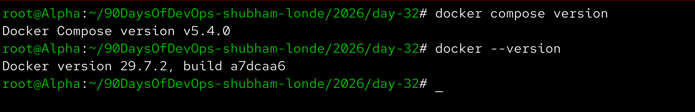
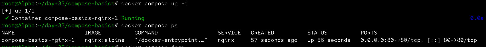
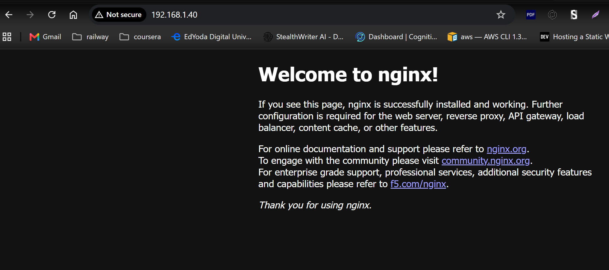
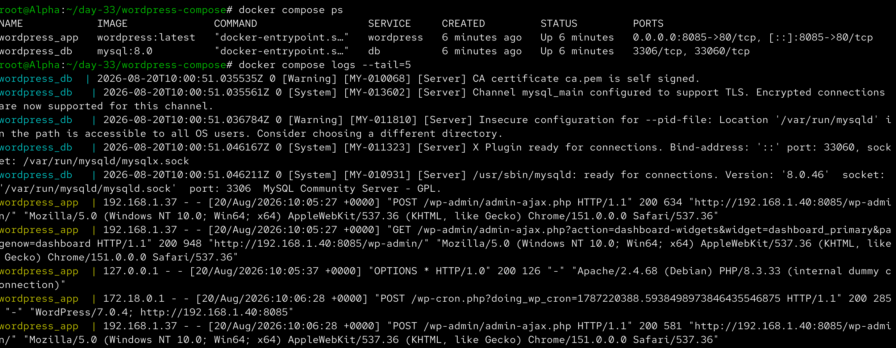
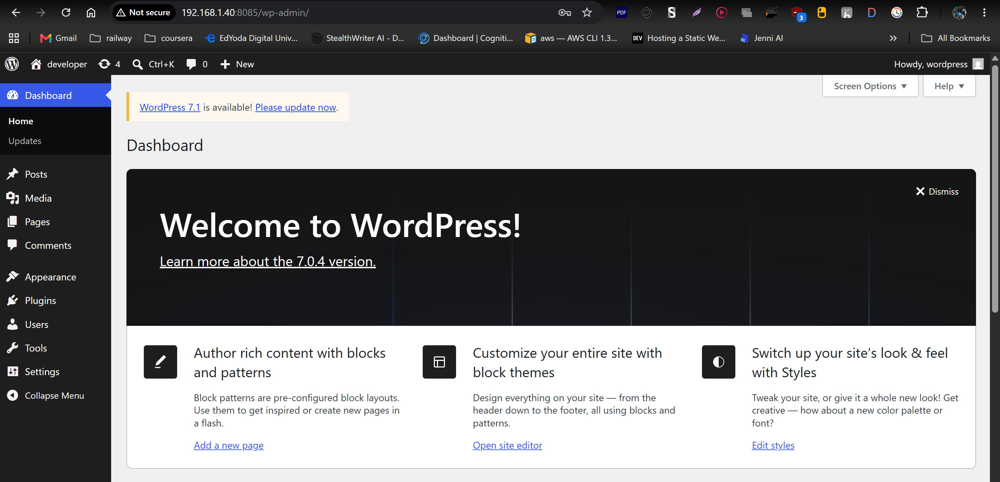
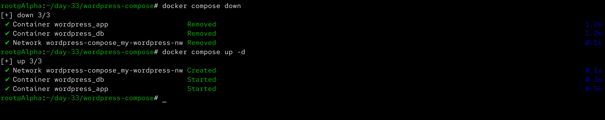
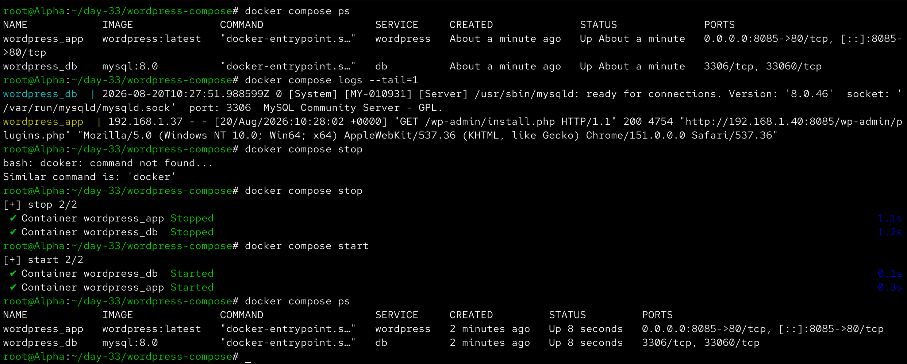
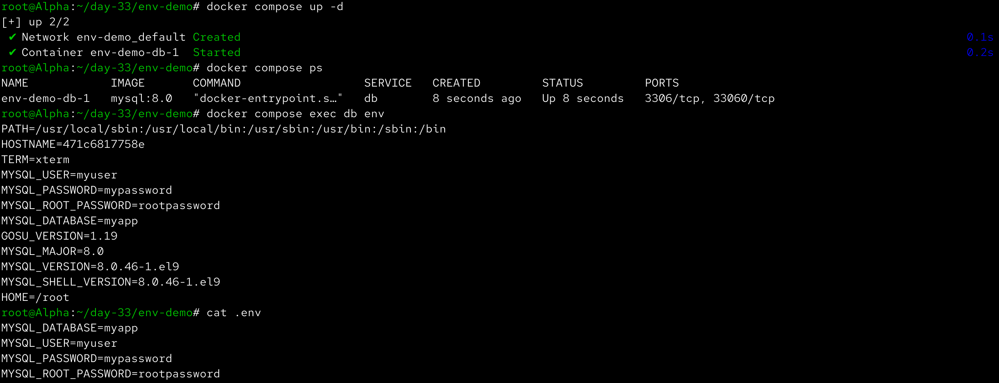

# Day 33 – Docker Compose: Multi-Container Basics

Aaj maine Docker Compose ko practically use kiya. Docker Compose ki help se multiple containers, networks aur volumes ko ek YAML file se manage karna seekha.

---

## Task 1 – Install & Verify

Sabse pehle Docker Compose available hai ya nahi ye verify kiya:

```bash
docker compose version
```

Docker version bhi check ki:

```bash
docker --version
```

Docker Compose successfully available tha.



---

## Task 2 – First Compose File

Sabse pehle `compose-basics` directory create ki:

```bash
mkdir -p ~/day-33/compose-basics
cd ~/day-33/compose-basics
```

Uske andar `docker-compose.yml` file create ki:

```yaml
services:
  nginx:
    image: nginx:alpine
    ports:
      - "8084:80"
```

Yahan:

- `services` → Compose application ke containers define karta hai.
- `nginx` → service ka naam hai.
- `image` → Nginx Alpine image use ho rahi hai.
- `ports` → host port `8084` ko container port `80` se map karta hai.

---

### Start Compose

```bash
docker compose up -d
```

Running services check ki:

```bash
docker compose ps
```

Nginx container successfully running tha.



Browser me Nginx access kiya:

```text
http://<SERVER-IP>:8084
```

Nginx welcome page successfully open hui.



---

### Stop Compose

Compose application stop aur remove karne ke liye:

```bash
docker compose down
```

Is command se Compose ke containers aur default network remove ho gaye.

---

# Task 3 – WordPress + MySQL

Ab maine Docker Compose ka real multi-container example banaya.

Architecture:

```text
WordPress
    |
    | Docker Compose Network
    |
    ↓
  MySQL
    |
    ↓
Named Volume
```

`docker-compose.yml`:

```yaml
services:

  db:
    image: mysql:8.0
    environment:
      MYSQL_DATABASE: wordpress
      MYSQL_USER: wordpress
      MYSQL_PASSWORD: wordpress
      MYSQL_ROOT_PASSWORD: rootpassword
    volumes:
      - wordpress-db-data:/var/lib/mysql

  wordpress:
    image: wordpress:latest
    ports:
      - "8085:80"
    environment:
      WORDPRESS_DB_HOST: db:3306
      WORDPRESS_DB_USER: wordpress
      WORDPRESS_DB_PASSWORD: wordpress
      WORDPRESS_DB_NAME: wordpress
    depends_on:
      - db

volumes:
  wordpress-db-data:
```

### Important Point

WordPress ke configuration me:

```yaml
WORDPRESS_DB_HOST: db:3306
```

`db` MySQL service ka naam hai.

Docker Compose automatically service-name based DNS provide karta hai, isliye WordPress MySQL ko uske container IP ke instead `db` naam se reach kar sakta hai.

---

## Start WordPress + MySQL

```bash
docker compose up -d
```

Running services check ki:

```bash
docker compose ps
```

Dono services successfully running thi:

```text
db
wordpress
```

Compose logs bhi check kiye:

```bash
docker compose logs --tail=20
```



---

## Access WordPress

Browser me open kiya:

```text
http://<SERVER-IP>:8085
```

WordPress setup complete kiya aur dashboard successfully access kiya.



---

# Test WordPress Data Persistence

Ab maine verify kiya ki Docker Compose ke through WordPress data persistent hai ya nahi.

Pehle complete Compose stack ko stop/remove kiya:

```bash
docker compose down
```

Volumes check kiye:

```bash
docker volume ls
```

Named volume abhi bhi available tha.

Phir stack ko dobara start kiya:

```bash
docker compose up -d
```

WordPress browser me dobara open kiya:

```text
http://<SERVER-IP>:8085
```

Previous WordPress configuration/data available tha.

Iska reason named volume hai:

```text
WordPress
    ↓
MySQL
    ↓
wordpress-db-data
    ↓
Persistent Data
```

`docker compose down` containers aur network remove karta hai, lekin named volume ko automatically remove nahi karta.



---

# Task 4 – Docker Compose Commands

## Start Services in Detached Mode

```bash
docker compose up -d
```

`-d` ka matlab detached mode hai. Containers background me run karte hain.

---

## View Running Services

```bash
docker compose ps
```

---

## View Logs of All Services

```bash
docker compose logs
```

Real-time logs:

```bash
docker compose logs -f
```

`Ctrl + C` se log following stop kar sakte hain.

---

## View Logs of a Specific Service

MySQL:

```bash
docker compose logs db
```

WordPress:

```bash
docker compose logs wordpress
```

---

## Stop Services Without Removing Them

```bash
docker compose stop
```

Isse containers stop hote hain lekin remove nahi hote.

Dobara start karne ke liye:

```bash
docker compose start
```

---

## Remove Containers and Network

```bash
docker compose down
```

---

## Remove Containers, Network and Volumes

```bash
docker compose down -v
```

`-v` named volumes ko bhi remove karta hai.

---

## Rebuild Images

Agar Compose project me custom Dockerfile use ho raha ho:

```bash
docker compose build
```

Uske baad:

```bash
docker compose up -d
```

---

### Compose Commands Practice

Maine Compose ke important lifecycle aur log commands practice kiye.



---

# Task 5 – Environment Variables

Docker Compose me environment variables ko `.env` file ke through manage kiya.

`.env` file:

```text
MYSQL_DATABASE=myapp
MYSQL_USER=myuser
MYSQL_PASSWORD=mypassword
MYSQL_ROOT_PASSWORD=rootpassword
```

Compose file:

```yaml
services:

  db:
    image: mysql:8.0
    environment:
      MYSQL_DATABASE: ${MYSQL_DATABASE}
      MYSQL_USER: ${MYSQL_USER}
      MYSQL_PASSWORD: ${MYSQL_PASSWORD}
      MYSQL_ROOT_PASSWORD: ${MYSQL_ROOT_PASSWORD}
```

Yahan:

```text
${MYSQL_DATABASE}
${MYSQL_USER}
${MYSQL_PASSWORD}
${MYSQL_ROOT_PASSWORD}
```

values `.env` file se automatically read hoti hain.

Compose application start ki:

```bash
docker compose up -d
```

Environment variables verify ki:

```bash
docker compose exec db env
```

Variables successfully container ke environment me available thi.



---

# Docker Compose Concepts

## What is Docker Compose?

Docker Compose ek tool hai jo multi-container Docker applications ko YAML configuration file ke through define aur manage karta hai.

Example:

```text
docker-compose.yml
        |
        ↓
docker compose up
        |
        ├── Network
        ├── Volume
        ├── Container 1
        └── Container 2
```

---

# Services

Compose file ke andar `services` ke under application ke containers define hote hain.

Example:

```yaml
services:
  web:
    image: nginx

  db:
    image: mysql
```

Yahan do services hain:

```text
web
db
```

---

# Automatic Network

Docker Compose automatically ek default network create karta hai.

Example:

```text
wordpress
     |
     | Docker DNS
     ↓
    db
```

WordPress MySQL ko service name ke through access karta hai:

```text
db:3306
```

IP address manually configure karne ki zarurat nahi hoti.

---

# Named Volumes

Compose named volumes ko bhi manage kar sakta hai.

Example:

```yaml
volumes:
  wordpress-db-data:
```

Volume ko MySQL ke saath mount kiya:

```yaml
volumes:
  - wordpress-db-data:/var/lib/mysql
```

Isse MySQL data container lifecycle ke bahar persist karta hai.

---

# Environment Variables

`.env` file configuration values ko Compose file se separate rakhne me help karti hai.

Example:

```text
MYSQL_DATABASE=myapp
MYSQL_USER=myuser
MYSQL_PASSWORD=mypassword
```

Compose me:

```yaml
environment:
  MYSQL_DATABASE: ${MYSQL_DATABASE}
  MYSQL_USER: ${MYSQL_USER}
  MYSQL_PASSWORD: ${MYSQL_PASSWORD}
```

---

# Docker Compose Workflow

Manual Docker workflow:

```text
Create Network
      ↓
Create Volume
      ↓
Run MySQL
      ↓
Run WordPress
      ↓
Configure Networking
      ↓
Check Containers
```

Docker Compose workflow:

```text
docker-compose.yml
        ↓
docker compose up -d
        ↓
Network + Volume + Containers
```

Yani ek YAML file me poori application architecture define karke single command se start ki ja sakti hai.

---

# WordPress + MySQL Architecture

```text
                  Docker Compose
                       |
              ┌────────┴────────┐
              │                 │
              ↓                 ↓
         WordPress            MySQL
         Container           Container
              │                 │
              │                 ↓
              │          wordpress-db-data
              │              Volume
              │
              └────── Docker Network ──────┘
```

WordPress MySQL ko service name:

```text
db
```

ke through access karta hai.

MySQL ka data:

```text
wordpress-db-data
```

named volume me persist hota hai.

---

# Important Commands Learned

## Start

```bash
docker compose up
```

## Detached Mode

```bash
docker compose up -d
```

## View Services

```bash
docker compose ps
```

## Logs

```bash
docker compose logs
```

## Follow Logs

```bash
docker compose logs -f
```

## Specific Service Logs

```bash
docker compose logs db
docker compose logs wordpress
```

## Stop Services

```bash
docker compose stop
```

## Start Existing Services

```bash
docker compose start
```

## Stop and Remove

```bash
docker compose down
```

## Remove Including Volumes

```bash
docker compose down -v
```

## Execute Command Inside Service

```bash
docker compose exec db env
```

## Build Images

```bash
docker compose build
```

---

# Docker Compose vs Manual Docker

### Manual Docker

```text
Network
   ↓
Volume
   ↓
MySQL Container
   ↓
WordPress Container
   ↓
Manual Configuration
```

### Docker Compose

```text
docker-compose.yml
        ↓
docker compose up -d
        ↓
Network
Volume
MySQL
WordPress
```

Docker Compose makes multi-container application management much easier and repeatable.

---

# What I Learned

- Docker Compose multiple containers ko ek YAML file se define aur manage karne ke liye use hota hai.
- Compose automatically services ke liye network create karta hai aur service names ke through container-to-container communication provide karta hai.
- Named volumes database data ko persistent rakhte hain, even when containers are recreated.
- `.env` files configuration values ko Compose files se separate rakhne me help karti hain.
- `docker compose up`, `ps`, `logs`, `stop`, `start` aur `down` multi-container applications ke important lifecycle commands hain.

---

# Day 33 Screenshots


