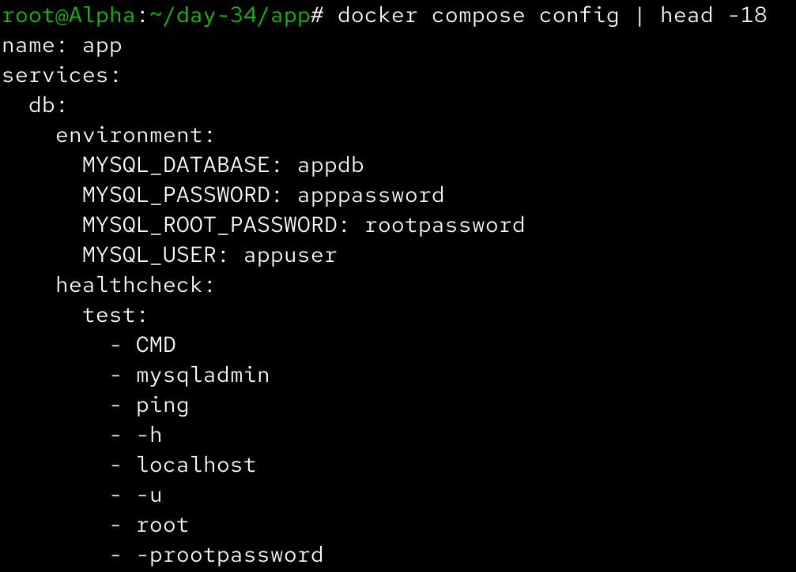
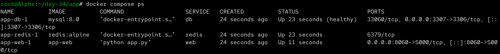
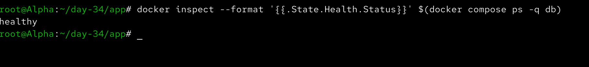
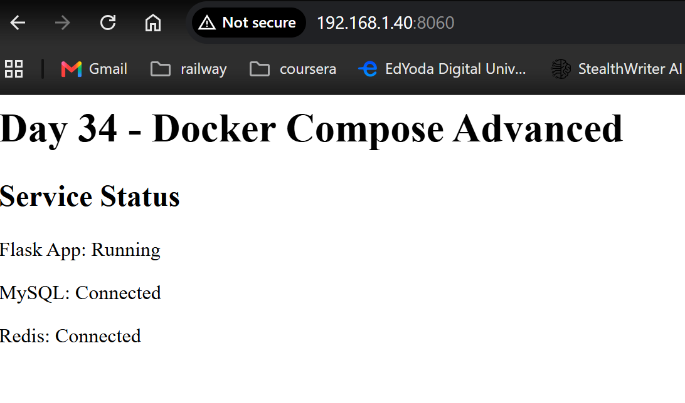
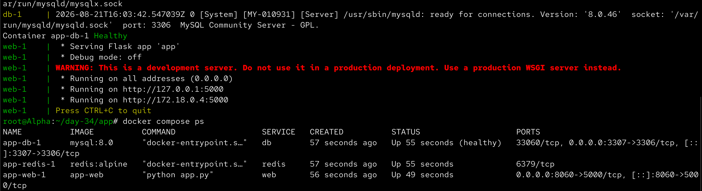
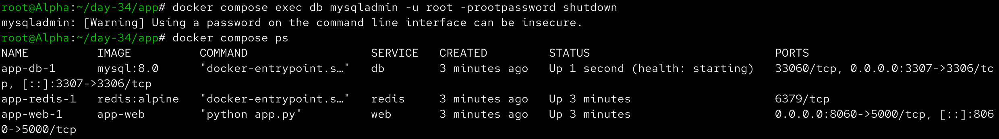
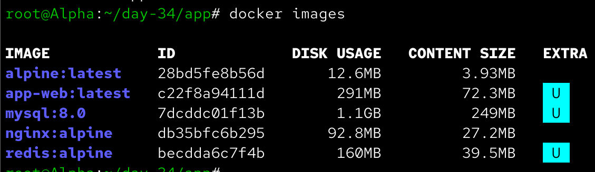
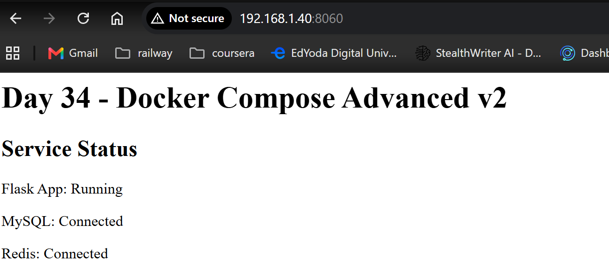
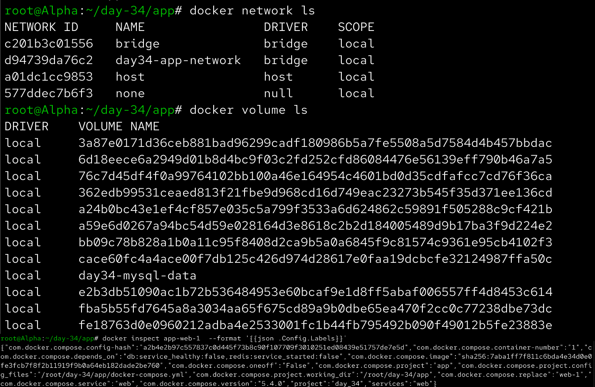
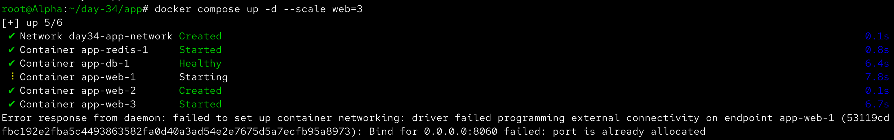

# Day 34 – Docker Compose: Real-World Multi-Container Apps

Aaj maine Docker Compose ke advanced concepts ko practically implement kiya. Maine Flask web application, MySQL database aur Redis cache ka 3-service stack banaya aur healthchecks, service dependencies, restart policies, custom Dockerfiles, named networks, volumes aur scaling ko practice kiya.

---

## Task 1 – Build Your Own App Stack

Aaj maine ek 3-service application stack create kiya:

```text
                Docker Compose
                     │
        ┌────────────┼────────────┐
        ↓            ↓            ↓
      Flask        MySQL        Redis
       App           DB          Cache
```

Maine Python Flask ko web application ke liye, MySQL ko database ke liye aur Redis ko caching service ke liye use kiya.

---

## Flask Application

`app.py`:

```python
from flask import Flask
import os
import mysql.connector
import redis

app = Flask(__name__)


@app.route("/")
def home():
    db_status = "Not connected"
    redis_status = "Not connected"

    try:
        db = mysql.connector.connect(
            host=os.getenv("DB_HOST", "db"),
            user=os.getenv("DB_USER", "appuser"),
            password=os.getenv("DB_PASSWORD", "apppassword"),
            database=os.getenv("DB_NAME", "appdb")
        )

        if db.is_connected():
            db_status = "Connected"

        db.close()

    except Exception as e:
        db_status = f"Error: {e}"

    try:
        cache = redis.Redis(
            host=os.getenv("REDIS_HOST", "redis"),
            port=6379,
            decode_responses=True
        )

        cache.ping()
        redis_status = "Connected"

    except Exception as e:
        redis_status = f"Error: {e}"

    return f"""
    <h1>Day 34 - Docker Compose Advanced</h1>

    <h2>Service Status</h2>

    <p>Flask App: Running</p>
    <p>MySQL: {db_status}</p>
    <p>Redis: {redis_status}</p>
    """


if __name__ == "__main__":
    app.run(host="0.0.0.0", port=5000)
```

---

## Requirements

`requirements.txt`:

```text
Flask
mysql-connector-python
redis
```

---

## Custom Dockerfile

`Dockerfile`:

```dockerfile
FROM python:3.12-slim

WORKDIR /app

COPY requirements.txt .

RUN pip install --no-cache-dir -r requirements.txt

COPY app.py .

EXPOSE 5000

CMD ["python", "app.py"]
```

### Dockerfile Explanation

```text
FROM
↓
Python base image

WORKDIR
↓
Sets /app as working directory

COPY requirements.txt
↓
Copies dependency file

RUN
↓
Installs Python dependencies

COPY app.py
↓
Copies application code

EXPOSE
↓
Documents Flask port 5000

CMD
↓
Starts Flask application
```

---

## Environment Variables

`.env`:

```text
MYSQL_DATABASE=appdb
MYSQL_USER=appuser
MYSQL_PASSWORD=apppassword
MYSQL_ROOT_PASSWORD=rootpassword
```

These variables are used by Docker Compose instead of hard-coding the values directly in the Compose configuration.

---

# Docker Compose Configuration

`docker-compose.yml`:

```yaml
services:
  web:
    build: /root/90DaysOfDevOps-shubham-londe/2026/day-34/app/.
      #  context: .
    ports:
      - 8060:5000
    environment:
      DB_HOST: db
      DB_USER: ${MYSQL_USER}
      DB_PASSWORD: ${MYSQL_PASSWORD}
      DB_NAME: ${MYSQL_DATABASE}
      REDIS_HOST: redis
    depends_on:
      db:
        condition: service_healthy
      redis:
        condition: service_started
    networks:
      - app-network
    labels:
      project: "day_34"
      services: "web"
  db:
    image: mysql:8.0
    restart: always
    environment:
      MYSQL_DATABASE: ${MYSQL_DATABASE}
      MYSQL_USER: ${MYSQL_USER}
      MYSQL_PASSWORD: ${MYSQL_PASSWORD}
      MYSQL_ROOT_PASSWORD: ${MYSQL_ROOT_PASSWORD}
    volumes:
      - mysql-data:/var/lib/mysql
    healthcheck:
      test:
        - CMD
        - mysqladmin
        - ping
        - -h
        - localhost
        - -u
        - root
        - -p$${MYSQL_ROOT_PASSWORD}
      interval: 10s
      timeout: 5s
      retries: 5
      start_period: 30s
    ports:
      - 3307:3306
    networks:
      - app-network
    labels: 
      project: "day-34"
      service: "database"
  redis:
    image: redis:alpine
    networks:
      - app-network
    labels:
      project: "day-34"
      service:  "cache"
networks:
  app-network:
    name: day34-app-network
    driver: bridge
volumes:
  mysql-data:
    name: day34-mysql-data
```

---

## Compose Architecture

```text
                         day34-app-network
                                │
               ┌────────────────┼────────────────┐
               │                │                │
               ↓                ↓                ↓
             web               db              redis
           Flask App          MySQL             Redis
               │                │
               │                ↓
               │          day34-mysql-data
               │             Volume
               │
         Port 8086:5000
               │
               ↓
           Browser
```

---

## Validate Compose Configuration

Before starting the application, I used:

```bash
docker compose config
```

This command displays the final Compose configuration after environment variable substitution.



---

# Task 2 – depends_on & Healthchecks

The Flask application depends on MySQL:

```yaml
depends_on:
  db:
    condition: service_healthy
```

The MySQL service contains a healthcheck:

```yaml
healthcheck:
  test:
    [
      "CMD",
      "mysqladmin",
      "ping",
      "-h",
      "localhost",
      "-u",
      "root",
      "-p${MYSQL_ROOT_PASSWORD}"
    ]
  interval: 10s
  timeout: 5s
  retries: 5
  start_period: 20s
```

This means the web application waits for MySQL to become healthy instead of simply waiting for the MySQL container to start.

---

## Start the Stack

```bash
docker compose up -d --build
```

Check services:

```bash
docker compose ps
```

The stack contains:

```text
web
db
redis
```



---

## Check MySQL Health

I checked the health status using:

```bash
docker inspect --format='{{.State.Health.Status}}' $(docker compose ps -q db)
```

The MySQL container eventually reported:

```text
healthy
```



---

## Test Flask Application

The application was exposed on port `8086`.

I opened:

```text
http://<SERVER-IP>:8086
```

The application displayed:

```text
Day 34 - Docker Compose Advanced

Service Status

Flask App: Running
MySQL: Connected
Redis: Connected
```

This confirmed that Flask could communicate with both MySQL and Redis.



---

## Test depends_on

I brought the complete stack down:

```bash
docker compose down
```

Then started it again:

```bash
docker compose up
```

I observed the startup process and verified that MySQL went through its healthcheck before the dependent web service became ready.



---

# Task 3 – Restart Policies

For the MySQL service, I configured:

```yaml
restart: always
```

This tells Docker to restart the container automatically if it stops.

---

## Test restart: always

First I checked the MySQL container:

```bash
docker compose ps
```

Then I killed it:

```bash
docker kill $(docker compose ps -q db)
```

After checking the services again:

```bash
docker compose ps
```

the MySQL container came back automatically because of the restart policy.



---

## Restart Policies Comparison

### `restart: always`

Docker attempts to restart the container whenever it stops.

Useful for important services such as:

- Databases
- Web servers
- Critical application services

### `restart: on-failure`

The container is restarted when it exits with a non-zero exit status.

Useful for:

- Applications that can crash
- Temporary failures
- Batch or worker processes

Other policies include:

```yaml
restart: "no"
```

and:

```yaml
restart: unless-stopped
```

---

# Task 4 – Custom Dockerfile in Compose

Instead of using only a pre-built image, I used:

```yaml
build: ./app
```

This tells Compose to build the Flask application from the Dockerfile located inside the `app` directory.

```text
docker-compose.yml
        ↓
build: ./app
        ↓
./app/Dockerfile
        ↓
Custom Flask Image
```

I checked the generated images:

```bash
docker images
```

The custom Flask image was successfully created.



---

## Rebuild After Code Change

I modified the Flask application's heading:

```python
<h1>Day 34 - Docker Compose Advanced v2</h1>
```

Then rebuilt and restarted the application using:

```bash
docker compose up -d --build
```

The updated application was visible in the browser.



---

# Task 5 – Named Networks & Volumes

Instead of relying on the default Compose network, I explicitly created:

```yaml
networks:
  app-network:
    name: day34-app-network
```

I checked it using:

```bash
docker network ls
```

and:

```bash
docker network inspect day34-app-network
```

---

## Named Volume

The MySQL data volume was explicitly defined:

```yaml
volumes:
  mysql-data:
    name: day34-mysql-data
```

I checked it using:

```bash
docker volume ls
```

and:

```bash
docker volume inspect day34-mysql-data
```

---

## Service Labels

I added labels to the services for better organization.

Example:

```yaml
labels:
  project: "day-34"
  service: "web"
```

Labels can be inspected with:

```bash
docker inspect \
  $(docker compose ps -q web) \
  --format '{{json .Config.Labels}}'
```



---

# Task 6 – Scaling

I attempted to scale the Flask web service to three replicas:

```bash
docker compose up -d --scale web=3
```

Then checked:

```bash
docker compose ps
```

The scaling experiment demonstrated a problem caused by the fixed port mapping:

```yaml
ports:
  - "8086:5000"
```

Every replica attempts to bind the same host port `8086`.

Only one container can bind that host port at a time, so simple scaling with a fixed host port causes a port allocation conflict.

Example:

```text
Host Port 8086
      │
      ├── web-1:5000
      ├── web-2:5000  ❌
      └── web-3:5000  ❌
```



---

# Why Does Simple Scaling Break with Port Mapping?

The same host port cannot be mapped to multiple containers simultaneously.

A production architecture would normally use a reverse proxy or load balancer:

```text
                 Browser
                    │
                    ↓
              Load Balancer
                    │
          ┌─────────┼─────────┐
          ↓         ↓         ↓
        web-1     web-2     web-3
          │         │         │
          └─────────┼─────────┘
                    ↓
                  MySQL
                    +
                  Redis
```

The load balancer receives traffic and distributes it among the web replicas.

---

# Important Commands Learned

## Validate Compose

```bash
docker compose config
```

## Build and Start

```bash
docker compose up -d --build
```

## Check Services

```bash
docker compose ps
```

## View Logs

```bash
docker compose logs
```

## Follow Logs

```bash
docker compose logs -f
```

## Inspect Health

```bash
docker inspect --format='{{.State.Health.Status}}' CONTAINER
```

## Scale

```bash
docker compose up -d --scale web=3
```

## Network

```bash
docker network ls
docker network inspect day34-app-network
```

## Volume

```bash
docker volume ls
docker volume inspect day34-mysql-data
```

## Rebuild

```bash
docker compose up -d --build
```

---

# Day 34 Final Architecture

```text
                         Browser
                            │
                            │ :8086
                            ▼
                     ┌─────────────┐
                     │   Flask     │
                     │     Web     │
                     └──────┬──────┘
                            │
                ┌───────────┴───────────┐
                │                       │
                ▼                       ▼
          ┌───────────┐           ┌───────────┐
          │   MySQL   │           │   Redis   │
          │     DB    │           │   Cache   │
          └─────┬─────┘           └───────────┘
                │
                ▼
        day34-mysql-data
             Volume

All services:
        │
        ▼
day34-app-network
```

---

# Key Concepts Learned

### `depends_on`

Controls service startup dependencies.

```yaml
depends_on:
  db:
    condition: service_healthy
```

---

### `healthcheck`

Checks whether a service is actually ready.

```yaml
healthcheck:
  test: [...]
  interval: 10s
  timeout: 5s
  retries: 5
```

---

### Restart Policy

Controls what Docker should do when a container exits.

```yaml
restart: always
```

or:

```yaml
restart: on-failure
```

---

### `build`

Builds a custom image from a Dockerfile.

```yaml
build: ./app
```

---

### Named Network

```yaml
networks:
  app-network:
    name: day34-app-network
```

---

### Named Volume

```yaml
volumes:
  mysql-data:
    name: day34-mysql-data
```

---

### Labels

Labels add metadata to Docker resources.

```yaml
labels:
  project: "day-34"
  service: "web"
```

---

# What I Learned

- `depends_on` with `service_healthy` allows an application to wait for the database to become healthy instead of only waiting for the container to start.
- Restart policies such as `always` and `on-failure` help automatically recover services after failures.
- Docker Compose can build custom application images directly from Dockerfiles using the `build` instruction.
- Explicit networks and named volumes make multi-container applications easier to organize and manage.
- Scaling a service with a fixed host port creates a port-binding conflict because multiple replicas cannot use the same host port.
- Production systems commonly use a reverse proxy or load balancer when multiple application replicas need to receive traffic.

---

# Day 34 Screenshot Checklist

The screenshots used in this documentation are:

```text
compose-config.png
compose-services-running.png
mysql-healthcheck.png
flask-app-stack.png
depends-on-healthcheck.png
restart-policy.png
custom-flask-image.png
compose-rebuild.png
named-network-volume-labels.png
compose-scaling.png
```

---

# Final Project Structure

```text
2026/day-34/
├── day-34-compose-advanced.md
├── docker-compose.yml
├── .env
├── app/
│   ├── Dockerfile
│   ├── app.py
│   └── requirements.txt
├── compose-config.png
├── compose-services-running.png
├── mysql-healthcheck.png
├── flask-app-stack.png
├── depends-on-healthcheck.png
├── restart-policy.png
├── custom-flask-image.png
├── compose-rebuild.png
├── named-network-volume-labels.png
└── compose-scaling.png
```

---

# Cleanup

After completing the documentation, the Compose stack can be stopped with:

```bash
docker compose down
```

If the MySQL volume is no longer required, it can also be removed:

```bash
docker compose down -v
```

Then verify:

```bash
docker ps -a
docker volume ls
docker network ls
```

---

# Conclusion

Day 34 was a major step from basic Docker Compose to a more realistic multi-container architecture.

The final stack contained:

```text
Flask Web Application
        +
      MySQL
        +
      Redis
        +
 Healthcheck
        +
 Restart Policy
        +
 Named Network
        +
 Named Volume
        +
 Custom Dockerfile
        +
 Environment Variables
```

This is much closer to the type of multi-service architecture used in real DevOps environments.
