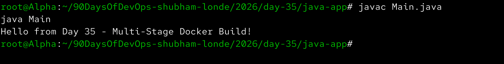
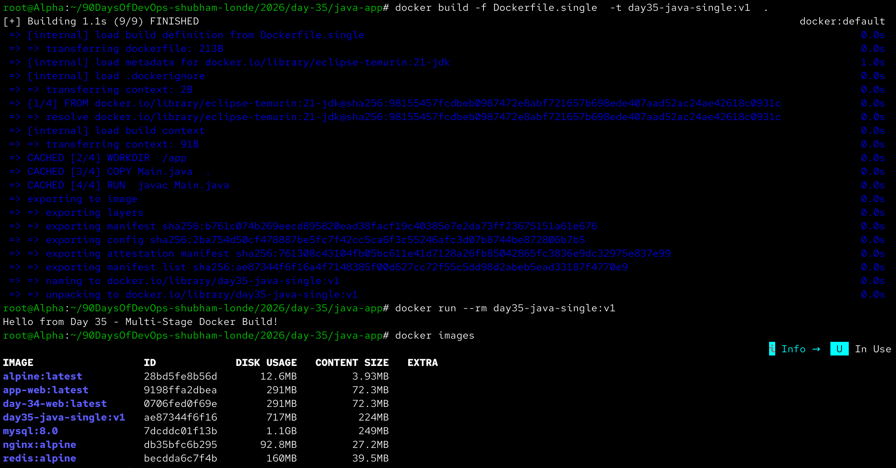
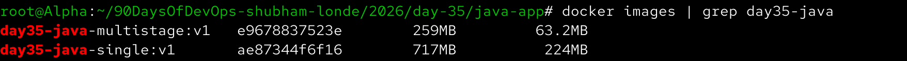
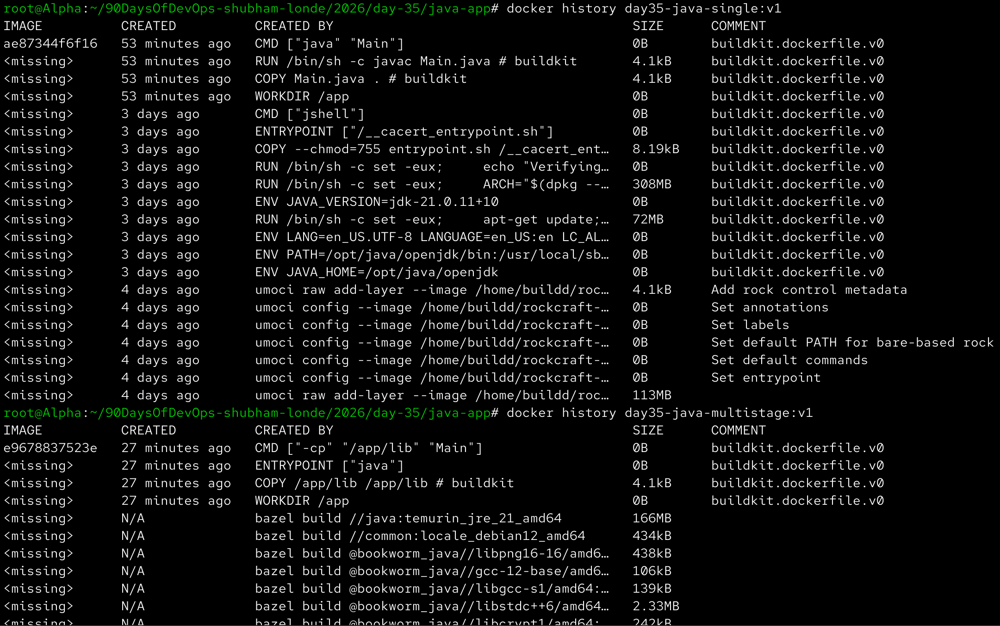
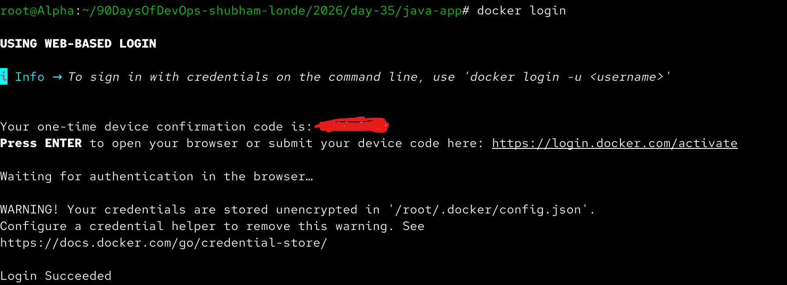
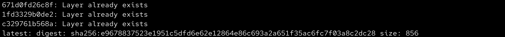
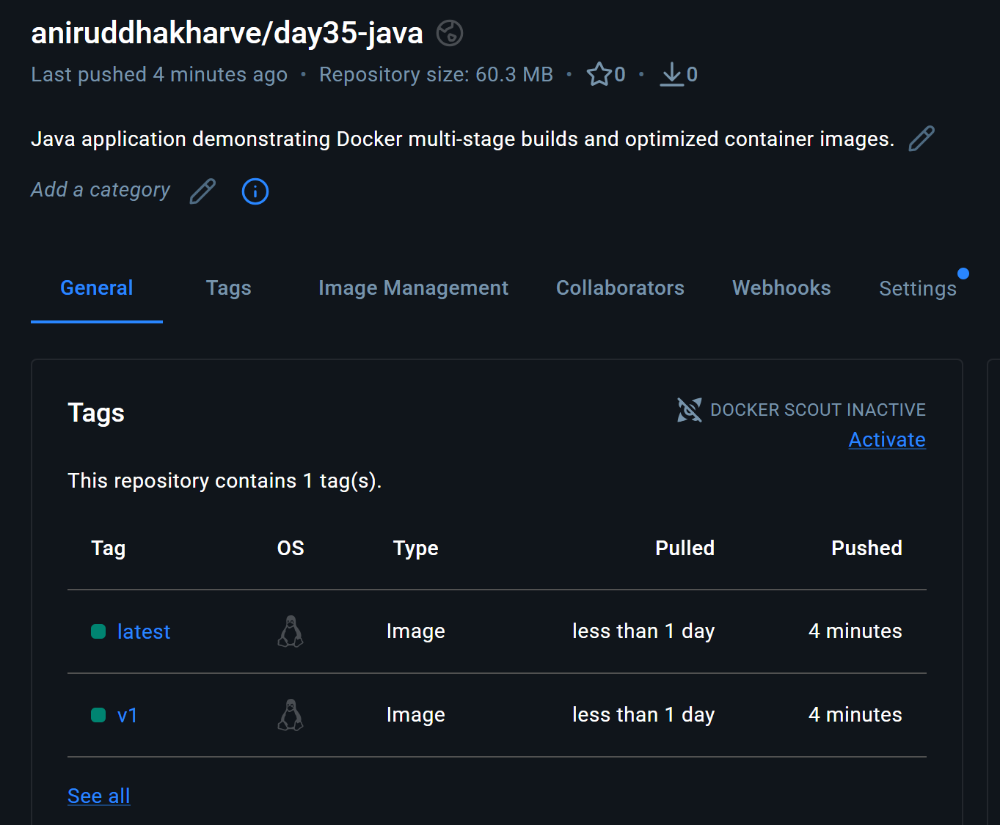
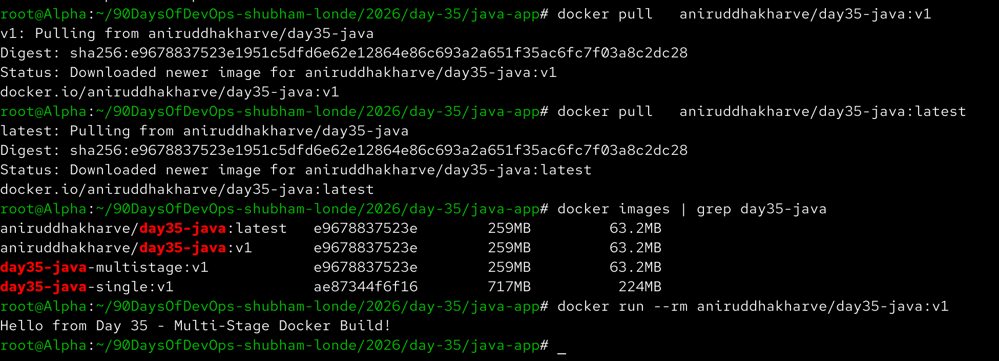
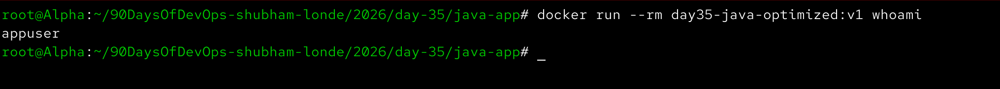
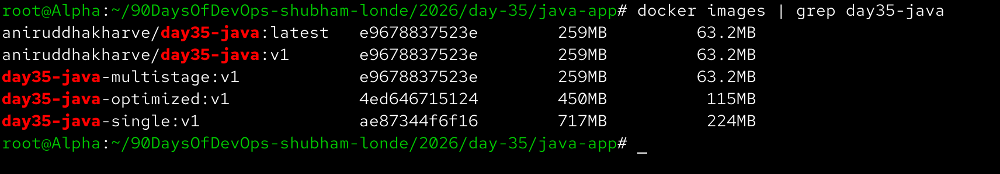

# Day 35 – Multi-Stage Builds & Docker Hub

Aaj maine Docker image optimization aur Docker Hub ke concepts practically practice kiye. Maine single-stage aur multi-stage Docker builds ko compare kiya, image sizes check kiye, non-root user configure kiya aur optimized image ko Docker Hub par push karke pull bhi kiya.

---

# Task 1 – The Problem with Large Images

Aaj maine ek simple Java application create kiya:

```java
public class Main {
    public static void main(String[] args) {
        System.out.println("Hello from Day 35 - Multi-Stage Docker Build!");
    }
}
```

Application ko locally compile aur run kiya:

```bash
javac Main.java
java Main
```

Output:

```text
Hello from Day 35 - Multi-Stage Docker Build!
```



---

# Single-Stage Docker Build

Sabse pehle maine ek single-stage Dockerfile create kiya.

**File:** `Dockerfile.single`

```dockerfile
FROM eclipse-temurin:21-jdk

WORKDIR /app

COPY Main.java .

RUN javac Main.java

CMD ["java", "Main"]
```

Is Dockerfile me build aur runtime dono ek hi image ke andar hain.

```text
JDK
+
Source Code
+
Compiler
+
Compiled Application
+
Runtime
```

Image build ki:

```bash
docker build -f Dockerfile.single -t day35-java-single:v1 .
```

Container run kiya:

```bash
docker run --rm day35-java-single:v1
```

Output:

```text
Hello from Day 35 - Multi-Stage Docker Build!
```

Image size check ki:

```bash
docker images day35-java-single
```



---

# Task 2 – Multi-Stage Build

Single-stage image me complete JDK aur build environment final image ke andar remain karta hai.

Is problem ko solve karne ke liye maine multi-stage build use kiya.

**File:** `Dockerfile`

```dockerfile
# Stage 1: Build the Java application
FROM eclipse-temurin:21-jdk AS builder

WORKDIR /app

COPY Main.java .

RUN javac Main.java


# Stage 2: Runtime image
FROM eclipse-temurin:21-jre

WORKDIR /app

COPY --from=builder /app/Main.class .

CMD ["java", "Main"]
```

---

## Builder Stage

```dockerfile
FROM eclipse-temurin:21-jdk AS builder
```

Is stage me complete JDK available hai.

```dockerfile
COPY Main.java .
```

Java source code copy kiya.

```dockerfile
RUN javac Main.java
```

Source code compile karke `Main.class` generate kiya.

---

## Runtime Stage

```dockerfile
FROM eclipse-temurin:21-jre
```

Final image ke liye sirf Java Runtime Environment use kiya.

```dockerfile
COPY --from=builder /app/Main.class .
```

Builder stage se sirf compiled application copy ki.

Isliye final image me unnecessary build tools nahi aaye.

---

## Build Multi-Stage Image

```bash
docker build -t day35-java-multistage:v1 .
```

Container run kiya:

```bash
docker run --rm day35-java-multistage:v1
```

Output:

```text
Hello from Day 35 - Multi-Stage Docker Build!
```

Image size check ki:

```bash
docker images day35-java-multistage
```

---

# Image Size Comparison

Dono images ko ek saath compare kiya:

```bash
docker images | grep day35-java
```

Comparison:

```text
Single-stage
        ↓
JDK + Build Tools + Application

Multi-stage
        ↓
JRE + Application
```

Multi-stage image smaller thi because final image me compiler aur unnecessary build dependencies included nahi the.



---

# Image Layers and History

Docker image layers ko understand karne ke liye maine `docker history` command use ki.

Single-stage image:

```bash
docker history day35-java-single:v1
```

Multi-stage image:

```bash
docker history day35-java-multistage:v1
```

Isse image ke different layers aur unke sizes ko observe kiya.



---

# Why Is Multi-Stage Build Smaller?

### Single-Stage

```text
JDK
+
Compiler
+
Build Tools
+
Source Code
+
Compiled Application
+
Runtime
```

### Multi-Stage

```text
Builder Stage
     ↓
Compiled Artifact
     ↓
Minimal Runtime Stage
```

Builder stage sirf application build karne ke liye use hota hai.

Final image me sirf required runtime aur application artifact copy hota hai.

---

# Task 3 – Push Image to Docker Hub

Docker Hub par image distribute karne ke liye pehle Docker Hub authentication ki.

```bash
docker login
```

Login successfully complete hua.

> Note: Screenshot me password ya access token expose nahi kiya.



---

# Tag the Image

Docker Hub image naming format:

```text
USERNAME/REPOSITORY:TAG
```

Multi-stage image ko Docker Hub repository ke liye tag kiya:

```bash
docker tag day35-java-multistage:v1 YOUR_DOCKERHUB_USERNAME/day35-java:v1
```

Latest tag bhi create kiya:

```bash
docker tag day35-java-multistage:v1 YOUR_DOCKERHUB_USERNAME/day35-java:latest
```

Verify:

```bash
docker images | grep day35-java
```

---

# Push Image to Docker Hub

Version tag push kiya:

```bash
docker push YOUR_DOCKERHUB_USERNAME/day35-java:v1
```

Latest tag push kiya:

```bash
docker push YOUR_DOCKERHUB_USERNAME/day35-java:latest
```

Image successfully Docker Hub par push hui.



---

# Task 4 – Docker Hub Repository

Docker Hub par repository check ki.

Repository:

```text
day35-java
```

Repository me version tags available hain:

```text
v1
latest
```

Docker Hub repository me description bhi add kiya:

```text
Java application demonstrating Docker multi-stage builds and optimized container images.
```



---

# Docker Image Tags

Docker image tags versioning ke liye useful hote hain.

Example:

```text
day35-java:v1
day35-java:v2
day35-java:latest
```

Specific version pull karne ke liye:

```bash
docker pull YOUR_DOCKERHUB_USERNAME/day35-java:v1
```

Latest version ke liye:

```bash
docker pull YOUR_DOCKERHUB_USERNAME/day35-java:latest
```

Production environments me specific version tags use karna generally safer hota hai because `latest` tag ka content change ho sakta hai.

---

# Pull and Verify Image

Local image ko remove karke Docker Hub se dobara pull kiya:

```bash
docker rmi YOUR_DOCKERHUB_USERNAME/day35-java:v1
```

Phir image pull ki:

```bash
docker pull YOUR_DOCKERHUB_USERNAME/day35-java:v1
```

Image successfully download hui.

Container run kiya:

```bash
docker run --rm YOUR_DOCKERHUB_USERNAME/day35-java:v1
```

Output:

```text
Hello from Day 35 - Multi-Stage Docker Build!
```

Isse verify hua ki Docker Hub se image successfully pull karke run ki ja sakti hai.



---

# Task 5 – Image Best Practices

Ab maine image ko aur secure banane ke liye non-root user use kiya.

**File:** `Dockerfile.optimized`

```dockerfile
# Stage 1: Build
FROM eclipse-temurin:21-jdk AS builder

WORKDIR /app

COPY Main.java .

RUN javac Main.java


# Stage 2: Runtime
FROM eclipse-temurin:21-jre

WORKDIR /app

RUN useradd --create-home appuser

COPY --from=builder /app/Main.class .

USER appuser

CMD ["java", "Main"]
```

---

# Build Optimized Image

```bash
docker build -f Dockerfile.optimized -t day35-java-optimized:v1 .
```

Run:

```bash
docker run --rm day35-java-optimized:v1
```

Application successfully run hui.

---

# Verify Non-Root User

Container ke andar current user check kiya:

```bash
docker run --rm day35-java-optimized:v1 whoami
```

Expected output:

```text
appuser
```

Isse verify hua ki application root user ke naam se run nahi ho rahi.



---

# Final Image Comparison

Final images ko compare kiya:

```bash
docker images | grep day35-java
```

Comparison me:

```text
day35-java-single
day35-java-multistage
day35-java-optimized
```

images ko compare kiya.



---

# Docker Image Best Practices

## 1. Multi-Stage Builds

Multi-stage builds build environment aur runtime environment ko separate karte hain.

```text
Builder
   ↓
Build Artifact
   ↓
Runtime Image
```

Isse final image smaller aur cleaner hoti hai.

---

## 2. Use Minimal Base Images

Agar application ko complete OS ki zarurat nahi hai to unnecessarily large base images avoid karni chahiye.

Example:

```dockerfile
FROM eclipse-temurin:21-jre
```

runtime ke liye JDK ke comparison me unnecessary build tools avoid karta hai.

---

## 3. Don't Run as Root

Application ko non-root user ke saath run karna better security practice hai.

```dockerfile
USER appuser
```

---

## 4. Use Specific Image Tags

Instead of:

```dockerfile
FROM eclipse-temurin:latest
```

specific version use karna better hai:

```dockerfile
FROM eclipse-temurin:21-jre
```

Isse builds more predictable aur reproducible hote hain.

---

## 5. Reduce Unnecessary Layers

Dockerfile me unnecessary `RUN` instructions avoid karni chahiye.

Multiple related commands ko appropriately combine kiya ja sakta hai:

```dockerfile
RUN command1 \
    && command2 \
    && command3
```

---

# Multi-Stage Build Architecture

```text
              Source Code
                   │
                   ↓
          ┌─────────────────┐
          │ Builder Stage   │
          │                 │
          │ JDK             │
          │ Compiler        │
          │ Build Tools     │
          └────────┬────────┘
                   │
                   │ Main.class
                   ↓
          ┌─────────────────┐
          │ Runtime Stage   │
          │                 │
          │ JRE             │
          │ Main.class      │
          │ appuser         │
          └────────┬────────┘
                   │
                   ↓
             Final Image
                   │
                   ↓
             Docker Hub
```

---

# Docker Hub Workflow

```text
Build Image
     ↓
Tag Image
     ↓
docker login
     ↓
docker push
     ↓
Docker Hub
     ↓
docker pull
     ↓
Run Container
```

---

# Important Commands Learned

## Build Single-Stage Image

```bash
docker build -f Dockerfile.single -t day35-java-single:v1 .
```

## Build Multi-Stage Image

```bash
docker build -t day35-java-multistage:v1 .
```

## Build Optimized Image

```bash
docker build -f Dockerfile.optimized -t day35-java-optimized:v1 .
```

## List Images

```bash
docker images
```

## Check Image Size

```bash
docker images day35-java-multistage
```

## Image History

```bash
docker history day35-java-multistage:v1
```

## Docker Login

```bash
docker login
```

## Tag Image

```bash
docker tag IMAGE USERNAME/REPOSITORY:TAG
```

## Push Image

```bash
docker push USERNAME/REPOSITORY:TAG
```

## Pull Image

```bash
docker pull USERNAME/REPOSITORY:TAG
```

## Run Image

```bash
docker run --rm USERNAME/REPOSITORY:TAG
```

## Check Container User

```bash
docker run --rm IMAGE whoami
```

---

# What I Learned

- Multi-stage Docker builds separate the build environment from the final runtime environment.
- `COPY --from=builder` allows only the required application artifact to be copied into the final image.
- Multi-stage builds can reduce image size by removing compilers, source code and unnecessary build dependencies from the final image.
- Docker Hub can be used to distribute images using versioned tags such as `v1` and `latest`.
- Running containers as a non-root user is an important Docker security best practice.
- Specific base-image versions make Docker builds more predictable and reproducible.
- Docker image optimization is not only about size; it also improves security by reducing unnecessary packages and attack surface.

---

# Day 35 Screenshot Checklist

The following screenshots were captured during the practical work:

```text
java-app-running.png
single-stage-image.png
multistage-size-comparison.png
multistage-image-history.png
docker-login.png
dockerhub-push.png
dockerhub-repository.png
dockerhub-pull-verify.png
non-root-container.png
final-image-comparison.png
```

---

# Final Project Structure

```text
2026/day-35/
├── README.md
├── day-35-multistage-hub.md
├── java-app/
│   └── Main.java
├── Dockerfile
├── Dockerfile.single
├── Dockerfile.optimized
├── java-app-running.png
├── single-stage-image.png
├── multistage-size-comparison.png
├── multistage-image-history.png
├── docker-login.png
├── dockerhub-push.png
├── dockerhub-repository.png
├── dockerhub-pull-verify.png
├── non-root-container.png
└── final-image-comparison.png
```

---

# Conclusion

Day 35 me maine Docker image optimization aur distribution ka practical workflow complete kiya.

```text
Single-Stage Build
        ↓
Large Image
        ↓
Multi-Stage Build
        ↓
Smaller Runtime Image
        ↓
Non-Root User
        ↓
Docker Hub
        ↓
Push
        ↓
Pull
        ↓
Run
```

Multi-stage builds production Docker images ko smaller, cleaner aur more secure banane me important role play karte hain. Docker Hub ke saath in images ko easily distribute aur reuse bhi kiya ja sakta hai.

---

# Day 35 Completed ✅

- ✅ Single-stage Docker build
- ✅ Multi-stage Docker build
- ✅ Image size comparison
- ✅ Image history
- ✅ Docker Hub authentication
- ✅ Image tagging
- ✅ Image push
- ✅ Docker Hub repository
- ✅ Image pull verification
- ✅ Non-root container
- ✅ Docker image best practices
