# Day 36 – Docker Project: Dockerize a Full Application

## Overview

For Day 36, I Dockerized a real-world **three-tier Java web application** instead of creating a simple demo application from scratch.

The project was forked from an existing GitHub repository and then Dockerized, optimized, connected to PostgreSQL, deployed using Docker Compose, and published to Docker Hub.

The complete application source code and Docker configuration are maintained in a **dedicated project repository**, while this Day-36 directory contains the documentation and screenshots for the 90 Days of DevOps challenge.

---

## 🔗 Project Links

### Complete GitHub Project

**Repository:** `three-tier-java-app-dockerize`

The complete Java application, Dockerfiles, Docker Compose configuration, source code, and project files are maintained here.

### Docker Hub

**Repository:** `aniruddhakharve/three-tier-java-app`

Published Docker image tags:

```text
v3-jlink
latest
```

### 90 Days of DevOps – Day 36

This documentation and all screenshots are maintained in:

```text
2026/day-36/
```

---

## 📁 Day-36 Documentation Structure

The Day-36 directory contains the documentation and screenshots:

```text
day-36/
├── README.md
├── day-36-docker-project.md
└── screenshots/
    ├── forked-repository.png
    ├── clone-and-remote.png
    ├── project-structure.png
    ├── source-structure.png
    ├── three-tier-architecture.png
    ├── pom-configuration.png
    ├── maven-build-success.png
    ├── war-contents.png
    ├── port-8080-check.png
    ├── port-8080-process.png
    ├── postgres-container-running.png
    ├── postgres-connection-test.png
    ├── database-connection.png
    ├── docker-environment-check.png
    ├── three-tier-network.png
    ├── three-tier-network-inspect.png
    ├── java-app-image-build.png
    ├── java-app-container-running.png
    ├── health-check.png
    ├── users-api.png
    ├── java-database-connection.png
    ├── three-tier-containers.png
    ├── multistage-baseline.png
    ├── multistage-history-comparison.png
    ├── multistage-size-comparison.png
    ├── jlink-build.png
    ├── jlink-size-comparison.png
    ├── jlink-container-running.png
    ├── jlink-app-logs.png
    ├── jlink-health-check.png
    ├── jlink-users-api.png
    ├── v3-final-optimization.png
    ├── compose-config.png
    ├── compose-services.png
    ├── compose-database-logs.png
    ├── compose-app-logs.png
    ├── compose-health-check.png
    ├── compose-users-api.png
    ├── compose-volume.png
    ├── compose-persistence.png
    ├── compose-persistence-browser.png
    ├── dockerhub-pull.png
    ├── dockerhub-deployment.png
    ├── dockerhub-health-check.png
    ├── dockerhub-users-api.png
    ├── deployment-script.png
    ├── docker logs day36-java-app-v3.png
    └── three-tier-app-browser.png
```

All screenshots referenced in this document are stored inside the `screenshots/` directory.

---

# 1. Project Source

The original application was:

```text
three-tier-java-app
```

The application was forked and cloned locally before beginning the Dockerization work.

The dedicated Dockerization project was created as:

```text
three-tier-java-app-dockerize
```

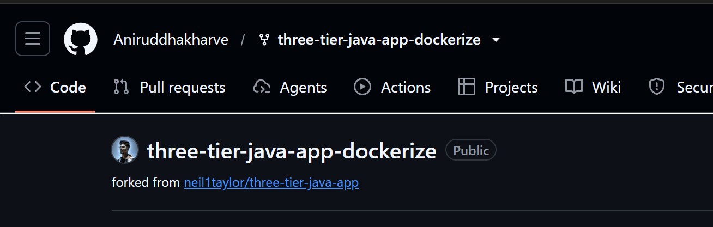

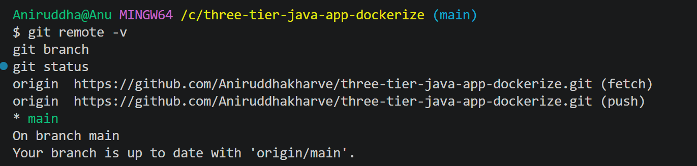

---

# 2. Project Structure

The original application is a Maven-based Java web application.

The main project structure is:

```text
three-tier-java-app-dockerize/
│
├── .git/
├── .gitignore
├── 3-tier-app.jpg
├── LICENSE
├── README.md
├── pom.xml
├── scripts/
│   ├── build.sh
│   ├── deploy.sh
│   └── verify-setup.sh
│
├── src/
│   └── main/
│       ├── java/
│       │   └── com/
│       │       └── threetier/
│       │           └── webapp/
│       │               ├── DatabaseConnection.java
│       │               ├── HealthServlet.java
│       │               ├── User.java
│       │               └── UserServlet.java
│       │
│       └── webapp/
│           ├── index.html
│           └── WEB-INF/
│               └── web.xml
│
└── target/
    └── app.war
```

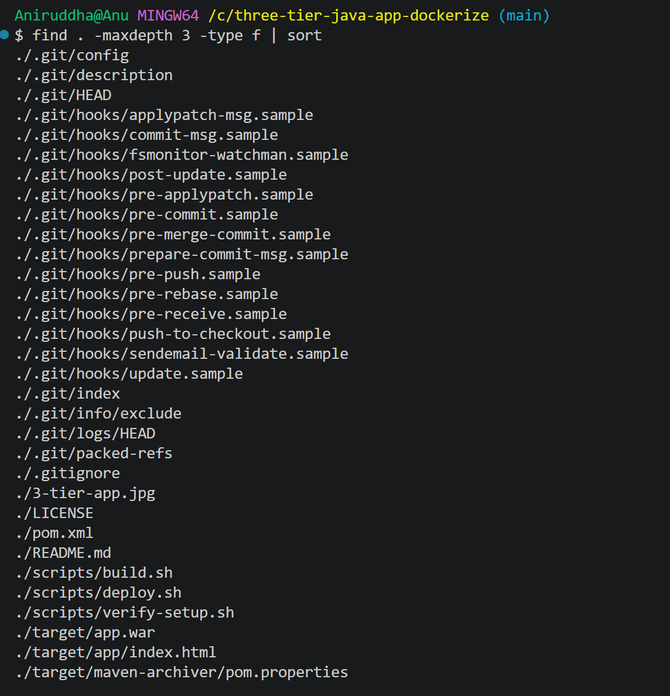

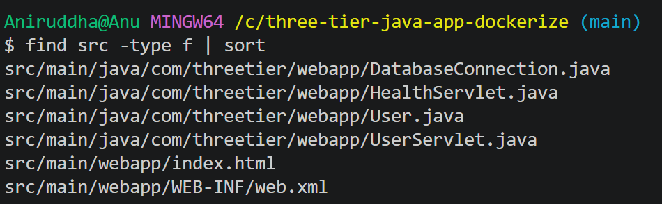

---

# 3. Three-Tier Architecture

The application follows a three-tier architecture:

```text
                    Client / Browser
                           │
                           │ HTTP
                           ▼
                ┌─────────────────────┐
                │     Web Tier        │
                │  Java Servlet App   │
                │      Tomcat 9       │
                └──────────┬──────────┘
                           │
                           │ JDBC
                           ▼
                ┌─────────────────────┐
                │  Database Tier      │
                │    PostgreSQL 15    │
                └──────────┬──────────┘
                           │
                           ▼
                  PostgreSQL Volume
```

The Java application communicates with PostgreSQL over a Docker custom bridge network.

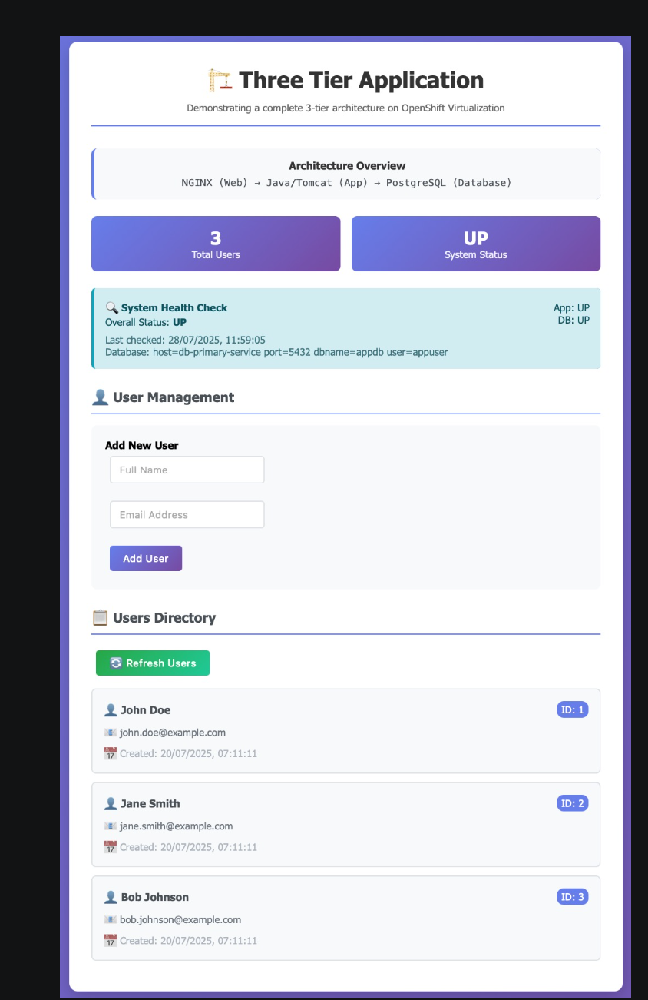

---

# 4. Application Build Verification

Before Dockerizing the application, I verified that the Java application could be built successfully using Maven.

## Maven Configuration

The application uses:

- Java 11 target
- Maven
- WAR packaging
- PostgreSQL JDBC driver
- Gson
- SLF4J
- Logback
- Servlet API

Important Maven configuration:

```xml
<packaging>war</packaging>

<properties>
    <maven.compiler.source>11</maven.compiler.source>
    <maven.compiler.target>11</maven.compiler.target>
</properties>
```

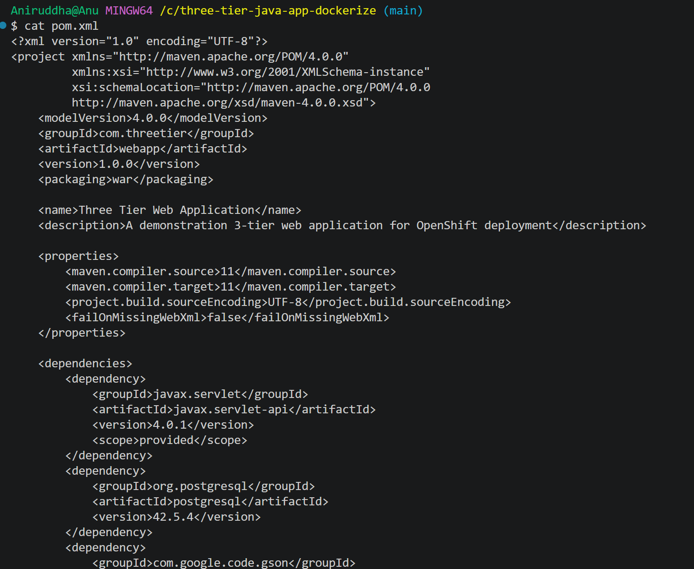

---

## Maven Build

Command:

```bash
mvn clean package
```

The build completed successfully and generated:

```text
target/app.war
```

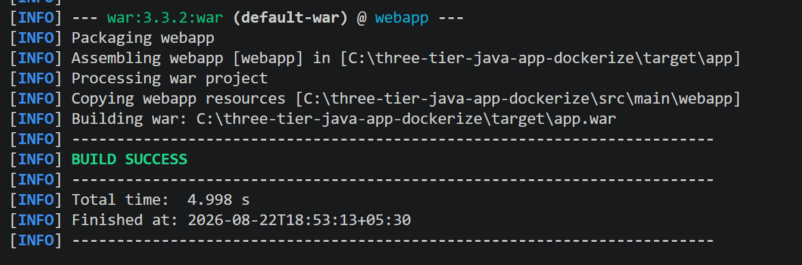

---

## WAR Verification

The generated WAR file was inspected using:

```bash
jar tf target/app.war | head -50
```

The WAR contained:

- Compiled application classes
- PostgreSQL JDBC driver
- Gson
- Logging dependencies
- `web.xml`
- Application resources

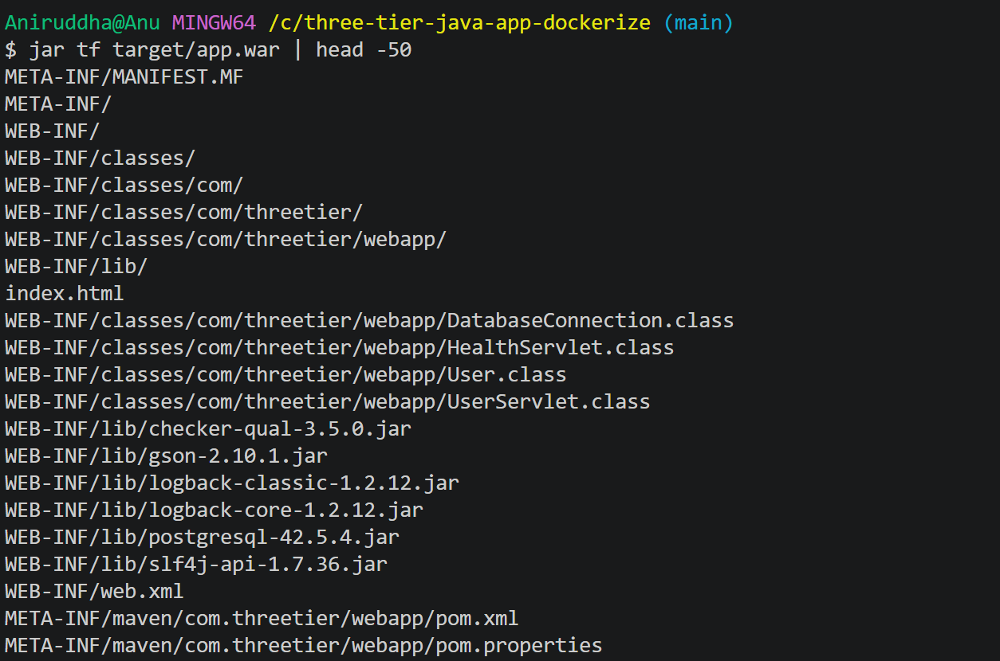

---

# 5. Initial Environment Verification

The development environment was checked before beginning the Docker implementation.

Environment:

```text
Operating System: Windows 11
Java: 21.0.10
Maven: 3.9.16
Docker: 29.6.2
Docker Compose: 5.3.1
Docker Engine: Linux / Docker Desktop
```

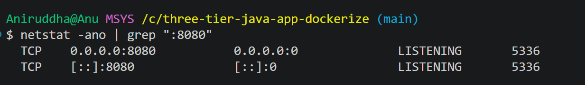

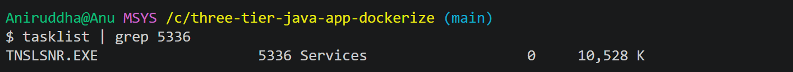

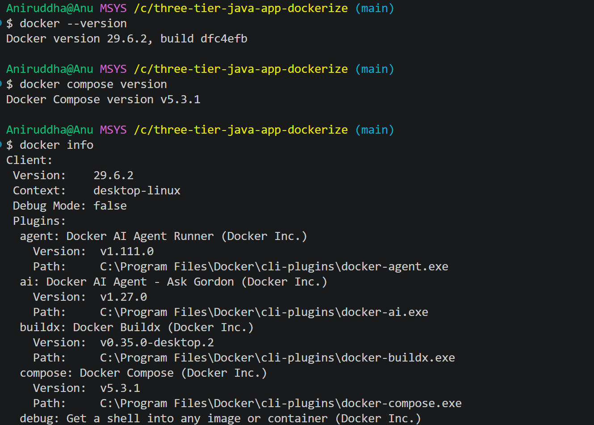

---

# 6. PostgreSQL Setup

For the database tier, PostgreSQL 15 was used.

The PostgreSQL container was configured with:

```text
POSTGRES_DB=appdb
POSTGRES_USER=appuser
POSTGRES_PASSWORD=appsecret
```

The database container was initially tested independently before integrating it with the Java application.

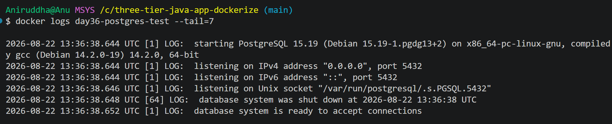

---

## Database Connection Verification

I connected directly to PostgreSQL from inside the container:

```bash
docker exec -it day36-postgres-test psql -U appuser -d appdb
```

The connection was successful.

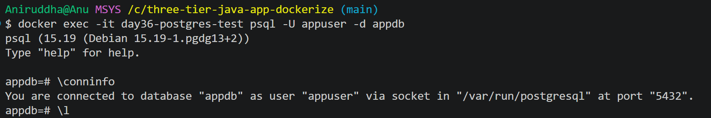

The database environment variables were also verified:

```bash
docker inspect day36-postgres-test \
  --format '{{range .Config.Env}}{{println .}}{{end}}'
```

The application database configuration was checked against the Java source.

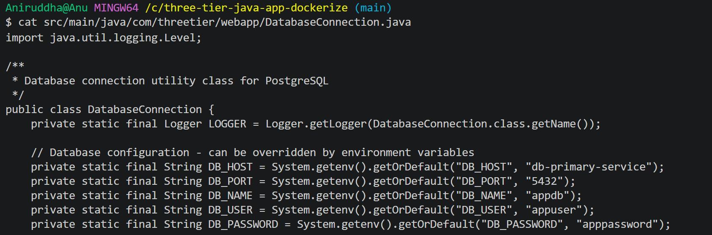

---

# 7. Docker Network

A custom Docker bridge network was created for communication between the Java application and PostgreSQL.

```text
three-tier-network
```

The network configuration included:

```text
Driver: bridge
Subnet: 172.18.0.0/16
Gateway: 172.18.0.1
```

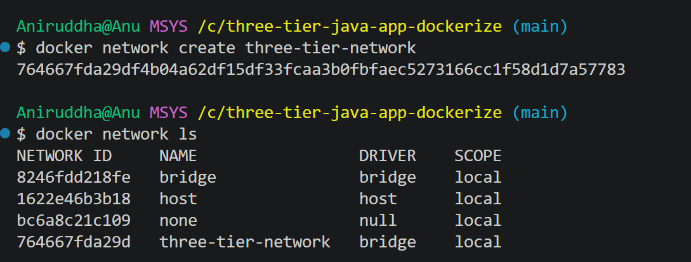

The network was inspected using:

```bash
docker network inspect three-tier-network
```

Both the PostgreSQL and Java application containers were connected to the network.

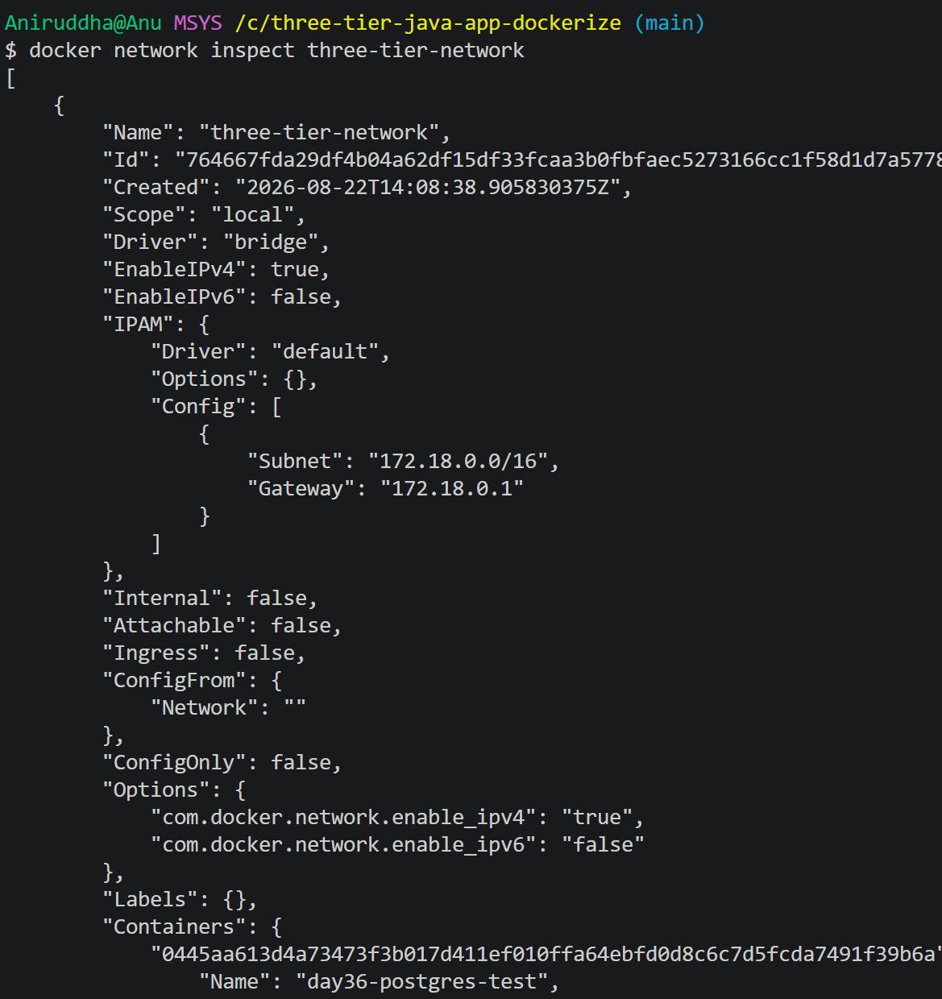

---

# 8. Initial Docker Image

The first Docker image was created using Apache Tomcat with Java 11 and the generated WAR file.

The initial image was tagged:

```text
three-tier-java-app:v1
```

The image size was approximately:

```text
208.7 MB content size
652 MB Docker disk usage
```

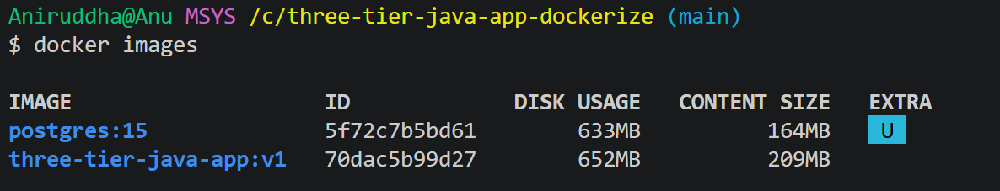

---

## Initial Container Test

The Java application container was connected to PostgreSQL through the Docker network.

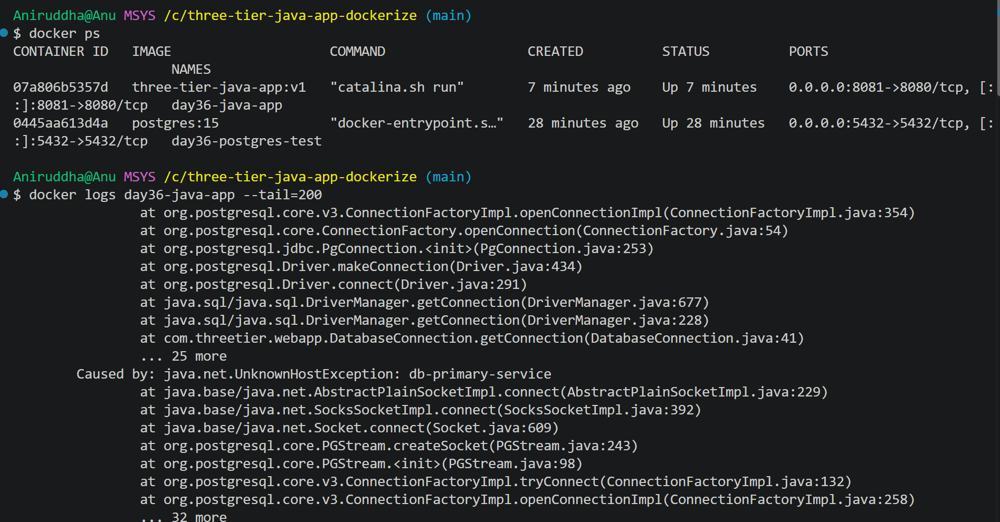

The running application was tested through the browser.

---

## Health Endpoint

```text
/health
```

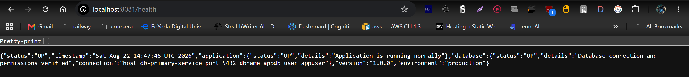

---

## Users API

```text
/api/users
```

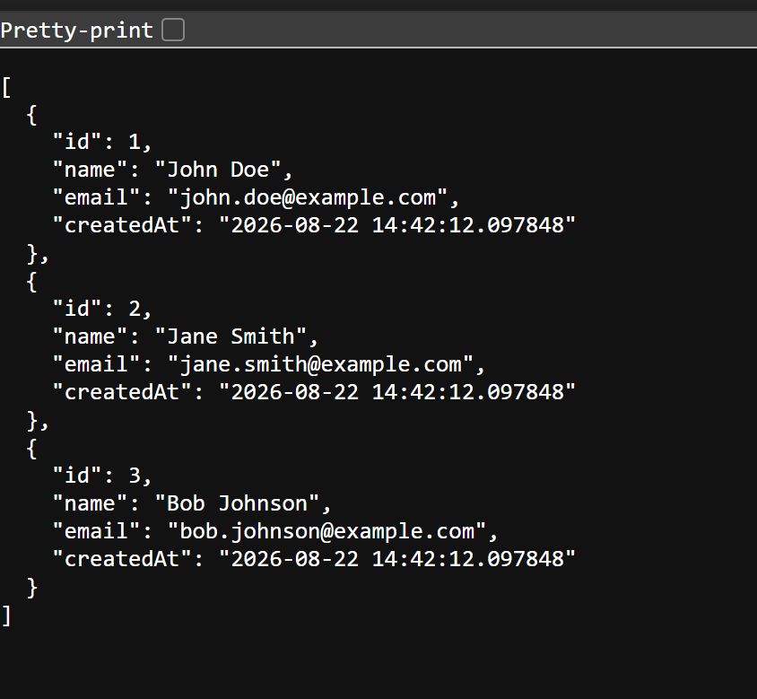

The application successfully communicated with PostgreSQL.

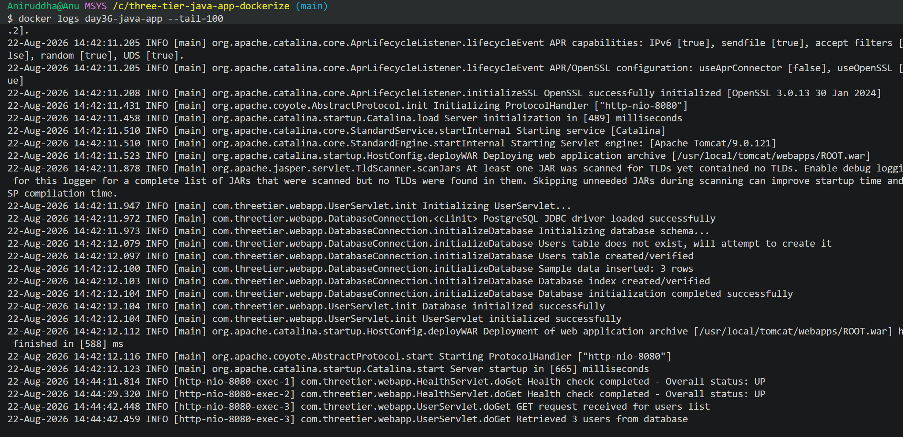

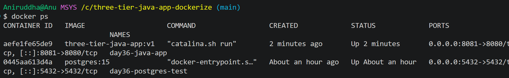

---

# 9. Multi-Stage Docker Build

The next step was to improve the Docker build process using a multi-stage Dockerfile.

The objective was to separate the:

```text
Build environment
```

from the:

```text
Runtime environment
```

The builder stage used Maven and Java 11 to compile the application and generate the WAR.

The runtime stage used Tomcat to run the WAR.

The image was tagged:

```text
three-tier-java-app:v2-multistage
```

---

## Multi-Stage Build Result

The multi-stage image still had approximately the same final size:

```text
~208.7 MB content size
~652 MB Docker disk usage
```

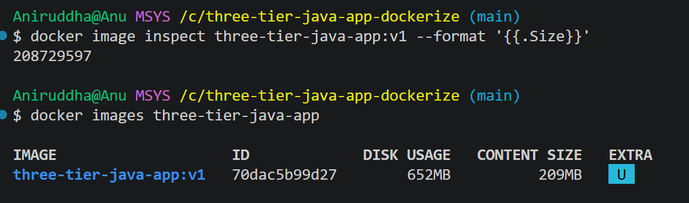

---

## Image History Comparison

The image history was inspected to understand where the image size was coming from.

```bash
docker history three-tier-java-app:v1
```

and:

```bash
docker history three-tier-java-app:v2-multistage
```

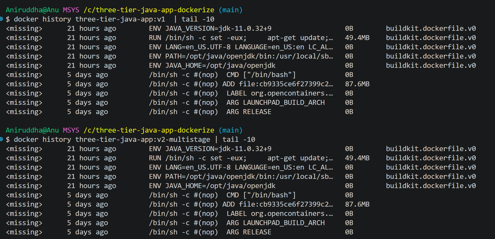

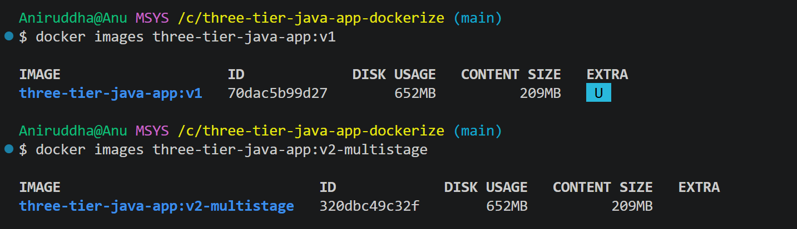

---

## Why Was the Image Still Large?

The multi-stage build successfully separated the build environment from the runtime environment.

However, the runtime image still contained a complete Java runtime.

Therefore:

```text
v1 Original
~208.7 MB
       │
       ▼
v2 Multi-stage
~208.7 MB
```

The next optimization had to target the Java runtime itself.

---

# 10. `jlink` Runtime Optimization

To further reduce the image size, I created a custom Java runtime using `jlink`.

The objective was to include only the Java modules required by Tomcat and the application.

The optimized build process became:

```text
Maven Builder
      │
      ├── Compile application
      ├── Build app.war
      │
      └── Create custom Java runtime
                     │
                     ▼
              Minimal Runtime
                     │
                     ▼
                  Tomcat
                     │
                     ▼
                  app.war
```

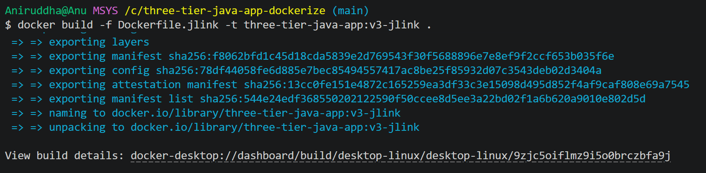

---

# 11. Troubleshooting the `jlink` Runtime

The first minimal runtime was too small for Tomcat.

Tomcat reported missing Java classes/modules, including:

```text
org/ietf/jgss/GSSException
```

and later runtime module requirements.

The errors were analyzed through the container logs.

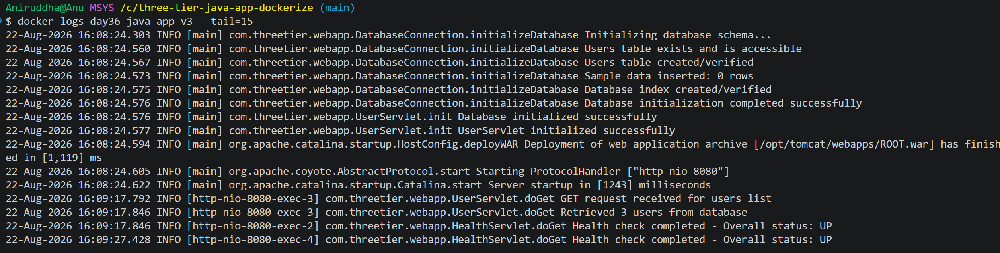

The required Java modules were added to the custom runtime.

After adjusting the `jlink` configuration, Tomcat successfully started.

---

# 12. Optimized `v3-jlink` Image

The final optimized image was tagged:

```text
three-tier-java-app:v3-jlink
```

The image size was approximately:

```text
81.3 MB content size
252 MB Docker disk usage
```

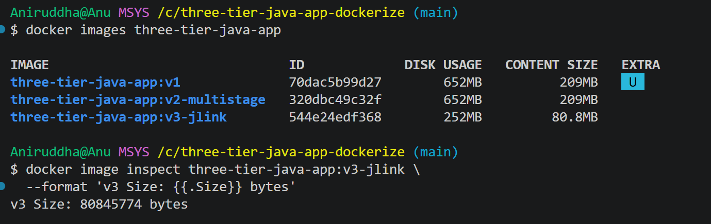

The final optimization was verified using Docker image inspection.

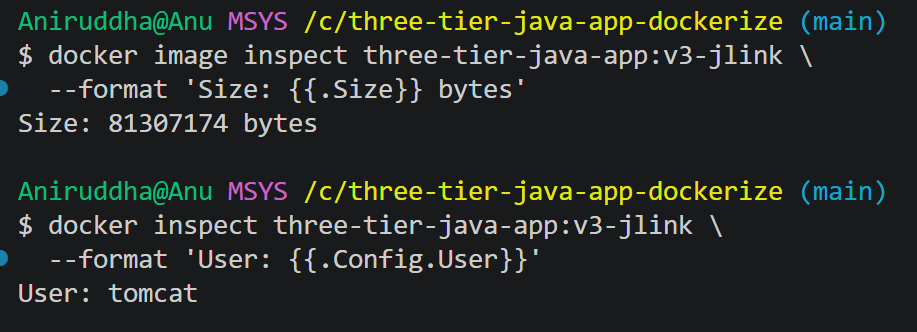

---

# 13. Image Optimization Results

The final comparison was:

| Image | Content Size | Docker Disk Usage |
|---|---:|---:|
| `v1` Original | ~208.7 MB | ~652 MB |
| `v2-multistage` | ~208.7 MB | ~652 MB |
| `v3-jlink` | ~81.3 MB | ~252 MB |

The final optimized image was approximately:

```text
81,307,174 bytes
```

compared with the original:

```text
208,729,597 bytes
```

This represents approximately a **61% reduction in image content size**.

---

# 14. Non-Root Runtime

The final optimized image was configured to run as the non-root user:

```text
tomcat
```

The configuration was verified using:

```bash
docker inspect three-tier-java-app:v3-jlink \
  --format 'User: {{.Config.User}}'
```

Expected result:

```text
User: tomcat
```

This improves container security by avoiding root execution.


---

# 15. Testing the Optimized Image

The optimized `v3-jlink` image was tested independently.

The container successfully started Tomcat and deployed the WAR application.

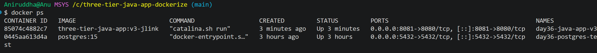

The application logs were checked to confirm successful startup.


---

## Health Endpoint

The optimized application was tested through:

```text
http://localhost:8081/health
```

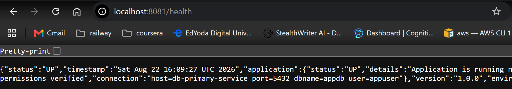

---

## Users API

The users API was tested through:

```text
http://localhost:8081/api/users
```

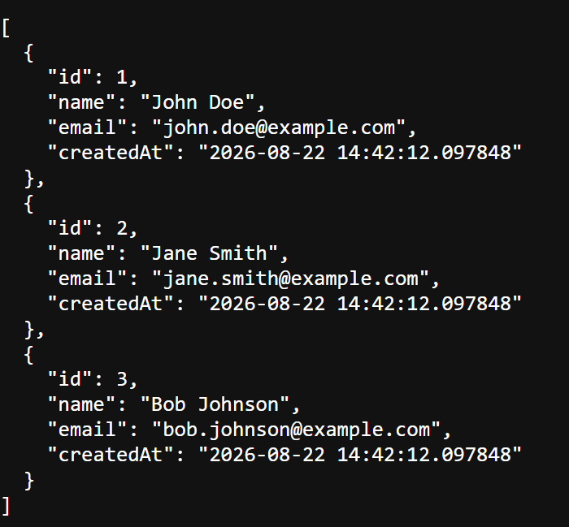

The optimized image successfully served the application.

---

# 16. Docker Compose

After verifying the optimized image, Docker Compose was introduced to manage the complete application stack.

The stack contains:

```text
Java Application
       │
       ▼
PostgreSQL
       │
       ▼
Named Volume
```

Both services communicate through:

```text
three-tier-network
```

The Compose configuration was tested with both:

```yaml
build:
  context: .
  dockerfile: Dockerfile.jlink
```

and the final Docker Hub image approach:

```yaml
image: aniruddhakharve/three-tier-java-app:v3-jlink
```

---

# 17. Compose Configuration

The application service can be built directly from the optimized Dockerfile:

```yaml
app:
  build:
    context: .
    dockerfile: Dockerfile.jlink
```

The PostgreSQL service uses:

```yaml
image: postgres:15
```

A named volume is used for database persistence.

The application waits for PostgreSQL to become healthy before starting.

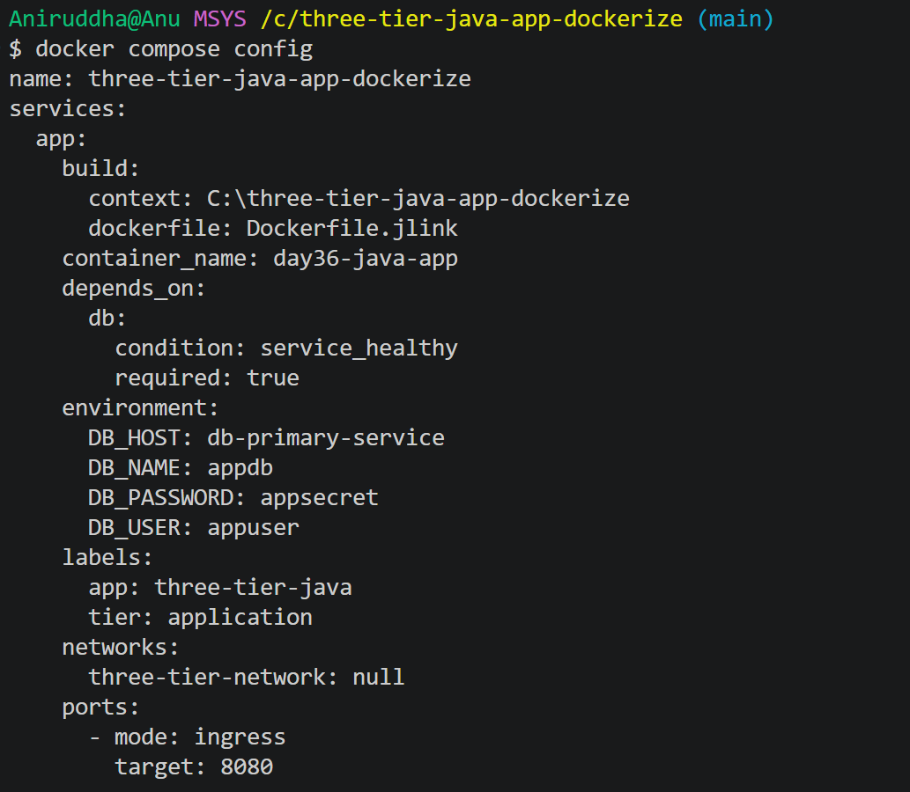

---

# 18. Compose Services

The complete stack was started using:

```bash
docker compose up -d
```

The running services were checked using:

```bash
docker compose ps
```

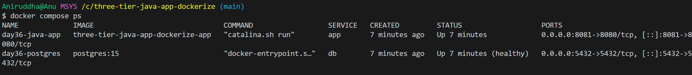

---

# 19. PostgreSQL Healthcheck

The PostgreSQL service uses a healthcheck based on `pg_isready`.

Example:

```yaml
healthcheck:
  test:
    ["CMD-SHELL", "pg_isready -U ${POSTGRES_USER} -d ${POSTGRES_DB}"]
  interval: 10s
  timeout: 5s
  retries: 5
  start_period: 10s
```

This ensures that the application does not attempt to connect to PostgreSQL before the database is ready.

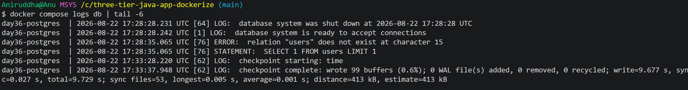

---

# 20. Application Logs

The application logs were checked using:

```bash
docker compose logs app
```

The application successfully started and connected to PostgreSQL.

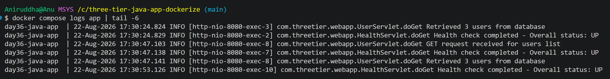

---

# 21. Compose Application Verification

The application was tested after starting the complete Compose stack.

## Health Endpoint

```text
http://localhost:8081/health
```

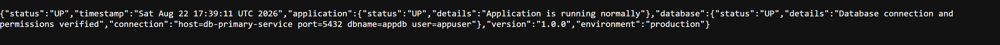

## Users API

```text
http://localhost:8081/api/users
```

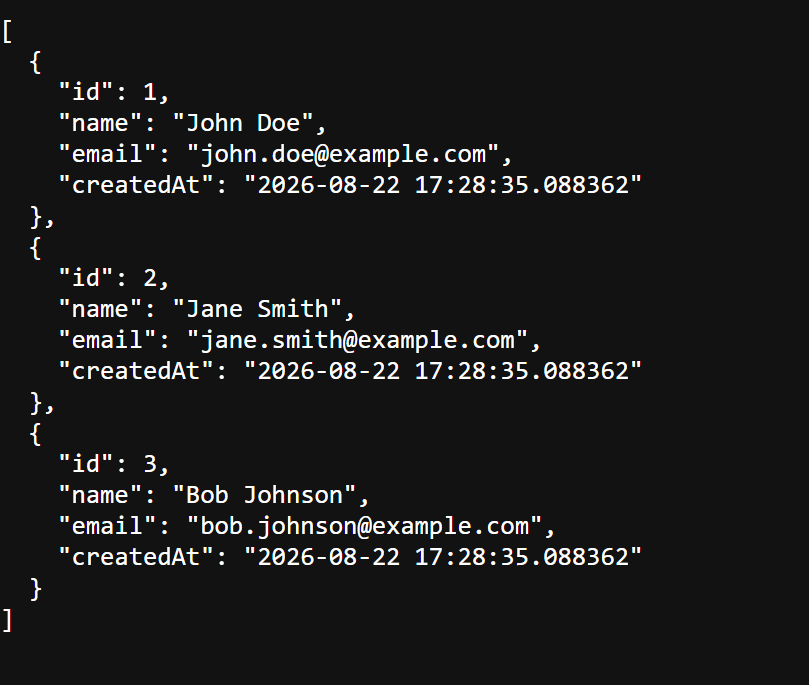

---

# 22. Named Volume

A named Docker volume was used to persist PostgreSQL data.

The volume was inspected to verify that database data was stored outside the lifecycle of the PostgreSQL container.

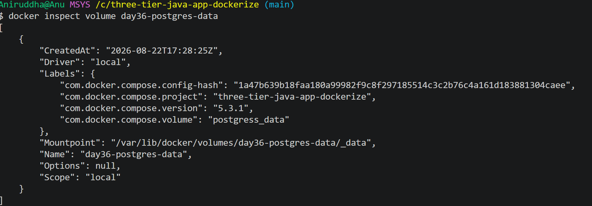

---

# 23. Database Persistence Test

The Compose stack was stopped using:

```bash
docker compose down
```

The containers were removed while the named volume was preserved.

The application was then started again:

```bash
docker compose up -d
```

The PostgreSQL data remained available.

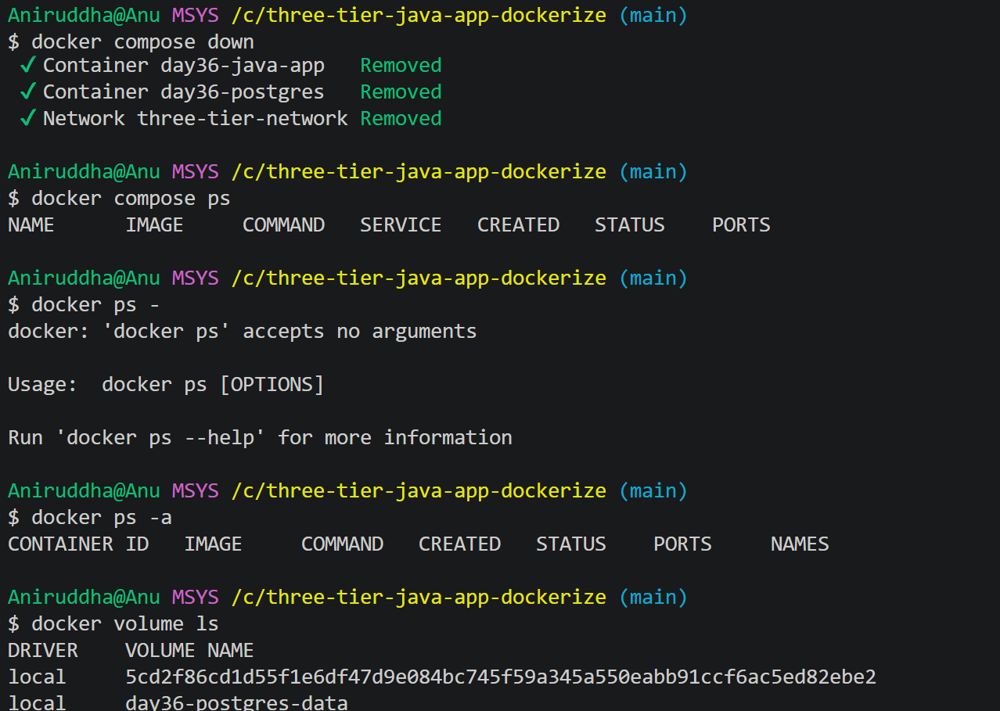

The application was also verified again from the browser.

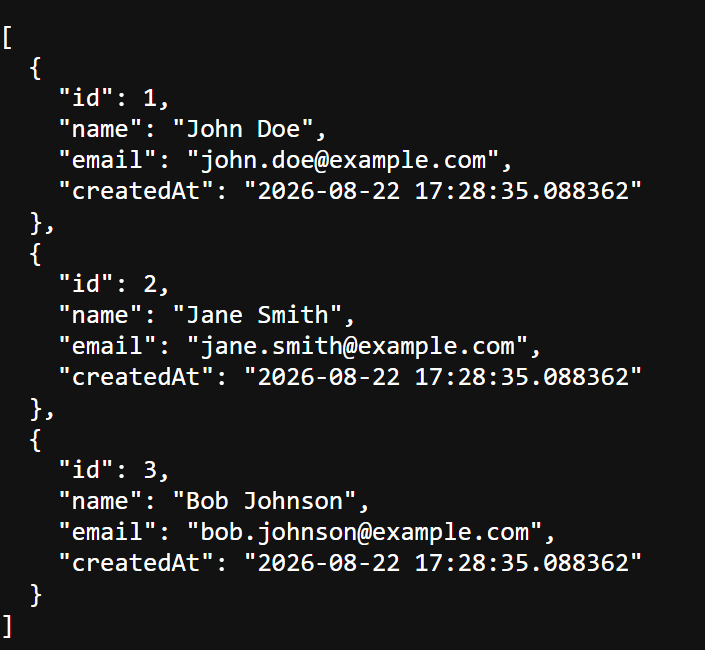

This demonstrated:

```text
Container removed
       │
       ▼
Named volume preserved
       │
       ▼
Container recreated
       │
       ▼
Database data preserved
```

---

# 24. Docker Hub

After the optimized image was verified locally, it was tagged and pushed to Docker Hub.

Docker Hub repository:

```text
aniruddhakharve/three-tier-java-app
```

Published tags:

```text
v3-jlink
latest
```

---

# 25. Docker Hub Pull Test

To prove that the application could be deployed from the registry rather than relying on the locally built image, the optimized image was removed locally and pulled again from Docker Hub.

Command:

```bash
docker pull aniruddhakharve/three-tier-java-app:v3-jlink
```

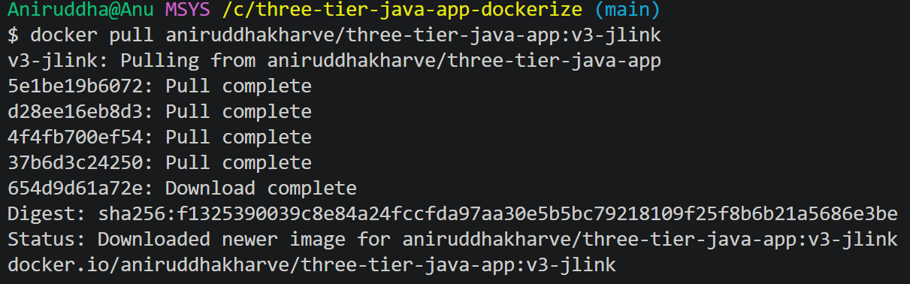

This confirmed that the optimized image was successfully available from Docker Hub.

---

# 26. Docker Hub Deployment

The final Compose configuration was changed from building locally to using the Docker Hub image:

```yaml
app:
  image: aniruddhakharve/three-tier-java-app:v3-jlink
```

The stack was started using:

```bash
docker compose up -d
```

The application successfully started using the Docker Hub image.

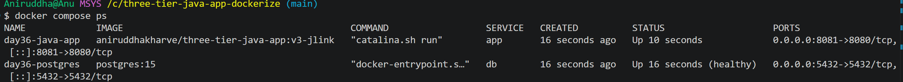

---

# 27. Final Docker Hub Application Test

After pulling the image from Docker Hub, the application was tested again.

## Health Endpoint

```text
http://localhost:8081/health
```

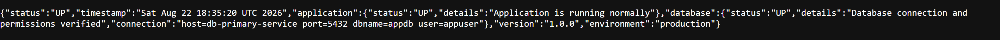

## Users API

```text
http://localhost:8081/api/users
```

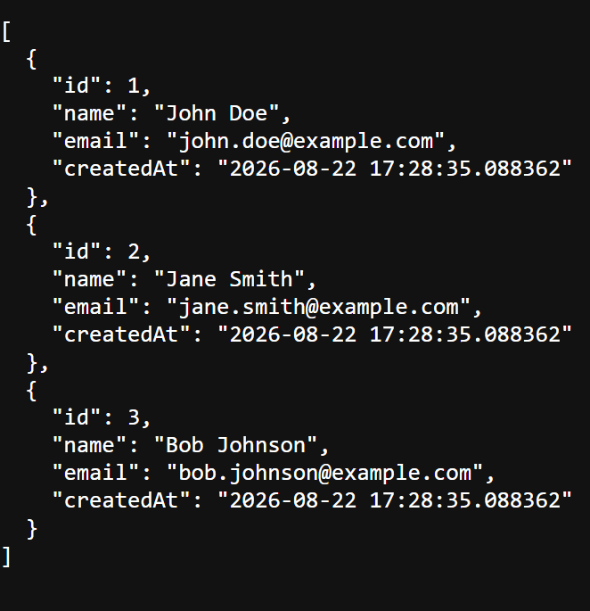

The application continued to work successfully after being deployed from the Docker Hub image.

---

# 28. Deployment Script

The project contains deployment-related scripts:

```text
scripts/
├── build.sh
├── deploy.sh
└── verify-setup.sh
```

The deployment script was reviewed as part of the project.

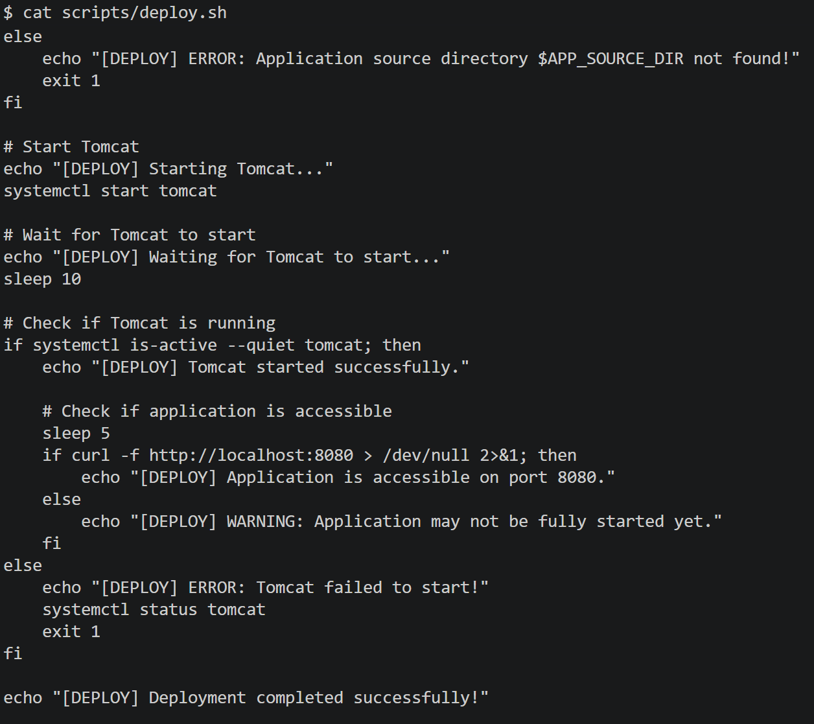

---

# 29. Additional Application Verification

Additional application logs were captured during the final testing.

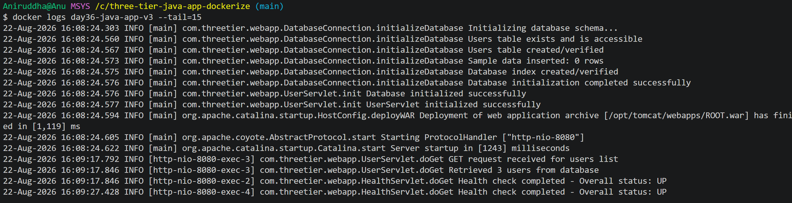

The final application was also verified through the browser.

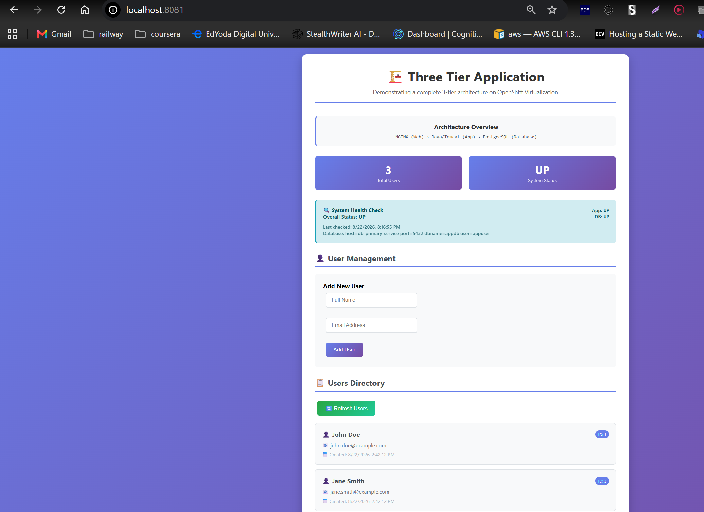

---

# 30. Final Architecture

The completed Dockerized architecture is:

```text
                         ┌─────────────────────┐
                         │      Browser        │
                         │   localhost:8081    │
                         └──────────┬──────────┘
                                    │
                                    ▼
                     ┌──────────────────────────┐
                     │     Java Web App         │
                     │                          │
                     │  Tomcat 9                │
                     │  Java 11 jlink runtime   │
                     │  app.war                 │
                     │  Non-root: tomcat        │
                     └────────────┬─────────────┘
                                  │
                                  │ JDBC
                                  ▼
                    ┌────────────────────────────┐
                    │      Docker Network        │
                    │    three-tier-network      │
                    └─────────────┬──────────────┘
                                  │
                                  ▼
                     ┌──────────────────────────┐
                     │      PostgreSQL 15       │
                     │                          │
                     │ DB: appdb                │
                     │ User: appuser            │
                     └────────────┬─────────────┘
                                  │
                                  ▼
                     ┌──────────────────────────┐
                     │    Named Docker Volume   │
                     │   PostgreSQL Data        │
                     └──────────────────────────┘
```

---

# 31. Final Dockerfile Optimization

The final Dockerfile uses a multi-stage build.

## Stage 1 – Builder

The builder stage:

- Uses Maven
- Downloads dependencies
- Compiles the Java application
- Creates the WAR
- Creates the custom Java runtime using `jlink`

## Stage 2 – Runtime

The runtime stage:

- Uses a minimal base image
- Uses the custom Java runtime
- Installs Tomcat
- Copies only the final WAR
- Removes unnecessary Tomcat applications
- Runs Tomcat as the non-root `tomcat` user

The resulting structure is:

```text
                 Builder Stage
             ┌───────────────────┐
             │ Maven + JDK 11    │
             │                   │
             │ Source Code       │
             │       ↓           │
             │    app.war        │
             │       +           │
             │  jlink runtime    │
             └─────────┬─────────┘
                       │
                       │ COPY --from=builder
                       ▼
             ┌───────────────────┐
             │ Runtime Stage     │
             │                   │
             │ Minimal Base      │
             │ Custom Java       │
             │ Tomcat            │
             │ app.war            │
             │                   │
             │ USER tomcat       │
             └───────────────────┘
```

---

# 32. Challenges Faced

## Challenge 1 – Multi-stage build did not reduce the image size

The first multi-stage build still produced an image around 209 MB.

### Solution

I inspected the image history and identified that the runtime still contained a full Java runtime.

I then used `jlink` to create a custom Java runtime containing only the required modules.

---

## Challenge 2 – Missing Java modules

The first `jlink` runtime was too minimal for Tomcat.

Tomcat reported errors such as:

```text
org/ietf/jgss/GSSException
```

### Solution

I analyzed the runtime errors and added the required Java modules.

After adjusting the runtime configuration, Tomcat successfully started and deployed the application.

---

## Challenge 3 – Docker Compose network ownership

A manually created `three-tier-network` conflicted with the Compose-managed network because it did not have the expected Compose labels.

### Solution

The network was recreated under Docker Compose management so that Compose could correctly manage its network lifecycle.

---

## Challenge 4 – Build versus Docker Hub image

During the project, I tested both approaches.

### Build directly from Dockerfile

```yaml
app:
  build:
    context: .
    dockerfile: Dockerfile.jlink
```

### Run the image from Docker Hub

```yaml
app:
  image: aniruddhakharve/three-tier-java-app:v3-jlink
```

Both approaches were successfully tested.

---

# 33. Final Results

| Feature | Status |
|---|---|
| Java application | ✅ |
| Maven build | ✅ |
| WAR packaging | ✅ |
| Tomcat | ✅ |
| PostgreSQL | ✅ |
| Docker image | ✅ |
| Multi-stage Dockerfile | ✅ |
| `jlink` optimization | ✅ |
| Non-root container | ✅ |
| Custom Docker network | ✅ |
| Docker Compose | ✅ |
| Database healthcheck | ✅ |
| `depends_on` | ✅ |
| Named volume | ✅ |
| Database persistence | ✅ |
| Environment variables | ✅ |
| Docker Hub | ✅ |
| Fresh image pull | ✅ |
| Browser health test | ✅ |
| Users API test | ✅ |

---

# 34. Image Size Comparison

The final image optimization was:

```text
Original v1
~208.7 MB
     │
     │ Multi-stage build
     ▼
v2-multistage
~208.7 MB
     │
     │ jlink custom Java runtime
     ▼
v3-jlink
~81.3 MB
```

Final reduction:

```text
~208.7 MB → ~81.3 MB
```

Approximately:

```text
61% reduction in image content size
```

The final optimized image also runs as:

```text
USER tomcat
```

---

# 35. Docker Hub Images

The final Docker Hub repository contains:

```text
aniruddhakharve/three-tier-java-app
```

Published tags:

```text
v3-jlink
latest
```

The `v3-jlink` image represents the optimized production-style image using:

- Multi-stage build
- Custom `jlink` Java runtime
- Tomcat
- Non-root execution

---

# 36. Key Docker Commands Practiced

```bash
docker build
docker run
docker ps
docker ps -a
docker logs
docker exec
docker inspect
docker images
docker history

docker network create
docker network inspect
docker network rm

docker volume ls
docker volume inspect

docker compose config
docker compose up
docker compose down
docker compose ps
docker compose logs
docker compose exec
docker compose build

docker tag
docker push
docker pull
```

---

# 37. What I Learned

This project demonstrated that Dockerizing an application is more than simply writing:

```dockerfile
FROM tomcat
COPY app.war .
```

A production-oriented Docker setup requires understanding:

- Build versus runtime environments
- Multi-stage builds
- Image layers
- Runtime dependencies
- Java runtime modules
- `jlink`
- Container security
- Non-root execution
- Container networking
- Database persistence
- Healthchecks
- Service dependencies
- Environment variables
- Docker Compose
- Image versioning
- Docker Hub
- Reproducible deployment

The biggest lesson from this project was that **multi-stage builds alone do not automatically make an image small**.

The runtime image itself must also be optimized.

Using `jlink`, I created a custom Java runtime containing only the required modules, reducing the final image from approximately **209 MB to 81 MB**.

---

# 38. Final Day-36 Outcome

The final application can now be deployed using Docker Compose and an optimized Docker image stored on Docker Hub.

The final workflow is:

```text
GitHub Source
      │
      ▼
Maven Build
      │
      ▼
Multi-stage Docker Build
      │
      ▼
jlink Custom Java Runtime
      │
      ▼
~81 MB Non-root Image
      │
      ▼
Docker Hub
      │
      ▼
docker pull
      │
      ▼
Docker Compose
      │
      ├────────────────┐
      ▼                ▼
 Java App         PostgreSQL
      │                │
      │                ▼
      │          Named Volume
      │
      └──── Custom Network ────┘
                 │
                 ▼
            Browser/API
```

---

# 39. Project Separation

The complete project was intentionally kept in a dedicated GitHub repository rather than duplicating the entire Java application inside the 90 Days of DevOps repository.

The repositories have different purposes:

```text
90DaysOfDevOps-shubham-londe
│
└── 2026/day-36/
    ├── day-36-docker-project.md
    └── screenshots/
        └── Day-36 screenshots
```

The dedicated project repository contains:

```text
three-tier-java-app-dockerize
│
├── Dockerfile
├── Dockerfile.multistage
├── Dockerfile.jlink
├── docker-compose.yml
├── pom.xml
├── src/
├── scripts/
└── README.md
```

This avoids duplicating the complete application while keeping the Day-36 challenge documentation organized.

---

# 40. Final Project Links

## GitHub Project

**Three-Tier Java App Dockerization**

`Aniruddhakharve/three-tier-java-app-dockerize`

## Docker Hub

**Three-Tier Java App Image**

`aniruddhakharve/three-tier-java-app`

Published:

```text
v3-jlink
latest
```

---

# 41. Day-36 Completion

Day 36 was completed by taking a real three-tier Java application and transforming it into a Dockerized application with:

```text
Java + Maven
     ↓
WAR
     ↓
Tomcat
     ↓
Multi-stage Docker Build
     ↓
jlink Optimization
     ↓
~81 MB Image
     ↓
Non-root Container
     ↓
PostgreSQL
     ↓
Custom Docker Network
     ↓
Docker Compose
     ↓
Healthcheck
     ↓
Named Volume
     ↓
Persistence
     ↓
Docker Hub
     ↓
Fresh Pull
     ↓
Successful Deployment
```

**Day 36 completed successfully. 🚀**

---

# Learn in Public

I Dockerized a real three-tier Java application, optimized the image from approximately 209 MB to approximately 81 MB using a custom `jlink` Java runtime, configured PostgreSQL persistence and Docker Compose, and published the final image to Docker Hub.

`#90DaysOfDevOps` `#DevOpsKaJosh` `#TrainWithShubham` `#Docker` `#Java` `#DevOps`
