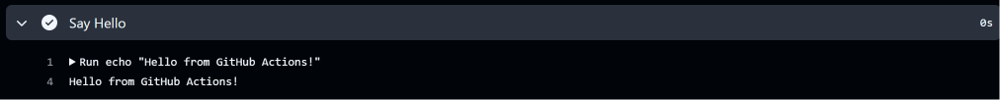
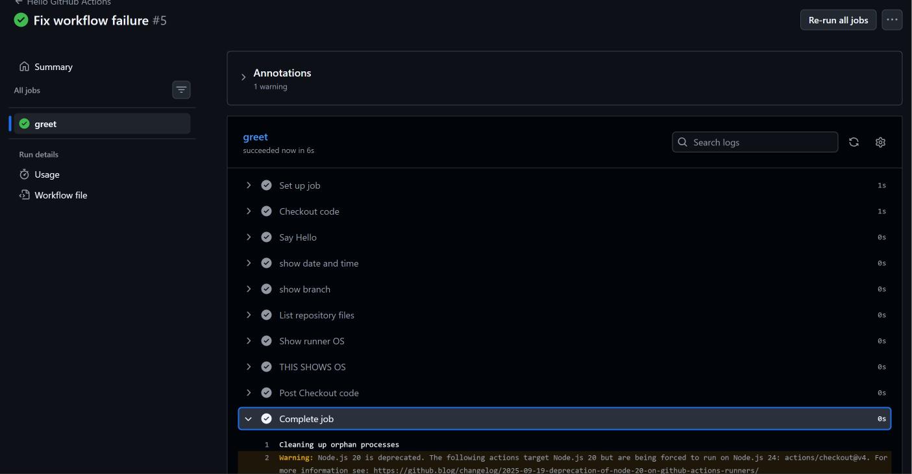

# Day 40 – Your First GitHub Actions Workflow

## Overview

Today I created and executed my first **GitHub Actions CI workflow**.

The goal was to understand how a GitHub Actions workflow is structured, how a runner executes jobs and steps, how GitHub-provided variables can be used, and what happens when a workflow fails.

---

## 1. Repository Setup

Created a public GitHub repository:

```text
github-actions-practice
```

Created the workflow directory:

```text
.github/
└── workflows/
    └── hello.yml
```

GitHub Actions automatically detects workflow files placed inside:

```text
.github/workflows/
```

---

## 2. First GitHub Actions Workflow

Created `.github/workflows/hello.yml`.

```yaml
name: Hello GitHub Actions

on:
  push:

jobs:
  greet:
    runs-on: ubuntu-latest

    steps:
      - name: Checkout code
        uses: actions/checkout@v4

      - name: Say Hello
        run: echo "Hello from GitHub Actions!"

      - name: Show date and time
        run: date

      - name: Show branch
        run: echo "Branch: ${{ github.ref_name }}"

      - name: List repository files
        run: ls -la

      - name: Show runner OS
        run: echo "Runner OS: ${{ runner.os }}"
```

### What this workflow does

Whenever I push code to the repository:

```text
git push
      ↓
GitHub detects push
      ↓
Workflow starts
```

The workflow then:

1. Starts an Ubuntu runner.
2. Checks out the repository code.
3. Prints a message.
4. Prints the current date and time.
5. Prints the branch that triggered the workflow.
6. Lists files in the repository.
7. Prints the runner operating system.

---

## 3. GitHub Actions Workflow Anatomy

### `name:`

```yaml
name: Hello GitHub Actions
```

Defines the name of the workflow shown in the GitHub Actions UI.

### `on:`

```yaml
on:
  push:
```

Defines the event that triggers the workflow.

Here, the workflow runs whenever a `push` occurs in the repository.

### `jobs:`

```yaml
jobs:
  greet:
```

Defines the jobs that the workflow will execute.

Here there is one job:

```text
greet
```

### `runs-on:`

```yaml
runs-on: ubuntu-latest
```

Defines the machine/runner environment where the job will execute.

In this workflow, GitHub provides an Ubuntu runner.

### `steps:`

```yaml
steps:
```

Contains the individual actions/commands that the job performs.

A job can contain multiple steps.

### `uses:`

```yaml
uses: actions/checkout@v4
```

Uses an existing GitHub Action instead of writing the complete implementation ourselves.

`actions/checkout` checks out the repository code onto the GitHub Actions runner.

### `run:`

```yaml
run: echo "Hello from GitHub Actions!"
```

Executes a shell command on the runner.

For example:

```yaml
run: date
```

executes the Linux `date` command.

### Step `name:`

```yaml
- name: Say Hello
```

Provides a readable name for the step.

The name appears in the GitHub Actions job logs.

---

## 4. GitHub Actions Variables

I also used GitHub Actions built-in variables.

### Branch name

```yaml
${{ github.ref_name }}
```

This gives the name of the branch that triggered the workflow.

Example:

```text
Branch: main
```

### Runner operating system

```yaml
${{ runner.os }}
```

This provides information about the operating system of the runner.

Example:

```text
Runner OS: Linux
```

---

## 5. Successful Workflow Run

The first workflow successfully executed and printed:

```text
Hello from GitHub Actions!
```



---

## 6. Workflow With Additional Steps

After the basic workflow worked, I added additional steps to inspect the GitHub Actions environment.

The job successfully executed:

- Checkout code
- Say Hello
- Show date and time
- Show branch
- List repository files
- Show runner OS
- Additional test/fix step



The GitHub Actions interface showed the `greet` job as successful.

---

## 7. Breaking the Workflow Intentionally

To understand pipeline failures, I intentionally added a command that returned a non-zero exit status.

Example:

```yaml
- name: Test failure
  run: exit 1
```

The command:

```bash
exit 1
```

indicates that the command failed.

This causes the GitHub Actions step to fail, which causes the job/workflow to be marked as failed.

### What I learned from the failure

A failed pipeline is not necessarily a problem with GitHub Actions.

It can be useful because CI/CD detects problems automatically.

The general debugging process is:

```text
Workflow fails
      ↓
Open GitHub Actions
      ↓
Open failed job
      ↓
Find failed step
      ↓
Read the error/log output
      ↓
Fix the problem
      ↓
Push the fix
      ↓
Workflow runs again
```

After fixing the workflow, I pushed the changes again and verified that the workflow became successful.

---

## 8. Important Concept – Runner

The workflow does not execute directly on my laptop.

GitHub Actions provides a **runner** to execute the job.

In this workflow:

```yaml
runs-on: ubuntu-latest
```

GitHub provisions an Ubuntu environment for the job.

The basic flow is:

```text
My Computer
     │
     │ git push
     ▼
GitHub Repository
     │
     ▼
GitHub Actions
     │
     ▼
Ubuntu Runner
     │
     ├── Checkout repository
     ├── Run commands
     ├── Run actions
     └── Generate logs
```

---

## 9. What I Learned

### 1. Workflow

A GitHub Actions workflow is defined using a YAML file inside:

```text
.github/workflows/
```

It describes when automation should run and what it should do.

### 2. Job and Steps

A workflow contains jobs, and jobs contain steps.

```text
Workflow
   └── Job
        ├── Step
        ├── Step
        └── Step
```

### 3. Runner

The job is executed on a runner.

For this practical:

```yaml
runs-on: ubuntu-latest
```

means the job runs on a GitHub-hosted Ubuntu environment.

---

## 10. CI/CD Connection

This was my first practical step toward CI/CD.

The workflow already demonstrates the basic idea:

```text
Developer
   │
   │ Push code
   ▼
GitHub
   │
   ▼
GitHub Actions
   │
   ▼
Runner
   │
   ├── Checkout
   ├── Test/Commands
   └── Validation
   │
   ▼
Success / Failure
```

Later, these simple steps can be expanded into a real CI/CD pipeline containing stages such as:

```text
Code Push
   ↓
Build
   ↓
Test
   ↓
Docker Build
   ↓
Push Image
   ↓
Deploy
```

---

## 11. Day 40 Summary

Today I:

- Created my first GitHub Actions workflow.
- Learned the structure of a workflow YAML file.
- Used the `push` trigger.
- Created a `greet` job.
- Used an `ubuntu-latest` runner.
- Used `actions/checkout@v4`.
- Executed shell commands using `run:`.
- Used GitHub Actions variables.
- Viewed workflow logs.
- Intentionally broke a workflow.
- Read the failure and fixed it.
- Verified the final workflow successfully completed.

**Day 40 completed successfully. 🚀**
