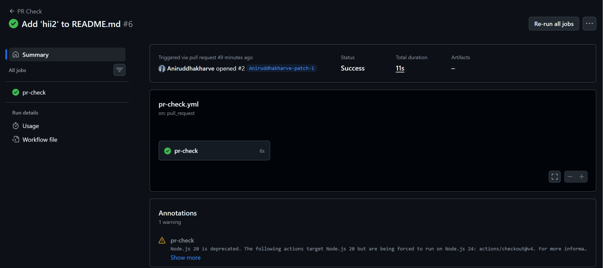
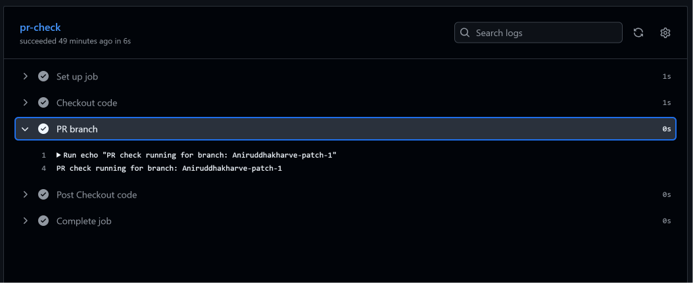
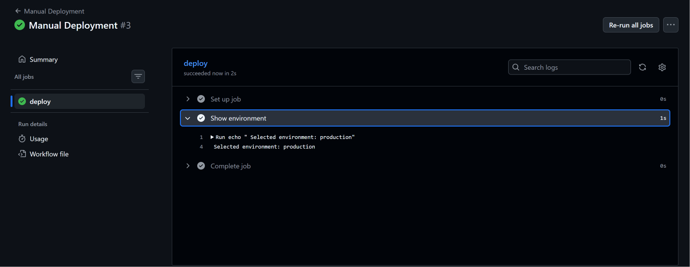
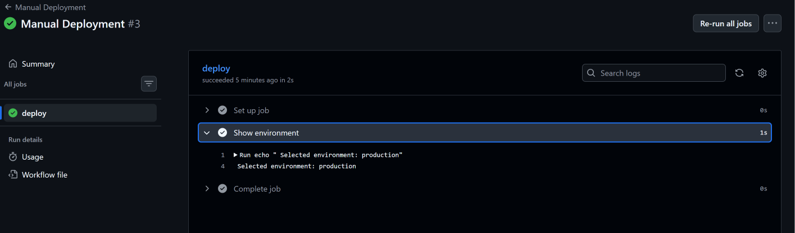
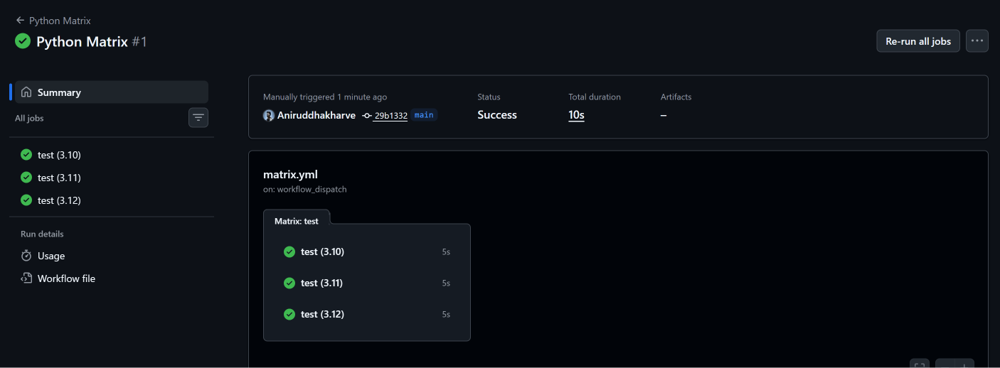
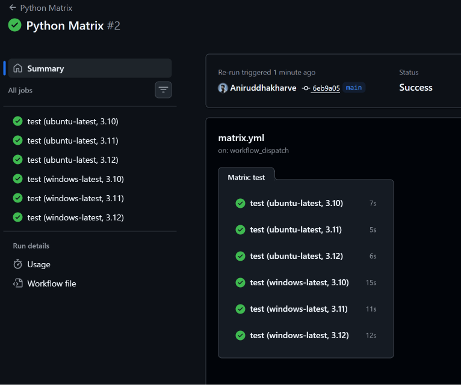
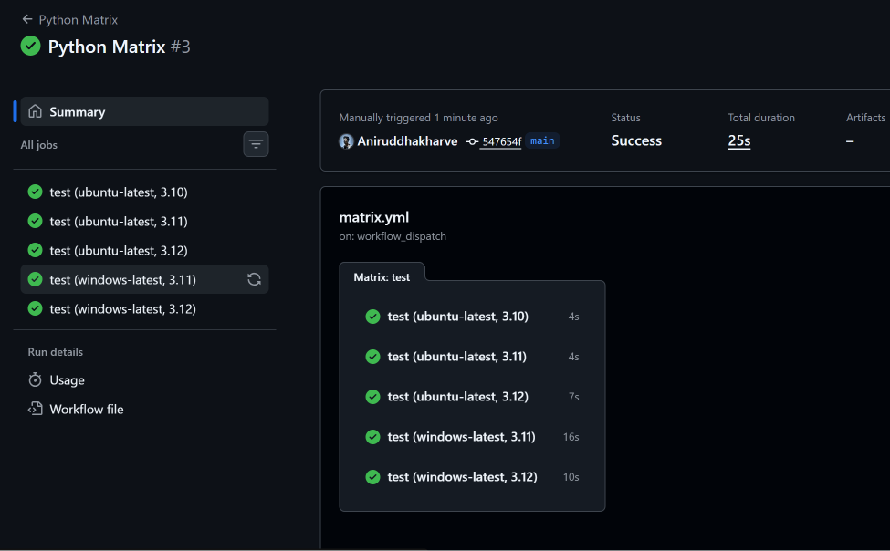
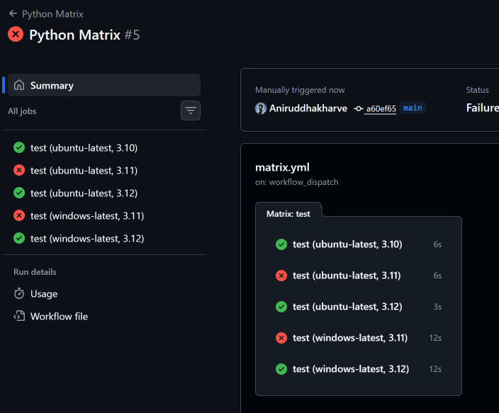
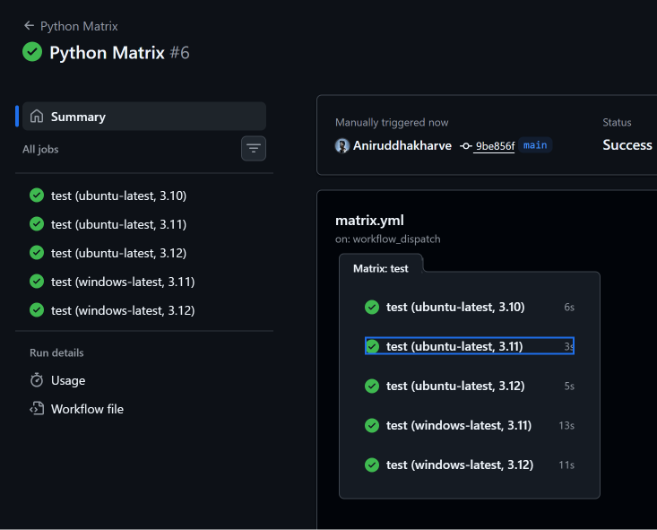

# Day 41 – GitHub Actions Triggers & Matrix Builds

## Overview

Day 41 focused on understanding **when a GitHub Actions workflow runs** and how the same job can be executed across multiple environments using **matrix builds**.

In Day 40, I created my first GitHub Actions workflow using a `push` trigger. In this exercise, I expanded that knowledge by working with:

- Pull Request triggers
- Scheduled triggers using cron
- Manual workflow triggers
- Workflow inputs
- Matrix strategies
- Multiple operating systems and Python versions
- Matrix exclusions
- `fail-fast`
- Intentional workflow failures

All practical tasks were performed in my `github-actions-practice` repository and verified from the GitHub Actions UI.

---

# 1. Pull Request Trigger

## Workflow

File:

```text
.github/workflows/pr-check.yml
```

```yaml
name: PR Check

on:
  pull_request:
    branches:
      - main
    types:
      - opened
      - synchronize

jobs:
  pr-check:
    runs-on: ubuntu-latest

    steps:
      - name: Checkout code
        uses: actions/checkout@v4

      - name: PR branch
        run: echo "PR check running for branch: ${{ github.head_ref }}"
```

## What I Learned

The `pull_request` trigger allows a workflow to run when activity happens on a Pull Request.

I used:

```yaml
types:
  - opened
  - synchronize
```

`opened` runs the workflow when a Pull Request is created.

`synchronize` runs the workflow when new commits are pushed to the Pull Request branch.

I also used:

```yaml
branches:
  - main
```

This means the workflow is triggered for Pull Requests targeting the `main` branch.

The Pull Request source branch can be accessed using:

```text
${{ github.head_ref }}
```

Example output:

```text
PR check running for branch: feature/test-pr
```

## Practical

I created a feature branch, pushed a commit, opened a Pull Request against `main`, and verified that the GitHub Actions workflow automatically executed.

### Screenshot – Successful PR Workflow



### Screenshot – Workflow on Pull Request



---

# 2. Scheduled Trigger

GitHub Actions can automatically execute workflows according to a schedule using the `schedule` trigger and cron syntax.

Example:

```yaml
name: Scheduled Workflow

on:
  schedule:
    - cron: "0 0 * * *"

jobs:
  scheduled-job:
    runs-on: ubuntu-latest

    steps:
      - name: Show scheduled execution
        run: echo "Scheduled workflow is running!"
```

The cron expression:

```text
0 0 * * *
```

means:

```text
Minute       = 0
Hour         = 0
Day of month = every day
Month        = every month
Day of week  = every day
```

Therefore, it represents:

```text
Every day at 00:00 UTC
```

## Cron Question

### What is the cron expression for every Monday at 9 AM?

```text
0 9 * * 1
```

Meaning:

```text
0  → minute
9  → hour
*  → every day of the month
*  → every month
1  → Monday
```

### Important

GitHub Actions cron schedules use **UTC**.

So when working with scheduled workflows, I need to convert the desired local time to UTC.

---

# 3. Manual Workflow Trigger

A workflow can also be started manually from the GitHub Actions UI using:

```yaml
workflow_dispatch:
```

I created:

```text
.github/workflows/manual.yml
```

with an environment input.

```yaml
name: Manual Deployment

on:
  workflow_dispatch:
    inputs:
      environment:
        description: "Choose deployment environment"
        required: true
        type: choice
        options:
          - staging
          - production

jobs:
  deploy:
    runs-on: ubuntu-latest

    steps:
      - name: Show environment
        run: echo "Selected environment: ${{ inputs.environment }}"
```

## What I Learned

`workflow_dispatch` allows a user to manually start a workflow.

The workflow can also accept inputs.

For example:

```text
staging
production
```

The selected input can then be accessed using:

```text
${{ inputs.environment }}
```

Example output:

```text
Selected environment: staging
```

## Practical

I opened:

```text
Actions → Manual Deployment → Run workflow
```

and selected an environment.

### Screenshot – Manual Workflow Input



### Screenshot – Manual Workflow Success



---

# 4. Matrix Builds

Matrix builds are useful when the same job needs to be tested against multiple versions or environments.

Instead of creating three separate jobs manually, I can define one job and provide multiple values through a matrix.

## Python Matrix

Example:

```yaml
name: Python Matrix

on:
  workflow_dispatch:

jobs:
  test:
    runs-on: ubuntu-latest

    strategy:
      matrix:
        python-version:
          - "3.10"
          - "3.11"
          - "3.12"

    steps:
      - name: Set up Python
        uses: actions/setup-python@v5
        with:
          python-version: ${{ matrix.python-version }}

      - name: Show Python version
        run: python --version
```

The matrix contains:

```text
3.10
3.11
3.12
```

Therefore, GitHub Actions creates three executions of the same job.

Conceptually:

```text
              Matrix
                 |
        +--------+--------+
        |        |        |
        v        v        v
      3.10     3.11     3.12
        |        |        |
        v        v        v
       Job      Job      Job
```

### Screenshot – Three Python Versions



---

# 5. Matrix with Multiple Operating Systems

I then extended the matrix to include two operating systems:

```yaml
strategy:
  matrix:
    os:
      - ubuntu-latest
      - windows-latest

    python-version:
      - "3.10"
      - "3.11"
      - "3.12"
```

The runner is selected dynamically:

```yaml
runs-on: ${{ matrix.os }}
```

The Python version is also selected dynamically:

```yaml
python-version: ${{ matrix.python-version }}
```

This creates:

```text
2 operating systems × 3 Python versions = 6 jobs
```

The combinations are:

```text
Ubuntu + Python 3.10
Ubuntu + Python 3.11
Ubuntu + Python 3.12

Windows + Python 3.10
Windows + Python 3.11
Windows + Python 3.12
```

This is one of the major benefits of matrix builds: I can test multiple combinations without writing separate jobs for every combination.

### Screenshot – Six Matrix Jobs



---

# 6. Matrix Exclude

Sometimes I don't want to run every possible matrix combination.

For example, I can exclude:

```text
Windows + Python 3.10
```

using:

```yaml
exclude:
  - os: windows-latest
    python-version: "3.10"
```

Complete matrix section:

```yaml
strategy:
  matrix:
    os:
      - ubuntu-latest
      - windows-latest

    python-version:
      - "3.10"
      - "3.11"
      - "3.12"

    exclude:
      - os: windows-latest
        python-version: "3.10"
```

Originally:

```text
2 × 3 = 6 jobs
```

After excluding one combination:

```text
6 - 1 = 5 jobs
```

### Screenshot – Excluded Matrix Combination



---

# 7. `fail-fast`

Matrix jobs can also use:

```yaml
fail-fast: false
```

Example:

```yaml
strategy:
  fail-fast: false

  matrix:
    os:
      - ubuntu-latest
      - windows-latest

    python-version:
      - "3.10"
      - "3.11"
      - "3.12"
```

## What does `fail-fast: false` do?

Suppose a matrix has several jobs:

```text
Job 1 → SUCCESS
Job 2 → FAILED
Job 3 → RUNNING
Job 4 → RUNNING
Job 5 → RUNNING
```

With:

```yaml
fail-fast: false
```

the failure of one matrix job does not cause the other in-progress matrix jobs to be cancelled.

The remaining matrix jobs can continue running.

## `fail-fast: true`

`true` is the default behavior.

If one matrix job fails, GitHub Actions can cancel other in-progress matrix jobs.

Therefore:

```text
fail-fast: true
```

means:

```text
One matrix job fails
        ↓
Other in-progress matrix jobs may be cancelled
```

While:

```text
fail-fast: false
```

means:

```text
One matrix job fails
        ↓
Other matrix jobs continue
```

### Screenshot – Fail-Fast False



---

# 8. Intentional Failure Testing

To understand `fail-fast`, I intentionally introduced a failure into one matrix combination.

Example:

```yaml
- name: Intentional failure
  if: matrix.python-version == '3.11'
  run: exit 1
```

This causes the Python 3.11 matrix jobs to fail.

Because I used:

```yaml
fail-fast: false
```

the other matrix jobs were allowed to continue.

After testing the failure behavior, I removed the intentional failure and ran the workflow again.

### Final Successful Matrix Run



---

# 9. GitHub Actions Trigger Types Learned

During Day 41, I worked with multiple workflow triggers.

## Push

```yaml
on:
  push:
```

Runs the workflow when code is pushed.

## Pull Request

```yaml
on:
  pull_request:
```

Runs the workflow based on Pull Request activity.

## Schedule

```yaml
on:
  schedule:
    - cron: "0 0 * * *"
```

Runs the workflow according to a cron schedule.

## Manual

```yaml
on:
  workflow_dispatch:
```

Allows the workflow to be manually started from GitHub.

---

# 10. Important GitHub Actions Expressions

## Current Matrix Value

```text
${{ matrix.python-version }}
```

Gets the current Python version from the matrix.

## Matrix Operating System

```text
${{ matrix.os }}
```

Gets the current operating system from the matrix.

## PR Source Branch

```text
${{ github.head_ref }}
```

Gets the Pull Request source branch.

## Workflow Input

```text
${{ inputs.environment }}
```

Gets the value supplied through a `workflow_dispatch` input.

---

# 11. Common Confusions

## `push` vs `pull_request`

`push` triggers when code is pushed to a branch.

`pull_request` triggers based on Pull Request activity.

They are different events.

---

## `workflow_dispatch` vs `schedule`

`workflow_dispatch` requires a person to manually start the workflow.

```text
User → Run workflow
```

`schedule` automatically starts the workflow according to the cron schedule.

```text
Cron schedule → Workflow
```

---

## Matrix vs Multiple Jobs

Without a matrix, I might write separate jobs:

```text
job-python-310
job-python-311
job-python-312
```

With a matrix, I define the job once:

```yaml
strategy:
  matrix:
    python-version:
      - "3.10"
      - "3.11"
      - "3.12"
```

GitHub Actions creates the required job combinations automatically.

---

## Matrix multiplication

If I have:

```text
2 operating systems
3 Python versions
```

the total number of combinations is:

```text
2 × 3 = 6
```

If one combination is excluded:

```text
6 - 1 = 5
```

---

# 12. Pipeline Flow Learned Today

The overall concept can be represented as:

```text
                    GitHub Actions
                         |
       +-----------------+------------------+
       |                 |                  |
       v                 v                  v
     Push              Pull Request      Schedule
       |                 |                  |
       +-----------------+------------------+
                         |
                         v
                  Workflow Starts
                         |
                         v
                    Matrix Strategy
                         |
          +--------------+--------------+
          |              |              |
          v              v              v
      Python 3.10    Python 3.11    Python 3.12
          |              |              |
          +--------------+--------------+
                         |
                         v
                  Jobs Run in Parallel
                         |
                         v
                  Results / Status
```

---

# 13. Interview Questions

## Q1. What is a trigger in GitHub Actions?

### Spoken Answer

A trigger defines the event that starts a GitHub Actions workflow. For example, a workflow can run when code is pushed, a Pull Request is opened, a schedule is reached, or a user manually starts the workflow.

---

## Q2. What is `workflow_dispatch`?

### Spoken Answer

`workflow_dispatch` allows a GitHub Actions workflow to be triggered manually from the Actions tab. It can also accept user inputs, which can be used by later steps in the workflow.

---

## Q3. What is a matrix strategy?

### Spoken Answer

A matrix strategy allows the same job to run with multiple combinations of configuration values. For example, I can test an application against Python 3.10, 3.11 and 3.12 without creating three separate job definitions.

---

## Q4. How many jobs are created by a matrix with 2 operating systems and 3 Python versions?

### Spoken Answer

The matrix creates every possible combination, so 2 operating systems multiplied by 3 Python versions results in 6 jobs.

---

## Q5. How can you exclude a matrix combination?

### Spoken Answer

I can use the `exclude` section inside the matrix strategy. For example, I can exclude Windows with Python 3.10 while keeping the other combinations.

---

## Q6. What is `fail-fast` in a matrix?

### Spoken Answer

`fail-fast` controls what happens to other matrix jobs when one matrix job fails. With the default `true`, other in-progress jobs may be cancelled. With `false`, the other matrix jobs are allowed to continue.

---

## Q7. What is the difference between Continuous Integration and a Pull Request trigger?

### Spoken Answer

Continuous Integration is a development practice where changes are frequently integrated and automatically tested. A Pull Request trigger is a specific GitHub Actions event that can start a workflow when a Pull Request is created or updated.

---

## Q8. What is cron used for in GitHub Actions?

### Spoken Answer

Cron is used with the `schedule` trigger to run workflows automatically at specific times or intervals. GitHub Actions evaluates the cron schedule using UTC.

---

# 14. How to Explain Day 41 in an Interview

If an interviewer asks:

> What did you learn about GitHub Actions triggers and matrix builds?

I would explain:

> "I learned how to control when GitHub Actions workflows execute using different triggers. I worked with Pull Request triggers, scheduled workflows using cron, and manual workflows using workflow_dispatch with inputs. I also worked with matrix strategies where the same job runs across different Python versions and operating systems. For example, two operating systems and three Python versions create six combinations. I also learned how to exclude specific combinations and how fail-fast controls whether other matrix jobs continue when one job fails."

---

# 15. Quick Revision Cheat Sheet

| Concept | Purpose | Example |
|---|---|---|
| `push` | Trigger on push | `on: push` |
| `pull_request` | Trigger on PR activity | `on: pull_request` |
| `schedule` | Run on a schedule | `cron: "0 0 * * *"` |
| `workflow_dispatch` | Manual execution | `on: workflow_dispatch` |
| `inputs` | Accept manual input | `${{ inputs.environment }}` |
| `strategy.matrix` | Run combinations | `matrix: python-version` |
| `matrix.os` | Current OS | `${{ matrix.os }}` |
| `matrix.python-version` | Current Python version | `${{ matrix.python-version }}` |
| `exclude` | Remove combinations | `exclude:` |
| `fail-fast` | Control matrix cancellation | `fail-fast: false` |
| `github.head_ref` | PR source branch | `${{ github.head_ref }}` |

---

# 16. Hands-On Scenario

## Scenario

Suppose a company has a Python application that needs to be tested on:

```text
Ubuntu
Windows
```

and supports:

```text
Python 3.10
Python 3.11
Python 3.12
```

Instead of creating six separate jobs, I can use a matrix:

```yaml
strategy:
  matrix:
    os:
      - ubuntu-latest
      - windows-latest

    python-version:
      - "3.10"
      - "3.11"
      - "3.12"
```

GitHub Actions automatically creates:

```text
Ubuntu + 3.10
Ubuntu + 3.11
Ubuntu + 3.12
Windows + 3.10
Windows + 3.11
Windows + 3.12
```

If Windows + Python 3.10 is unsupported:

```yaml
exclude:
  - os: windows-latest
    python-version: "3.10"
```

Now only five combinations execute.

This is useful in real CI pipelines because the same application can automatically be validated against multiple supported environments.

---

# 17. What I Learned Today

### 1. Workflows can have different triggers

A workflow doesn't have to run only on every push. GitHub Actions supports events such as Pull Requests, schedules, and manual execution.

### 2. Matrix builds reduce duplicate YAML

Instead of creating separate jobs for every environment/version combination, a matrix allows one job definition to be reused across multiple combinations.

### 3. Matrix behavior can be controlled

`exclude` allows specific combinations to be removed, while `fail-fast` controls what happens when one matrix job fails.

---

# 18. Day 41 Summary

Today I moved beyond basic GitHub Actions workflows and learned how real CI pipelines control execution.

The main concepts covered were:

```text
Triggers
   ↓
Pull Request
   ↓
Schedule / Cron
   ↓
Manual Workflow
   ↓
Workflow Inputs
   ↓
Matrix Strategy
   ↓
Multiple OS / Versions
   ↓
Exclude
   ↓
Fail-Fast
```

The most important takeaway is that GitHub Actions is not just about running commands. It also provides mechanisms to control **when a workflow runs, what environments it runs against, and how jobs behave when something fails**.

---

## Practical Completion

Day 41 practical tasks completed:

- [x] Pull Request trigger
- [x] Scheduled trigger
- [x] Cron expression practice
- [x] Manual workflow trigger
- [x] Workflow input
- [x] Python matrix build
- [x] Multi-OS matrix
- [x] Matrix exclusion
- [x] `fail-fast: false`
- [x] Intentional matrix failure
- [x] Final successful matrix run
- [x] Screenshots captured
- [x] Documentation prepared

---

**Day 41 completed successfully. 🚀**

`#90DaysOfDevOps` `#DevOpsKaJosh` `#TrainWithShubham`
