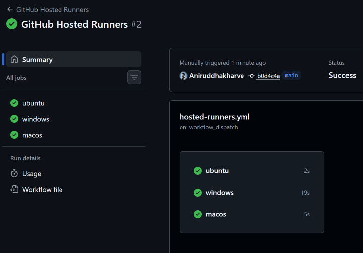
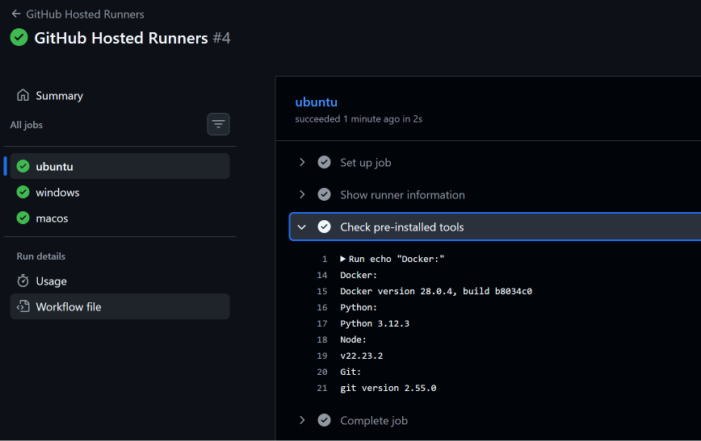
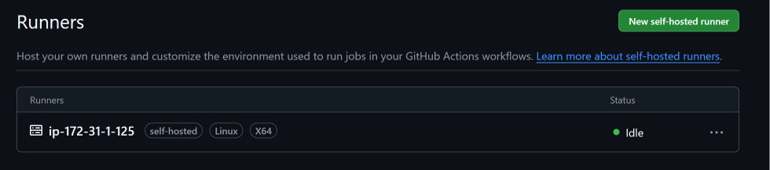
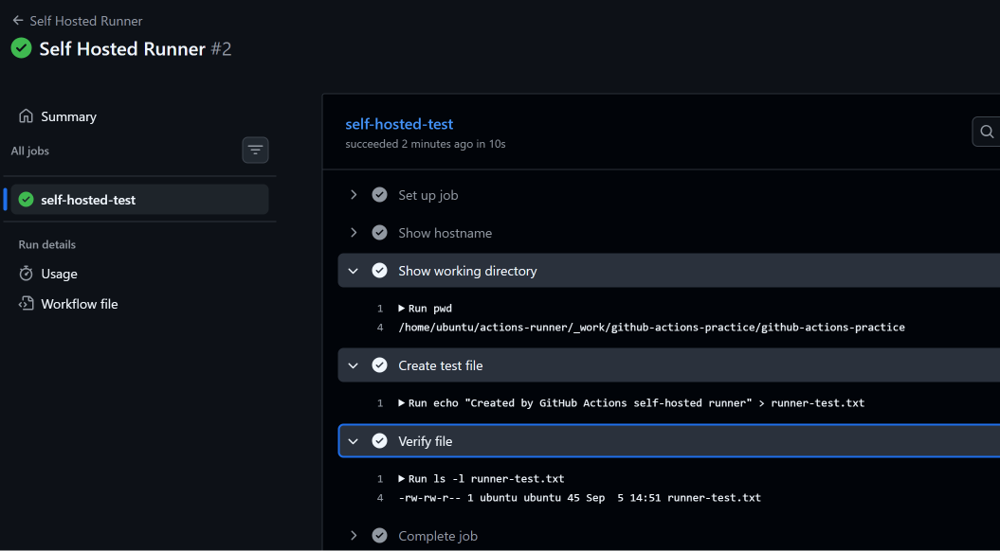
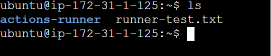
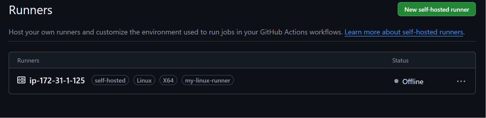
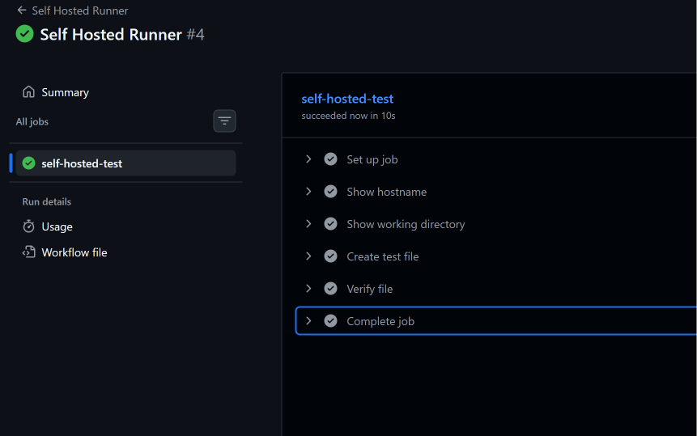

# Day 42 – GitHub Actions Runners: GitHub-Hosted & Self-Hosted

## 📌 Day 42 Overview

Aaj ka focus GitHub Actions ke **Runners** par tha.

Runner basically woh machine hoti hai jahan GitHub Actions ka workflow actually execute hota hai.

Aaj maine:

- GitHub-hosted runners par workflow run kiya
- Ubuntu, Windows aur macOS runners compare kiye
- Ubuntu runner par pre-installed tools check kiye
- Local/VM Linux machine par self-hosted runner configure kiya
- Self-hosted runner par workflow execute kiya
- Runner ke hostname aur working directory verify ki
- GitHub Actions se machine par file create ki
- Custom runner label use kiya
- GitHub-hosted vs self-hosted runners compare kiye

---

# 1. What is a GitHub Actions Runner?

GitHub Actions workflow ke jobs kisi machine par execute hone chahiye.

Is machine ko **Runner** kaha jata hai.

Runner:

- Workflow jobs execute karta hai
- Workflow ke commands run karta hai
- Repository ka code access kar sakta hai
- Required tools aur dependencies use karta hai
- Job ka output GitHub Actions ko return karta hai

Simple flow:

```text
GitHub Repository
       |
       v
GitHub Actions Workflow
       |
       v
Runner
       |
       v
Workflow Jobs / Commands
```

Example:

```yaml
jobs:
  build:
    runs-on: ubuntu-latest
    steps:
      - run: echo "Hello from runner"
```

Yahan:

```yaml
runs-on: ubuntu-latest
```

GitHub ko batata hai ki job ko Ubuntu GitHub-hosted runner par execute karna hai.

---

# 2. Types of GitHub Actions Runners

GitHub Actions mein mainly do types ke runners use kiye ja sakte hain:

### GitHub-Hosted Runner

Infrastructure GitHub provide karta hai.

Examples:

```text
ubuntu-latest
windows-latest
macos-latest
```

### Self-Hosted Runner

Machine/infrastructure hum khud provide aur maintain karte hain.

Example:

```text
Our Linux VM
      |
      v
GitHub Self-Hosted Runner
      |
      v
GitHub Actions Job
```

---

# 3. Task 1 – GitHub-Hosted Runners

Sabse pehle maine GitHub-hosted runners ko practically test kiya.

Maine ek workflow create kiya jisme three different jobs the:

- Ubuntu
- Windows
- macOS

Workflow:

```yaml
name: GitHub Hosted Runners

on:
  workflow_dispatch:

jobs:
  ubuntu:
    runs-on: ubuntu-latest
    steps:
      - name: Show runner information
        run: |
          echo "OS: Ubuntu"
          echo "Hostname: $(hostname)"
          echo "User: $(whoami)"

  windows:
    runs-on: windows-latest
    steps:
      - name: Show runner information
        shell: pwsh
        run: |
          Write-Host "OS: Windows"
          Write-Host "Hostname: $env:COMPUTERNAME"
          Write-Host "User: $env:USERNAME"

  macos:
    runs-on: macos-latest
    steps:
      - name: Show runner information
        run: |
          echo "OS: macOS"
          echo "Hostname: $(hostname)"
          echo "User: $(whoami)"
```

## Important Point

Har job ke andar:

```yaml
runs-on:
```

runner type specify karta hai.

For example:

```yaml
runs-on: ubuntu-latest
```

means job Ubuntu GitHub-hosted runner par run hoga.

Similarly:

```yaml
runs-on: windows-latest
```

Windows runner ke liye.

And:

```yaml
runs-on: macos-latest
```

macOS runner ke liye.

### Parallel Execution

Ye jobs independent hain, isliye GitHub Actions inhe parallel execute kar sakta hai.

Conceptually:

```text
                 Workflow
                    |
          +---------+---------+
          |         |         |
          v         v         v
       Ubuntu    Windows    macOS
       Runner    Runner     Runner
```

### Screenshot



---

# 4. Task 2 – Pre-installed Tools on Ubuntu Runner

GitHub-hosted runners ka ek major advantage ye hai ki commonly required development tools pehle se available hote hain.

Maine Ubuntu runner par following tools check kiye:

- Docker
- Python
- Node.js
- Git

Workflow step:

```yaml
- name: Check pre-installed tools
  run: |
    echo "Docker:"
    docker --version

    echo "Python:"
    python --version

    echo "Node:"
    node --version

    echo "Git:"
    git --version
```

Isse verify kiya ja sakta hai ki runner par required tools available hain.

### Why Pre-installed Tools Matter?

Agar runner par common tools already installed hain, toh workflow ke andar har baar un tools ko manually install karne ki zarurat nahi padti.

For example:

```text
Without pre-installed tools:

Runner
  |
  +--> Install Git
  +--> Install Python
  +--> Install Node
  +--> Install Docker
  +--> Run build
```

Pre-installed tools ke saath:

```text
Runner
  |
  +--> Git available
  +--> Python available
  +--> Node available
  +--> Docker available
  |
  +--> Run build
```

Isse:

- Workflow setup simpler hota hai
- Execution time reduce ho sakta hai
- Repeated installation avoid hoti hai
- CI/CD pipeline easier maintain hoti hai

### Screenshot



---

# 5. GitHub-Hosted Runner – Key Characteristics

GitHub-hosted runners ke case mein infrastructure GitHub manage karta hai.

Hum mainly workflow mein runner environment specify karte hain:

```yaml
runs-on: ubuntu-latest
```

Advantages:

- Machine manually setup nahi karni padti
- Runner maintenance GitHub handle karta hai
- Multiple OS options available hain
- CI/CD start karna easy hai
- Common tools available hote hain
- Temporary CI/CD workloads ke liye convenient hai

---

# 6. Task 3 – Self-Hosted Runner

Next step mein maine Linux machine ko GitHub Actions ke liye **self-hosted runner** ke roop mein configure kiya.

Self-hosted runner mein machine hum provide karte hain.

Architecture:

```text
GitHub
  |
  | GitHub Actions Job
  v
Self-Hosted Runner
  |
  v
Our Linux Machine / VM
```

---

## Step 1 – Open Repository Settings

Repository ke andar:

```text
Settings
   ↓
Actions
   ↓
Runners
```

Then:

```text
New self-hosted runner
```

Select:

```text
Linux
```

GitHub setup ke liye required commands provide karta hai.

Important:

> Runner registration ke liye GitHub jo commands/token provide karta hai, unhe directly use karna chahiye. Token manually invent nahi karna chahiye.

---

# 7. Start the Self-Hosted Runner

Runner setup ke baad runner ko start kiya ja sakta hai:

```bash
./run.sh
```

Runner successfully connected hone ke baad GitHub repository ke:

```text
Settings → Actions → Runners
```

section mein runner ka status:

```text
Idle
```

show hota hai.

`Idle` ka matlab hai runner online hai aur job receive karne ke liye ready hai.

### Screenshot



---

# 8. Self-Hosted Runner Workflow

Self-hosted runner ko use karne ke liye workflow mein:

```yaml
runs-on: self-hosted
```

use kiya.

Example:

```yaml
name: Self Hosted Runner

on:
  workflow_dispatch:

jobs:
  self-hosted-test:
    runs-on: self-hosted

    steps:
      - name: Show hostname
        run: hostname

      - name: Show working directory
        run: pwd

      - name: Create test file
        run: echo "Created by GitHub Actions self-hosted runner" > runner-test.txt

      - name: Verify file
        run: ls -l runner-test.txt
```

---

# 9. Verify Runner Hostname

Workflow mein:

```bash
hostname
```

command use karke maine verify kiya ki job self-hosted machine par execute ho raha hai.

Similarly:

```bash
pwd
```

se current working directory check ki.

Ye useful hai because self-hosted runner mein hum directly apni machine ka environment use kar rahe hote hain.

---

# 10. Create File on Self-Hosted Machine

Workflow se maine ek test file create ki:

```bash
echo "Created by GitHub Actions self-hosted runner" > runner-test.txt
```

Then verify kiya:

```bash
ls -l runner-test.txt
```

Is practical se ye clearly demonstrate hua ki GitHub Actions job self-hosted runner machine par commands execute kar sakta hai.

### Screenshot – Job



### Screenshot – File Created



---

# 11. Task 5 – Runner Labels

Self-hosted runners ko labels assign kiye ja sakte hain.

Labels useful hote hain jab multiple self-hosted runners available hon aur hume kisi specific type ke runner par job execute karni ho.

Example label:

```text
my-linux-runner
```

Then workflow mein:

```yaml
runs-on: [self-hosted, my-linux-runner]
```

use kar sakte hain.

Meaning:

```text
self-hosted
      +
my-linux-runner
```

GitHub ko aisa runner select karna hoga jiske paas required labels hon.

---

# 12. Why Runner Labels Matter?

Suppose organization mein multiple self-hosted runners hain:

```text
Runner 1 → Linux
Runner 2 → Windows
Runner 3 → Docker
Runner 4 → Production
```

Hum labels use karke specific runner select kar sakte hain.

Example:

```yaml
runs-on: [self-hosted, docker]
```

Ya:

```yaml
runs-on: [self-hosted, production]
```

Ye large CI/CD environments mein kaafi useful hota hai.

### Screenshot – Label



### Screenshot – Labeled Runner Job



---

# 13. GitHub-Hosted vs Self-Hosted Runners

| Feature | GitHub-Hosted | Self-Hosted |
|---|---|---|
| Infrastructure | GitHub provides | We provide |
| Machine Management | GitHub manages | We manage |
| Setup | Easy | Requires configuration |
| Maintenance | GitHub handles | We handle |
| Customization | Limited to available environment | High |
| Private Infrastructure Access | Limited | Can access internal infrastructure |
| Custom Software | Limited to supported environment | Full control |
| Scaling | GitHub-managed | We need to manage |
| Security Responsibility | Mostly GitHub-managed infrastructure | Higher responsibility on us |
| Cost Consideration | GitHub Actions usage limits/billing apply | Own infrastructure cost |
| Best Use Case | General CI/CD | Custom/private/internal environments |

---

# 14. When to Use GitHub-Hosted Runner?

GitHub-hosted runners are a good choice when:

- Standard CI/CD environment required ho
- Custom infrastructure ki requirement nahi hai
- Quickly pipeline create karni ho
- Common development tools enough hain
- Infrastructure maintain nahi karna chahte

Example:

```text
Git Push
   ↓
GitHub Actions
   ↓
GitHub-Hosted Ubuntu Runner
   ↓
Build
   ↓
Test
   ↓
Deploy
```

---

# 15. When to Use Self-Hosted Runner?

Self-hosted runners useful hain when:

- Custom software required ho
- Special hardware required ho
- Private/internal infrastructure access chahiye
- Specific network configuration required ho
- Custom dependencies installed hon
- Organization ko runner environment par full control chahiye

Example:

```text
GitHub Actions
      |
      v
Self-Hosted Runner
      |
      +--> Internal Network
      |
      +--> Private Database
      |
      +--> Internal Services
      |
      +--> Custom Tools
```

---

# 16. Security Considerations for Self-Hosted Runners

Self-hosted runner powerful hota hai because workflow commands directly apni machine par execute hote hain.

Isliye security important hai.

Potential risks:

- Malicious workflow code
- Secrets exposure
- Unauthorized access
- Persistent files/processes
- Incorrect permissions
- Untrusted pull requests

Important practices:

- Runner ko unnecessary privileges mat do
- Dedicated machine/VM use karna better hai
- Secrets carefully manage karo
- Untrusted workflows ko blindly execute mat karo
- Runner ko regularly update karo
- Required firewall/network restrictions apply karo
- Production infrastructure ko unnecessarily expose mat karo

Simple rule:

> Self-hosted runner ka infrastructure aur security responsibility largely hamari hoti hai.

---

# 17. Important `runs-on` Examples

### GitHub-hosted Ubuntu

```yaml
runs-on: ubuntu-latest
```

### GitHub-hosted Windows

```yaml
runs-on: windows-latest
```

### GitHub-hosted macOS

```yaml
runs-on: macos-latest
```

### Any self-hosted runner

```yaml
runs-on: self-hosted
```

### Self-hosted runner with label

```yaml
runs-on: [self-hosted, my-linux-runner]
```

---

# 18. Common Mistakes

## Mistake 1 – Self-hosted runner offline

Agar runner GitHub mein:

```text
Offline
```

show kare, toh workflow job execute nahi ho payega.

Check:

```text
Settings
→ Actions
→ Runners
```

Runner online hai ya nahi verify karo.

---

## Mistake 2 – Runner process stopped

Agar manually runner start kiya hai:

```bash
./run.sh
```

toh process running rehna chahiye.

Agar process stop ho gaya, runner offline ho sakta hai.

---

## Mistake 3 – Wrong label

Agar workflow mein:

```yaml
runs-on: [self-hosted, my-linux-runner]
```

hai, lekin runner ke paas:

```text
my-linux-runner
```

label nahi hai, toh job matching runner nahi milega.

---

## Mistake 4 – Wrong shell syntax

Linux runner:

```bash
hostname
pwd
whoami
```

Windows runner mein PowerShell syntax use karna convenient hai:

```powershell
$env:COMPUTERNAME
$env:USERNAME
```

Isliye OS-specific commands ka dhyan rakhna important hai.

---

# 19. Hands-On Scenario

### Scenario

Suppose ek company ke paas internal deployment server hai jo public internet se directly accessible nahi hai.

Application ko GitHub Actions se deploy karna hai.

GitHub-hosted runner directly internal infrastructure access nahi kar sakta.

Solution:

```text
GitHub Repository
       |
       v
GitHub Actions
       |
       v
Self-Hosted Runner
       |
       v
Internal Network
       |
       +--> Application Server
       +--> Private Database
       +--> Internal Services
```

Self-hosted runner ko internal environment mein place karke workflow ko required infrastructure access diya ja sakta hai.

---

# 20. What I Learned Today

Day 42 ke baad mujhe clear understanding hai ki:

1. Runner woh machine hai jahan GitHub Actions jobs execute hote hain.
2. GitHub-hosted runners GitHub provide aur manage karta hai.
3. `ubuntu-latest`, `windows-latest` aur `macos-latest` GitHub-hosted runner examples hain.
4. GitHub-hosted runners mein commonly used tools pre-installed hote hain.
5. Self-hosted runner ke liye apni machine/VM use karte hain.
6. `runs-on: self-hosted` self-hosted runner ko target karta hai.
7. Runner labels specific runner selection ke liye useful hain.
8. Self-hosted runners mein infrastructure aur security ki responsibility zyada hoti hai.
9. Self-hosted runners custom/private environments ke liye useful hain.
10. GitHub-hosted runners standard CI/CD workloads ke liye convenient hain.

---

# 21. Interview Questions & Answers

## Q1. What is a GitHub Actions Runner?

**Answer:**

> A runner is a machine that executes GitHub Actions workflow jobs. It can either be hosted by GitHub or managed by the organization as a self-hosted runner.

---

## Q2. What is the difference between GitHub-hosted and self-hosted runners?

**Answer:**

> In GitHub-hosted runners, GitHub manages the runner infrastructure and environment. In self-hosted runners, we provide and manage the machine, which gives us more control and customization but also more responsibility for security and maintenance.

---

## Q3. What does `runs-on` do?

**Answer:**

> `runs-on` specifies the runner environment on which a GitHub Actions job should execute.

Example:

```yaml
runs-on: ubuntu-latest
```

---

## Q4. Why would you use a self-hosted runner?

**Answer:**

> I would use a self-hosted runner when I need a custom environment, special dependencies, private network access, or access to internal infrastructure that is not directly available from a GitHub-hosted runner.

---

## Q5. What are runner labels?

**Answer:**

> Labels are used to identify and target specific self-hosted runners based on their capabilities or environment.

Example:

```yaml
runs-on: [self-hosted, my-linux-runner]
```

---

## Q6. What does `runs-on: self-hosted` mean?

**Answer:**

> It tells GitHub Actions to execute the job on an available self-hosted runner instead of a GitHub-hosted runner.

---

## Q7. What is the advantage of GitHub-hosted runners?

**Answer:**

> The main advantage is that GitHub manages the infrastructure, so we don't need to maintain the runner machine ourselves.

---

## Q8. What is a major responsibility with self-hosted runners?

**Answer:**

> We are responsible for maintaining and securing the runner machine, including its operating system, software, network access, permissions, and security.

---

## Q9. Can GitHub Actions jobs run on different operating systems?

**Answer:**

> Yes. GitHub Actions supports different runner environments such as Ubuntu, Windows and macOS. We can specify the required environment using `runs-on`.

---

## Q10. Why are pre-installed tools useful on GitHub-hosted runners?

**Answer:**

> Pre-installed tools reduce the amount of setup required in the workflow. Tools such as Git, Python, Node.js and Docker can already be available, making workflows easier and faster to configure.

---

# 22. How to Explain Day 42 in an Interview

Agar interviewer pooche:

**"What did you learn about GitHub Actions runners?"**

You can say:

> "I learned how GitHub Actions runners execute workflow jobs. I worked with GitHub-hosted runners using Ubuntu, Windows and macOS, and checked the available tools on the Ubuntu runner. I also configured a Linux machine as a self-hosted runner and executed a GitHub Actions workflow on it. I verified the hostname, working directory and created a file directly on the self-hosted machine. Finally, I used runner labels to target a specific self-hosted runner. I also understood the trade-off between GitHub-hosted and self-hosted runners in terms of management, customization and security."

---

# 23. Quick Revision Cheat Sheet

```text
Runner
→ Machine where GitHub Actions jobs execute

GitHub-hosted
→ GitHub manages infrastructure

Self-hosted
→ We manage infrastructure

Ubuntu
→ runs-on: ubuntu-latest

Windows
→ runs-on: windows-latest

macOS
→ runs-on: macos-latest

Self-hosted
→ runs-on: self-hosted

Self-hosted + label
→ runs-on: [self-hosted, my-linux-runner]

Runner status
→ Idle = Online and ready

Runner labels
→ Used to target specific runners

GitHub-hosted
→ Easy + managed

Self-hosted
→ More control + more responsibility
```

---

# 24. Day 42 Summary

Day 42 mein maine GitHub Actions runners ko practically understand kiya.

Sabse pehle GitHub-hosted runners ke saath Ubuntu, Windows aur macOS jobs run kiye.

Uske baad Ubuntu runner par Docker, Python, Node.js aur Git jaise tools check kiye.

Phir Linux machine ko self-hosted runner ke roop mein configure kiya aur GitHub Actions workflow ko successfully self-hosted runner par execute kiya.

Maine workflow ke through hostname, working directory aur file creation bhi verify ki.

Finally, runner labels ka use karke specific self-hosted runner ko target karna samjha.

Overall:

```text
GitHub Actions
      |
      v
    Runner
      |
      +----------------------+
      |                      |
      v                      v
GitHub-Hosted           Self-Hosted
      |                      |
      v                      v
Managed by GitHub       Managed by Us
```

**Day 42 completed! 🚀**

---
```
