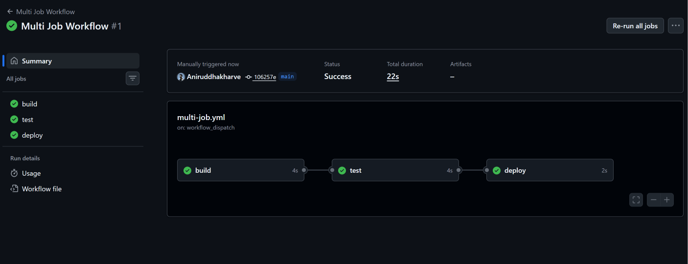
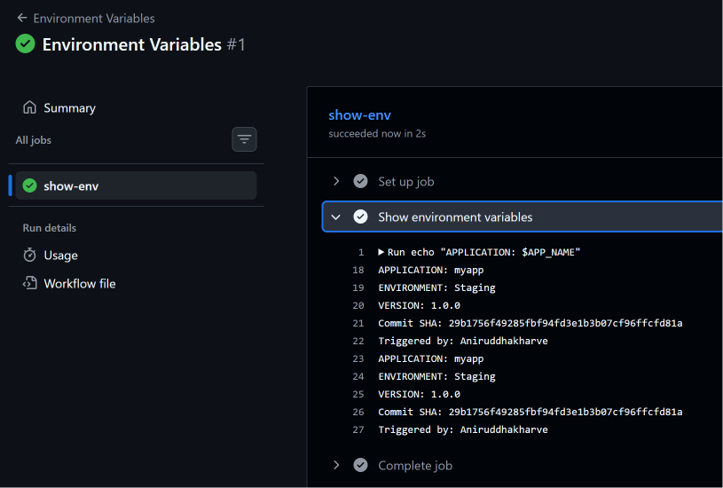
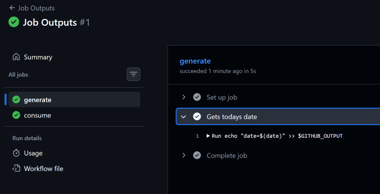
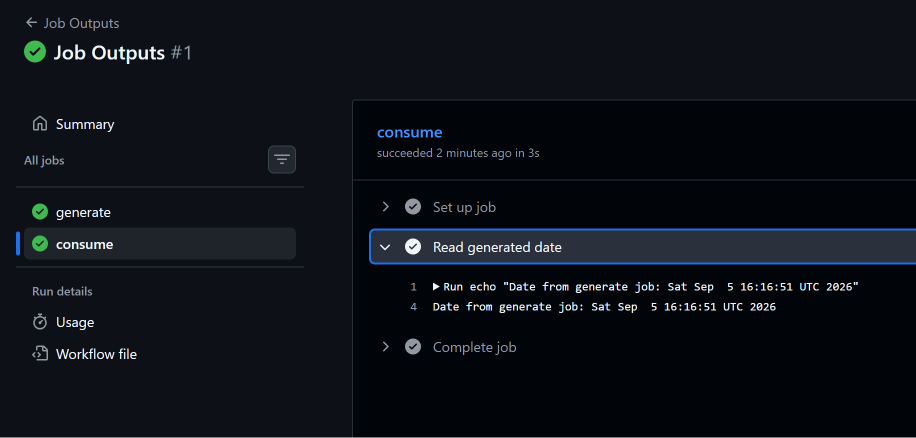
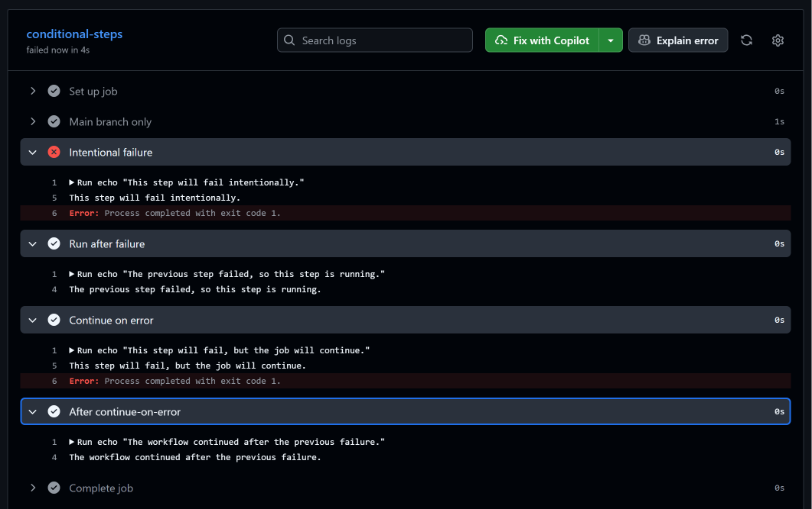
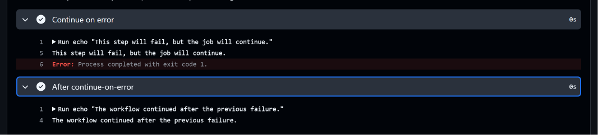
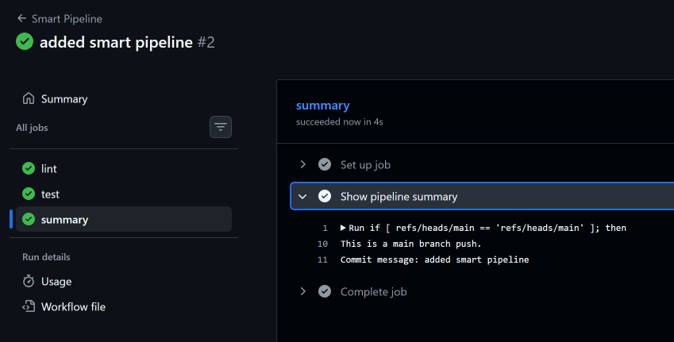

# Day 43 – Jobs, Steps, Environment Variables & Conditionals

## 📌 Overview

Day 43 mein maine GitHub Actions workflow ke **flow control** ko practically explore kiya.

Day 42 mein maine runners samjhe the. Aaj uske upar build karke maine seekha ki workflow ke andar:

- Multiple jobs kaise create karte hain
- Jobs ke beech dependency kaise create karte hain
- Environment variables different levels par kaise define karte hain
- GitHub context variables kaise access karte hain
- Ek job ka output doosri job ko kaise pass karte hain
- Conditional steps/jobs kaise execute karte hain
- `failure()` aur `always()` kaise work karte hain
- `continue-on-error` kaise use hota hai
- Parallel jobs aur dependent jobs ko ek pipeline mein kaise combine karte hain

---

# 1. Jobs vs Steps

GitHub Actions workflow mein basic structure hota hai:

```text
Workflow
   |
   +── Job
   |    |
   |    +── Step
   |    +── Step
   |    +── Step
   |
   +── Job
        |
        +── Step
        +── Step
```

### Job

Job ek logical unit of work hai jo ek runner par execute hota hai.

Example:

```yaml
jobs:
  build:
    runs-on: ubuntu-latest
```

### Step

Step job ke andar individual command ya action hota hai.

Example:

```yaml
steps:
  - name: Build
    run: echo "Building the app"
```

Simple way:

> **Job = kaam ka bada unit**  
> **Step = us job ke andar individual task**

---

# 2. Task 1 – Multi-Job Workflow

Maine ek workflow create kiya jisme three jobs the:

```text
build
  ↓
test
  ↓
deploy
```

Workflow:

```yaml
name: Multi Job Workflow

on:
  workflow_dispatch:

jobs:
  build:
    runs-on: ubuntu-latest
    steps:
      - name: Build
        run: echo "Building the app"

  test:
    needs: build
    runs-on: ubuntu-latest
    steps:
      - name: Test
        run: echo "Running tests"

  deploy:
    needs: test
    runs-on: ubuntu-latest
    steps:
      - name: Deploy
        run: echo "Deploying"
```

## `needs:` kya karta hai?

```yaml
needs: build
```

ka matlab:

> `test` job tabhi start hoga jab `build` job successfully complete ho.

Similarly:

```yaml
needs: test
```

ka matlab:

> `deploy` job tabhi start hoga jab `test` successfully complete ho.

Therefore dependency chain:

```text
Build
  |
  v
Test
  |
  v
Deploy
```

### Workflow Graph

Actions tab mein workflow run ka graph dependency chain ko visually show karta hai.



---

# 3. Understanding `needs:`

`needs:` jobs ke beech dependency establish karta hai.

Example:

```yaml
test:
  needs: build
```

Means:

```text
build → test
```

Multiple dependencies bhi define kar sakte hain:

```yaml
summary:
  needs: [lint, test]
```

Means:

```text
lint ──┐
       ├──> summary
test ──┘
```

`summary` job ko dono jobs complete hone ka wait karna padega.

---

# 4. Task 2 – Environment Variables

Environment variables application aur workflow configuration ke liye useful hote hain.

Maine environment variables ko three different levels par test kiya:

1. Workflow level
2. Job level
3. Step level

---

## Workflow-Level Variable

```yaml
env:
  APP_NAME: myapp
```

Ye workflow ke scope mein available hota hai.

---

## Job-Level Variable

```yaml
jobs:
  show-env:
    env:
      ENVIRONMENT: staging
```

Ye us particular job ke steps ke liye available hota hai.

---

## Step-Level Variable

```yaml
steps:
  - name: Show environment variables
    env:
      VERSION: 1.0.0
```

Ye variable sirf us particular step ke liye available hota hai.

---

## Complete Example

```yaml
name: Environment Variables

on:
  workflow_dispatch:

env:
  APP_NAME: myapp

jobs:
  show-env:
    runs-on: ubuntu-latest

    env:
      ENVIRONMENT: staging

    steps:
      - name: Show environment variables
        env:
          VERSION: 1.0.0
        run: |
          echo "Application: $APP_NAME"
          echo "Environment: $ENVIRONMENT"
          echo "Version: $VERSION"
          echo "Commit SHA: $GITHUB_SHA"
          echo "Triggered by: $GITHUB_ACTOR"
```

---

# 5. Environment Variable Scope

Environment variable ka scope samajhna important hai.

```text
Workflow
│
└── APP_NAME
     │
     └── Job
          │
          └── ENVIRONMENT
               │
               └── Step
                    │
                    └── VERSION
```

### Workflow Level

```yaml
env:
  APP_NAME: myapp
```

Broadest scope.

### Job Level

```yaml
env:
  ENVIRONMENT: staging
```

Sirf particular job ke liye.

### Step Level

```yaml
env:
  VERSION: 1.0.0
```

Sirf particular step ke liye.

---

# 6. GitHub Context Variables

Maine GitHub ke built-in context/environment variables bhi test kiye.

### `GITHUB_SHA`

```text
GITHUB_SHA
```

Workflow run se associated commit SHA provide karta hai.

### `GITHUB_ACTOR`

```text
GITHUB_ACTOR
```

Workflow ko trigger karne wale GitHub user ko identify karta hai.

Example:

```bash
echo "Commit SHA: $GITHUB_SHA"
echo "Triggered by: $GITHUB_ACTOR"
```

### Practical Result

Maine verify kiya ki workflow-level, job-level aur step-level variables ke saath GitHub context information bhi successfully print ho rahi thi.



---

# 7. Task 3 – Job Outputs

Kabhi-kabhi ek job koi value generate karta hai jo doosri job ko chahiye hoti hai.

Is situation mein **job outputs** useful hote hain.

Example:

```text
Generate Job
     |
     | date
     v
Consume Job
```

---

## Generate Job

Maine ek job create kiya jo today's date generate karta hai.

```yaml
generate:
  runs-on: ubuntu-latest

  outputs:
    date: ${{ steps.get-date.outputs.date }}

  steps:
    - name: Get today's date
      id: get-date
      run: echo "date=$(date)" >> "$GITHUB_OUTPUT"
```

Important parts:

```yaml
id: get-date
```

Step ko identify karta hai.

Then:

```bash
echo "date=$(date)" >> "$GITHUB_OUTPUT"
```

step output create karta hai.

---

# 8. Exposing Step Output as Job Output

Job ke andar:

```yaml
outputs:
  date: ${{ steps.get-date.outputs.date }}
```

Isse `date` value job output ban jaati hai.

Flow:

```text
Step Output
    |
    v
Job Output
```

---

# 9. Reading Job Output

Second job mein:

```yaml
consume:
  needs: generate
```

Ye ensure karta hai ki `consume` job pehle `generate` job complete hone ka wait kare.

Then output access karne ke liye:

```yaml
${{ needs.generate.outputs.date }}
```

use kiya.

Complete example:

```yaml
name: Job Outputs

on:
  workflow_dispatch:

jobs:
  generate:
    runs-on: ubuntu-latest

    outputs:
      date: ${{ steps.get-date.outputs.date }}

    steps:
      - name: Get today's date
        id: get-date
        run: echo "date=$(date)" >> "$GITHUB_OUTPUT"

  consume:
    needs: generate
    runs-on: ubuntu-latest

    steps:
      - name: Read generated date
        run: echo "Date from generate job: ${{ needs.generate.outputs.date }}"
```

---

# 10. Why Pass Outputs Between Jobs?

Job outputs ka use tab hota hai jab ek job ka generated result doosri job ko required ho.

Real-world examples:

```text
Build Job
    |
    | Docker image tag
    v
Test Job
    |
    | Test result
    v
Deploy Job
```

Possible values:

- Application version
- Docker image tag
- Generated artifact name
- Infrastructure IP
- Release ID
- Build information

Benefits:

- Same value dobara calculate nahi karna padta
- Jobs ke beech information share kar sakte hain
- Pipeline ko more modular bana sakte hain
- Build/test/deploy stages ko connect karna easier hota hai

### Practical Evidence





---

# 11. Task 4 – Conditionals

Conditionals ka use karke hum decide kar sakte hain ki koi step ya job **kab execute hona chahiye**.

Basic syntax:

```yaml
if: condition
```

---

# 12. Main Branch Condition

Maine main branch ke liye condition test ki:

```yaml
if: github.ref == 'refs/heads/main'
```

Example:

```yaml
- name: Main branch only
  if: github.ref == 'refs/heads/main'
  run: echo "This step runs only on the main branch."
```

Agar workflow `main` branch par run ho raha hai, step execute hoga.

Other branch par condition false hone par step skip ho jayega.

---

# 13. `failure()` Condition

Maine ek step intentionally fail kiya:

```yaml
- name: Intentional failure
  id: failing-step
  run: |
    echo "This step will fail intentionally."
    exit 1
```

Uske baad:

```yaml
- name: Run after failure
  if: failure()
  run: echo "The previous step failed, so this step is running."
```

`failure()` previous failure ke baad conditional step ko execute karne ke liye useful hai.

Flow:

```text
Intentional Failure
        |
        v
      FAILED
        |
        v
    failure()
        |
        v
Step Runs
```

Useful scenarios:

- Failure logs collect karna
- Error information print karna
- Notification trigger karna
- Debugging information collect karna

---

# 14. `always()` Condition

Practical ke during ek important behavior observe hua.

Initial workflow mein previous step fail hone ke baad kuch later steps expected way mein execute nahi ho rahe the.

Isliye maine:

```yaml
if: always()
```

use kiya.

Example:

```yaml
- name: Continue on error
  if: always()
  continue-on-error: true
  run: |
    echo "This step will fail, but the job will continue."
    exit 1
```

Aur next step:

```yaml
- name: After continue-on-error
  if: always()
  run: echo "The workflow continued after the previous failure."
```

`always()` ka purpose hai ki step previous steps ke result se independent execute ho sake.

---

# 15. `continue-on-error: true`

Maine intentionally failing step ke saath:

```yaml
continue-on-error: true
```

test kiya.

Example:

```yaml
- name: Continue on error
  if: always()
  continue-on-error: true
  run: |
    echo "This step will fail, but the job will continue."
    exit 1
```

Important:

> `continue-on-error` command ko successful nahi banata. Step fail ho sakta hai, lekin GitHub Actions us failure ko tolerate karke workflow ko continue kar sakta hai.

Practical flow:

```text
Step
 ↓
FAIL
 ↓
continue-on-error: true
 ↓
Failure tolerated
 ↓
Workflow continues
```

Lekin agar job already previous step ki wajah se failure state mein hai, toh later steps ke execution behavior ko control karne ke liye `if: always()` important ho sakta hai.

---

# 16. `failure()` vs `always()` vs `continue-on-error`

| Feature | Purpose |
|---|---|
| `failure()` | Previous failure ke case mein step/job run karna |
| `always()` | Previous result success/failure se independent execution allow karna |
| `continue-on-error` | Particular step/job ki failure ko tolerate karna |

Simple memory trick:

```text
failure()
→ Failure hua? Then run.

always()
→ Result kuch bhi ho, run.

continue-on-error
→ Fail hua? Workflow ko continue karne do.
```

---

# 17. Push-Only Job

Maine ek job create kiya jo sirf push event par run hota hai:

```yaml
push-only-job:
  if: github.event_name == 'push'
  runs-on: ubuntu-latest

  steps:
    - name: Push event detected
      run: echo "This job runs only for push events."
```

Condition:

```yaml
if: github.event_name == 'push'
```

Meaning:

```text
Push Event
    ↓
Condition TRUE
    ↓
Job Runs
```

Pull request event:

```text
Pull Request
    ↓
Condition FALSE
    ↓
Job Skipped
```

---

# 18. Working Conditional Workflow

Mera successfully tested version:

```yaml
name: Conditionals

on:
  push:
  pull_request:
  workflow_dispatch:

jobs:
  conditional-steps:
    runs-on: ubuntu-latest

    steps:
      - name: Main branch only
        if: github.ref == 'refs/heads/main'
        run: echo "This step runs only on the main branch."

      - name: Intentional failure
        id: failing-step
        run: |
          echo "This step will fail intentionally."
          exit 1

      - name: Run after failure
        if: failure()
        run: echo "The previous step failed, so this step is running."

      - name: Continue on error
        if: always()
        continue-on-error: true
        run: |
          echo "This step will fail, but the job will continue."
          exit 1

      - name: After continue-on-error
        if: always()
        run: echo "The workflow continued after the previous failure."

  push-only-job:
    if: github.event_name == 'push'
    runs-on: ubuntu-latest

    steps:
      - name: Push event detected
        run: echo "This job runs only for push events."
```

### Practical Evidence





---

# 19. Task 5 – Smart Pipeline

Finally maine previous concepts ko combine karke ek smart pipeline create ki.

Requirements:

- Push event par trigger
- `lint` job
- `test` job
- `summary` job
- `lint` aur `test` parallel
- `summary` dono ke baad execute
- Branch type identify karna
- Commit message print karna

Workflow:

```yaml
name: Smart Pipeline

on:
  push:

jobs:
  lint:
    runs-on: ubuntu-latest

    steps:
      - name: Run lint
        run: echo "Running lint checks"

  test:
    runs-on: ubuntu-latest

    steps:
      - name: Run tests
        run: echo "Running tests"

  summary:
    needs: [lint, test]
    runs-on: ubuntu-latest

    steps:
      - name: Show pipeline summary
        run: |
          if [ "${GITHUB_REF}" = "refs/heads/main" ]; then
            echo "This is a main branch push."
          else
            echo "This is a feature branch push."
          fi

          echo "Commit message: ${{ github.event.head_commit.message }}"
```

---

# 20. Smart Pipeline Architecture

`lint` aur `test` independent jobs hain.

Isliye:

```text
lint ─────┐
          │
          ├──> summary
          │
test ─────┘
```

`summary` ke andar:

```yaml
needs: [lint, test]
```

hai.

Therefore summary dono jobs complete hone ke baad run hota hai.

---

# 21. Why `lint` and `test` Run in Parallel?

Humne `lint` ke andar `needs:` nahi diya.

Similarly `test` bhi independent hai.

Therefore GitHub Actions ke paas dono jobs ko independently schedule karne ka option hota hai.

Conceptually:

```text
         Workflow
            |
       +----+----+
       |         |
       v         v
     lint       test
       |         |
       +----+----+
            |
            v
         summary
```

Parallel execution CI/CD pipelines ko faster bana sakta hai jab jobs ek doosre par dependent na hon.

---

# 22. Branch Detection

Summary job mein:

```bash
if [ "${GITHUB_REF}" = "refs/heads/main" ]; then
```

use kiya.

Agar branch `main` hai:

```text
This is a main branch push.
```

Otherwise:

```text
This is a feature branch push.
```

---

# 23. Commit Message

Commit message access karne ke liye:

```yaml
${{ github.event.head_commit.message }}
```

use kiya.

Isse summary job mein push event ka commit message print kiya.

Example:

```text
Commit message: update workflow
```

---

# 24. Smart Pipeline Evidence




---

# 25. Important GitHub Actions Syntax

## Job dependency

```yaml
needs: build
```

## Multiple dependencies

```yaml
needs: [lint, test]
```

## Workflow-level environment variable

```yaml
env:
  APP_NAME: myapp
```

## Job-level environment variable

```yaml
env:
  ENVIRONMENT: staging
```

## Step-level environment variable

```yaml
env:
  VERSION: 1.0.0
```

## Main branch condition

```yaml
if: github.ref == 'refs/heads/main'
```

## Failure condition

```yaml
if: failure()
```

## Always execute condition

```yaml
if: always()
```

## Continue after error

```yaml
continue-on-error: true
```

## Push-only condition

```yaml
if: github.event_name == 'push'
```

## Set step output

```bash
echo "date=$(date)" >> "$GITHUB_OUTPUT"
```

## Read job output

```yaml
${{ needs.generate.outputs.date }}
```

## Commit SHA

```text
$GITHUB_SHA
```

## Triggering actor

```text
$GITHUB_ACTOR
```

## Commit message

```yaml
${{ github.event.head_commit.message }}
```

---

# 26. Common Mistakes & Learnings

## Mistake 1 – Confusing `needs:` with `steps`

`needs:` job-level dependency ke liye use hota hai.

```yaml
needs: build
```

Steps ke liye nahi.

---

## Mistake 2 – Thinking `continue-on-error` makes the step successful

It doesn't.

A command can still return exit code `1`.

`continue-on-error` simply tells GitHub Actions to tolerate that failure.

---

## Mistake 3 – Forgetting `always()` after an earlier failure

A previous step fail hone ke baad normal later steps execute nahi kar sakte depending on the job state and conditions.

Agar step ko previous result regardless execute karwana hai:

```yaml
if: always()
```

useful hai.

---

## Mistake 4 – Wrong branch reference

Main branch check ke liye:

```yaml
if: github.ref == 'refs/heads/main'
```

use kiya.

Sirf:

```text
main
```

compare karna correct Git reference nahi hai.

---

## Mistake 5 – Job output ka wrong syntax

Correct:

```yaml
${{ needs.generate.outputs.date }}
```

Yahan:

```text
needs
 ↓
generate
 ↓
outputs
 ↓
date
```

---

# 27. Real-World CI/CD Example

Suppose ek Java application ka CI/CD pipeline hai.

Pipeline:

```text
                Git Push
                   |
                   v
          +--------+--------+
          |                 |
          v                 v
       Lint Job          Test Job
          |                 |
          +--------+--------+
                   |
                   v
              Build Job
                   |
                   v
             Deploy Job
```

Possible implementation:

```text
Lint
→ Code quality check

Test
→ Unit/integration tests

Build
→ Application artifact / Docker image

Deploy
→ Staging/Production
```

`needs:` ka use karke dependency control kiya ja sakta hai.

Environment variables se:

```text
APP_NAME
ENVIRONMENT
VERSION
```

jaisi values manage ki ja sakti hain.

Job outputs se:

```text
IMAGE_TAG
VERSION
ARTIFACT_NAME
```

next job ko pass kiye ja sakte hain.

Conditionals se:

```text
main branch
→ Production deployment

feature branch
→ Tests only
```

jaisa behavior create kiya ja sakta hai.

---

# 28. What I Learned Today

Day 43 ke baad mujhe clear understanding hai ki:

1. GitHub Actions workflow multiple jobs contain kar sakta hai.
2. Jobs ke andar multiple steps ho sakte hain.
3. `needs:` jobs ke beech dependency establish karta hai.
4. Independent jobs parallel execute ho sakte hain.
5. Environment variables workflow, job aur step level par define kiye ja sakte hain.
6. GitHub context variables workflow information provide karte hain.
7. Job outputs ek job se doosri job ko data pass karne ke liye useful hain.
8. `if:` conditions workflow execution ko control karti hain.
9. `failure()` previous failure ke case mein steps run karne ke liye useful hai.
10. `always()` previous result regardless execution ke liye useful hai.
11. `continue-on-error` failure ko tolerate karke workflow continue karne deta hai.
12. Multiple jobs ko combine karke smart CI/CD pipeline design ki ja sakti hai.

---

# 29. Interview Questions & Answers

## Q1. What is the difference between a job and a step?

**Answer:**

> A job is a logical unit of work that runs on a runner, while a step is an individual task or command executed inside that job.

---

## Q2. What does `needs` do in GitHub Actions?

**Answer:**

> `needs` creates a dependency between jobs. The dependent job starts only after the required job or jobs have completed successfully.

Example:

```yaml
test:
  needs: build
```

---

## Q3. Can jobs run in parallel?

**Answer:**

> Yes. Jobs without dependencies on each other can run independently and may execute in parallel.

---

## Q4. What are environment variables in GitHub Actions?

**Answer:**

> Environment variables are values that can be made available to workflow steps. They can be defined at workflow, job or step level depending on the required scope.

---

## Q5. What is a job output?

**Answer:**

> A job output is a value generated by one job and exposed so that another dependent job can consume it.

Example:

```yaml
${{ needs.generate.outputs.date }}
```

---

## Q6. Why would you use job outputs?

**Answer:**

> I would use job outputs when one job generates information that another job needs, such as an image tag, application version, artifact name or deployment information.

---

## Q7. What does `failure()` do?

**Answer:**

> `failure()` evaluates to true when a previous step or job has failed, allowing us to run error-handling or cleanup steps.

---

## Q8. What does `always()` do?

**Answer:**

> `always()` allows a step or job to run regardless of the result of previous steps or jobs.

---

## Q9. What does `continue-on-error` do?

**Answer:**

> It allows a step or job to fail without causing the workflow to stop because of that failure. The command itself can still return a failure.

---

## Q10. What is the difference between `failure()` and `always()`?

**Answer:**

> `failure()` runs when a failure has occurred, while `always()` is intended to run regardless of whether previous steps succeeded or failed.

---

## Q11. How can you run a job only for push events?

**Answer:**

```yaml
if: github.event_name == 'push'
```

This checks the event that triggered the workflow.

---

## Q12. How can you check whether the workflow is running on main?

**Answer:**

```yaml
if: github.ref == 'refs/heads/main'
```

---

# 30. How to Explain Day 43 in an Interview

Agar interviewer pooche:

**"What did you learn about jobs, outputs and conditionals in GitHub Actions?"**

You can explain:

> "In Day 43, I learned how to control the execution flow of GitHub Actions workflows. I created multiple jobs and used `needs` to create dependencies such as build, test and deploy. I also worked with environment variables at workflow, job and step levels and used GitHub context variables like commit SHA and actor. Then I implemented job outputs to pass data from one job to another using `needs.<job>.outputs.<name>`. I also tested conditionals using `if`, `failure()` and `always()`, along with `continue-on-error`. Finally, I created a smart pipeline where lint and test run independently and a summary job waits for both."

---

# 31. Quick Revision Cheat Sheet

```text
GitHub Actions Flow
-------------------

Workflow
   |
   +── Jobs
        |
        +── Steps


Job Dependency
--------------

needs: build

build
  ↓
test


Multiple Dependencies
---------------------

needs: [lint, test]

lint ──┐
       ├──> summary
test ──┘


Environment Variables
----------------------

Workflow:
env:
  APP_NAME: myapp

Job:
env:
  ENVIRONMENT: staging

Step:
env:
  VERSION: 1.0.0


Job Outputs
-----------

Set:
echo "date=$(date)" >> "$GITHUB_OUTPUT"

Expose:
outputs:
  date: ${{ steps.get-date.outputs.date }}

Read:
${{ needs.generate.outputs.date }}


Conditionals
------------

Main:
if: github.ref == 'refs/heads/main'

Failure:
if: failure()

Always:
if: always()

Push:
if: github.event_name == 'push'


Error Handling
--------------

continue-on-error: true


GitHub Context
--------------

$GITHUB_SHA
→ Commit SHA

$GITHUB_ACTOR
→ User who triggered workflow

${{ github.event.head_commit.message }}
→ Commit message
```

---

# 32. Day 43 Summary

Day 43 mein maine GitHub Actions ke workflow execution flow ko much deeper level par understand kiya.

Maine pehle multi-job workflow create karke:

```text
build → test → deploy
```

dependency chain implement ki.

Uske baad environment variables ke different scopes:

```text
Workflow → Job → Step
```

ko practically test kiya.

Job outputs ke through ek job se doosri job ko data pass karna bhi implement kiya:

```text
generate → consume
```

Conditionals mein maine:

```text
if:
failure()
always()
continue-on-error
```

ko practically test kiya.

Particularly `always()` aur `continue-on-error` ke combination ko test karne se ye samajh aaya ki **step failure ko tolerate karna aur failed job state ke baad later steps ko execute karna related but separate behaviors hain**.

Finally, maine ek smart pipeline banayi:

```text
lint ─────┐
          ├──> summary
test ─────┘
```

jisme independent jobs parallel run kar sakte hain aur summary job dono ke complete hone ke baad execute hoti hai.

### Final Takeaway

```text
GitHub Actions
      |
      v
   Jobs
      |
      +── Dependencies → needs
      |
      +── Data Sharing → outputs
      |
      +── Configuration → env
      |
      +── Flow Control → if
      |
      +── Failure Handling → failure()
      |
      +── Always Execute → always()
      |
      +── Tolerate Errors → continue-on-error
```

**Day 43 completed! 🚀**
