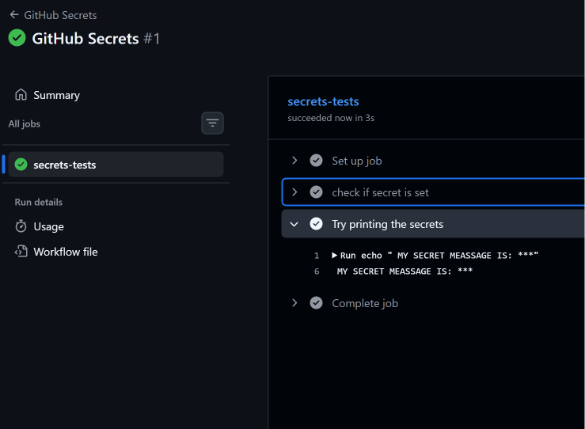
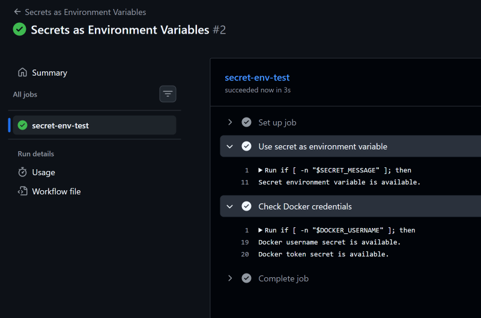
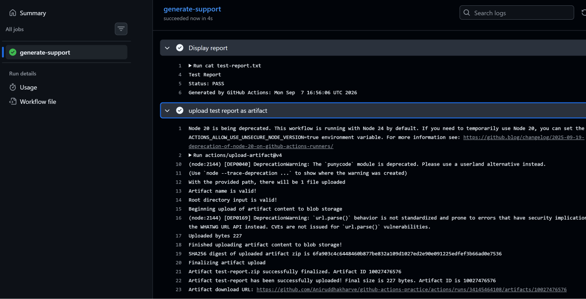
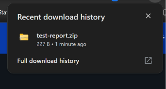
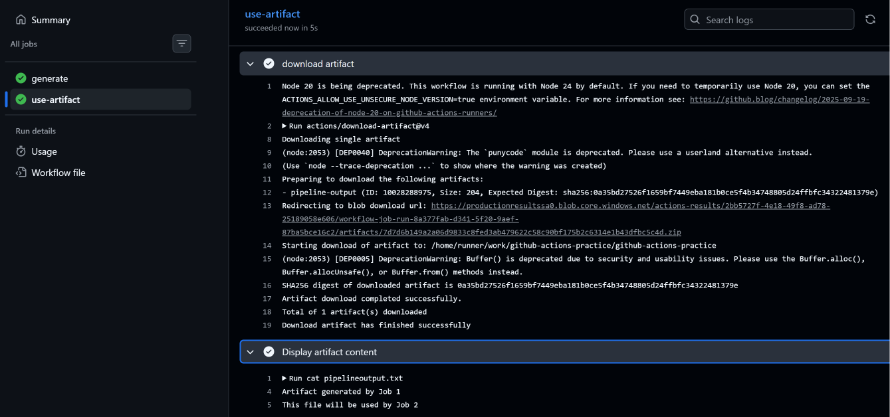
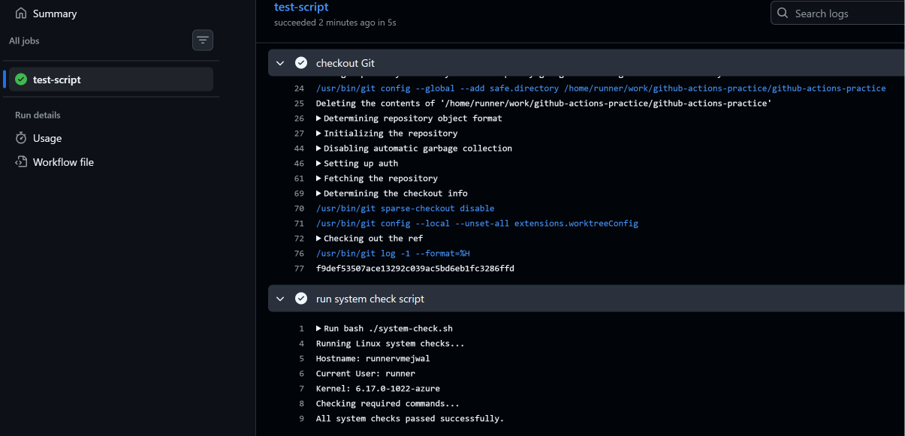
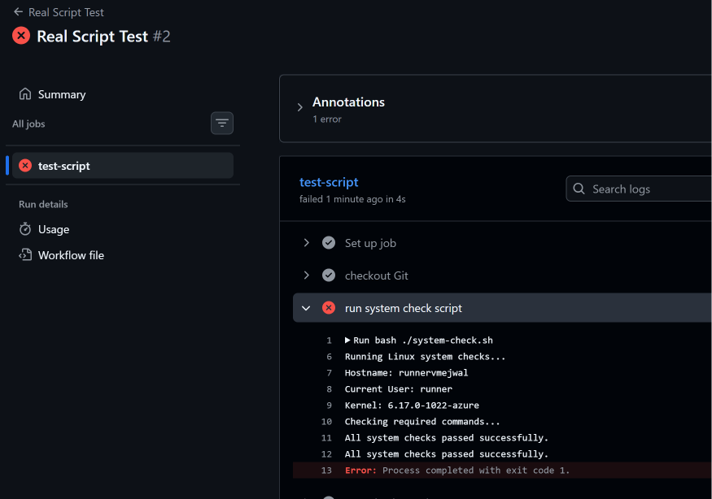
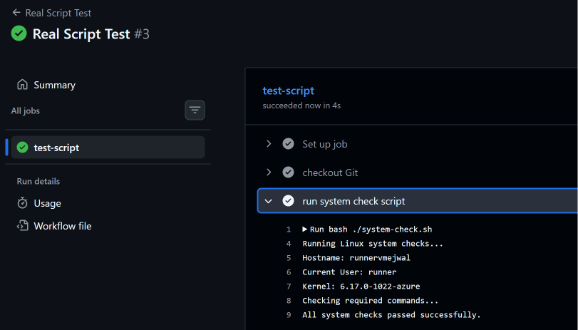
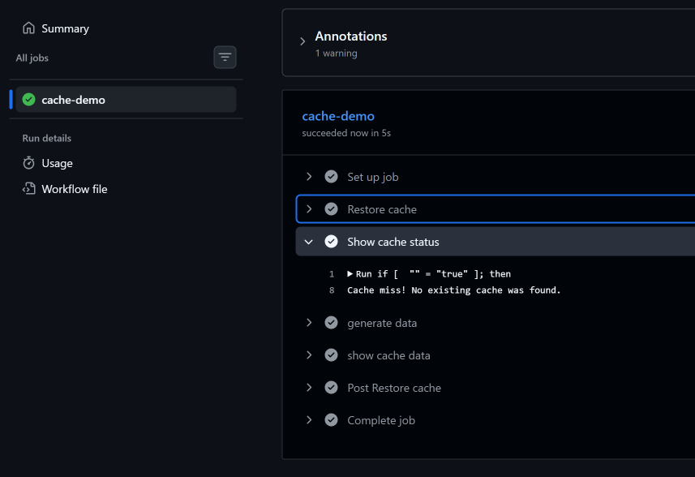
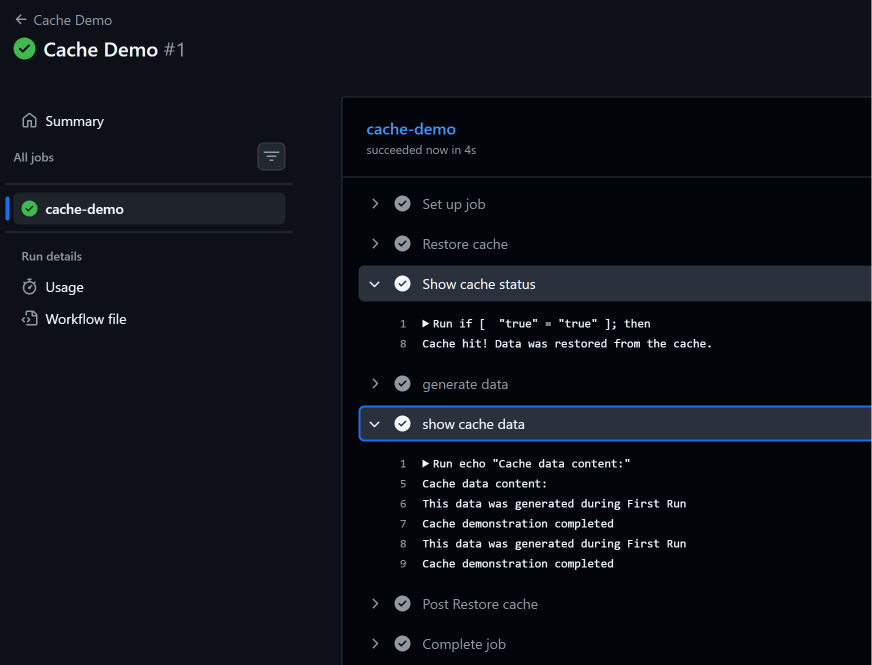

# Day 44 – Secrets, Artifacts & Running Real Tests in CI

## 📌 Overview

Day 44 focused on some of the most practical features of GitHub Actions:

- GitHub Actions Secrets
- Using Secrets as environment variables
- Uploading workflow artifacts
- Sharing artifacts between jobs
- Running a real script inside CI
- Understanding exit codes and pipeline success/failure
- GitHub Actions caching
- Cache miss vs cache hit

Until now, most of the GitHub Actions workflows were focused on understanding the workflow structure and concepts.

Today, the focus was on making the CI pipeline behave more like a **real-world CI environment**.

---

# 🎯 Objectives

By the end of Day 44, I learned how to:

1. Store sensitive information using GitHub Secrets.
2. Prevent secrets from being exposed in CI logs.
3. Pass secrets to commands using environment variables.
4. Upload files as GitHub Actions artifacts.
5. Download artifacts from another job.
6. Run an actual Bash script inside GitHub Actions.
7. Understand how exit codes determine CI success or failure.
8. Intentionally break a test and observe a failed pipeline.
9. Fix the test and restore the pipeline to green.
10. Use GitHub Actions cache.
11. Understand cache miss and cache hit.

---

# 📂 Day 44 Files

The following workflow files were created during Day 44:

```text
.github/workflows/
├── secrets.yml
├── secrets-env.yml
├── upload-artifact.yml
├── artifact-between-jobs.yml
├── real-test.yml
└── cache.yml
```

A Bash script was also created for the real CI test:

```text
system-check.sh
```

---

# 🔐 Task 1 – GitHub Actions Secrets

## What are GitHub Secrets?

GitHub Secrets are used to store sensitive values that should not be written directly inside workflow files.

Examples:

```text
API keys
Passwords
Tokens
Cloud credentials
Docker Hub credentials
SSH keys
```

Instead of writing a sensitive value directly in YAML, the workflow can access it using:

```yaml
${{ secrets.SECRET_NAME }}
```

---

## Creating a Repository Secret

The repository settings were opened:

```text
Repository
    ↓
Settings
    ↓
Secrets and variables
    ↓
Actions
```

A repository secret named:

```text
MY_SECRET_MESSAGE
```

was created.

The actual secret value is intentionally not documented here.

---

## Reading the Secret Safely

The workflow checked whether the secret was available without printing the actual secret value.

The important idea was:

```text
Secret exists
     ↓
Workflow reads secret
     ↓
Only confirmation is printed
     ↓
Actual secret remains hidden
```

Example:

```text
The secret is set: true
```

### 📸 Screenshot



**Screenshot:** `01-secret-masked.png`

---

## What happened when the secret was printed directly?

The secret was also tested by attempting to print it directly:

```yaml
run: echo "${{ secrets.MY_SECRET_MESSAGE }}"
```

GitHub Actions masked the secret value in the workflow logs.

This demonstrates GitHub's secret masking behavior.

However, **this does not mean that printing secrets is safe**.

---

## Why should secrets never be printed in CI logs?

Secrets should never intentionally be printed because:

- Logs can be viewed by people with repository/workflow access.
- Logs may be copied or shared.
- Secrets can potentially be exposed through incorrect handling.
- Debugging output can accidentally reveal sensitive information.
- Masking should be treated as a safety mechanism, not a reason to print secrets.

### Best practice

Never do this:

```yaml
run: echo "${{ secrets.MY_SECRET_MESSAGE }}"
```

Instead, use the secret only where it is required.

---

# 🔑 Task 2 – Using Secrets as Environment Variables

A better way to pass a secret to a command is through an environment variable.

Example:

```yaml
- name: Use secret safely
  env:
    MY_SECRET: ${{ secrets.MY_SECRET_MESSAGE }}
  run: |
    if [ -n "$MY_SECRET" ]; then
      echo "Secret environment variable is available."
    fi
```

The secret is passed into the step through:

```yaml
env:
  MY_SECRET: ${{ secrets.MY_SECRET_MESSAGE }}
```

The shell command can then use:

```bash
$MY_SECRET
```

without hardcoding the sensitive value inside the workflow.

### 📸 Screenshot



**Screenshot:** `02-secret-env-success.png`

---

## Docker Hub Secrets

Two additional repository secrets were also created for use in the upcoming Docker-related work:

```text
DOCKER_USERNAME
DOCKER_TOKEN
```

The actual values are not documented.

These will be useful for authenticating with Docker Hub from GitHub Actions.

---

# 📦 Task 3 – Uploading Artifacts

## What is an Artifact?

An artifact is a file or collection of files produced during a workflow run that we want to preserve after the job finishes.

Examples:

```text
Test reports
Build files
Log files
Screenshots
Compiled binaries
Coverage reports
```

For example, a CI pipeline could generate:

```text
test-report.txt
```

and upload it as an artifact.

---

## Upload Artifact Action

GitHub provides:

```yaml
uses: actions/upload-artifact@v4
```

Example:

```yaml
- name: Upload test report
  uses: actions/upload-artifact@v4
  with:
    name: test-report
    path: test-report.txt
```

The important parts are:

```yaml
name: test-report
```

This gives the artifact its name.

And:

```yaml
path: test-report.txt
```

specifies which file should be uploaded.

---

## Artifact Flow

```text
GitHub Actions Runner
        ↓
Generate report
        ↓
test-report.txt
        ↓
Upload Artifact
        ↓
GitHub Actions stores artifact
        ↓
Artifact can be downloaded later
```

The artifact was successfully uploaded and downloaded from the Actions interface.

### 📸 Screenshots



**Screenshot:** `03-artifact-uploaded.png`



**Screenshot:** `04-artifact-downloaded.png`

---

# 🔄 Task 4 – Downloading Artifacts Between Jobs

Artifacts become especially useful when multiple jobs are involved.

A file created in one job is not automatically available to another job because jobs normally run on separate runners.

For example:

```text
Job 1
  ↓
Generate file
  ↓
Upload artifact
  ↓
GitHub stores artifact
  ↓
Job 2
  ↓
Download artifact
  ↓
Use file
```

---

## Workflow Used

The workflow used two jobs:

```yaml
name: Artifact Between Jobs

on:
  workflow_dispatch:

jobs:
  generate:
    runs-on: ubuntu-latest

    steps:
      - name: Generate file
        run: |
          echo "Artifact generated by Job 1" > pipeline-output.txt
          echo "This file will be used by Job 2" >> pipeline-output.txt

      - name: Upload artifact
        uses: actions/upload-artifact@v4
        with:
          name: pipeline-output
          path: pipeline-output.txt

  use-artifact:
    needs: generate
    runs-on: ubuntu-latest

    steps:
      - name: Download artifact
        uses: actions/download-artifact@v4
        with:
          name: pipeline-output

      - name: Read artifact
        run: |
          echo "Contents of downloaded artifact:"
          cat pipeline-output.txt
```

---

## Important Concept

The second job uses:

```yaml
needs: generate
```

This makes the dependency:

```text
generate
   ↓
use-artifact
```

The second job downloads the artifact using:

```yaml
uses: actions/download-artifact@v4
```

and then reads the file.

### 📸 Screenshot



**Screenshot:** `05-artifact-between-jobs.png`

---

# 🧪 Task 5 – Running a Real Script in CI

## What was the purpose of this task?

The goal was to move from workflows that only print messages such as:

```bash
echo "Tests passed"
```

to actually executing a real script.

A CI pipeline should execute the application, test, or script and determine whether it succeeded based on the program's exit status.

---

## Real Script

A Bash script named:

```text
system-check.sh
```

was created for this practical.

The script performs Linux environment checks:

```bash
#!/bin/bash

set -e

echo "Running Linux system checks..."

echo "Hostname: $(hostname)"
echo "Current User: $(whoami)"
echo "Kernel: $(uname -r)"

echo "Checking required commands..."

command -v bash >/dev/null
command -v git >/dev/null
command -v python >/dev/null

echo "All system checks passed successfully."
```

The script was created specifically for this practical based on the Linux system administration work from earlier days.

---

# ⚙️ Real Test Workflow

The workflow was:

```yaml
name: Real Script Test

on:
  push:
  workflow_dispatch:

jobs:
  test-script:
    runs-on: ubuntu-latest

    steps:
      - name: Checkout repository
        uses: actions/checkout@v4

      - name: Run system check script
        run: bash system-check.sh
```

---

## How the Workflow Works

First:

```yaml
uses: actions/checkout@v4
```

downloads the repository contents onto the GitHub-hosted runner.

Then:

```yaml
run: bash system-check.sh
```

executes the actual Bash script.

The overall flow is:

```text
GitHub Repository
       ↓
actions/checkout@v4
       ↓
Repository files available on runner
       ↓
bash system-check.sh
       ↓
System checks execute
       ↓
Exit status returned
       ↓
GitHub Actions determines success/failure
```

---

# 🟢 Successful Test Run

The first execution completed successfully.

The CI runner executed:

```text
Running Linux system checks...
Hostname: runner...
Current User: runner
Kernel: ...
Checking required commands...
All system checks passed successfully.
```

The workflow finished with a successful status.

### 📸 Screenshot



**Screenshot:** `06-test-passing.png`

---

# 🔴 Intentionally Breaking the Test

To prove that GitHub Actions was actually evaluating the script's result, an intentional failure was added:

```bash
exit 1
```

At the end of the script.

The script still printed:

```text
All system checks passed successfully.
```

but then returned:

```text
exit code 1
```

GitHub Actions therefore marked the step and workflow as failed.

---

## Why did the pipeline fail?

Linux commands and scripts return an exit status.

Generally:

```text
0       → Success
Non-zero → Failure
```

Therefore:

```bash
exit 0
```

means success, while:

```bash
exit 1
```

means failure.

The CI system uses this status to determine whether the command succeeded.

### 📸 Screenshot



**Screenshot:** `07-test-failing.png`

The workflow showed:

```text
Error: Process completed with exit code 1.
```

This was an intentional failure used to demonstrate CI behavior.

---

# 🟢 Fixing the Test

The intentional:

```bash
exit 1
```

was removed from the script.

The workflow was pushed again.

The script executed successfully and GitHub Actions returned the workflow to a green state.

### 📸 Screenshot



**Screenshot:** `08-test-fixed.png`

---

# ⭐ Key Learning from Real Tests

The important lesson from this task is:

```text
CI does not care only about what the script prints.

CI cares about the command's exit status.
```

For example:

```text
Script prints "Success"
        +
exit 0
        ↓
✅ CI Pass
```

But:

```text
Script prints "Success"
        +
exit 1
        ↓
❌ CI Fail
```

This is why simply writing:

```bash
echo "Tests passed"
```

does not represent a real test.

A real program or test must execute and return the appropriate exit code.

---

# ⚡ Task 6 – GitHub Actions Caching

## What is Caching?

Caching allows workflows to reuse data from previous workflow runs.

Without caching:

```text
Run 1 → Download/generate data
Run 2 → Download/generate data again
Run 3 → Download/generate data again
```

With caching:

```text
Run 1 → Generate data → Save cache

Run 2 → Restore cache → Reuse data

Run 3 → Restore cache → Reuse data
```

This can make CI pipelines faster by avoiding repeated work.

---

# 🗂️ Cache Workflow

The workflow used:

```yaml
name: Cache Demo

on:
  workflow_dispatch:

jobs:
  cache-demo:
    runs-on: ubuntu-latest

    steps:
      - name: Restore cache
        id: cache
        uses: actions/cache@v4
        with:
          path: cache-data
          key: demo-cache-v1

      - name: Show cache status
        run: |
          if [ "${{ steps.cache.outputs.cache-hit }}" = "true" ]; then
            echo "Cache hit! Data was restored from the cache."
          else
            echo "Cache miss! No existing cache was found."
          fi

      - name: Generate data
        run: |
          mkdir -p cache-data
          echo "This data was generated during the first run." > cache-data/result.txt
          echo "Cache demonstration completed." >> cache-data/result.txt

      - name: Show cached data
        run: |
          echo "Contents of cache-data:"
          cat cache-data/result.txt
```

---

# ❌ First Run – Cache Miss

During the first workflow run, the cache did not exist.

The workflow reported:

```text
Cache miss! No existing cache was found.
```

The workflow then generated the data and saved it to the cache.

### 📸 Screenshot



**Screenshot:** `09-cache-miss.png`

---

# ✅ Second Run – Cache Hit

The workflow was executed again using the same cache key:

```text
demo-cache-v1
```

This time GitHub Actions found the existing cache.

The workflow reported:

```text
Cache hit! Data was restored from the cache.
```

The cached file was also successfully restored and displayed.

### 📸 Screenshot



**Screenshot:** `10-cache-hit.png`

---

# 🔁 Cache Lifecycle

The complete demonstration was:

```text
FIRST RUN

Cache key: demo-cache-v1
        ↓
Search for cache
        ↓
❌ Cache Miss
        ↓
Generate cache-data/
        ↓
Save cache


SECOND RUN

Cache key: demo-cache-v1
        ↓
Search for cache
        ↓
✅ Cache Hit
        ↓
Restore cache-data/
        ↓
Use existing data
```

---

# 🧠 Common Confusions

## 1. Are Secrets the same as Environment Variables?

No.

A Secret is securely stored by GitHub.

An environment variable is a way to make a value available to a process or step.

For example:

```yaml
env:
  MY_SECRET: ${{ secrets.MY_SECRET_MESSAGE }}
```

Here:

```text
GitHub Secret
     ↓
Environment Variable
     ↓
Command/Script
```

---

## 2. Does GitHub masking mean it is safe to print secrets?

No.

GitHub may mask recognized secret values in logs, but secrets should still never intentionally be printed.

Best practice:

```text
Store secret
    ↓
Pass only where required
    ↓
Use environment variable/input
    ↓
Never print secret
```

---

## 3. Why do we need artifacts?

Artifacts allow us to preserve files generated during a workflow.

For example:

```text
Build Job
    ↓
build.zip
    ↓
Upload Artifact
    ↓
Deploy Job
    ↓
Download Artifact
    ↓
Deploy
```

---

## 4. Why can't Job 2 directly access Job 1's files?

GitHub Actions jobs normally run on separate runners.

Therefore:

```text
Job 1 Runner
    ↓
file.txt
```

does not automatically mean:

```text
Job 2 Runner
    ↓
file.txt
```

The file needs to be transferred using an artifact or another appropriate storage mechanism.

---

## 5. What is the difference between an Artifact and a Cache?

### Artifact

Used to preserve or transfer workflow output.

Examples:

```text
test-report
build.zip
logs
coverage report
```

### Cache

Used mainly to speed up future workflow runs by reusing data.

Examples:

```text
dependency caches
package manager data
generated reusable files
```

Simple way to remember:

```text
Artifact → Keep/transfer output

Cache → Reuse data to make workflows faster
```

---

## 6. Does cache miss mean the workflow failed?

No.

A cache miss simply means the requested cache was not found.

Example:

```text
Cache miss
    ↓
Generate data
    ↓
Save cache
    ↓
Workflow succeeds
```

A cache miss is normal, especially on the first run.

---

## 7. Why did `exit 1` fail the workflow?

Because a non-zero exit status normally indicates failure.

```bash
exit 0
```

means:

```text
Success
```

while:

```bash
exit 1
```

means:

```text
Failure
```

GitHub Actions detects this and marks the step/job accordingly.

---

# 💼 How to Explain in an Interview

### Q: What are GitHub Actions Secrets?

**Answer:**

> GitHub Actions Secrets are encrypted repository or organization-level values used to store sensitive information such as tokens, passwords, and credentials. Workflows can access them using the `secrets` context instead of hardcoding sensitive values in the YAML file.

---

### Q: Why shouldn't you hardcode credentials in a workflow?

**Answer:**

> Hardcoding credentials can expose sensitive information in source code and potentially in logs. I would store them as GitHub Secrets and inject them into the required workflow step through environment variables or supported action inputs.

---

### Q: What are artifacts in GitHub Actions?

**Answer:**

> Artifacts are files generated during a workflow run that can be uploaded and preserved after the job completes. They can also be downloaded by another job, which is useful for passing build outputs, test reports, and logs between jobs.

---

### Q: What is the difference between artifacts and cache?

**Answer:**

> Artifacts are mainly used to preserve or transfer workflow outputs, while caches are used to reuse data between workflow runs to improve performance.

---

### Q: How does GitHub Actions know whether a script passed or failed?

**Answer:**

> GitHub Actions uses the command's exit status. An exit code of zero normally indicates success, while a non-zero exit code indicates failure. In Day 44, I intentionally added `exit 1` to a Bash script and verified that GitHub Actions marked the workflow as failed.

---

### Q: What is `actions/checkout` used for?

**Answer:**

> `actions/checkout` checks out the repository code onto the GitHub Actions runner so that subsequent workflow steps can access and execute the repository files.

---

### Q: What is caching in GitHub Actions?

**Answer:**

> Caching allows reusable data to be stored and restored across workflow runs. It helps reduce repeated work such as downloading dependencies and can improve CI execution time. I demonstrated this using a cache key and verified both cache miss and cache hit scenarios.

---

# 🛠️ Hands-On Scenario

Consider a real application pipeline:

```text
Developer Push
      ↓
GitHub Actions
      ↓
Checkout Code
      ↓
Restore Cache
      ↓
Install Dependencies
      ↓
Run Tests
      ↓
Generate Test Report
      ↓
Upload Artifact
      ↓
Build Application
      ↓
Upload Build Artifact
      ↓
Deploy
```

Secrets could be used for:

```text
Docker Hub credentials
Cloud credentials
API tokens
Deployment credentials
```

Artifacts could contain:

```text
Test reports
Build packages
Logs
Coverage reports
```

Caching could be used for:

```text
Dependencies
Package manager cache
Build-related reusable data
```

---

# 📋 Day 44 Workflow Summary

| Workflow | Purpose |
|---|---|
| `secrets.yml` | GitHub Secrets and secret masking |
| `secrets-env.yml` | Using Secrets through environment variables |
| `upload-artifact.yml` | Uploading an artifact |
| `artifact-between-jobs.yml` | Sharing an artifact between jobs |
| `real-test.yml` | Running a real Bash script in CI |
| `cache.yml` | Demonstrating cache miss and cache hit |

---

# 📸 Screenshot Checklist

All Day 44 practical screenshots:

```text
01-secret-masked.png
02-secret-env-success.png
03-artifact-uploaded.png
04-artifact-downloaded.png
05-artifact-between-jobs.png
06-test-passing.png
07-test-failing.png
08-test-fixed.png
09-cache-miss.png
10-cache-hit.png
```

---

# ⚡ Quick Revision Cheat Sheet

## Secrets

```yaml
${{ secrets.SECRET_NAME }}
```

Never hardcode credentials.

---

## Secret as Environment Variable

```yaml
env:
  MY_SECRET: ${{ secrets.MY_SECRET_MESSAGE }}
```

---

## Upload Artifact

```yaml
uses: actions/upload-artifact@v4
with:
  name: artifact-name
  path: file.txt
```

---

## Download Artifact

```yaml
uses: actions/download-artifact@v4
with:
  name: artifact-name
```

---

## Checkout Repository

```yaml
uses: actions/checkout@v4
```

---

## Run Script

```yaml
run: bash system-check.sh
```

---

## Exit Codes

```text
0       → Success
Non-zero → Failure
```

---

## Cache

```yaml
uses: actions/cache@v4
with:
  path: cache-data
  key: demo-cache-v1
```

```text
Cache miss → Generate/restore process → Save cache

Cache hit  → Restore existing cache → Reuse data
```

---

# 🧠 Key Takeaways

Day 44 connected several important GitHub Actions concepts together.

The major lessons were:

```text
Secrets
   ↓
Protect sensitive information


Artifacts
   ↓
Preserve and transfer workflow files


Real Tests
   ↓
Execute actual scripts
   ↓
Check exit status
   ↓
Pass or fail pipeline


Caching
   ↓
Reuse data between workflow runs
   ↓
Improve CI efficiency
```

The most important practical lesson was that a CI pipeline should **execute real validation**, not simply print a success message.

By intentionally breaking `system-check.sh` with `exit 1` and then fixing it, I verified that GitHub Actions correctly detects the actual result of the script.

---

# 🚀 Day 44 Status

```text
GitHub Secrets              ✅
Secrets as Environment Var  ✅
Artifact Upload             ✅
Artifact Download           ✅
Artifacts Between Jobs      ✅
Real Script Execution       ✅
Intentional CI Failure      ✅
CI Failure Recovery         ✅
Cache Miss                  ✅
Cache Hit                   ✅
```

**Day 44 completed successfully. 🎯**
