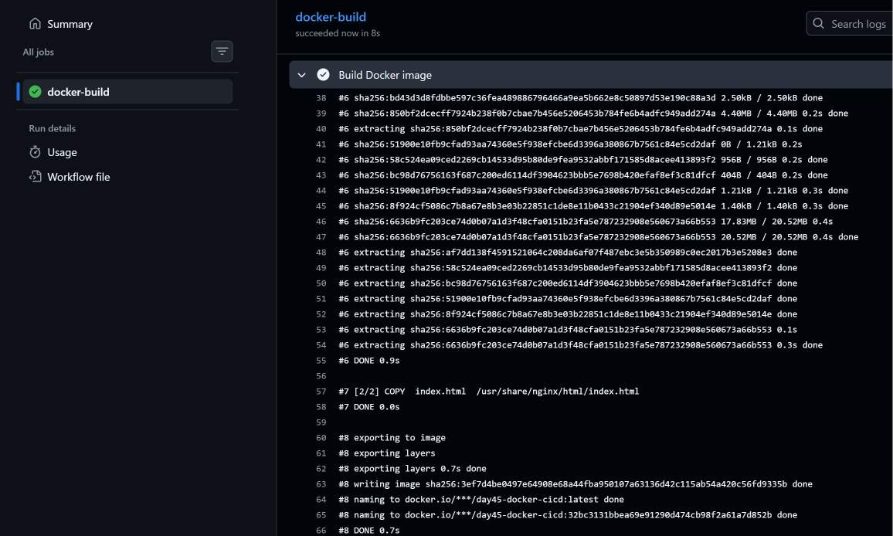
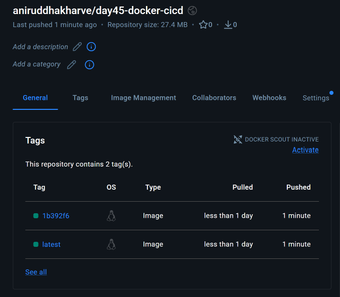
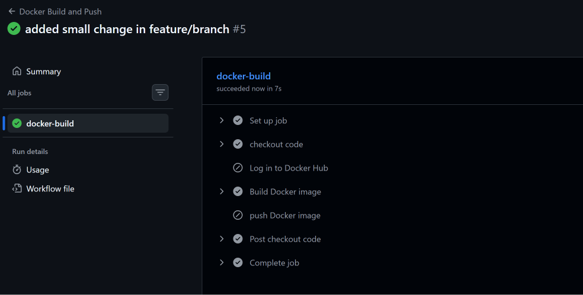
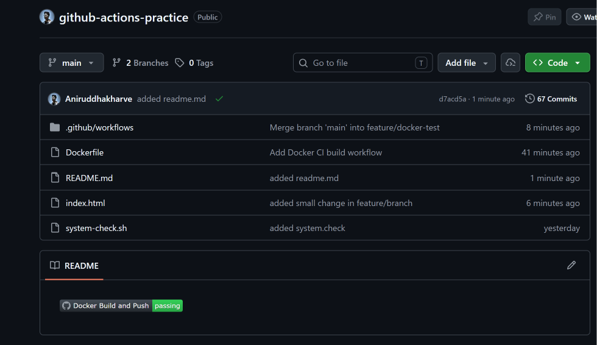
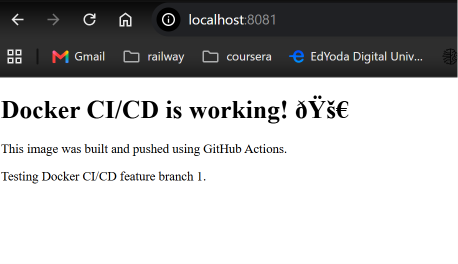

# Day 45 – Docker Build & Push with GitHub Actions

## 📅 Day 45 – Docker CI/CD

Today I connected **Docker with GitHub Actions** and created a complete CI/CD workflow that:

- Builds a Docker image automatically
- Creates multiple image tags
- Logs into Docker Hub using GitHub Secrets
- Pushes images to Docker Hub only from the `main` branch
- Builds the image on feature branches without pushing it
- Adds a GitHub Actions status badge to the repository
- Pulls the image from Docker Hub
- Runs the container locally

---

# 🏗️ What We Built

The complete CI/CD flow looks like this:

```text
Developer
   │
   │ git push
   ▼
GitHub Repository
   │
   ▼
GitHub Actions
   │
   ├── Checkout code
   │
   ├── Docker login
   │      └── Only on main
   │
   ├── Build Docker image
   │
   └── Push image
          └── Only on main
                 │
                 ▼
             Docker Hub
                 │
                 │ docker pull
                 ▼
             Docker Image
                 │
                 │ docker run
                 ▼
          Running Container
                 │
                 ▼
             localhost
```

---

# 📁 Files Created

Day 45 introduced the following files:

```text
github-actions-practice/
│
├── .github/
│   └── workflows/
│       └── docker-publish.yml
│
├── Dockerfile
├── index.html
└── README.md
```

The GitHub Actions workflow file created specifically for Day 45 is:

```text
.github/workflows/docker-publish.yml
```

---

# 🐳 Task 1 – Prepare a Docker Application

Instead of copying the complete three-tier Java application from Day 36, I used a simple Nginx-based Docker application.

This was sufficient for demonstrating the Docker CI/CD workflow.

## `index.html`

```html
<!DOCTYPE html>
<html>
<head>
    <title>Day 45 Docker CI/CD</title>
</head>
<body>
    <h1>Docker CI/CD is working! 🚀</h1>
    <p>This image was built and pushed using GitHub Actions.</p>
</body>
</html>
```

The HTML page gives us a simple way to verify that the Docker container is actually serving the application.

---

# 🐳 Dockerfile

```dockerfile
FROM nginx:alpine
COPY index.html /usr/share/nginx/html/index.html
```

## Explanation

### `FROM nginx:alpine`

Uses the lightweight Alpine-based Nginx image as the base image.

### `COPY index.html /usr/share/nginx/html/index.html`

Copies our HTML file into Nginx's default web root.

When the container starts, Nginx serves this HTML page.

---

# 🔐 GitHub Secrets

The Docker Hub credentials were already configured during Day 44.

The workflow uses:

```text
DOCKER_USERNAME
DOCKER_TOKEN
```

These are stored as **GitHub repository secrets**.

The actual secret values are never written in the workflow.

Instead, GitHub Actions accesses them using:

```yaml
${{ secrets.DOCKER_USERNAME }}
```

and:

```yaml
${{ secrets.DOCKER_TOKEN }}
```

---

# ⚙️ Task 2 – Build Docker Image in GitHub Actions

The initial workflow was created as:

```yaml
name: Docker Build and Push

on:
  push:
  workflow_dispatch:

jobs:
  docker-build:
    runs-on: ubuntu-latest

    steps:
      - name: Checkout repository
        uses: actions/checkout@v4

      - name: Build Docker image
        run: |
          docker build \
            -t ${{ secrets.DOCKER_USERNAME }}/day45-docker-cicd:latest \
            -t ${{ secrets.DOCKER_USERNAME }}/day45-docker-cicd:sha-${GITHUB_SHA::7} \
            .
```

The workflow successfully built the Docker image in the GitHub-hosted runner.

---

## 🏷️ Docker Image Tags

Two tags were created during the build:

```text
latest
```

and:

```text
sha-<short-commit-hash>
```

For example:

```text
aniruddhakharve/day45-docker-cicd:latest
aniruddhakharve/day45-docker-cicd:1b392f6
```

The SHA-based tag provides a way to identify the image corresponding to a particular Git commit.

---

## 📸 Screenshot – Successful Docker Build



The GitHub Actions run showed the Docker image being successfully built and tagged.

---

# 🚀 Task 3 – Push Docker Image to Docker Hub

Next, Docker Hub authentication and image pushing were added.

The workflow was updated to:

```yaml
name: Docker Build and Push

on:
  push:
  workflow_dispatch:

jobs:
  docker-build:
    runs-on: ubuntu-latest

    steps:
      - name: Checkout repository
        uses: actions/checkout@v4

      - name: Log in to Docker Hub
        uses: docker/login-action@v3
        with:
          username: ${{ secrets.DOCKER_USERNAME }}
          password: ${{ secrets.DOCKER_TOKEN }}

      - name: Build Docker image
        run: |
          docker build \
            -t ${{ secrets.DOCKER_USERNAME }}/day45-docker-cicd:latest \
            -t ${{ secrets.DOCKER_USERNAME }}/day45-docker-cicd:sha-${GITHUB_SHA::7} \
            .

      - name: Push Docker image
        run: |
          docker push ${{ secrets.DOCKER_USERNAME }}/day45-docker-cicd:latest
          docker push ${{ secrets.DOCKER_USERNAME }}/day45-docker-cicd:sha-${GITHUB_SHA::7}
```

---

# 🔑 Docker Hub Login

The workflow uses:

```yaml
uses: docker/login-action@v3
```

Credentials are provided through GitHub Secrets:

```yaml
username: ${{ secrets.DOCKER_USERNAME }}
password: ${{ secrets.DOCKER_TOKEN }}
```

This prevents Docker Hub credentials from being hardcoded into the workflow.

---

# 📦 Docker Hub Image

The image repository created for this exercise is:

```text
aniruddhakharve/day45-docker-cicd
```

The image was successfully pushed with:

```text
latest
```

and a commit-specific SHA tag.

The Docker Hub repository showed both tags successfully.

---

## 📸 Screenshot – Docker Hub Tags



The screenshot shows the Docker image repository with:

```text
latest
sha-<commit-hash>
```

---

# 🌿 Task 4 – Build on Feature Branch but Push Only on Main

A common CI/CD requirement is:

> Build and test code from every branch, but publish production Docker images only from `main`.

To demonstrate this, the workflow was changed so that:

- Docker image building happens on all push events
- Docker Hub login happens only on `main`
- Docker image push happens only on `main`

The final workflow is:

```yaml
name: Docker Build and Push

on:
  push:
  workflow_dispatch:

jobs:
  docker-build:
    runs-on: ubuntu-latest

    steps:
      - name: Checkout repository
        uses: actions/checkout@v4

      - name: Log in to Docker Hub
        if: github.ref == 'refs/heads/main'
        uses: docker/login-action@v3
        with:
          username: ${{ secrets.DOCKER_USERNAME }}
          password: ${{ secrets.DOCKER_TOKEN }}

      - name: Build Docker image
        run: |
          docker build \
            -t ${{ secrets.DOCKER_USERNAME }}/day45-docker-cicd:latest \
            -t ${{ secrets.DOCKER_USERNAME }}/day45-docker-cicd:sha-${GITHUB_SHA::7} \
            .

      - name: Push Docker image
        if: github.ref == 'refs/heads/main'
        run: |
          docker push ${{ secrets.DOCKER_USERNAME }}/day45-docker-cicd:latest
          docker push ${{ secrets.DOCKER_USERNAME }}/day45-docker-cicd:sha-${GITHUB_SHA::7}
```

---

# 🧠 Important Condition

The following condition checks whether the workflow is running on the `main` branch:

```yaml
if: github.ref == 'refs/heads/main'
```

Therefore:

### Main branch

```text
Checkout       ✅
Docker Login   ✅
Docker Build   ✅
Docker Push    ✅
```

### Feature branch

```text
Checkout       ✅
Docker Login   ⏭️ Skipped
Docker Build   ✅
Docker Push    ⏭️ Skipped
```

This prevents feature branch builds from publishing Docker images to Docker Hub.

---

## 📸 Screenshot – Feature Branch



The feature branch workflow successfully built the Docker image, while the Docker Hub login and push steps were skipped.

This verified the branch-based publishing condition.

---

# 🏷️ Task 5 – GitHub Actions Status Badge

A GitHub Actions status badge was added to the repository README.

The badge displays whether the Docker Build and Push workflow is passing.

The repository README now shows:

```text
Docker Build and Push    passing
```

This provides a quick visual indication of the CI/CD pipeline status.

---

## 📸 Screenshot – Status Badge



The green `passing` badge confirms that the workflow is currently successful.

---

# 🐳 Task 6 – Pull and Run the Docker Image

After successfully pushing the image to Docker Hub, the next step was to verify that the image could actually be used outside GitHub Actions.

The image was pulled from Docker Hub and then run as a Docker container.

---

## Pull the Image

```bash
docker pull aniruddhakharve/day45-docker-cicd:latest
```

This downloads the `latest` image from Docker Hub to the local Docker environment.

---

## Run the Container

Example:

```bash
docker run -d --name day45-app -p 8080:80 aniruddhakharve/day45-docker-cicd:latest
```

### Port Mapping

```text
8080:80
  │   │
  │   └── Container port
  └────── Host port
```

Nginx listens on port `80` inside the container.

The host exposes it through port `8080`.

---

## Verify Running Container

```bash
docker ps
```

The container should appear with the name:

```text
day45-app
```

---

## Access the Application

The application was successfully accessed through the local browser.

In the practical run, the application was accessed using:

```text
http://localhost:8081
```

The host port can differ depending on the port mapping used when starting the container.

The page displayed:

```text
Docker CI/CD is working! 🚀
```

along with:

```text
This image was built and pushed using GitHub Actions.
```

This confirmed that the Docker image was successfully running as a container.

---

## 📸 Screenshot – Pull & Run



The screenshot shows the successfully running Docker-served application.

---

# 🔄 Complete CI/CD Journey

The complete journey from source code to running container was:

```text
1. Developer changes application code
                ↓
2. git push
                ↓
3. GitHub receives the commit
                ↓
4. GitHub Actions workflow starts
                ↓
5. actions/checkout checks out the code
                ↓
6. Docker image is built
                ↓
7. Image receives two tags
                ↓
       latest
       sha-<commit>
                ↓
8. Branch condition is evaluated
                ↓
       ┌───────────────┐
       │ Is it main?   │
       └───────┬───────┘
               │
        ┌──────┴──────┐
       YES            NO
        │              │
        ▼              ▼
   Docker Login      Build only
        │
        ▼
   Docker Push
        │
        ▼
   Docker Hub
        │
        ▼
   docker pull
        │
        ▼
   docker run
        │
        ▼
   Running Container
        │
        ▼
   Browser / localhost
```

---

# 🧠 Why Use `latest` and SHA Tags?

Using only:

```text
latest
```

makes it easy to pull the newest version:

```bash
docker pull aniruddhakharve/day45-docker-cicd:latest
```

However, `latest` does not tell us exactly which Git commit produced the image.

The SHA tag solves this:

```text
sha-1b392f6
```

Now an image can be associated with a specific commit.

Conceptually:

```text
Git Commit
   ↓
Commit SHA
   ↓
Docker Image
   ↓
sha-<short-SHA>
```

This is useful for traceability and debugging.

---

# 🔐 Why Should Docker Hub Credentials Be Stored as Secrets?

Credentials should never be hardcoded:

```yaml
username: myusername
password: mypassword
```

Instead, GitHub Secrets are used:

```yaml
username: ${{ secrets.DOCKER_USERNAME }}
password: ${{ secrets.DOCKER_TOKEN }}
```

Advantages:

- Credentials are not stored in source code
- Secrets can be managed separately
- Sensitive values can be rotated
- The same workflow can be used without exposing credentials

---

# 🌿 Why Build Feature Branches?

Building feature branches is useful because it allows CI to verify changes before merging.

For example:

```text
feature/login
      ↓
Git Push
      ↓
GitHub Actions
      ↓
Docker Build
      ↓
Build successful
      ↓
Pull Request
      ↓
Merge to main
      ↓
Docker Build
      ↓
Docker Hub Push
```

This creates a safer deployment process.

---

# ⚠️ Common Errors and Confusions

## 1. Docker image builds but push fails

Possible causes:

- Incorrect Docker Hub username
- Invalid Docker Hub token
- Incorrect GitHub Secret names
- Docker Hub authentication failure

Check that the workflow uses:

```yaml
${{ secrets.DOCKER_USERNAME }}
```

and:

```yaml
${{ secrets.DOCKER_TOKEN }}
```

---

## 2. Feature branch accidentally pushes an image

Make sure the push step contains:

```yaml
if: github.ref == 'refs/heads/main'
```

The Docker login step should also use the same condition.

---

## 3. Feature branch workflow shows push failure instead of skipped

This usually means the updated workflow containing the `if` condition has not been committed/pushed to the feature branch.

The feature branch must contain the corrected workflow.

Expected result:

```text
Build Docker image    ✅
Push Docker image     ⏭️ Skipped
```

---

## 4. `latest` image is not the expected version

Remember that:

```text
latest
```

is a mutable tag.

If another successful main branch workflow pushes a newer image using `latest`, the tag points to the newer image.

For exact version identification, use:

```text
sha-<commit>
```

---

## 5. Browser cannot access the application

Check:

```bash
docker ps
```

Then verify the port mapping.

For example:

```text
0.0.0.0:8080->80/tcp
```

means:

```text
http://localhost:8080
```

If the host port was mapped to `8081`, then access:

```text
http://localhost:8081
```

---

# 🎯 Interview Questions

## 1. How do you build a Docker image using GitHub Actions?

### Answer

I use a GitHub Actions workflow triggered by a Git push. The workflow checks out the repository using `actions/checkout` and then runs `docker build` with the required image tags.

Example:

```yaml
- name: Build Docker image
  run: |
    docker build \
      -t username/repository:latest \
      -t username/repository:sha-${GITHUB_SHA::7} \
      .
```

---

## 2. How do you push a Docker image to Docker Hub from GitHub Actions?

### Answer

First I authenticate with Docker Hub using `docker/login-action` and GitHub Secrets. Then I run `docker push` for the required image tags.

---

## 3. Why do you use GitHub Secrets?

### Answer

GitHub Secrets allow me to store sensitive values such as Docker Hub credentials outside the source code. The workflow accesses them using the `secrets` context.

---

## 4. How do you prevent feature branches from pushing Docker images?

### Answer

I use an `if` condition on the login and push steps:

```yaml
if: github.ref == 'refs/heads/main'
```

This allows Docker builds on feature branches while restricting Docker Hub publishing to the `main` branch.

---

## 5. What is the purpose of a SHA-based Docker tag?

### Answer

A SHA-based tag connects a Docker image to the Git commit that produced it. This improves traceability because I can identify which source-code version generated a particular image.

---

## 6. Why use both `latest` and SHA tags?

### Answer

`latest` is convenient for pulling the newest image, while the SHA tag provides an immutable reference to a particular build.

---

## 7. What happens when code is pushed to a feature branch?

### Answer

The GitHub Actions workflow runs and builds the Docker image, but the Docker login and push steps are skipped because they are restricted to the `main` branch.

---

## 8. What happens when code is pushed to `main`?

### Answer

The workflow checks out the code, logs into Docker Hub using GitHub Secrets, builds the Docker image, tags it with `latest` and a short Git SHA, and pushes both tags to Docker Hub.

---

# 🗣️ How to Explain This Project in an Interview

> "I created a GitHub Actions workflow to implement Docker CI/CD. Whenever code is pushed, GitHub Actions checks out the repository and builds a Docker image. I tag the image with both `latest` and a short Git commit SHA for traceability. I use GitHub Secrets for Docker Hub authentication. I also added a branch condition so feature branches can build the Docker image but only the main branch can push it to Docker Hub. Finally, I pulled the published image from Docker Hub and ran it locally to verify that the application was working."

---

# ⚡ Quick Revision Cheat Sheet

| Concept | Key Point |
|---|---|
| GitHub Actions | Automates CI/CD workflows |
| Dockerfile | Defines how the Docker image is built |
| `docker build` | Creates Docker image |
| `docker login` | Authenticates with Docker registry |
| `docker push` | Uploads image to registry |
| Docker Hub | Container image registry |
| `latest` | Convenient mutable image tag |
| SHA tag | Identifies a specific build/commit |
| GitHub Secrets | Stores sensitive credentials |
| `github.ref` | Identifies the Git reference |
| `if:` | Controls whether a workflow step runs |
| `docker pull` | Downloads image from registry |
| `docker run` | Creates and starts container |
| Status badge | Shows workflow status in README |

---

# 🧪 Practical Scenario

### Requirement

A development team wants:

- Every branch to build the Docker image
- Only `main` to publish images
- Docker Hub credentials to remain secret
- Every published image to have a version identifier

### Solution

```text
Feature Branch
     │
     ▼
Docker Build
     │
     └── No Docker Hub Push

Main Branch
     │
     ▼
Docker Build
     │
     ▼
Docker Login
     │
     ▼
Docker Push
     │
     ├── latest
     └── sha-<commit>
```

This is the basic structure of a branch-aware Docker CI/CD pipeline.

---

# 📊 Practical Results

The following were successfully demonstrated during Day 45:

- ✅ Created a Dockerfile
- ✅ Created a simple Docker application
- ✅ Built Docker image using GitHub Actions
- ✅ Created `latest` Docker tag
- ✅ Created short SHA Docker tag
- ✅ Logged into Docker Hub using GitHub Secrets
- ✅ Pushed Docker image to Docker Hub
- ✅ Verified Docker Hub image tags
- ✅ Built Docker image from a feature branch
- ✅ Skipped Docker Hub login on feature branch
- ✅ Skipped Docker Hub push on feature branch
- ✅ Added GitHub Actions status badge
- ✅ Pulled Docker image
- ✅ Ran Docker container
- ✅ Verified application in browser

---

# 📸 Screenshots

All Day 45 screenshots:

```text
screenshots/
│
├── 01-docker-build-success.png
├── 02-dockerhub-image-tags.png
├── 03-feature-branch-no-push.png
├── 04-status-badge.png
└── 05-pull-run-container.png
```

---

# 📁 Final Day 45 Structure

```text
2026/
└── day-45/
    ├── day-45-docker-cicd.md
    └── screenshots/
        ├── 01-docker-build-success.png
        ├── 02-dockerhub-image-tags.png
        ├── 03-feature-branch-no-push.png
        ├── 04-status-badge.png
        └── 05-pull-run-container.png
```

---

# 🏁 Day 45 Status

```text
Day 45 – Docker Build & Push in GitHub Actions

Dockerfile                  ✅
Docker Image Build          ✅
Docker Hub Authentication   ✅
Docker Hub Push             ✅
Latest Tag                  ✅
SHA Tag                     ✅
Feature Branch Build       ✅
Main Branch Push            ✅
GitHub Actions Badge        ✅
Docker Pull                 ✅
Docker Run                  ✅
Application Verification    ✅

Status: COMPLETED 🎉
```

---

# 🚀 Key Takeaway

Day 45 connected the concepts learned in the previous days into an actual Docker CI/CD workflow.

The important flow to remember is:

```text
Git Push
   ↓
GitHub Actions
   ↓
Docker Build
   ↓
Tag Image
   ↓
Branch Check
   ↓
main ──────────────→ Docker Hub Push
   │
   └── feature ────→ Build Only
                         ↓
                    Docker Pull
                         ↓
                    Docker Run
                         ↓
                    Application
```

This is a practical foundation for building more advanced CI/CD pipelines with Docker, security scanning, automated testing, deployment, and cloud infrastructure.
