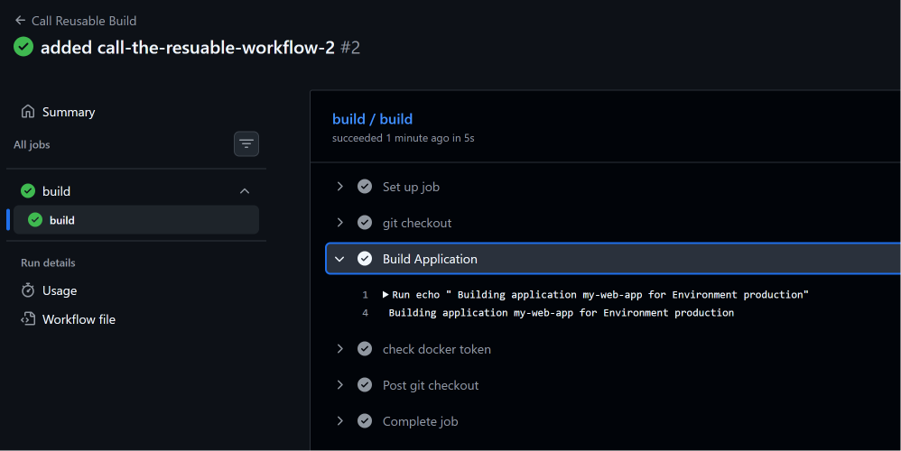
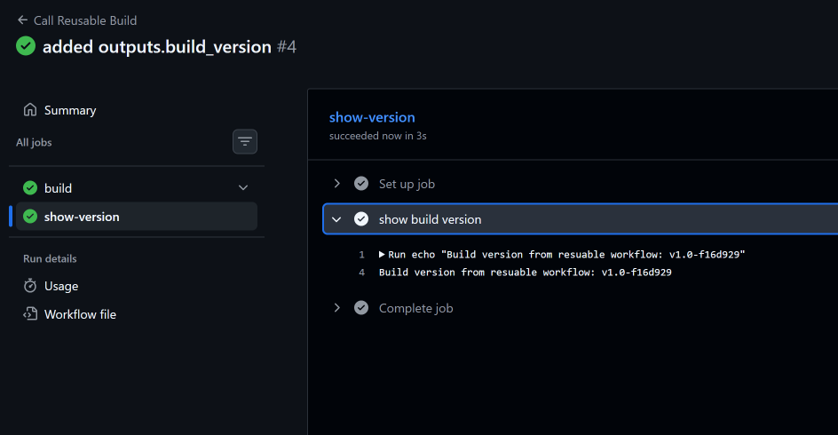
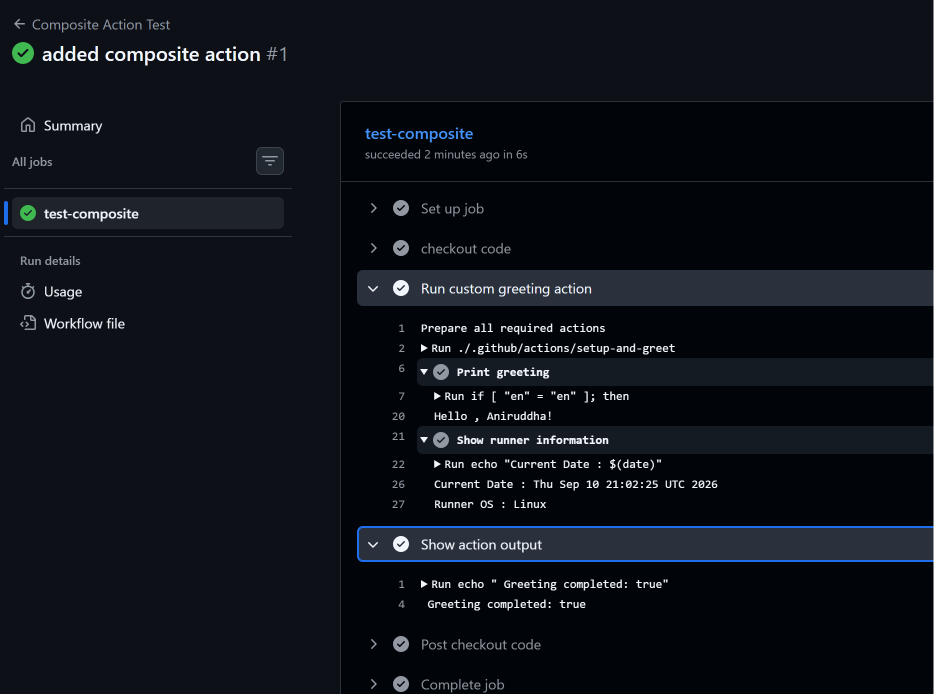

# Day 46 – Reusable Workflows & Composite Actions

## 📅 Day 46 – GitHub Actions Reusable Workflows & Composite Actions

Today I learned how to avoid repeating GitHub Actions workflow logic by creating:

- A reusable workflow using `workflow_call`
- A caller workflow that invokes the reusable workflow
- Outputs from a reusable workflow
- A custom composite action
- A workflow that uses the composite action
- The difference between reusable workflows and composite actions

The main goal was to understand how GitHub Actions can be designed using reusable components instead of duplicating the same steps across multiple workflows.

---

# 🎯 What We Built

The Day 46 implementation contains:

```text
github-actions-practice/
│
├── .github/
│   ├── workflows/
│   │   ├── reusable-build.yml
│   │   ├── call-build.yml
│   │   └── composite-test.yml
│   │
│   └── actions/
│       └── setup-and-greet/
│           └── action.yml
```

The complete concept is:

```text
Caller Workflow
      │
      │ workflow_call
      ▼
Reusable Workflow
      │
      ├── Checkout
      ├── Build Application
      ├── Check Secret
      └── Generate Version
              │
              ▼
        build_version
              │
              ▼
       Caller Workflow
              │
              ▼
         Show Version
```

And for the composite action:

```text
Workflow
   │
   ▼
Composite Action
   │
   ├── Print Greeting
   └── Show Runner Information
   │
   ▼
Action Output
```

---

# 🧠 Task 1 – Understand `workflow_call`

## 1. What is a Reusable Workflow?

A reusable workflow is a GitHub Actions workflow that can be called by another workflow instead of duplicating the same workflow logic.

It allows teams to create common CI/CD processes once and reuse them from multiple workflows.

Example:

```yaml
jobs:
  build:
    uses: ./.github/workflows/reusable-build.yml
```

The reusable workflow contains the actual job and step logic.

---

# 2. What is `workflow_call`?

`workflow_call` is the trigger that makes a GitHub Actions workflow reusable.

Basic syntax:

```yaml
on:
  workflow_call:
```

A workflow using `workflow_call` waits for another workflow to call it.

It can define:

- Inputs
- Secrets
- Outputs

Example:

```yaml
on:
  workflow_call:
    inputs:
      app_name:
        required: true
        type: string
```

---

# 3. Reusable Workflow vs Regular Action

A regular GitHub Action is normally used inside a workflow step:

```yaml
steps:
  - name: Checkout
    uses: actions/checkout@v4
```

A reusable workflow is called at the job level:

```yaml
jobs:
  build:
    uses: ./.github/workflows/reusable-build.yml
```

The key difference is:

```text
Regular Action
     ↓
Called inside a STEP


Reusable Workflow
     ↓
Called at JOB level
```

---

# 4. Where Must a Reusable Workflow Live?

Reusable workflows must be stored inside:

```text
.github/workflows/
```

Our reusable workflow is:

```text
.github/workflows/reusable-build.yml
```

---

# 🚀 Task 2 – Create the Reusable Workflow

We created:

```text
.github/workflows/reusable-build.yml
```

The reusable workflow accepts:

- `app_name`
- `environment`
- `docker_token`

It also generates and exposes a `build_version`.

---

# 📄 `reusable-build.yml`

```yaml
name: Reusable Build

on:
  workflow_call:

    inputs:
      app_name:
        description: 'Application name'
        required: true
        type: string

      environment:
        description: "Deployment environment"
        required: true
        type: string
        default: "staging"

    secrets:
      docker_token:
        description: "Docker Hub token"
        required: true

    outputs:
      build_version:
        description: "Generated build version"
        value: ${{ jobs.build.outputs.build_version }}

jobs:
  build:
    runs-on: ubuntu-latest

    outputs:
      build_version: ${{ steps.version.outputs.build_version }}

    steps:

      - name: git checkout
        uses: actions/checkout@v7

      - name: Build Application
        run: |
          echo " Building application ${{ inputs.app_name }} for Environment ${{ inputs.environment }}"

      - name: check docker token
        run: |
          if [ -n "${{ secrets.docker_token }}" ]; then
            echo "Docker token is set: true"
          else
            echo "Docker token is set: false"
          fi

      - name: Generate build version
        id: version
        run: |
          VERSION="v1.0-${GITHUB_SHA::7}"
          echo "Build version: $VERSION"
          echo "build_version=$VERSION" >> "$GITHUB_OUTPUT"
```

---

# 🧩 Understanding the Inputs

The reusable workflow defines:

```yaml
inputs:
  app_name:
    required: true
    type: string
```

and:

```yaml
environment:
  required: true
  type: string
  default: "staging"
```

The caller can provide these values.

For our practical:

```yaml
with:
  app_name: "my-web-app"
  environment: "production"
```

Therefore the reusable workflow printed:

```text
Building my-web-app for Environment production
```

---

# 🔐 Understanding the Secret Mapping

The reusable workflow defines its own secret interface:

```yaml
secrets:
  docker_token:
    description: "Docker Hub token"
    required: true
```

Our actual repository secret is:

```text
DOCKER_TOKEN
```

The caller maps the repository secret to the reusable workflow secret:

```yaml
secrets:
  docker_token: ${{ secrets.DOCKER_TOKEN }}
```

The flow is:

```text
Repository Secret
DOCKER_TOKEN
       │
       │ mapping
       ▼
Caller Workflow
docker_token: ${{ secrets.DOCKER_TOKEN }}
       │
       ▼
Reusable Workflow
${{ secrets.docker_token }}
```

This means the reusable workflow does not need to know the original repository secret name.

---

# 🔒 Secret Safety

We never printed the actual Docker token.

Instead, we checked whether the secret was set:

```bash
if [ -n "${{ secrets.docker_token }}" ]; then
  echo "Docker token is set: true"
else
  echo "Docker token is set: false"
fi
```

Expected result:

```text
Docker token is set: true
```

This is safer than exposing the actual secret value in logs.

---

# 📤 Task 4 – Reusable Workflow Outputs

We extended the reusable workflow to generate a build version.

The version format used was:

```text
v1.0-<short-commit-sha>
```

For example, during the practical run:

```text
v1.0-f16d929
```

---

# 🔄 Output Flow

There are multiple output levels involved:

```text
Generate build version step
        │
        ▼
steps.version.outputs.build_version
        │
        ▼
build job output
        │
        ▼
jobs.build.outputs.build_version
        │
        ▼
workflow_call output
        │
        ▼
needs.build.outputs.build_version
        │
        ▼
Caller second job
```

---

# 🏗️ Step Output

The step was given an ID:

```yaml
- name: Generate build version
  id: version
```

Then the output was written to:

```bash
echo "build_version=$VERSION" >> "$GITHUB_OUTPUT"
```

The generated value was:

```text
v1.0-f16d929
```

---

# 📤 Job Output

The job exposes the step output:

```yaml
jobs:
  build:
    outputs:
      build_version: ${{ steps.version.outputs.build_version }}
```

This makes the step output available as a job output.

---

# 📤 Reusable Workflow Output

The reusable workflow then exposes the job output:

```yaml
on:
  workflow_call:
    outputs:
      build_version:
        description: "Generated build version"
        value: ${{ jobs.build.outputs.build_version }}
```

Therefore the caller can access the output.

---

# 🚀 Task 3 – Create the Caller Workflow

We created:

```text
.github/workflows/call-build.yml
```

The caller workflow runs when code is pushed to `main`.

---

# 📄 `call-build.yml`

```yaml
name: Call Reusable Build

on:
  push:
    branches:
      - main

jobs:
  build:
    uses: ./.github/workflows/reusable-build.yml
    with:
      app_name: "my-web-app"
      environment: "production"
    secrets:
      docker_token: ${{ secrets.DOCKER_TOKEN }}

  show-version:
    needs: build
    runs-on: ubuntu-latest

    steps:
      - name: show build version
        run: |
          echo "Build version from resuable workflow: ${{ needs.build.outputs.build_version }}"
```

---

# 🧠 How the Caller Works

The caller invokes the reusable workflow using:

```yaml
jobs:
  build:
    uses: ./.github/workflows/reusable-build.yml
```

Inputs are passed using:

```yaml
with:
  app_name: "my-web-app"
  environment: "production"
```

The repository secret is mapped using:

```yaml
secrets:
  docker_token: ${{ secrets.DOCKER_TOKEN }}
```

---

# 🔗 Job Dependency

The second job uses:

```yaml
needs: build
```

This means:

```text
build
  │
  ▼
show-version
```

The `show-version` job waits for the reusable workflow job to complete.

Then it reads:

```yaml
${{ needs.build.outputs.build_version }}
```

---

# 📸 Screenshot – Reusable Workflow Caller



The caller successfully triggered the reusable workflow.

The reusable workflow received:

```text
app_name = my-web-app
environment = production
```

and printed:

```text
Building my-web-app for Environment production
```

---

# 📸 Screenshot – Reusable Workflow Output



The second job successfully received the output generated by the reusable workflow.

The practical result was:

```text
Build version from resuable workflow: v1.0-f16d929
```

This verified that the output successfully travelled from the reusable workflow to the caller workflow.

---

# 🧩 Task 5 – Create a Composite Action

Next, we created a custom composite action.

The action is located at:

```text
.github/actions/setup-and-greet/action.yml
```

A composite action bundles multiple steps into one reusable action.

---

# 📄 `action.yml`

```yaml
name: Setup and Greet
description: "A custom composite action that greets the user and shows runner information"

inputs:
  name:
    description: "Name to greet"
    required: true

  language:
    description: "Greeting language"
    required: false
    default: "en"

outputs:
  greeted:
    description: "Whether the greeting was completed"
    value: ${{ steps.greeting.outputs.greeted }}

runs:
  using: "composite"

  steps:
    - name: Print greeting
      id: greeting
      shell: bash
      run: |
        if [ "${{ inputs.language }}" = "en" ]; then
          echo "Hello, ${{ inputs.name }}!"
        elif [ "${{ inputs.language }}" = "hi" ]; then
          echo "Namaste, ${{ inputs.name }}!"
        elif [ "${{ inputs.language }}" = "fr" ]; then
          echo "Bonjour, ${{ inputs.name }}!"
        else
          echo "Hello, ${{ inputs.name }}!"
        fi

        echo "greeted=true" >> "$GITHUB_OUTPUT"

    - name: Show runner information
      shell: bash
      run: |
        echo "Current date: $(date)"
        echo "Runner OS: $RUNNER_OS"
```

---

# 🧠 Composite Action Inputs

The action accepts:

```yaml
name:
```

and:

```yaml
language:
```

The language has a default:

```yaml
default: "en"
```

Our workflow used:

```yaml
with:
  name: "Aniruddha"
  language: "en"
```

---

# 📤 Composite Action Output

The action exposes:

```yaml
outputs:
  greeted:
```

The value comes from:

```yaml
value: ${{ steps.greeting.outputs.greeted }}
```

The greeting step sets the output using:

```bash
echo "greeted=true" >> "$GITHUB_OUTPUT"
```

Therefore:

```text
Greeting Step
      ↓
greeted=true
      ↓
Composite Action Output
      ↓
Caller Workflow
```

---

# ⚙️ `runs: using: composite`

This tells GitHub Actions that this is a composite action:

```yaml
runs:
  using: "composite"
```

The composite action can then contain multiple steps.

---

# 🚀 Workflow Using the Composite Action

We created:

```text
.github/workflows/composite-test.yml
```

The workflow uses the custom action inside a step.

```yaml
name: Composite Action Test

on:
  push:
    branches:
      - main
  workflow_dispatch:

jobs:
  test-composite:
    runs-on: ubuntu-latest

    steps:
      - name: Checkout repository
        uses: actions/checkout@v4

      - name: Run custom greeting action
        id: greet
        uses: ./.github/actions/setup-and-greet
        with:
          name: "Aniruddha"
          language: "en"

      - name: Show action output
        run: |
          echo "Greeting completed: ${{ steps.greet.outputs.greeted }}"
```

---

# 📸 Screenshot – Composite Action



The custom composite action successfully executed.

The workflow output showed:

```text
Hello, Aniruddha!
```

and:

```text
Runner OS : Linux
```

The action output was:

```text
Greeting completed: true
```

This verified that the custom composite action worked correctly.

---

# 🆚 Task 6 – Reusable Workflow vs Composite Action

| Feature | Reusable Workflow | Composite Action |
|---|---|---|
| Triggered by | `workflow_call` | `uses:` in a step |
| Can contain jobs? | ✅ Yes | ❌ No |
| Can contain multiple steps? | ✅ Yes | ✅ Yes |
| Lives where? | `.github/workflows/` | `.github/actions/<action-name>/action.yml` |
| Can accept secrets directly? | ✅ Yes, through `workflow_call.secrets` | ❌ No direct `secrets` declaration; required values can be passed through supported inputs/environment |
| Best for | Reusing complete CI/CD workflows and jobs | Reusing a common group of steps |

---

# 🧠 The Most Important Difference

The easiest way to remember the difference is:

```text
REUSABLE WORKFLOW
        ↓
Complete workflow logic
        ↓
Can contain JOBS
        ↓
Called at JOB level
```

Whereas:

```text
COMPOSITE ACTION
        ↓
Group of reusable STEPS
        ↓
Cannot contain JOBS
        ↓
Called inside a STEP
```

---

# 🔥 Calling Syntax Comparison

## Reusable Workflow

```yaml
jobs:
  build:
    uses: ./.github/workflows/reusable-build.yml
```

`uses:` appears under:

```text
jobs
```

---

## Composite Action

```yaml
steps:
  - name: Run custom greeting action
    uses: ./.github/actions/setup-and-greet
```

`uses:` appears under:

```text
steps
```

---

# 🎯 Interview Questions

## 1. What is a reusable workflow?

### Answer

A reusable workflow is a GitHub Actions workflow that can be called by another workflow. It helps avoid duplicating workflow logic and can contain multiple jobs and steps.

---

## 2. What is `workflow_call`?

### Answer

`workflow_call` is the GitHub Actions trigger used to make a workflow reusable. It allows the workflow to define inputs, secrets, and outputs that can be provided or consumed by the caller.

---

## 3. Where does a reusable workflow live?

### Answer

A reusable workflow must be stored inside:

```text
.github/workflows/
```

---

## 4. How do you call a reusable workflow?

### Answer

A reusable workflow is called at the job level:

```yaml
jobs:
  build:
    uses: ./.github/workflows/reusable-build.yml
```

---

## 5. What is a composite action?

### Answer

A composite action is a custom GitHub Action that combines multiple workflow steps into a single reusable action.

---

## 6. Where does a composite action live?

### Answer

A local composite action can be stored under:

```text
.github/actions/<action-name>/action.yml
```

---

## 7. Can a composite action contain jobs?

### Answer

No. A composite action is a collection of steps and runs inside an existing job.

---

## 8. What is the difference between a reusable workflow and a composite action?

### Answer

A reusable workflow is used to reuse complete workflow/job logic and is called at the job level using `workflow_call`.

A composite action bundles multiple steps and is called inside a job's steps.

---

## 9. How are secrets passed to a reusable workflow?

### Answer

The reusable workflow declares the secret under `workflow_call.secrets`, and the caller maps its repository secret to that reusable secret.

Example:

```yaml
secrets:
  docker_token: ${{ secrets.DOCKER_TOKEN }}
```

---

## 10. How did you pass the build version from the reusable workflow to the caller?

### Answer

I generated the version as a step output, exposed it as a job output, then exposed that job output through `workflow_call.outputs`. The caller accessed it using:

```yaml
${{ needs.build.outputs.build_version }}
```

---

# 🗣️ How to Explain This in an Interview

> "In GitHub Actions, I learned to avoid duplicating workflow logic by creating reusable workflows and composite actions. I created a reusable workflow using `workflow_call` that accepts application and environment inputs and a Docker secret. It generates a build version and exposes it as an output. Then I created a caller workflow that invokes the reusable workflow and consumes its output in another job. I also created a custom composite action that bundles greeting and runner-information steps. The main difference is that reusable workflows can contain complete jobs and are called at the job level, while composite actions bundle reusable steps and are called inside a job."

---

# 🧪 Practical Scenario

Imagine a company has multiple repositories:

```text
Application A
Application B
Application C
```

All applications need the same CI process:

```text
Checkout
   ↓
Build
   ↓
Test
   ↓
Generate Version
```

Instead of duplicating the workflow in every repository, the team can create reusable workflow logic.

```text
                 Reusable Workflow
                 ┌───────────────┐
                 │ Checkout      │
                 │ Build         │
                 │ Test          │
                 │ Version       │
                 └───────┬───────┘
                         │
            ┌────────────┼────────────┐
            ▼            ▼            ▼
        App A          App B        App C
```

Similarly, if several workflows repeatedly need the same small collection of steps:

```text
Setup
Print Information
Configure Environment
```

those steps can be packaged into a composite action.

---

# ⚠️ Common Confusions

## 1. `workflow_call` vs `uses`

For reusable workflows:

```yaml
on:
  workflow_call:
```

and caller:

```yaml
jobs:
  build:
    uses: ./.github/workflows/reusable-build.yml
```

For composite actions:

```yaml
steps:
  - uses: ./.github/actions/setup-and-greet
```

Remember:

```text
Reusable Workflow → Job level

Composite Action → Step level
```

---

## 2. Repository Secret Name vs Reusable Secret Name

The repository secret was:

```text
DOCKER_TOKEN
```

The reusable workflow secret was:

```text
docker_token
```

The caller maps them:

```yaml
docker_token: ${{ secrets.DOCKER_TOKEN }}
```

They don't have to have the same name.

---

## 3. Workflow Output vs Step Output

A step output:

```yaml
steps.version.outputs.build_version
```

is not automatically available as a job output.

We explicitly exposed it:

```yaml
outputs:
  build_version: ${{ steps.version.outputs.build_version }}
```

Then exposed that job output through `workflow_call.outputs`.

---

## 4. Reusable Workflow Doesn't Run by Itself

A workflow containing:

```yaml
on:
  workflow_call:
```

is designed to be called by another workflow.

Therefore:

```text
reusable-build.yml
        ↓
waiting for caller
        ↓
call-build.yml
        ↓
reusable workflow runs
```

---

# ⚡ Quick Revision Cheat Sheet

| Concept | Remember |
|---|---|
| `workflow_call` | Makes workflow reusable |
| Reusable Workflow | Reuses complete workflow/job logic |
| Reusable Workflow location | `.github/workflows/` |
| Reusable Workflow call | Job level |
| Composite Action | Reuses multiple steps |
| Composite Action location | `.github/actions/<name>/action.yml` |
| Composite Action call | Step level |
| `with:` | Passes inputs |
| `secrets:` | Maps secrets |
| `needs:` | Creates job dependency |
| `$GITHUB_OUTPUT` | Sets step outputs |
| `steps.<id>.outputs` | Reads step output |
| `needs.<job>.outputs` | Reads job output |
| `runs: using: composite` | Defines composite action |

---

# 📁 Final Day 46 Files

The files created specifically for Day 46 are:

```text
.github/
│
├── workflows/
│   ├── reusable-build.yml
│   ├── call-build.yml
│   └── composite-test.yml
│
└── actions/
    └── setup-and-greet/
        └── action.yml
```

Documentation:

```text
2026/day-46/day-46-reusable-workflows.md
```

---

# 📸 Screenshots

Day 46 screenshots:

```text
screenshots/
│
├── 01-reusable-workflow-success.png
├── 02-reusable-workflow-output.png
└── 03-composite-action-success.png
```

---

# 📊 Practical Results

The following were successfully demonstrated:

```text
Reusable Workflow                  ✅
workflow_call                      ✅
Workflow Inputs                    ✅
Workflow Secrets                   ✅
Secret Mapping                     ✅
Caller Workflow                    ✅
Reusable Workflow Execution        ✅
Workflow Outputs                   ✅
Build Version Generation           ✅
Output Consumed by Caller          ✅
Composite Action                   ✅
Composite Action Inputs            ✅
Composite Action Output            ✅
Runner Information                 ✅
Reusable Workflow Comparison       ✅
```

---

# 🏁 Day 46 Status

```text
Day 46 – Reusable Workflows & Composite Actions

Task 1 – Understand workflow_call       ✅
Task 2 – Reusable Workflow              ✅
Task 3 – Caller Workflow                ✅
Task 4 – Workflow Outputs               ✅
Task 5 – Composite Action               ✅
Task 6 – Comparison                     ✅

Status: COMPLETED 🎉
```

---

# 🚀 Key Takeaway

The biggest lesson from Day 46 is:

```text
Don't repeat CI/CD logic.
Make it reusable.
```

For complete workflow logic:

```text
workflow_call
      ↓
Reusable Workflow
```

For a reusable collection of steps:

```text
action.yml
      ↓
Composite Action
```

The most important interview memory is:

```text
Reusable Workflow
        ↓
Can contain JOBS
        ↓
Called at JOB level


Composite Action
        ↓
Contains STEPS
        ↓
Called at STEP level
```

This gives GitHub Actions pipelines a cleaner, more maintainable, and reusable structure.
