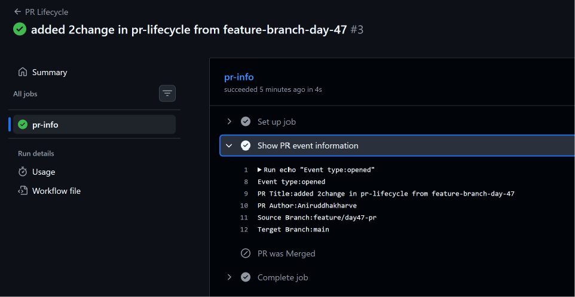
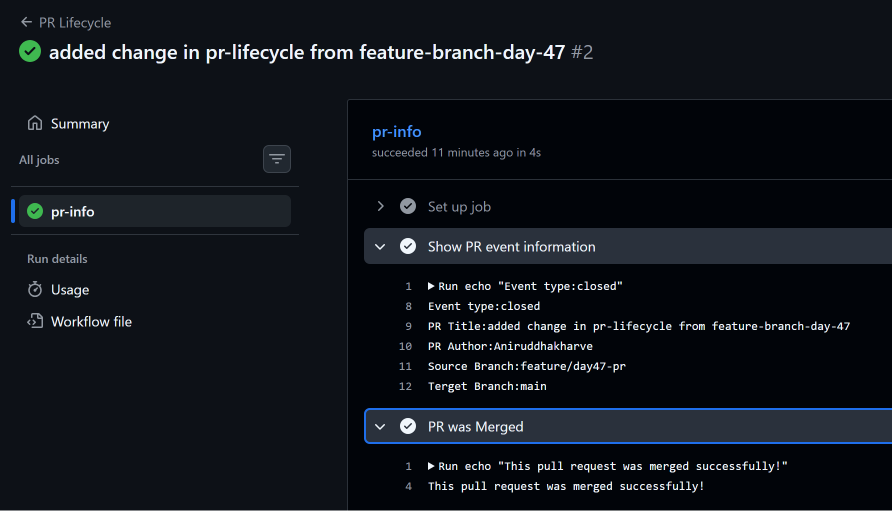
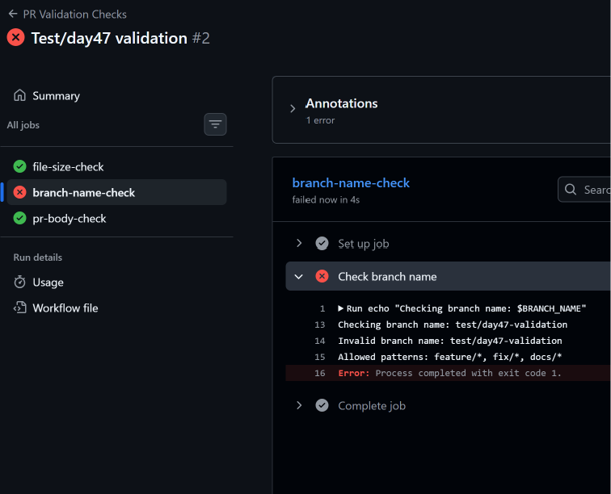
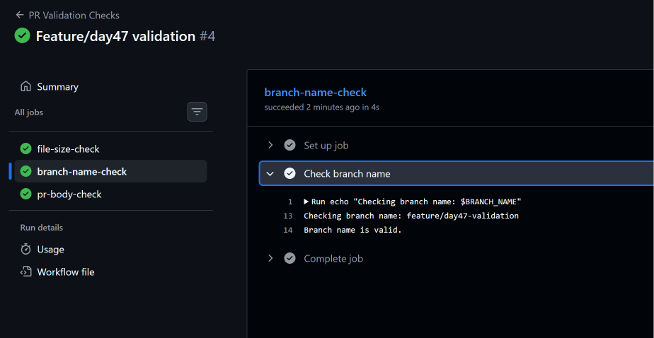
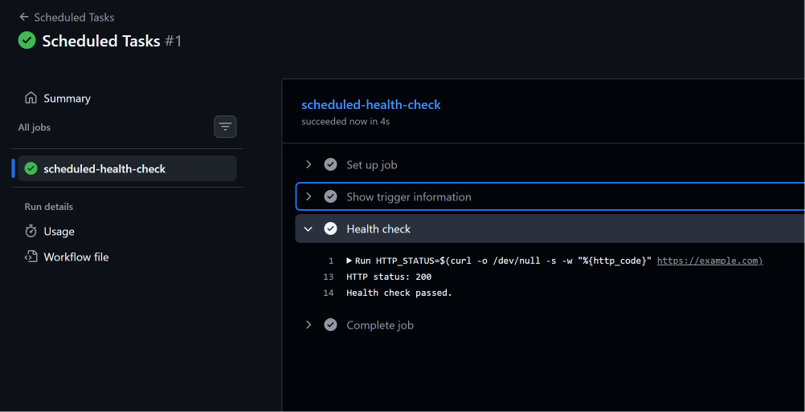
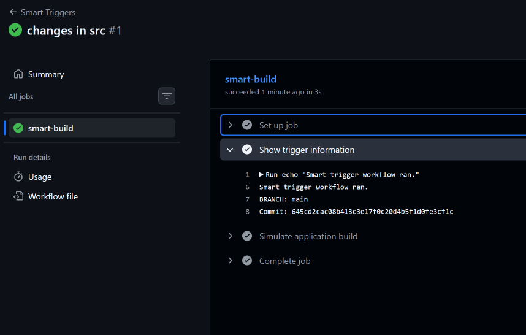
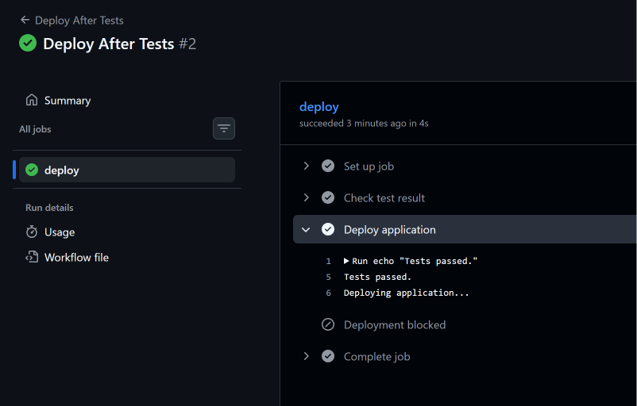
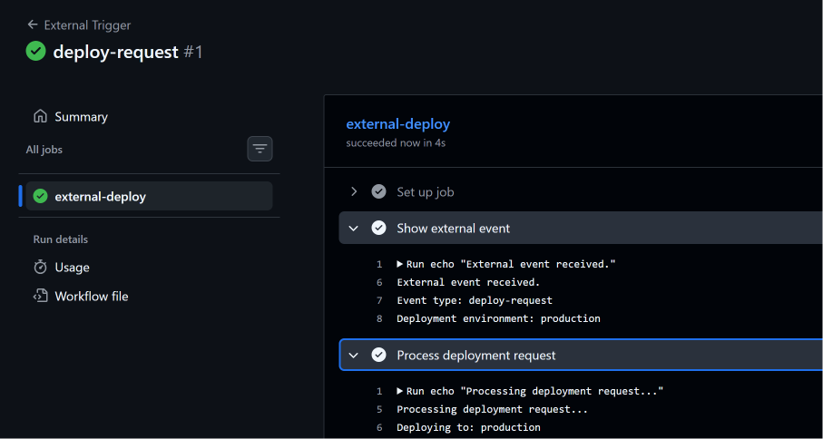

# Day 47 – Advanced GitHub Actions Triggers

## 📌 Overview

Day 47 mein maine GitHub Actions ke **advanced triggers and workflow control mechanisms** ko practically implement kiya.

Is day ka main focus tha ki workflow ko sirf simple `push` ya `pull_request` se nahi, balki different events, schedules, branches, paths aur other workflows ke completion ke basis par kaise trigger kiya jaata hai.

### Topics Covered

- Pull Request Lifecycle Events
- Pull Request Validation
- Scheduled Workflows using Cron
- Branch Filters
- Path Filters
- `paths-ignore`
- `workflow_run`
- `repository_dispatch`
- External event payloads
- Practical workflow chaining

---

# 🏗️ Day 47 Workflow Structure

Day 47 mein maine total **8 workflow YAML files** create kiye:

```text
.github/
└── workflows/
    ├── pr-lifecycle.yml
    ├── pr-checks.yml
    ├── scheduled-tasks.yml
    ├── smart-triggers.yml
    ├── docs-ignore.yml
    ├── tests.yml
    ├── deploy-after-tests.yml
    └── external-trigger.yml
```

---

# 1. Pull Request Lifecycle

## 🎯 Objective

PR ke different lifecycle events ko detect karna:

- `opened`
- `synchronize`
- `reopened`
- `closed`

Aur agar PR merge hua ho, toh specifically usko detect karna.

## 📄 Workflow

File:

```text
.github/workflows/pr-lifecycle.yml
```

```yaml
name: PR Lifecycle

on:
  pull_request:
    types:
      - opened
      - synchronize
      - reopened
      - closed

jobs:
  pr-info:
    runs-on: ubuntu-latest

    steps:
      - name: Show PR event information
        run: |
          echo "Event type: ${{ github.event.action }}"
          echo "PR title: ${{ github.event.pull_request.title }}"
          echo "PR author: ${{ github.event.pull_request.user.login }}"
          echo "Source branch: ${{ github.event.pull_request.head.ref }}"
          echo "Target branch: ${{ github.event.pull_request.base.ref }}"

      - name: PR was merged
        if: github.event.pull_request.merged == true
        run: |
          echo "This pull request was merged successfully!"
```

## 🔍 Important Concept

`github.event.action` event ka action batata hai.

Example:

```text
opened
synchronize
reopened
closed
```

PR merge hone ke case mein:

```yaml
if: github.event.pull_request.merged == true
```

use karke merged PR ko identify kar sakte hain.

## 🧪 Practical Result

Maine successfully test kiya:

- PR opened event
- PR closed + merged event

Merged PR ke case mein `PR was merged` step successfully execute hua.

## 📸 Screenshot – PR Opened



## 📸 Screenshot – PR Merged



---

# 2. Pull Request Validation Checks

## 🎯 Objective

PR create hone par basic validation checks automatically run karna.

Maine teen checks implement kiye:

1. Changed files ka size check
2. Branch naming convention check
3. PR description check

---

## 📄 Workflow

File:

```text
.github/workflows/pr-checks.yml
```

```yaml
name: PR Validation Checks

on:
  pull_request:
    branches:
      - main

jobs:
  file-size-check:
    runs-on: ubuntu-latest

    steps:
      - name: Checkout code
        uses: actions/checkout@v4
        with:
          fetch-depth: 0

      - name: Check PR file sizes
        run: |
          echo "Checking files changed in this PR..."

          git diff --name-only \
            "${{ github.event.pull_request.base.sha }}" \
            "${{ github.event.pull_request.head.sha }}" > changed-files.txt

          echo "Changed files:"
          cat changed-files.txt

          LARGE_FILE_FOUND=false

          while IFS= read -r file; do
            if [ -f "$file" ]; then
              SIZE=$(stat -c%s "$file")

              if [ "$SIZE" -gt 1048576 ]; then
                echo "File larger than 1 MB: $file ($(du -h "$file" | cut -f1))"
                LARGE_FILE_FOUND=true
              fi
            fi
          done < changed-files.txt

          if [ "$LARGE_FILE_FOUND" = true ]; then
            echo "PR contains files larger than 1 MB."
            exit 1
          else
            echo "All changed files are within the 1 MB limit."
          fi

  branch-name-check:
    runs-on: ubuntu-latest

    steps:
      - name: Check branch name
        env:
          BRANCH_NAME: ${{ github.head_ref }}
        run: |
          echo "Checking branch name: $BRANCH_NAME"

          if [[ "$BRANCH_NAME" =~ ^(feature|fix|docs)/.+$ ]]; then
            echo "Branch name is valid."
          else
            echo "Invalid branch name: $BRANCH_NAME"
            echo "Allowed patterns: feature/*, fix/*, docs/*"
            exit 1
          fi

  pr-body-check:
    runs-on: ubuntu-latest

    steps:
      - name: Check PR description
        env:
          PR_BODY: ${{ github.event.pull_request.body }}
        run: |
          if [ -z "$PR_BODY" ]; then
            echo "::warning::Pull request description is empty."
          else
            echo "Pull request description is present."
          fi
```

## 🔍 Branch Naming Rule

Allowed branch patterns:

```text
feature/*
fix/*
docs/*
```

Examples:

```text
feature/login
fix/docker-build
docs/readme-update
```

Invalid example:

```text
test/day47-validation
```

## 🧪 Practical Testing

Maine intentionally invalid branch:

```text
test/day47-validation
```

se PR create karke validation failure test kiya.

Result:

```text
file-size-check       ✅
branch-name-check     ❌
pr-body-check         ✅
```

Uske baad valid branch:

```text
feature/day47-validation
```

use karke final validation run successfully pass kiya.

Result:

```text
file-size-check       ✅
branch-name-check     ✅
pr-body-check         ✅
```

## 📸 Screenshot – Intentional Validation Failure



## 📸 Screenshot – Final Validation Success



---

# 3. Scheduled Workflows

## 🎯 Objective

GitHub Actions workflow ko specific time intervals par automatically run karna using `schedule` and cron expressions.

## 📄 Workflow

File:

```text
.github/workflows/scheduled-tasks.yml
```

```yaml
name: Scheduled Tasks

on:
  schedule:
    - cron: '30 2 * * 1'
    - cron: '0 */6 * * *'
  workflow_dispatch:

jobs:
  scheduled-health-check:
    runs-on: ubuntu-latest

    steps:
      - name: Show trigger information
        run: |
          echo "Workflow triggered by:"
          echo "${{ github.event_name }}"

          if [ "${{ github.event_name }}" = "schedule" ]; then
            echo "Schedule expression: ${{ github.event.schedule }}"
          else
            echo "This workflow was triggered manually."
          fi

      - name: Health check
        run: |
          HTTP_STATUS=$(curl -o /dev/null -s -w "%{http_code}" https://example.com)

          echo "HTTP status: $HTTP_STATUS"

          if [ "$HTTP_STATUS" -ne 200 ]; then
            echo "Health check failed."
            exit 1
          fi

          echo "Health check passed."
```

## 🧠 Cron Expressions

### Every Monday at 09:00 AM IST

```text
30 3 * * 1
```

GitHub Actions cron UTC mein work karta hai.

### Every 6 Hours

```text
0 */6 * * *
```

### First Day of Every Month at Midnight

```text
0 0 1 * *
```

## ⚠️ Important

Scheduled workflows exact clock time par guaranteed nahi hote. GitHub Actions scheduling mein delay ho sakta hai.

Maine workflow ko manually bhi trigger karke health check test kiya.

Result:

```text
HTTP status: 200
Health check passed.
```

## 📸 Screenshot



---

# 4. Path and Branch Filters

## 🎯 Objective

Workflow ko sirf specific branches aur specific paths par changes hone par trigger karna.

---

## 📄 Smart Triggers Workflow

File:

```text
.github/workflows/smart-triggers.yml
```

```yaml
name: Smart Triggers

on:
  push:
    branches:
      - main
      - 'release/**'
    paths:
      - 'src/**'
      - 'app/**'

jobs:
  smart-build:
    runs-on: ubuntu-latest

    steps:
      - name: Show trigger information
        run: |
          echo "Smart trigger workflow ran."
          echo "Branch: ${{ github.ref_name }}"
          echo "Commit: ${{ github.sha }}"

      - name: Simulate application build
        run: |
          echo "Application files changed."
          echo "Running application build..."
```

### Meaning

Workflow tabhi trigger hoga jab:

```text
Branch = main
OR
Branch = release/**
```

and changed files:

```text
src/**
OR
app/**
```

ke andar hon.

---

# 5. `paths-ignore`

## 🎯 Objective

Kuch specific files/directories ke changes ko workflow trigger se ignore karna.

## 📄 Workflow

File:

```text
.github/workflows/docs-ignore.yml
```

```yaml
name: Docs Ignore

on:
  push:
    branches:
      - main
      - 'release/**'
    paths-ignore:
      - '*.md'
      - 'docs/**'

jobs:
  code-change:
    runs-on: ubuntu-latest

    steps:
      - name: Show trigger information
        run: |
          echo "Workflow ran because non-documentation files changed."
          echo "Branch: ${{ github.ref_name }}"
```

## 🔍 Difference

`paths`:

```yaml
paths:
  - 'src/**'
  - 'app/**'
```

Meaning:

> Sirf matching paths ke changes par workflow run karo.

`paths-ignore`:

```yaml
paths-ignore:
  - '*.md'
  - 'docs/**'
```

Meaning:

> In paths ke changes ko ignore karo.

## 🧪 Practical Test

Maine `src/` mein change karke `Smart Triggers` workflow successfully run kiya.

Uske baad sirf `README.md` change kiya.

`README.md` `src/**` ya `app/**` ke andar nahi hai, isliye `Smart Triggers` workflow run nahi hua.

## 📸 Screenshot



---

# 6. `workflow_run` – Workflow Chaining

## 🎯 Objective

Ek workflow ke complete hone ke baad automatically doosra workflow trigger karna.

Yeh CI/CD pipelines mein useful hai.

Example:

```text
Tests
  ↓
Deploy
```

---

# 6.1 Run Tests Workflow

## 📄 File

```text
.github/workflows/tests.yml
```

```yaml
name: Run Tests

on:
  push:
    branches:
      - main
  workflow_dispatch:

jobs:
  tests:
    runs-on: ubuntu-latest

    steps:
      - name: Run tests
        run: |
          echo "Running tests..."
          echo "All tests passed successfully."
```

---

# 6.2 Deploy After Tests

## 📄 File

```text
.github/workflows/deploy-after-tests.yml
```

```yaml
name: Deploy After Tests

on:
  workflow_run:
    workflows: ["Run Tests"]
    types:
      - completed

jobs:
  deploy:
    runs-on: ubuntu-latest

    steps:
      - name: Check test result
        run: |
          echo "Tests workflow conclusion: ${{ github.event.workflow_run.conclusion }}"

      - name: Deploy application
        if: github.event.workflow_run.conclusion == 'success'
        run: |
          echo "Tests passed."
          echo "Deploying application..."

      - name: Deployment blocked
        if: github.event.workflow_run.conclusion != 'success'
        run: |
          echo "Tests did not pass."
          echo "Deployment will not proceed."
          exit 1
```

## 🔍 How It Works

Flow:

```text
Run Tests
    |
    | completed
    ↓
Deploy After Tests
    |
    ├── success → Deploy
    |
    └── failure → Deployment blocked
```

Maine successfully verify kiya:

```text
Tests passed.
Deploying application...
```

Aur `Deployment blocked` step skip hua.

## 📸 Screenshot



---

# 7. `repository_dispatch` – External Trigger

## 🎯 Objective

GitHub Actions workflow ko GitHub ke bahar se API event ke through trigger karna.

Iske liye:

```yaml
repository_dispatch:
```

use kiya.

---

## 📄 Workflow

File:

```text
.github/workflows/external-trigger.yml
```

```yaml
name: External Trigger

on:
  repository_dispatch:
    types:
      - deploy-request

jobs:
  external-deploy:
    runs-on: ubuntu-latest

    steps:
      - name: Show external event
        run: |
          echo "External event received."
          echo "Event type: ${{ github.event.action }}"
          echo "Deployment environment: ${{ github.event.client_payload.environment }}"

      - name: Process deployment request
        run: |
          echo "Processing deployment request..."
          echo "Deploying to: ${{ github.event.client_payload.environment }}"
```

## 🔍 Important Concepts

Event type:

```text
deploy-request
```

Payload:

```json
{
  "environment": "production"
}
```

Workflow ke andar payload ko access kiya:

```yaml
${{ github.event.client_payload.environment }}
```

---

# 🛠️ Triggering `repository_dispatch`

GitHub CLI install karke authentication complete kiya.

Authentication verify:

```bash
gh auth status
```

External dispatch event send karne ke liye complete JSON request body use ki:

```bash
echo '{"event_type":"deploy-request","client_payload":{"environment":"production"}}' \
  | gh api repos/Aniruddhakharve/github-actions-practice/dispatches --input -
```

## 🧪 Practical Result

Workflow successfully triggered hua.

Output:

```text
External event received.
Event type: deploy-request
Deployment environment: production
Processing deployment request...
Deploying to: production
```

Isse verify hua ki:

```text
External API Event
       ↓
repository_dispatch
       ↓
GitHub Actions Workflow
       ↓
client_payload
       ↓
production
```

## 📸 Screenshot



---

# 🔥 Important Difference: `workflow_call` vs `workflow_run`

Day 46 mein `workflow_call` padha tha, aur Day 47 mein `workflow_run` implement kiya.

Dono ko confuse nahi karna hai.

## `workflow_call`

Purpose:

> Ek workflow ko intentionally reusable workflow ki tarah call karna.

Example:

```yaml
jobs:
  build:
    uses: ./.github/workflows/reusable-build.yml
```

Flow:

```text
Caller Workflow
      ↓
Reusable Workflow
```

## `workflow_run`

Purpose:

> Ek workflow ke complete hone ke baad doosra workflow automatically trigger karna.

Example:

```yaml
on:
  workflow_run:
    workflows: ["Run Tests"]
    types:
      - completed
```

Flow:

```text
Run Tests
    ↓
completed
    ↓
Deploy After Tests
```

### Easy Interview Explanation

> `workflow_call` is used when I want to explicitly reuse another workflow, whereas `workflow_run` is used to trigger a workflow based on the completion of another workflow.

---

# 🧠 Important GitHub Actions Contexts Used

Day 47 mein different GitHub event information access ki.

### Event name

```yaml
${{ github.event_name }}
```

Example:

```text
push
pull_request
schedule
repository_dispatch
```

### PR action

```yaml
${{ github.event.action }}
```

Example:

```text
opened
closed
synchronize
deploy-request
```

### PR branch

```yaml
${{ github.head_ref }}
```

### Current branch

```yaml
${{ github.ref_name }}
```

### PR title

```yaml
${{ github.event.pull_request.title }}
```

### PR author

```yaml
${{ github.event.pull_request.user.login }}
```

### Workflow run conclusion

```yaml
${{ github.event.workflow_run.conclusion }}
```

### Repository dispatch payload

```yaml
${{ github.event.client_payload.environment }}
```

---

# ⚠️ Common Errors Faced

## 1. `repository_dispatch` returned HTTP 422

Initial command used:

```bash
-f client_payload='{"environment":"production"}'
```

GitHub interpreted the payload incorrectly as a string instead of an object.

### Solution

Complete JSON request body `--input` ke through send kiya:

```bash
echo '{"event_type":"deploy-request","client_payload":{"environment":"production"}}' \
  | gh api repos/Aniruddhakharve/github-actions-practice/dispatches --input -
```

---

## 2. External Trigger Workflow Syntax Issue

`external-trigger.yml` mein initially `echo` statement ka closing quote missing tha.

Incorrect:

```bash
echo "External event received.
```

Correct:

```bash
echo "External event received."
```

---

## 3. PR Branch Validation Failed

Intentionally invalid branch:

```text
test/day47-validation
```

Allowed pattern nahi tha.

Allowed:

```text
feature/*
fix/*
docs/*
```

Valid branch use karne ke baad validation successfully pass hua.

---

## 4. README Change Did Not Trigger Smart Triggers

`smart-triggers.yml` mein:

```yaml
paths:
  - 'src/**'
  - 'app/**'
```

configured tha.

Isliye sirf:

```text
README.md
```

change karne par workflow run nahi hua.

Yeh expected behaviour tha, error nahi.

---

# 💼 Real-World CI/CD Example

Day 47 ke concepts ko real CI/CD pipeline mein combine kar sakte hain:

```text
Developer creates PR
        ↓
PR Validation
        ↓
File Size Check
        ↓
Branch Name Check
        ↓
PR Description Check
        ↓
PR Merge
        ↓
Tests Workflow
        ↓
workflow_run
        ↓
Deployment
```

Scheduled health monitoring:

```text
Cron Schedule
      ↓
Health Check
      ↓
Application Status
```

External deployment request:

```text
External System
      ↓
repository_dispatch
      ↓
GitHub Actions
      ↓
Deployment
```

---

# 🎯 Hands-On Scenarios

## Scenario 1 – Only Application Code Changes

Requirement:

> Application code change hone par build run hona chahiye, documentation change par nahi.

Solution:

```yaml
paths:
  - 'src/**'
  - 'app/**'
```

---

## Scenario 2 – Enforce Branch Naming

Requirement:

> Developers ko standard branch naming follow karni hai.

Solution:

```bash
if [[ "$BRANCH_NAME" =~ ^(feature|fix|docs)/.+$ ]]
```

---

## Scenario 3 – Deploy Only After Successful Tests

Requirement:

> Tests successful hone ke baad hi deployment run hona chahiye.

Solution:

```yaml
on:
  workflow_run:
    workflows: ["Run Tests"]
    types:
      - completed
```

And:

```yaml
if: github.event.workflow_run.conclusion == 'success'
```

---

## Scenario 4 – External Deployment Request

Requirement:

> External system GitHub Actions ko deployment request bheje.

Solution:

```yaml
on:
  repository_dispatch:
    types:
      - deploy-request
```

Payload:

```json
{
  "environment": "production"
}
```

---

# 🎤 Interview Questions & Answers

## Q1. What is `repository_dispatch`?

### Answer

> `repository_dispatch` is a GitHub Actions event that allows an external system to trigger a workflow using the GitHub repository dispatch API. We can also send custom data through `client_payload`.

---

## Q2. What is `workflow_run`?

### Answer

> `workflow_run` allows one workflow to be triggered when another workflow completes. For example, I can run deployment only after my test workflow finishes successfully.

---

## Q3. What is the difference between `workflow_call` and `workflow_run`?

### Answer

> `workflow_call` is used for explicitly calling a reusable workflow, while `workflow_run` is used to trigger a workflow based on the completion of another workflow.

---

## Q4. What are path filters?

### Answer

> Path filters allow us to run workflows only when files matching specific paths are changed. For example, a workflow can run only when files under `src/` or `app/` change.

---

## Q5. What is `paths-ignore`?

### Answer

> `paths-ignore` prevents a workflow from running when only the specified paths are changed. It is useful for ignoring documentation-only changes.

---

## Q6. What is `github.event.action`?

### Answer

> `github.event.action` provides the specific action associated with an event. For a pull request it can be `opened`, `closed`, or `synchronize`, while a repository dispatch can use a custom action such as `deploy-request`.

---

## Q7. How can you run a workflow periodically?

### Answer

> We can use the `schedule` trigger with a cron expression in the workflow YAML.

Example:

```yaml
on:
  schedule:
    - cron: '0 */6 * * *'
```

---

## Q8. How do you ensure deployment happens only after successful tests?

### Answer

> I can use `workflow_run` to trigger the deployment workflow after the test workflow completes, and then check `github.event.workflow_run.conclusion == 'success'` before running the deployment step.

---

# 🗣️ How to Explain Day 47 in an Interview

> On Day 47, I worked with advanced GitHub Actions triggers. I implemented pull request lifecycle events, PR validation checks, scheduled workflows using cron, branch and path filters, and workflow chaining using `workflow_run`.
>
> I also implemented `repository_dispatch` to trigger a workflow externally and passed deployment information through `client_payload`.
>
> I tested both successful and intentionally failed scenarios, including invalid branch naming and path-based workflow filtering.
>
> The main thing I learned was how to control when GitHub Actions workflows should execute instead of running pipelines for every repository change.

---

# ⚡ Quick Revision Cheat Sheet

| Concept | Purpose |
|---|---|
| `pull_request` | Trigger workflow for PR events |
| `types` | Select specific PR event actions |
| `schedule` | Run workflow periodically |
| `cron` | Define schedule |
| `branches` | Restrict workflow to branches |
| `paths` | Run only for matching file paths |
| `paths-ignore` | Ignore specific paths |
| `workflow_run` | Trigger after another workflow completes |
| `repository_dispatch` | Trigger workflow externally |
| `client_payload` | Pass custom data with dispatch event |
| `github.event.action` | Current event action |
| `github.event_name` | Current event type |
| `github.ref_name` | Current branch/tag name |
| `github.head_ref` | PR source branch |
| `github.event.workflow_run.conclusion` | Result of previous workflow |
| `github.event.client_payload` | External event payload |

---

# 📊 Day 47 Practical Results

| Task | Result |
|---|---|
| PR Lifecycle | ✅ Completed |
| PR Validation | ✅ Completed |
| Intentional Validation Failure | ✅ Tested |
| Scheduled Workflow | ✅ Completed |
| Cron Health Check | ✅ Passed |
| Branch Filters | ✅ Tested |
| Path Filters | ✅ Tested |
| `paths-ignore` | ✅ Tested |
| `workflow_run` Chain | ✅ Completed |
| `repository_dispatch` | ✅ Completed |
| External Payload | ✅ Received Successfully |

---

# 📸 Day 47 Screenshots

All screenshots are stored inside:

```text
2026/day-47/screenshots/
```

### Screenshot List

```text
01-pr-lifecycle-opened.png
02-pr-lifecycle-merged.png
02-pr-validation-failed.png
02-pr-validation-checks.png
03-scheduled-workflow.png
04-path-branch-filter.png
05-workflow-run-chain.png
06-repository-dispatch.png
```

---

# 📁 Final Day 47 Files

```text
2026/
└── day-47/
    ├── day-47-advanced-triggers.md
    └── screenshots/
        ├── 01-pr-lifecycle-opened.png
        ├── 02-pr-lifecycle-merged.png
        ├── 02-pr-validation-failed.png
        ├── 02-pr-validation-checks.png
        ├── 03-scheduled-workflow.png
        ├── 04-path-branch-filter.png
        ├── 05-workflow-run-chain.png
        └── 06-repository-dispatch.png
```

---

# ✅ Day 47 Status

**Day 47 – Advanced GitHub Actions Triggers: COMPLETED ✅**

I successfully practiced advanced GitHub Actions event handling including:

```text
Pull Request Events
        ↓
PR Validation
        ↓
Scheduled Workflows
        ↓
Branch & Path Filters
        ↓
workflow_run
        ↓
repository_dispatch
        ↓
External Deployment Trigger
```

This day helped me understand how real-world CI/CD pipelines control workflow execution based on different events, conditions, schedules, code changes, and external requests.

---

## 🔥 Key Takeaway

> GitHub Actions triggers are not limited to `push` and `pull_request`. By using events such as `schedule`, `workflow_run`, and `repository_dispatch`, along with branch and path filters, we can build more controlled and production-oriented CI/CD workflows.
