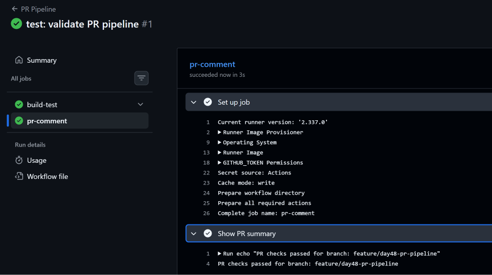
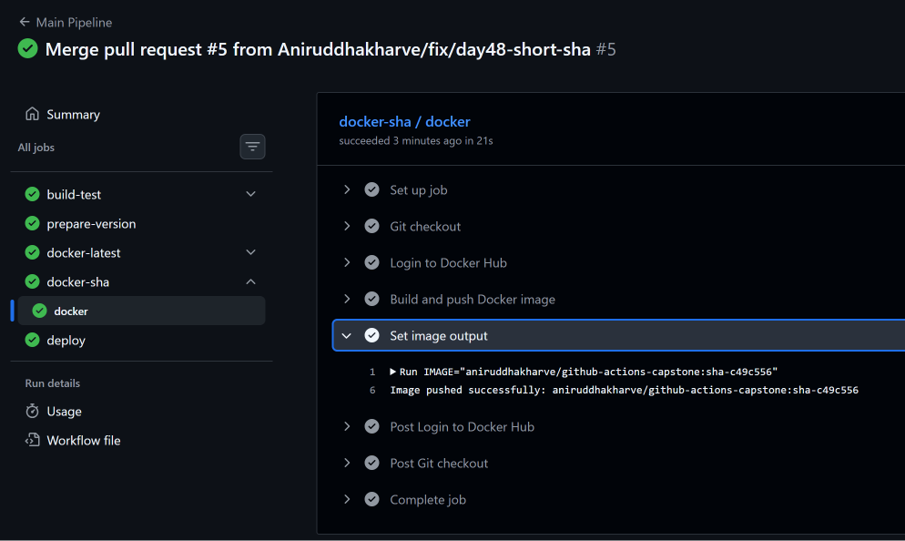
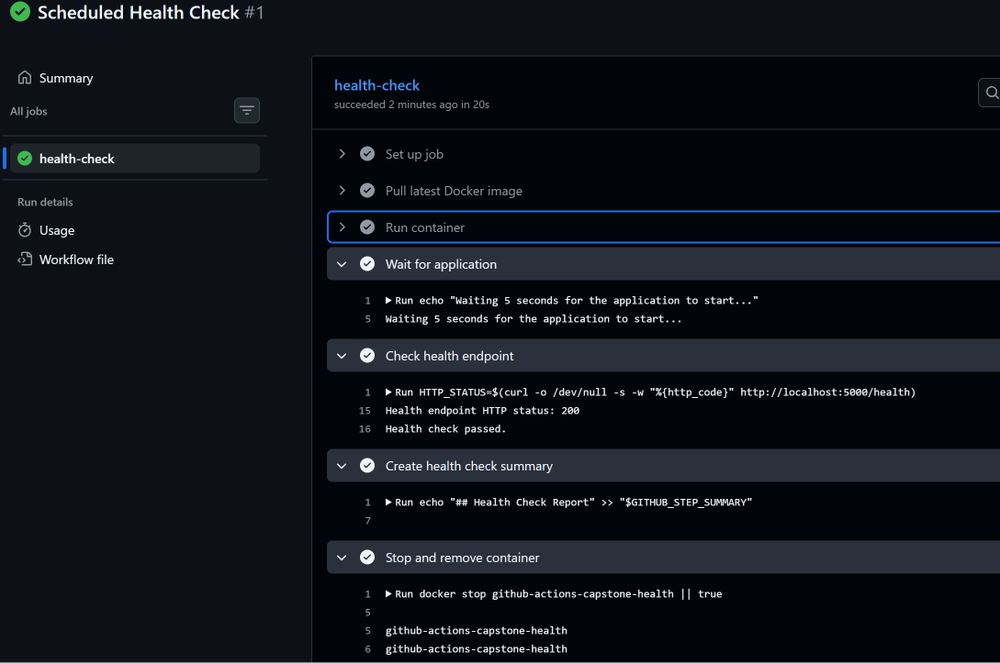

# Day 48 – GitHub Actions Project: End-to-End CI/CD Pipeline

## 📌 Overview

Day 48 is the **GitHub Actions Capstone Project**, where I combined the concepts learned from Day 40 to Day 47 into one complete CI/CD pipeline.

The project uses a Python Flask application and GitHub Actions to implement:

- Pull Request CI
- Reusable workflows
- Automated testing
- Docker image build and push
- Versioned Docker images
- Production deployment
- GitHub Environment approval
- Scheduled container health checks
- GitHub Actions workflow summaries
- Workflow status badges

The application is hosted as a Docker image on Docker Hub.

---

# 🎯 Objectives

The main objectives of this project were:

1. Build a simple application with automated tests.
2. Create reusable GitHub Actions workflows.
3. Run tests automatically for Pull Requests.
4. Build and push Docker images after merging to `main`.
5. Tag Docker images using `latest` and short commit SHA.
6. Deploy the Docker image through a protected production environment.
7. Perform scheduled health checks against the Docker image.
8. Document the complete CI/CD architecture.

---

# 🏗️ Project Architecture

```text
                         Pull Request
                              │
                              ▼
                     ┌─────────────────┐
                     │   PR Pipeline   │
                     └────────┬────────┘
                              │
                              ▼
                    ┌──────────────────┐
                    │ Build + Test     │
                    │ Reusable Workflow│
                    └────────┬─────────┘
                              │
                              ▼
                         PR Checks
                              │
                              │
                           Merge
                              │
                              ▼
                         main branch
                              │
                              ▼
                    ┌──────────────────┐
                    │ Build + Test     │
                    └────────┬─────────┘
                              │
                              ▼
                    ┌──────────────────┐
                    │ Prepare Version  │
                    │ Short SHA        │
                    └────────┬─────────┘
                              │
                 ┌────────────┴────────────┐
                 ▼                         ▼
        ┌─────────────────┐       ┌─────────────────┐
        │ Docker :latest  │       │ Docker :sha-XXX │
        │ Build + Push    │       │ Build + Push    │
        └────────┬────────┘       └────────┬────────┘
                 │                         │
                 └────────────┬────────────┘
                              ▼
                  ┌─────────────────────┐
                  │ Production          │
                  │ Environment         │
                  └──────────┬──────────┘
                             │
                          Approval
                             │
                             ▼
                          Deploy


                     Every 12 Hours
                             │
                             ▼
                  ┌─────────────────────┐
                  │ Scheduled Health    │
                  │ Check               │
                  └──────────┬──────────┘
                             │
                             ▼
                    Pull Docker Image
                             │
                             ▼
                       Run Container
                             │
                             ▼
                        /health
                             │
                             ▼
                         HTTP 200
                             │
                             ▼
                          Cleanup
```

---

# 📂 Project Structure

The capstone application repository contains:

```text
github-actions-capstone/
│
├── app.py
├── requirements.txt
├── test_app.py
├── Dockerfile
├── .dockerignore
├── README.md
│
└── .github/
    └── workflows/
        ├── reusable-build-test.yml
        ├── reusable-docker.yml
        ├── pr-pipeline.yml
        ├── main-pipeline.yml
        └── health-check.yml
```

---

# 🐍 Application

The project uses a simple Python Flask application.

## Endpoints

```text
GET /
```

Application endpoint.

```text
GET /health
```

Health check endpoint.

The health endpoint returns:

```json
{
  "status": "healthy"
}
```

---

# 🧪 Automated Tests

Pytest is used for application testing.

The tests verify:

- `/` returns HTTP 200
- `/health` returns HTTP 200
- `/health` returns the expected `healthy` status

The test suite contains two tests.

Successful execution:

```text
2 passed
```

---

# 🐳 Docker

The Flask application is containerized using Docker.

The Docker image repository is:

```text
aniruddhakharve/github-actions-capstone
```

The pipeline publishes two tags:

```text
latest
sha-<short-commit-hash>
```

Example:

```text
aniruddhakharve/github-actions-capstone:latest
aniruddhakharve/github-actions-capstone:sha-c49c556
```

The `latest` tag represents the latest production image, while the SHA tag provides a unique version for a specific commit.

---

# 🔄 Workflow 1 — Reusable Build & Test

File:

```text
.github/workflows/reusable-build-test.yml
```

This workflow uses:

```yaml
on:
  workflow_call:
```

It is not triggered directly by a push or Pull Request.

Other workflows call it when they need to build and test the application.

## Complete Workflow

```yaml
name: Reusable Build and Test

on:
  workflow_call:
    inputs:
      python-version:
        description: 'Python version to use'
        required: false
        type: string
        default: "3.12"

      run-tests:
        description: "Whether to run tests"
        required: false
        type: boolean
        default: true

    outputs:
      test-result:
        description: "Result of the test execution"
        value: ${{ jobs.build-test.outputs.test_result }}

jobs:
  build-test:
    runs-on: ubuntu-latest

    outputs:
      test_result: ${{ steps.test.outputs.test_result }}

    steps:
      - name: Checkout code
        uses: actions/checkout@v7

      - name: Setup Python
        uses: actions/setup-python@v5
        with:
          python-version: ${{ inputs.python-version }}

      - name: Install dependencies
        run: |
          python --version
          pip install -r requirements.txt

      - name: Run tests
        id: test
        if: ${{ inputs.run-tests }}
        continue-on-error: true
        run: |
          pytest
          TEST_EXIT_CODE=$?

          if [ "$TEST_EXIT_CODE" -eq 0 ]; then
            echo "test_result=passed" >> "$GITHUB_OUTPUT"
          else
            echo "test_result=failed" >> "$GITHUB_OUTPUT"
            exit 1
          fi

      - name: Run Tests skipped
        if: ${{ !inputs.run-tests }}
        run: |
          echo "Tests were skipped."
```

## Workflow Responsibilities

```text
Checkout
   ↓
Setup Python
   ↓
Install dependencies
   ↓
Run pytest
   ↓
Return test result
```

This workflow is reused by both the PR and main branch pipelines.

---

# 🐳 Workflow 2 — Reusable Docker Build & Push

File:

```text
.github/workflows/reusable-docker.yml
```

This workflow is also reusable through:

```yaml
on:
  workflow_call:
```

It receives:

- Docker image name
- Docker tag
- Docker Hub username
- Docker Hub token

The username is passed as a normal input, while the Docker token remains a secret.

## Complete Workflow

```yaml
name: Reusable Docker Build and Push

on:
  workflow_call:
    inputs:
      image_name:
        description: "Docker image name"
        required: true
        type: string

      tag:
        description: "Docker image tag"
        required: true
        type: string

      docker_username:
        description: "Docker Hub username"
        required: true
        type: string

    secrets:
      docker_token:
        description: "Docker Hub access token"
        required: true

    outputs:
      image_url:
        description: "Full Docker image path"
        value: ${{ jobs.docker.outputs.image_url }}

jobs:
  docker:
    runs-on: ubuntu-latest

    outputs:
      image_url: ${{ steps.image.outputs.image_url }}

    steps:
      - name: Git checkout
        uses: actions/checkout@v7

      - name: Login to Docker Hub
        uses: docker/login-action@v4
        with:
          username: ${{ inputs.docker_username }}
          password: ${{ secrets.docker_token }}

      - name: Build and push Docker image
        run: |
          IMAGE="${{ inputs.docker_username }}/${{ inputs.image_name }}:${{ inputs.tag }}"
          echo "Building Docker image: $IMAGE"
          docker build -t "$IMAGE" .
          docker push "$IMAGE"

      - name: Set image output
        id: image
        run: |
          IMAGE="${{ inputs.docker_username }}/${{ inputs.image_name }}:${{ inputs.tag }}"
          echo "image_url=$IMAGE" >> "$GITHUB_OUTPUT"
          echo "Image pushed successfully: $IMAGE"
```

## Output Flow

```text
Set image output
       ↓
steps.image.outputs.image_url
       ↓
jobs.docker.outputs.image_url
       ↓
Reusable workflow output
       ↓
Main Pipeline
       ↓
Deploy Job
```

---

# 🔀 Workflow 3 — Pull Request Pipeline

File:

```text
.github/workflows/pr-pipeline.yml
```

The PR pipeline runs when:

- A Pull Request is opened
- New commits are pushed to the Pull Request

It targets the `main` branch.

## Complete Workflow

```yaml
name: PR Pipeline

on:
  pull_request:
    branches:
      - main
    types: [opened, synchronize]

jobs:
  build-test:
    uses: ./.github/workflows/reusable-build-test.yml
    with:
      python-version: "3.12"
      run-tests: true

  pr-comment:
    needs: build-test
    runs-on: ubuntu-latest

    steps:
      - name: Show PR summary
        run: |
          echo "PR Checks Passed For Branch: ${{ github.head_ref }}"
```

## PR Flow

```text
Pull Request
      ↓
PR Pipeline
      ↓
Reusable Build + Test
      ↓
pytest
      ↓
pr-comment
      ↓
PR checks passed
```

### Important Design

Docker is **not** built or pushed from the PR pipeline.

```text
PR
 ↓
Test
 ↓
Checks
```

This prevents unapproved Pull Request code from being published as a Docker image.

---

# 📸 PR Pipeline Screenshot

The PR pipeline was successfully executed with both jobs passing.



The successful run showed:

```text
build-test    ✅
pr-comment    ✅
```

The branch summary showed:

```text
PR checks passed for branch: feature/day48-pr-pipeline
```

---

# 🚀 Workflow 4 — Main Branch Pipeline

File:

```text
.github/workflows/main-pipeline.yml
```

This is the main CI/CD workflow.

It runs whenever code is pushed to `main`.

## Complete Workflow

```yaml
name: Main Pipeline

on:
  push:
    branches:
      - main

jobs:
  build-test:
    uses: ./.github/workflows/reusable-build-test.yml
    with:
      python-version: "3.12"
      run-tests: true

  prepare-version:
    needs: build-test
    runs-on: ubuntu-latest

    outputs:
      short_sha: ${{ steps.version.outputs.short_sha }}

    steps:
      - name: Generate short SHA
        id: version
        run: |
          SHORT_SHA=$(echo "${{ github.sha }}" | cut -c1-7)
          echo "Short SHA: $SHORT_SHA"
          echo "short_sha=$SHORT_SHA" >> "$GITHUB_OUTPUT"

  docker-latest:
    needs: [build-test, prepare-version]
    uses: ./.github/workflows/reusable-docker.yml
    with:
      image_name: github-actions-capstone
      tag: "latest"
      docker_username: aniruddhakharve
    secrets:
      docker_token: ${{ secrets.DOCKER_TOKEN }}

  docker-sha:
    needs: [build-test, prepare-version]
    uses: ./.github/workflows/reusable-docker.yml
    with:
      image_name: github-actions-capstone
      tag: sha-${{ needs.prepare-version.outputs.short_sha }}
      docker_username: aniruddhakharve
    secrets:
      docker_token: ${{ secrets.DOCKER_TOKEN }}

  deploy:
    needs: [docker-latest, docker-sha]
    runs-on: ubuntu-latest
    environment: production

    steps:
      - name: Deploy Application
        run: |
          echo "Deploying image: ${{ needs.docker-latest.outputs.image_url }} to production"
          echo "Deployment completed successfully."
```

---

# 🔢 Short SHA Generation

The pipeline generates a 7-character commit SHA:

```bash
SHORT_SHA=$(echo "${{ github.sha }}" | cut -c1-7)
```

For example:

```text
Full SHA:
c49c556xxxxxxxxxxxxxxxxxxxxxxxxxxxxxxxxx

Short SHA:
c49c556
```

The Docker image is then tagged:

```text
sha-c49c556
```

---

# 🔗 Main Pipeline Dependencies

The pipeline uses GitHub Actions `needs` to control execution order.

```text
build-test
     ↓
prepare-version
     ↓
 ┌───┴───────────────┐
 ↓                   ↓
docker-latest    docker-sha
 └────────┬──────────┘
          ↓
        deploy
```

The two Docker jobs can run after the required previous jobs succeed.

The deployment waits for both Docker jobs.

---

# 🔐 Production Environment

The deployment job uses:

```yaml
environment: production
```

A `production` GitHub Environment was configured.

A required reviewer was used for the production deployment.

Therefore, the pipeline can pause before deployment until the production deployment is approved.

```text
Docker Build + Push
        ↓
Production Environment
        ↓
Manual Approval
        ↓
Deploy
```

---

# 📸 Main Pipeline Screenshot

The final corrected Main Pipeline successfully completed all jobs.



The pipeline showed:

```text
build-test        ✅
prepare-version   ✅
docker-latest     ✅
docker-sha        ✅
deploy            ✅
```

The Docker SHA image was successfully pushed as:

```text
aniruddhakharve/github-actions-capstone:sha-c49c556
```

The deployment output showed:

```text
Deploying image: aniruddhakharve/github-actions-capstone:latest to production
Deployment completed successfully.
```

---

# 🛠️ Issue Encountered — Docker Username Secret

During the first Main Pipeline execution, Docker failed with:

```text
invalid tag
invalid reference format
```

The generated image name contained an unexpected newline around the Docker username.

The image looked similar to:

```text
***/github-actions-capstone:latest
```

with the username and image path separated incorrectly.

## Fix

The Docker username was separated from the secret credential.

The username became a normal reusable workflow input:

```yaml
docker_username:
  required: true
  type: string
```

The Docker token remained a secret:

```yaml
secrets:
  docker_token:
    required: true
```

Authentication:

```yaml
username: ${{ inputs.docker_username }}
password: ${{ secrets.docker_token }}
```

This fixed the Docker image reference.

---

# 🛠️ Issue Encountered — `image_url` Output

The first successful Docker deployment displayed:

```text
Deploying image:  to production
```

Even though both Docker jobs succeeded.

The reusable Docker workflow originally generated the image path using the Docker username secret.

The implementation was changed so that the Docker username was passed as a normal input and only the Docker token remained secret.

After the change, the deployment correctly received:

```text
aniruddhakharve/github-actions-capstone:latest
```

This verified the complete reusable workflow output chain.

---

# ❤️ Workflow 5 — Scheduled Health Check

File:

```text
.github/workflows/health-check.yml
```

The health check runs:

```text
Every 12 hours
```

using:

```yaml
cron: '0 */12 * * *'
```

It also supports:

```yaml
workflow_dispatch:
```

for manual testing.

## Complete Workflow

```yaml
name: Scheduled Health Check

on:
  schedule:
    - cron: '0 */12 * * *'
  workflow_dispatch:

jobs:
  health-check:
    runs-on: ubuntu-latest

    steps:
      - name: Pull latest Docker image
        run: |
          docker pull aniruddhakharve/github-actions-capstone:latest

      - name: Run container
        run: |
          docker run -d \
            --name github-actions-capstone-health \
            -p 5000:5000 \
            aniruddhakharve/github-actions-capstone:latest

      - name: Wait for application
        run: |
          echo "Waiting 5 seconds for the application to start..."
          sleep 5

      - name: Check health endpoint
        id: health
        run: |
          HTTP_STATUS=$(curl -o /dev/null -s -w "%{http_code}" http://localhost:5000/health)

          echo "Health endpoint HTTP status: $HTTP_STATUS"

          if [ "$HTTP_STATUS" -eq 200 ]; then
            echo "Health check passed."
            echo "status=PASSED" >> "$GITHUB_OUTPUT"
          else
            echo "Health check failed."
            echo "status=FAILED" >> "$GITHUB_OUTPUT"
            exit 1
          fi

      - name: Create health check summary
        if: always()
        run: |
          echo "## Health Check Report" >> "$GITHUB_STEP_SUMMARY"
          echo "- Image: aniruddhakharve/github-actions-capstone:latest" >> "$GITHUB_STEP_SUMMARY"
          echo "- Status: ${{ steps.health.outputs.status || 'FAILED' }}" >> "$GITHUB_STEP_SUMMARY"
          echo "- Time: $(date)" >> "$GITHUB_STEP_SUMMARY"

      - name: Stop and remove container
        if: always()
        run: |
          docker stop github-actions-capstone-health || true
          docker rm github-actions-capstone-health || true
```

---

# 🩺 Health Check Flow

```text
Scheduled Trigger
       ↓
Pull latest Docker image
       ↓
Run container
       ↓
Wait 5 seconds
       ↓
curl /health
       ↓
HTTP 200
       ↓
Health Check Passed
       ↓
Create GitHub Summary
       ↓
Stop container
       ↓
Remove container
```

The workflow was also manually triggered for testing.

---

# 📸 Health Check Screenshot

The scheduled health-check workflow completed successfully.



The successful run showed:

```text
Health endpoint HTTP status: 200
Health check passed.
```

The container was then stopped and removed successfully.

The GitHub Step Summary was also generated.

---

# 📊 GitHub Step Summary

The workflow uses:

```text
$GITHUB_STEP_SUMMARY
```

to create a readable health-check report in the GitHub Actions run summary.

The report contains:

```text
Health Check Report

Image: aniruddhakharve/github-actions-capstone:latest
Status: PASSED
Time: <execution time>
```

---

# 🧹 Cleanup

The health-check workflow uses:

```bash
docker stop github-actions-capstone-health || true
docker rm github-actions-capstone-health || true
```

The `|| true` ensures cleanup does not fail if the container has already stopped or does not exist.

The cleanup step also uses:

```yaml
if: always()
```

so cleanup still executes even when the health check fails.

---

# 🔐 Secrets Used

The pipeline uses a Docker Hub access token stored as a GitHub Actions secret:

```text
DOCKER_TOKEN
```

The Docker token is never hardcoded in the workflow files.

The Docker username is passed as a normal input because it is not a credential.

---

# 🏷️ Docker Image Versioning

The main pipeline publishes two image tags.

## Latest

```text
aniruddhakharve/github-actions-capstone:latest
```

Used by the scheduled health check.

## Commit-specific

```text
aniruddhakharve/github-actions-capstone:sha-c49c556
```

This allows a specific version of the application to be identified and deployed.

---

# 📛 Workflow Badges

The project README contains status badges for:

- PR Pipeline
- Main Pipeline
- Scheduled Health Check

These provide a quick visual indication of the workflow status directly from the repository README.

---

# 📈 What I Learned

Through this project I combined the major GitHub Actions concepts learned during Days 40–47.

### GitHub Actions

- Workflow triggers
- Pull Request workflows
- Reusable workflows
- Workflow inputs
- Workflow secrets
- Workflow outputs
- Job dependencies
- GitHub Environments
- Scheduled workflows
- Manual workflow execution
- GitHub Step Summary

### Docker

- Docker image building
- Docker image tagging
- Docker Hub authentication
- Docker image pushing
- Running containers inside GitHub-hosted runners
- Container health testing

### CI/CD

- Pull Request validation
- Continuous Integration
- Continuous Delivery
- Production approval
- Deployment sequencing
- Health monitoring

---

# 🧠 Important Concepts

## `workflow_call`

Used when one workflow intentionally calls another reusable workflow.

Example:

```yaml
jobs:
  build-test:
    uses: ./.github/workflows/reusable-build-test.yml
```

---

## `workflow_run`

Different from `workflow_call`.

`workflow_run` reacts to another workflow completing.

Example concept:

```text
Workflow A
    ↓
completed
    ↓
Workflow B
```

`workflow_call` is for **reusing a workflow**, while `workflow_run` is an **event trigger**.

---

## `needs`

Controls job execution order.

Example:

```yaml
deploy:
  needs:
    - docker-latest
    - docker-sha
```

This means deployment waits for both Docker jobs.

---

## `environment`

Used to associate a deployment with an environment such as:

```text
production
```

It can also be protected with required reviewers.

---

## `$GITHUB_OUTPUT`

Used to create step outputs.

Example:

```bash
echo "image_url=$IMAGE" >> "$GITHUB_OUTPUT"
```

The output can then be exposed at the job and reusable-workflow levels.

---

## `$GITHUB_STEP_SUMMARY`

Used to create a readable Markdown summary for an Actions run.

Example:

```bash
echo "## Health Check Report" >> "$GITHUB_STEP_SUMMARY"
```

---

# ❓ Common Questions

## Why don't we push Docker images on Pull Requests?

Because Pull Requests contain code that has not yet been merged into the main production branch.

Our design is:

```text
PR → Test
Merge → Build + Push → Deploy
```

This keeps Docker publishing restricted to the main branch pipeline.

---

## Why use reusable workflows?

Reusable workflows avoid duplicating the same CI/CD logic.

For example, both:

```text
PR Pipeline
```

and:

```text
Main Pipeline
```

can call:

```text
reusable-build-test.yml
```

This improves maintainability and consistency.

---

## Why use two Docker tags?

`latest` provides a simple reference to the latest image.

The SHA tag identifies the image built from a specific commit.

```text
latest
```

is convenient, while:

```text
sha-c49c556
```

provides version traceability.

---

## Why use `needs` for deployment?

Deployment should only happen after the required build and Docker publishing jobs succeed.

```text
Build + Test
     ↓
Docker Build + Push
     ↓
Deploy
```

`needs` enforces this dependency.

---

## Why use `if: always()` in the health check?

The summary and cleanup should still run even if the health check fails.

Without `always()`, a failure could prevent cleanup or reporting.

---

# 🎤 How to Explain This Project in an Interview

> "I built an end-to-end CI/CD pipeline using GitHub Actions for a Python Flask application. I created reusable workflows for build and test and for Docker build and push. Pull Requests trigger only the testing workflow, so Docker images aren't published from unmerged code. After merging to main, the pipeline runs tests, generates a short commit SHA, builds and pushes both latest and SHA-tagged Docker images, and then deploys through a protected production environment with approval. I also implemented a scheduled health-check workflow that pulls the latest Docker image, runs the container, checks the `/health` endpoint, generates a GitHub Actions summary, and cleans up the container."

---

# 💡 What Would I Improve Next?

If this were moved closer to a real production environment, I would add:

### 1. DevSecOps Security Scanning

Add a container vulnerability scanner such as Trivy.

```text
Docker Build
     ↓
Security Scan
     ↓
Docker Push
```

This is the main security improvement planned for the next stage of the challenge.

### 2. Multi-Environment Deployment

Instead of only:

```text
production
```

add:

```text
development
     ↓
staging
     ↓
production
```

### 3. Rollback

Keep previous image versions so a failed deployment can roll back to a known-good Docker image.

### 4. Notifications

Add notifications for:

- Pipeline failure
- Deployment success
- Deployment failure
- Health-check failure

For example, Slack or another notification system could be integrated.

### 5. Real Deployment Target

Replace the simulated deployment command with an actual deployment to infrastructure such as:

- AWS EC2
- ECS
- Kubernetes
- AWS App Runner

---

# 🏆 Final Pipeline

The completed Day 48 pipeline can be summarized as:

```text
                    ┌──────────────────┐
                    │   Pull Request   │
                    └────────┬─────────┘
                             ↓
                    ┌──────────────────┐
                    │ Build + Test     │
                    └────────┬─────────┘
                             ↓
                         PR Checks
                             │
                           Merge
                             ↓
                    ┌──────────────────┐
                    │ Build + Test     │
                    └────────┬─────────┘
                             ↓
                    ┌──────────────────┐
                    │ Prepare Short SHA│
                    └────────┬─────────┘
                             ↓
                 ┌───────────┴───────────┐
                 ↓                       ↓
          Docker :latest          Docker :sha-XXXXXXX
                 ↓                       ↓
                 └───────────┬───────────┘
                             ↓
                    Production Environment
                             ↓
                         Approval
                             ↓
                          Deploy


                    Every 12 Hours
                             ↓
                       Health Check
                             ↓
                     Docker Container
                             ↓
                         /health
                             ↓
                       HTTP 200 ✅
                             ↓
                          Cleanup
```

---

# 📸 Project Screenshots

## PR Pipeline


## Main Pipeline


## Scheduled Health Check


---

# 📦 Project Repositories

## Application / CI/CD Project

```text
github-actions-capstone
```

Contains the Flask application, Dockerfile, tests, and all GitHub Actions workflows.

## 90 Days of DevOps Documentation

```text
90DaysOfDevOps-shubham-londe
```

This documentation is stored under:

```text
2026/day-48/day-48-actions-project.md
```

---

# ⚡ Quick Revision Cheat Sheet

```text
workflow_call
→ Reusable workflow

pull_request
→ Run CI checks for Pull Requests

push:
  branches:
    - main
→ Run pipeline after changes reach main

needs
→ Create job dependencies

workflow inputs
→ Pass configurable values to reusable workflows

workflow secrets
→ Pass sensitive credentials securely

$GITHUB_OUTPUT
→ Create step outputs

$GITHUB_STEP_SUMMARY
→ Create Actions run summaries

environment: production
→ Associate job with production environment

cron
→ Schedule workflow execution

docker build
→ Build container image

docker push
→ Publish image

latest
→ Latest image reference

sha-XXXXXXX
→ Commit-specific image version

if: always()
→ Run important reporting/cleanup steps even after failure
```

---

# ✅ Day 48 Results

```text
Task 1 — Project Setup                  ✅
Task 2 — Reusable Build & Test          ✅
Task 3 — Reusable Docker Build & Push   ✅
Task 4 — PR Pipeline                    ✅
Task 5 — Main Branch Pipeline           ✅
Task 6 — Scheduled Health Check         ✅
Task 7 — Badges & Documentation         ✅
```

## Final Status

**Day 48 — GitHub Actions End-to-End CI/CD Capstone: COMPLETED ✅**

This project demonstrates a complete CI/CD workflow from Pull Request validation through Docker image publishing, production approval, deployment, and scheduled health monitoring.
